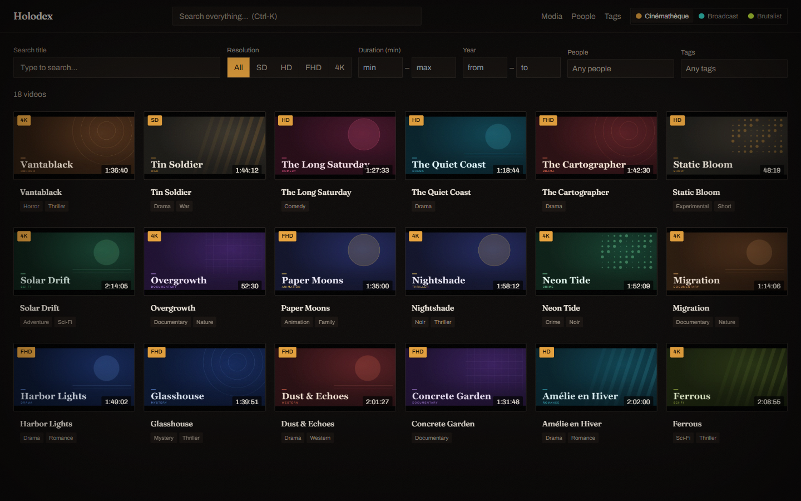
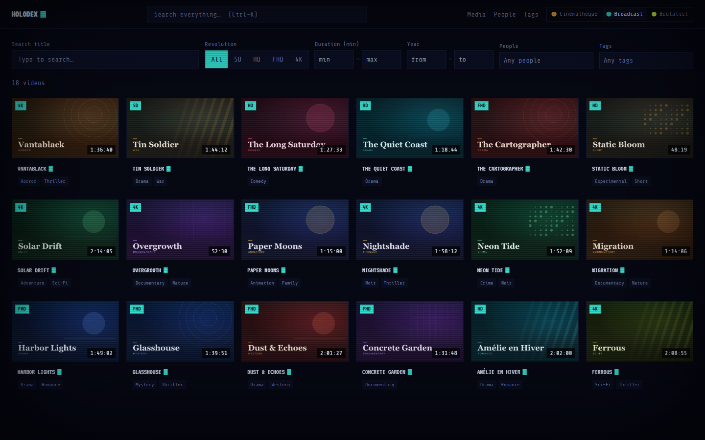
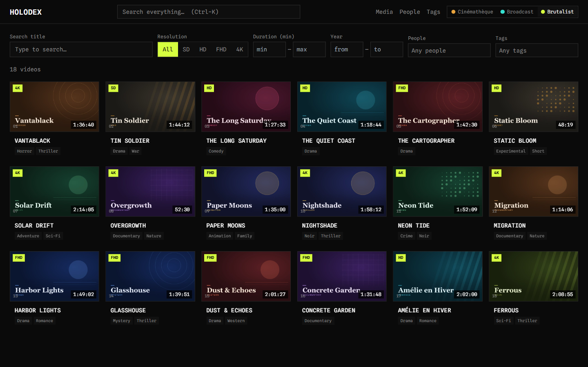
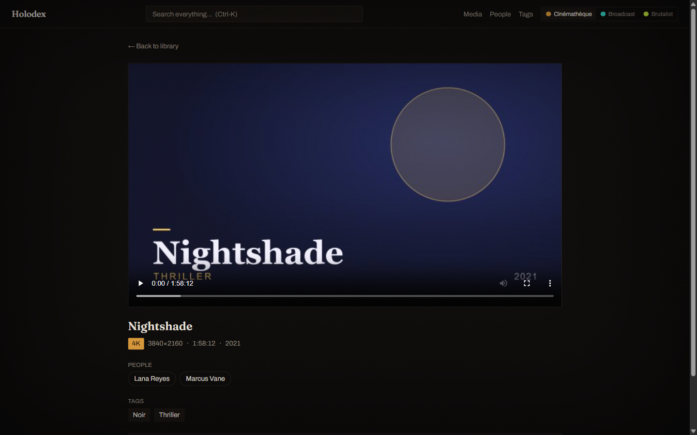

# Holodex

**A self-hosted media server for your personal video library — where the file's own
embedded metadata is the source of truth.**

Point Holodex at a folder of `.mp4`/`.mkv` files and it indexes everything automatically:
titles, cast, genres, resolution, and dates read straight from the tags already inside your
files. No naming conventions, no manual database, no internet connection, no telemetry. Just
a fast, good-looking web library you run yourself.



## Highlights

- **Your tags are the truth.** Metadata comes from each file's embedded container tags
  (iTunes atoms, Matroska tags) via a layered `exiftool` + `ffprobe` pipeline — Holodex never
  imposes a filename scheme or guesses from the path.
- **Automatic, incremental indexing.** Recursively scans on startup, watches the filesystem
  for changes in real time, and only re-reads files whose size or mtime changed — a rescan of
  an unchanged 10k-file library makes zero subprocess calls.
- **Cover art, two ways.** Embedded poster art is extracted at index time (instant); files
  without it get a throttled background frame thumbnail so the grid fills in without hammering
  a modest host.
- **Real search.** Full-text title search (SQLite FTS5) with diacritic folding — `amelie`
  finds *Amélie*. Faceted filters for resolution, duration, year, people, and tags, all
  reflected in shareable URLs, plus a `Ctrl-K` global palette across videos/people/tags.
- **Browse by people & tags.** Every cast member and genre is a navigable page with its own
  filmography.
- **Plays in the browser.** Inline HTML5 player with HTTP Range seeking; a raw-metadata panel
  shows exactly what each file's encoder embedded.
- **Three switchable skins.** All dark, all offline (fonts bundled, no CDN), all WCAG AA.
- **Self-hosted & portable.** A single pure-Go binary; one multi-arch image (`amd64` + `arm64`)
  for NAS and ARM home servers.

## Three switchable skins

The UI is built on semantic design tokens, so the entire look swaps from the header with zero
restyling ([ADR-021](docs/architecture/ADR-021-frontend-theming-and-skins.md)).

| Cinémathèque | Broadcast | Brutalist |
|:---:|:---:|:---:|
|  |  |  |
| Refined film-archive — Fraunces serif, warm grain + vignette, ember accent, letterbox bars | Retro-futurist CRT — VT323 bitmap, scanlines, cyan accent, `▮` caret | Raw catalog — Spline Mono, hairline grid, acid-lime, `01/02` index counters |

Every video detail page carries the skin through, too:



## Quick start (self-host)

You need only Docker and the one compose file — no source tree, no Go/Node toolchain.

```bash
# 1. Point Holodex at your library (defaults to ./media if unset)
export HOLODEX_MEDIA_PATH=/srv/media          # PowerShell: $env:HOLODEX_MEDIA_PATH = "D:\Videos"

# 2. Run the prebuilt image from GHCR
docker compose -f docker-compose.prod.yml up -d

# 3. Open the library
#    -> http://localhost:7800
```

Your library is mounted **read-only**; the index, thumbnails, and config live in a named
volume. Pin a release with `HOLODEX_TAG=1.2.0` instead of `latest`. See
[ADR-023](docs/architecture/ADR-023-image-distribution.md) for the distribution model.

## Roadmap

Phase 1 (MVP) and the tiered cover-art pipeline are implemented. Next up
([`docs/specs`](docs/specs)):

- **Phase 2** — an MCP server exposing the library to AI assistants (Claude Desktop, etc.),
  sort controls, a "Recently added" shelf, keyboard navigation, a responsive mobile layout,
  Prometheus metrics, and configurable metadata field mapping (map raw tags to custom facets).
- **Phase 3** — people/tag aliases and hierarchy, external metadata plugins (IMDB/TMDB),
  opt-in metadata writeback to source files, and hover-preview trailers.

## Development

Requires Go 1.25+ and Node 22+.

```bash
go mod tidy                       # first time

# Backend API (defaults: DATA_PATH=./data, PORT=7800)
MEDIA_PATH=/path/to/videos go run ./cmd/holodex   # -> http://localhost:7800

# Frontend dev server (separate terminal; proxies /api -> :7800)
cd web && npm install && npm run dev              # -> http://localhost:5173
```

> **Using git worktrees?** `web/node_modules` is gitignored and branch-specific — run
> `npm ci` in `web/` for *each* worktree (don't symlink/junction one worktree's to another's,
> as deps differ by branch). Without it the dev server fails with `'vite' is not recognized`.

Config precedence is **CLI flags > env > `holodex.yaml` > defaults**
([ADR-014](docs/architecture/ADR-014-configuration-and-data-layout.md)); e.g.
`holodex -port 8080 -media-path /srv/videos`. Other vars: `DATA_PATH` (index/thumbnails/config),
`PORT`, and `HOST` (bind address; default all interfaces — set `127.0.0.1` for loopback only).
See [`holodex.yaml.example`](holodex.yaml.example).

### Try it without a library

A generator produces a deterministic, IP-free demo library (curated titles, generated
key-art, every resolution bucket) so you can see a populated grid and all three skins with no
real footage — see [`testdata/demo/`](testdata/demo/) and
[the spec](docs/specs/showcase-demo-corpus.md):

```bash
cd testdata/demo && npm install && npm run generate
MEDIA_PATH=$(pwd)/library go run ../../cmd/holodex
```

### Testing

```bash
go test ./...                    # backend unit (fast, no external binaries)
go test -tags integration ./...  # backend integration (needs ffmpeg, exiftool, mkvtoolnix)
cd web && npm test               # frontend unit (vitest)
```

See [docs/testing-strategy.md](docs/testing-strategy.md).

## Project layout

```
cmd/holodex          entrypoint (config, db, migrations, server, graceful shutdown)
internal/
  config             configuration loader (CLI > env > yaml > defaults) — ADR-014
  model              core domain types
  metadata           extraction (exiftool/ffprobe) + resolution classifier — ADR-004/010/012
  scanner            filesystem scan + incremental change detection — ADR-011/018
  thumbnail          tiered cover-art / frame pipeline — ADR-009
  db                 SQLite open + embedded migrations — ADR-003/016
  cache              cache interface (in-process / noop) — ADR-008
  api                chi router, REST handlers, health — ADR-006/019
web/                 SvelteKit SPA (Tailwind, semantic tokens) — ADR-002/021
testdata/            fixture generator + golden files; demo/ showcase corpus
docs/                architecture (ADRs), specs, testing strategy
```

## Docs

[`docs/architecture`](docs/architecture/README.md) (29 ADRs) ·
[`docs/specs`](docs/specs) (phase + showcase specs) ·
[`docs/design/theming.md`](docs/design/theming.md) ·
[`docs/testing-strategy.md`](docs/testing-strategy.md)
