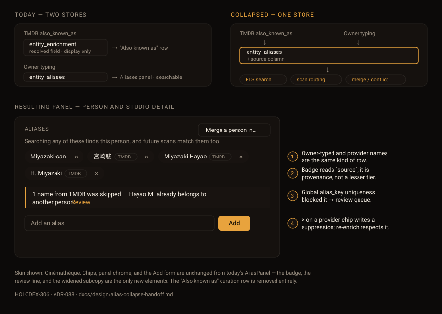

# Design handoff — alias collapse (HOLODEX-306)

One Aliases panel replaces two competing lists of alternate names. Architecture and rationale:
[ADR-088](../architecture/ADR-088-provider-alias-collapse.md).

## What changes on screen

| Surface | Change |
|---|---|
| "Also known as" row (person detail) | **Removed.** Delete the `mergeFields` block at `web/src/routes/people/[id]/+page.svelte:656-677` and the RD2 comment above it. |
| `AliasPanel.svelte` chips | Provider-sourced chips gain a source badge between the label and the `×`. |
| `AliasPanel.svelte` subcopy | "Searching **either** name…" → "Searching **any of these** finds this {noun}, and future scans match them too." The old wording assumed two names. |
| `AliasPanel.svelte` | New skipped-collision review line, rendered only when the entity has queued `provider-alias` pairs. |

Everything else in the panel — the merge button, the add form, the homonym `MergeOfferCard`, the
near-miss nudge — is untouched.

## Chip anatomy

The provider chip is today's chip plus one element. Same pill, same background, same `×`.

- Badge: `text-[10px] text-muted`, `border border-rule`, `rounded-full`, `px-1.5 py-px`, sitting in
  the existing `gap-1` flex row before the remove button.
- Label text is the provider's display name from the registry (`TMDB`), not the raw namespace.
- The badge is **not** a link and **not** a `ProvenanceBadge` — that component expands to a source
  breakdown, which has no meaning here (an alias has exactly one origin and no competing
  candidates). A plain span is correct.
- Owner-authored chips (`source === ''`) render exactly as they do today, with no badge and no
  placeholder gap.

Ordering does not change: aliases stay sorted case-insensitively by name, mixed. Grouping
provider-sourced chips separately would re-introduce the two-tier reading this change removes.

## Collision review line

Renders when `skipped_aliases` on the detail read is non-empty.

- Container: `bg-surface-2`, `border-l-[3px] border-accent`, `rounded-none` (per the theming rule —
  no rounded corners on a single-sided border), `p-3`.
- Copy, one name: `1 name from {provider} was skipped — {name} already belongs to another {noun}.`
- Copy, several: `{n} names from {provider} were skipped because they belong to other {noun}s.`
- Trailing `Review` link routes to the existing near-miss review queue, filtered to this entity.
- Visitor sees nothing — this is owner-only, like the rest of the panel's controls.

## States

| State | Rendering |
|---|---|
| No aliases, owner | "No aliases yet." — unchanged |
| No aliases, visitor | Panel hidden entirely — unchanged (`{#if aliases.length || isOwner}`) |
| Provider aliases only | Panel shows, all chips badged. The subcopy still reads correctly. |
| Add collides with another entity | `MergeOfferCard` — unchanged path |
| Delete a provider chip | Optimistic removal as today; the suppression write is invisible. No confirm dialog — it is reversible by re-typing the name. |
| Enrich adds 8 names at once | Chips wrap; the panel grows. No cap and no "show more" — a person with many AKAs genuinely has them, and the panel is already below the fold. |

## Accessibility

- The badge is decorative-adjacent but carries meaning, so it stays real text inside the chip —
  screen readers read `宮崎駿 TMDB Remove alias 宮崎駿`, which is correct.
- Existing `aria-label={`Remove alias ${a.alias}`}` is unchanged and must not gain the provider
  name.
- The review line goes inside the panel's existing `aria-live="polite"` region so a post-enrich
  refresh announces it.

## Theming

Tokens only, per `.claude/rules/frontend-theming.md`. The badge uses `text-muted` + `border-rule`;
the review line uses `border-accent` on `bg-surface-2`. Both need a three-skin QA pass —
Cinémathèque, Broadcast, Brutalist — with particular attention to the badge, since a low-contrast
`text-muted` on `bg-surface-2` is the failure mode this codebase has hit before. Verify computed
contrast rather than eyeballing.

## Out of scope

- Tag aliases — tag has no `AliasPanel` (RD7) and no provider alias source.
- Matched-alias annotation in search results (HOLODEX-81) — this change makes provider names
  findable, but showing *which* alias matched remains its own ticket.
- Bulk alias management across entities.
