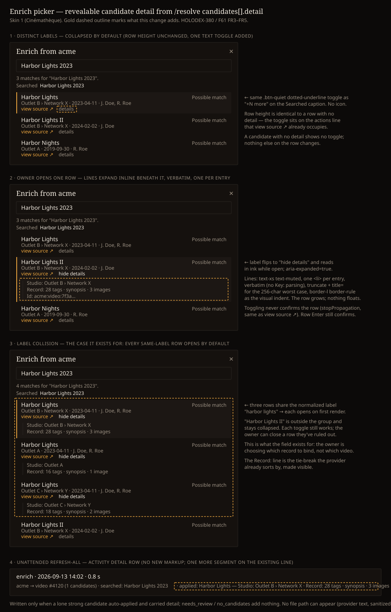

# Design Handoff: Revealable candidate detail in the Enrich picker (HOLODEX-380 / F61)

**Spec**: [candidates-detail.md](../specs/candidates-detail.md) FR3 (reveal), FR4 (auto-expand), FR5
(activity row) ·
**Contract**: [metadata-provider-contract.md](../specs/metadata-provider-contract.md) §2.3
`candidates[].detail`, §5 caps
**Theming contract**: [ADR-021](../architecture/ADR-021-frontend-theming-and-skins.md) +
[theming.md](theming.md) — **tokens only, QA all three skins**.
**Prior art**: [`EnrichPicker.svelte`](../../web/src/lib/components/enrichment/EnrichPicker.svelte)
— the candidate row (`role="option"`, roving tabindex) and its two in-row idioms this reuses: the
`view source ↗` link that stops propagation (F47/RD6), and the `+N more` `.btn-quiet` dotted-underline
toggle on the Searched caption ([structured-resolve-hints-searched-caption-handoff.md](structured-resolve-hints-searched-caption-handoff.md)).
**Surfaces**: `EnrichPicker.svelte` (one toggle + one list per candidate row); `JobHistory.svelte`
(**no markup change** — the batch path rides the existing detail line).
**Mockup**: 
**QA**: [candidates-detail-qa-checklist.md](candidates-detail-qa-checklist.md)
**Jira**: [HOLODEX-380](https://whoiskevinrich.atlassian.net/browse/HOLODEX-380) (story) ·
Draft PR [#333](https://github.com/whoiskevinrich/holodex/pull/333)

---

## Overview

When an upstream catalogues one release once per distribution outlet, the picker shows several
rows with the same label, date, cast, and confidence, and the owner is choosing **which record to
bind to** — a choice that sets the video's studio chain, genres, synopsis, and poster. `detail` on
the candidate is the provider's per-record summary. This handoff puts it **one activation away** on
each row: a text toggle on the actions line the row already has, lines that open inline beneath
the row, and — for the case the field exists for — rows that share a label open on their own.

**Decisions (from two mocked options, 2026-09-13):**

- **Text toggle over an info glyph.** `details` / `hide details` in the picker's existing
  `.btn-quiet` dotted-underline idiom. Zero new components, zero icons (Holodex has no icon font;
  a glyph would have been this component's first inline SVG plus a touch-target rule). The label is
  the accessible name — no separate `aria-label` copy to maintain.
- **Inline expansion over a tooltip/popover.** The listbox is keyboard-first and scrolls at 25
  candidates; anything floating gets clipped or needs its own focus management. The row grows.
- **Auto-expand on label collision** (spec FR4) so the owner never has to discover the toggle in
  the one case that needs it.

### Design-system fit

**Zero new tokens. Zero new components. No icon.** The toggle is `.btn-quiet` + `text-xs` +
`underline decoration-dotted`, exactly the Searched caption's `+N more`. The lines are a `<ul>` of
`text-xs text-muted` with `border-l border-rule` as the indent — the same rule color the search
field's border uses. State is expressed by the toggle's own text color (`text-muted` closed →
`text-ink` open), not by a new class. Skins 2/3 differ only by their token values (`font-ui` is
monospace there, which suits `Key: value` lines).

---

## Placement

On the candidate row's **actions line** — the line `view source ↗` already occupies — trailing that
link, with the row's existing `gap-2`. When the candidate has no `profile_url`, the toggle is the
only item on that line and sits where the link would. When the candidate has no `detail`, the line
is unchanged (no toggle, no placeholder).

```
┌ Enrich from acme ───────────────────────────────────────┐
│ Harbor Lights                          Possible match   │  ← existing
│ Outlet B › Network X · 2023-04-11 · J. Doe, R. Roe      │  ← existing disambiguation
│ view source ↗   details                                 │  ← toggle joins this line
│   │ Studio: Outlet B › Network X                        │  ← NEW, only when open
│   │ Record: 28 tags · synopsis · 3 images               │
└─────────────────────────────────────────────────────────┘
```

The lines render **inside the `<li>`**, after the actions line, so they scroll with the row, take
the active-row background (`bg-surface-2`) with it, and sit inside the row's `border-l-2` accent
bar when the row is active. Not a sibling row, not a portal.

## Content spec

| Element | Content | Notes |
|---|---|---|
| Toggle, closed | `details` | Lowercase, matches `view source ↗` on the same line |
| Toggle, open | `hide details` | Same button; text swap only |
| Lines | each `detail[i]`, **verbatim** | No `Key:` parsing (spec Resolved Decision 1). One `<li>` per entry, provider order |
| Line overflow | `truncate` + `title={entry}` | The 256-char cap makes truncation rare but a 200-char line at `max-w-lg` will clip; `title` carries the full text, same as the Searched caption's entries |
| Count | ≤ 8 lines | Server-capped; the client renders what it gets and never slices |
| Empty | no toggle | `detail` absent / `[]` are indistinguishable by the time they reach the client |

No new copy anywhere else — the status line, Searched caption, and footer are untouched.

## States and interactions

| Element | State | Behaviour |
|---|---|---|
| Toggle | closed (default) | `text-muted`, dotted underline; `aria-expanded="false"`; lines **not in the DOM** |
| Toggle | open | `text-ink`, dotted underline; `aria-expanded="true"`; `<ul>` rendered beneath the actions line |
| Toggle | hover | `.btn-quiet`'s existing hover (`text-ink`) — no new rule |
| Toggle | focus | the app's standard focus ring; it is a real `<button type="button">` |
| Toggle | activate (click / tap / Enter / Space) | flips open/closed; **`stopPropagation`** so the row's `onclick` (confirm) never fires — identical to the `view source ↗` handler |
| Row | Enter/Space with the *row* focused | confirms the candidate exactly as today; the toggle does not intercept row keys |
| Row | ↑/↓ | moves the active row; **expansion state of every row is preserved** (state is a per-row map keyed by `external_id`, not a single index) |
| Row | mouseenter | sets active as today; does not change expansion |
| Picker | new response | expansion map is **reset**, then FR4 seeds it: every candidate in a label-collision group that carries `detail` starts open |
| Picker | Escape / ✕ / confirm / no match | closes as today; expansion state is discarded with the response |

**Label-collision rule (FR4).** Normalize `label` with case-fold + collapse internal whitespace +
trim. Group by the normalized string. Any group of size ≥ 2 is a collision; each member **with
`detail`** starts open. Members without `detail` have no toggle. Rows outside any group start
closed regardless of whether they carry `detail`.

## Keyboard and accessibility

- **Tab order within the modal's focus trap:** search box → active row (`tabindex="0"`) →
  `view source ↗` (if any) → `details` toggle (if any) → … → footer buttons → ✕. The trap's
  selector already collects `button` elements, so the toggle joins without a selector change.
- The toggle is `<button type="button" aria-expanded aria-controls="enrich-detail-{i}">`. The
  `<ul>` carries `id="enrich-detail-{i}"`. No `aria-label` — the visible text is the name.
- The lines are a plain `<ul>` — not `role="option"` children, not inside the `aria-live` region.
  A screen reader arriving at an open row reads label → disambiguation → link → "hide details,
  button, expanded" → the list. Nothing is announced on toggle beyond the state change.
- Auto-expanded rows are not announced as such; they simply are open. The `aria-live` status line
  ("4 matches for …") is unchanged.
- Touch: the toggle is a text button with the row's `py-2`; the hit area is the button's box,
  which at `text-xs` is ~16 px tall. Acceptable because it is adjacent to nothing else on its
  line except `view source ↗` with `gap-2`, and a mis-tap on the row itself confirms — so the
  toggle should get `py-1` to reach ~24 px without changing the row's collapsed height (the
  actions line already has that slack). QA item 4.6 measures this.

## Responsive

Nothing width-dependent. The dialog is `max-w-lg`; lines `truncate` at the row's width with the
full text in `title`. At phone width the row is the same three lines plus the open list; the
modal already scrolls its listbox. No breakpoint work.

## Edge cases

- **Long line (256 chars):** one row, truncated, `title` holds it. Never wraps.
- **8 lines:** an open row is ~52 px + 8 × 16 px. At 25 candidates all open (worst case: 25 same-
  label records all with 8 lines) the listbox scrolls as it does today; nothing is clipped because
  the lines are in flow. QA item 5.3 asserts this.
- **Candidate with `detail` but no `profile_url`:** the toggle is the only item on the actions line.
- **Candidate with `profile_url` but no `detail`:** row is byte-for-byte what it is today.
- **Provider sends `detail` on person/studio candidates:** same rendering — the row component is
  entity-agnostic; nothing is gated by `entityType`.
- **Response with one candidate carrying `detail`:** closed by default (no collision). If it is a
  strong lone match on the interactive path the picker still auto-applies with no picker shown —
  `detail` never renders; the unattended path's activity row is where its lines go (below).
- **Owner opens a row, then types a new query:** the map resets; rows in the new response follow
  FR4. This is deliberate — stale open state on a different candidate set is misleading.

## Batch path — Activity detail row (no new markup)

`JobHistory.svelte` renders `run.detail` verbatim on one line. The unattended resolve entry gains
one segment after `searched: …`:

```
acme → video #4120 (1 candidates) · searched: Harbor Lights 2023 · applied: Harbor Lights — Studio: Outlet B › Network X · Record: 28 tags · synopsis · 3 images
```

Format: `· applied: <label> — <detail lines joined with " · ">`. Present only when a lone strong
candidate auto-applied **and** carried `detail`; `needs_review` and `no_candidates` outcomes add
nothing. The segment is server-composed and already sanitized; the row's existing `truncate` +
`title` handle its length. F22.6b's no-path invariant holds because the text is provider
metadata, not a Holodex path.

## Non-goals

- No muted `Key:` prefix (spec P2-a). Verbatim.
- No "expand all / collapse all" control on the picker. FR4 covers the case that needs it; a global
  control invites the row-height cost the collapsed default avoids.
- No `detail` on the *interactive* apply's activity entry — the owner saw it.
- No thumbnail (spec Non-Goals).

## Implementation notes

- `EnrichCandidate` in `web/src/lib/types.ts` gains `detail?: string[]`.
- State: `let open = $state<Record<string, boolean>>({})` keyed by `external_id`; rebuilt in the
  same place `candidates` is assigned (the stale-response guard), seeded from the collision rule.
- Collision helper is a pure function (`collisionOpen(candidates): Record<string, boolean>`) so it
  is unit-tested without the component; put it beside `searchedCaption.ts`.
- Toggle markup mirrors the Searched caption's `+N more` button verbatim, with
  `onclick={(e) => { e.stopPropagation(); open[c.external_id] = !open[c.external_id]; }}` and
  `onkeydown` that stops propagation on Enter/Space so `onOptionKey` never sees them.
- Lines: `<ul id="enrich-detail-{i}" class="mt-1 border-l border-rule pl-2 text-xs text-muted">`
  with `<li class="truncate" title={line}>{line}</li>`.
- Geometry test (existing `geometry` suite): a row with `detail` closed has the same
  `offsetHeight` as one without; open lines' `getBoundingClientRect()` are within the `<ul>`'s
  scroll box at 25 candidates.
