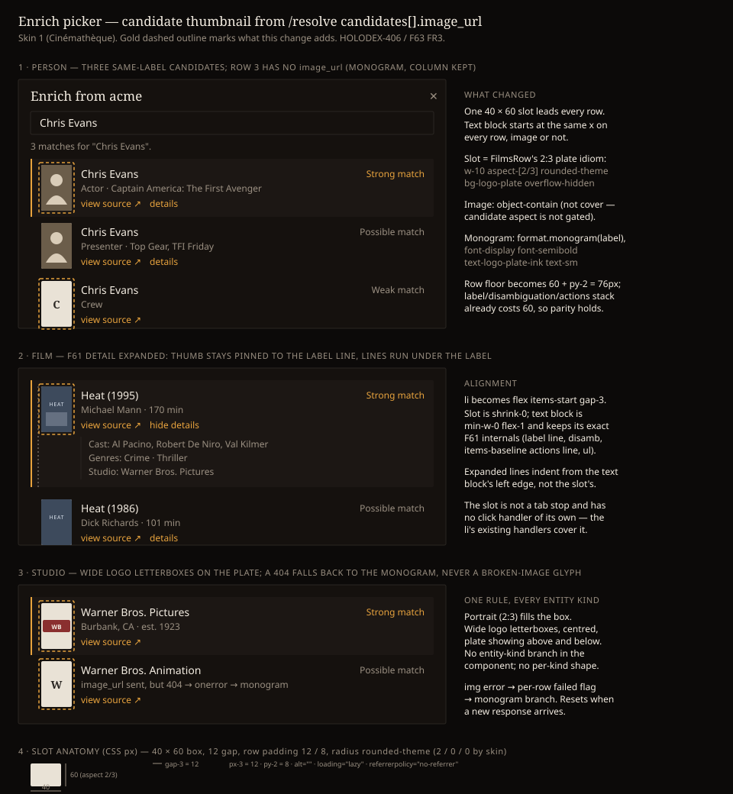

# Design Handoff: Candidate thumbnail in the Enrich picker (HOLODEX-406 / F64)

> **Superseded in part by [candidates-image-per-kind-handoff.md](candidates-image-per-kind-handoff.md)
> (HOLODEX-414):** the slot's box is now kind-shaped — 40 × 60 portrait for person/film,
> 108 × 60 landscape (backdrop) for media, 120 × 60 logo for studio — always 60 px tall. The
> "one 2:3 box for every kind" rule below and the "Per-entity-kind slot shape" non-goal no
> longer hold; every other section still does.

**Spec**: [candidates-image.md](../specs/candidates-image.md) FR3 (row slot), FR1/FR2 (what may
reach the row) ·
**Contract**: [metadata-provider-contract.md](../specs/metadata-provider-contract.md) §2.3
`candidates[].image_url`, §5 caps, §6 S7
**Theming contract**: [ADR-021](../architecture/ADR-021-frontend-theming-and-skins.md) +
[theming.md](theming.md) — **tokens only, QA all three skins**.
**Prior art**: [`EnrichPicker.svelte`](../../web/src/lib/components/enrichment/EnrichPicker.svelte)
— the candidate row (`role="option"`, roving tabindex) and its F61 internals this must not
disturb ([candidates-detail-handoff.md](candidates-detail-handoff.md)); the **2:3 plate idiom**
in [`FilmsRow.svelte`](../../web/src/lib/components/entity/FilmsRow.svelte) (`aspect-[2/3]
rounded-theme bg-logo-plate` + `font-display font-semibold text-logo-plate-ink` monogram) that the
slot reuses; the `entity/CLAUDE.md` rule *frame follows source aspect* that decides `object-contain`.
**Surfaces**: `EnrichPicker.svelte` only (one slot per candidate row). No other component changes.
**Mockup**: 
**QA**: [candidates-image-qa-checklist.md](candidates-image-qa-checklist.md)
**Jira**: [HOLODEX-406](https://whoiskevinrich.atlassian.net/browse/HOLODEX-406) (story) ·
PR [#346](https://github.com/whoiskevinrich/holodex/pull/346)

---

## Overview

Every candidate row in the Enrich picker gains one leading, fixed-size image slot — **40 × 60 CSS
px (2:3)** — showing the provider's `image_url` when Holodex let one through, and the label's
monogram on the plate otherwise. The owner scans faces / posters / logos instead of reading
`disambiguation` to tell same-named candidates apart. Nothing else on the row moves: label line,
match strength, `disambiguation`, the `view source ↗` link, the F61 `details` toggle and its
expanded list keep their exact markup, only shifted right by the slot.

The slot is **presentation of candidate identity** (ADR-090 layer 1 evidence). It is not an image
chooser and never becomes the entity's poster/headshot — `/enrich` `assets[]` stays the only path
into the store.

## Placement

```
<li role="option" class="cursor-pointer rounded-theme border-l-2 px-3 py-2 flex items-start gap-3 {active}">
  <div class="w-10 shrink-0 aspect-[2/3] flex items-center justify-center overflow-hidden rounded-theme bg-logo-plate" aria-hidden="true">
    {#if c.image_url && !failed}
       failed = true} />
    {:else}
      <span class="font-display text-sm font-semibold text-logo-plate-ink">{monogram(c.label)}</span>
    {/if}
  </div>
  <div class="min-w-0 flex-1">
    …existing row internals, byte-for-byte: label line · disambiguation · actions line · detail <ul>…
  </div>
</li>
```

- The `<li>` gains `flex items-start gap-3`; its existing `px-3 py-2 border-l-2 rounded-theme`
  and the active-row classes (`border-accent bg-surface-2`) are unchanged.
- The slot is the **first** child so the roving-tabindex `<li>` still receives focus and the
  existing `onclick` / `onkeydown` / `onmouseenter` on the `<li>` cover clicks on the image — the
  slot has **no handlers and no `tabindex`**.
- The text block wraps the current internals in one `div.min-w-0.flex-1` so `truncate` on the
  label and `disambiguation` keeps working (a flex child without `min-w-0` refuses to shrink —
  see the overflow-guards note in HOLODEX-356).

## Content spec

| Slot state | When | Renders |
|---|---|---|
| **Image** | `c.image_url` present (server already dropped non-allowlisted / bad-scheme / malformed / `""`) and the `` has not errored | `` `object-contain` on `bg-logo-plate`. A 2:3 portrait fills the box; a wide logo letterboxes, centred, plate visible above and below |
| **Monogram** | `c.image_url` absent (pre-F64 provider, provider omitted it, or Holodex stripped it) | `monogram(c.label)` — first character upper-cased, `?` for empty — in `font-display text-sm font-semibold text-logo-plate-ink` on the plate |
| **Monogram (after error)** | `` fired `error` (404, refused decode, offline) | Same monogram branch; the broken-image glyph never shows |
| **Loading** | Bytes not yet arrived | The plate alone (the box is sized by `w-10 aspect-[2/3]` before the request, so there is no layout shift). No skeleton, no spinner — a 60 px thumb does not earn one |

- `alt=""` always. The label carries the name; a screen reader must not hear "Chris Evans" twice.
- `loading="lazy"` + `decoding="async"`: 25 rows at 60 px = 25 requests otherwise; below-the-fold
  rows wait until scrolled near.
- `referrerpolicy="no-referrer"`: the provider CDN does not learn the owner's Holodex URL.
- Character limits / truncation: none new. `image_url` is a URL the row never displays.

## States and interactions

| Element | State | Behaviour |
|---|---|---|
| Row | Resting | Slot on plate, text block as today |
| Row | Active (`i === active`, hover or ↑/↓) | `border-accent bg-surface-2` on the `<li>` as today; the plate colour is unchanged — `bg-logo-plate` is a light neutral in all three skins, so the thumb reads the same on the active row |
| Row | Click / Enter / Space | Confirms the candidate, as today. Clicking on the image is a click on the `<li>` |
| Row | F61 `details` expanded | Row grows downward; slot stays pinned to the label line (`items-start`); expanded `<ul>` indents from the **text block's** left edge (it lives inside the text block), not the slot's |
| Slot | Any | Not a tab stop, no hover state, no cursor change beyond the row's `cursor-pointer`, no zoom |
| `` | `error` | Per-row `failed` flag flips to the monogram; flag resets when a new response arrives (the `candidates` array is replaced, so a keyed `{#each}` on `external_id` or a `Map` reseeded per response both work — same lifecycle as F61's `open` map) |

No transitions or animation. The image simply appears when decoded; no fade (a fade on a
60 px thumb in a keyboard-driven list is noise, and the plate already fills the box).

## Keyboard and accessibility

- **Focus order unchanged**: search field → rows (roving `tabindex`) → F61 `details` toggles /
  `view source ↗` links inside each row per the existing `trapTab` selector. The slot adds no
  stop; `aria-hidden="true"` on the slot wrapper keeps the `` and the monogram out of the
  accessibility tree entirely.
- **Announcements**: none new. `role="option"` rows still announce the label + match text.
- **Contrast**: the monogram is `text-logo-plate-ink` on `bg-logo-plate`, the same pair
  `FilmsRow` and `StudioLinkCard` already ship — verify per skin in QA §3 anyway, since the
  active row's `bg-surface-2` sits behind the plate's edge.
- **Reduced motion**: nothing animates, nothing to honour.

## Responsive

| Width | Behaviour |
|---|---|
| ≥ 640 (dialog at `max-w-lg` = 512) | Inner 480 → row text block ≈ 480 − 24 (px-3) − 40 (slot) − 12 (gap) = **404 px** |
| 375 (backdrop `px-4`) | Dialog 343, inner 311 → text block ≈ **235 px**. Label and `disambiguation` `truncate` as today; the match-strength text is `shrink-0` as today. The slot never shrinks (`shrink-0`) — 40 px is the floor the text pays for |
| Any | No breakpoint-specific slot size. One size everywhere; the picker is a modal, not a page |

## Edge cases

- **25 candidates, all with images** — 25 lazy requests; the `<ul>` `overflow-y-auto` box is
  unchanged. Rows are now at least 76 px (60 + 2 × 8), so 25 rows ≈ 1900 px inside the
  `max-h-[80vh]` dialog — the scroll box, not the dialog, absorbs it, as today.
- **Row with no `disambiguation` and no actions line** (label only) — previously ≈ 36 px; now the
  slot sets a **76 px floor**. Accepted: alignment across rows matters more than density, and
  every TMDB candidate carries at least a `disambiguation`.
- **Image aspect not 2:3** (a provider sends a square or a wide render) — `object-contain`
  letterboxes it; never cropped. This is the `entity/CLAUDE.md` rule: the source aspect is not
  gated for candidates (unlike the film banner, HOLODEX-386), so the frame must not assume it.
- **Very large image** (a provider ignores §5 and sends `original`) — costs the owner's browser
  the bytes; renders correctly at 40 × 60. Not Holodex's problem to fix client-side.
- **Same `image_url` on several rows** (duplicate-release case from F61) — each row loads it;
  the browser cache dedupes. No special handling.
- **Label collision auto-expand (F61)** — unchanged; several expanded rows each keep their
  thumb pinned top.
- **Provider that sends `image_url` on a non-allowlisted host** — the row never sees it (server
  strips); it renders the monogram. Owner sees no error; a provider implementer debugs it from
  the contract's S7 note.
- **Long label** — truncates as today, 40 px earlier.

## Non-goals

- Hover / zoom preview, lightbox, or a larger thumb on wide viewports.
- Entity's current image in the picker header for side-by-side comparison.
- Per-entity-kind slot shape (circle for people, wide for logos). One 2:3 box; `object-contain`
  handles the rest.
- A skeleton or spinner while the image loads.
- Any change to `PersonAvatar`, `EntityImageSlot`, `ProviderIcon`, or `FilmsRow`. The slot
  copies `FilmsRow`'s class idiom inline rather than extracting a shared component: two call
  sites with one deliberate difference (`contain` vs `cover`) is not yet a component.

## Implementation notes

- **`EnrichCandidate.image_url?: string`** in `web/src/lib/types.ts` beside `profile_url`.
- Import `monogram` from `$lib/format` (the picker currently imports only `isHttpUrl` /
  `toMessage`).
- **Row-height floor and the F61 geometry assertion.** `collapsed-detail-row-costs-one-line`
  bounds `#enrich-opt-2` at [70, 76] under the `flood` persona. With the slot, a collapsed row is
  `max(text stack, 60) + 16`; the F61 text stack (label + disambiguation + `py-1` actions line)
  already costs 60, so the row stays **76** and the bound still passes — but the assertion loses
  its `py-1` mutation sensitivity (dropping `py-1` no longer drops the row below the 76 floor).
  The testing gate should either tighten the bound to equality 76 (F61 precedent) or add a
  second assertion on the **text block's** height, and add a new one for slot/text **x-offset
  parity** across rows with and without an image (AC4).
- **Per-row `failed` state**: a `Map<external_id, boolean>` reseeded on each response is the
  F61 `open`-map idiom; do not put the flag on the candidate object (it comes from the server).
- **Stub personas** (`testdata/enrich-stub/`): add `faces` — person candidates mixing (a) image
  on the stub's own host, (b) image on `img.other.example` (must arrive stripped), (c) no image,
  (d) an image path the stub 404s — so QA §3 can walk all four slot states against a real
  sidecar; and a `logos` studio persona with one wide logo for the letterbox check.
- **Three skins**: nothing skin-specific. `rounded-theme` gives 2 / 0 / 0 px corners on the
  plate per skin, exactly as `FilmsRow`. Verify by computed style, not screenshots (they time out
  on this picker).
- **Rule to record** in `web/src/lib/components/enrichment/CLAUDE.md` (a decision now made
  twice — here and in `entity/CLAUDE.md`): *an image slot whose source aspect is not gated
  upstream uses the 2:3 `bg-logo-plate` tile with `object-contain`; `object-cover` is only for
  roles whose aspect ingest enforces (film banner/poster).*
