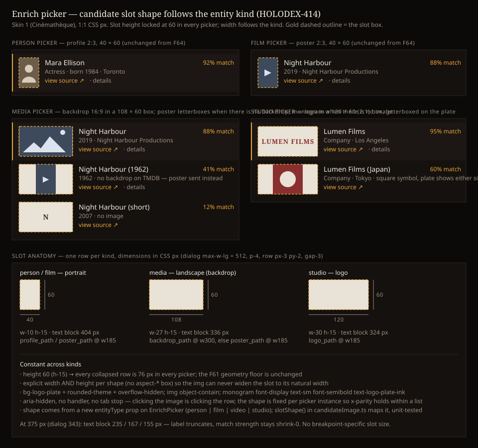

# Design Handoff: Candidate slot shape per entity kind (HOLODEX-414)

**Supersedes, in part**: [candidates-image-handoff.md](candidates-image-handoff.md) (HOLODEX-406 /
F64) — its *one 2:3 box for every kind* rule and the "Per-entity-kind slot shape" non-goal. Every
other section of that handoff (content states, keyboard, error → monogram, non-goals on
hover/zoom/header comparison/skeleton) still applies verbatim and is not repeated here.
**Spec**: [candidates-image.md](../specs/candidates-image.md) FR3 (slot), FR4 (sidecar rendition)
— amended by this story ·
**Contract**: [metadata-provider-contract.md](../specs/metadata-provider-contract.md) §2.3
`candidates[].image_url` — shape guidance per `entity_type` added.
**Theming contract**: [ADR-021](../architecture/ADR-021-frontend-theming-and-skins.md) +
[theming.md](theming.md) — **tokens only, QA all three skins**.
**Prior art**: the F64 slot in
[`EnrichPicker.svelte`](../../web/src/lib/components/enrichment/EnrichPicker.svelte); the studio
logo aspect rule from HOLODEX-411 (≥ 2:1 reads as a wordmark); `aspect-video` on the media
detail page for the file's own thumbnail; `entityType` as the prop name every entity-generic
component already takes (`PromotedFieldEdit`, `EntityImageSlot`).
**Surfaces**: `EnrichPicker.svelte` (slot classes + one new prop), its five mounts (pass the
prop), `candidateImage.ts` (pure shape rule), sidecar `providers/tmdb` (backdrop on the video
path). No new component.
**Mockup**: 
**QA**: [candidates-image-per-kind-qa-checklist.md](candidates-image-per-kind-qa-checklist.md)
**Jira**: [HOLODEX-414](https://whoiskevinrich.atlassian.net/browse/HOLODEX-414) (story)

---

## Overview

F64 gave every picker row one fixed 40 × 60 (2:3) image slot and deliberately branched on
nothing: a headshot fills it, a poster fills it, a wide logo letterboxes inside it. This story
keeps everything about that slot — plate, monogram, `object-contain`, error handling, no tab
stop — and makes **only its box shape** a function of the entity kind the picker was opened for:

| Picker | Provider image (TMDB) | Box | Classes |
|---|---|---|---|
| Person | `profile_path` @ w185 — unchanged | 40 × 60 portrait | `w-10 h-15` |
| Film | `poster_path` @ w185 — unchanged | 40 × 60 portrait | `w-10 h-15` |
| Media (video) | **`backdrop_path` @ w300**; `poster_path` @ w185 when there is no backdrop | 108 × 60 landscape | `w-27 h-15` |
| Studio | `logo_path` @ w185 — unchanged | 120 × 60 (2:1) logo | `w-30 h-15` |

The row height is **locked at 60 px of slot in every picker** — the decision Kevin made from the
two-option mockup (A: height locked, width follows the kind; B: width locked at 80, height
follows). A wins because HOLODEX-406 §4.6 already ruled that a smaller box "hands row height
back to the text stack and thins a wide logo's letterbox"; B would reintroduce both for media
and studios, and a 108 × 60 backdrop is the smallest size at which a scene is recognisable, which
is the whole reason to send a backdrop instead of a poster for a video.

Why a backdrop for media at all: a *video* row is the owner asking "is this file that title?",
and the file's own thumbnail (the thing they are comparing against, `aspect-video` on the media
page) is a landscape frame. A landscape still from the title reads against a landscape frame; a
2:3 poster does not. Films keep the poster because the film page's own identity image is the
poster.

## Placement

```
<li role="option" class="flex cursor-pointer items-start gap-3 rounded-theme border-l-2 px-3 py-2 {active}">
  <div aria-hidden="true"
       class="flex shrink-0 items-center justify-center overflow-hidden rounded-theme bg-logo-plate {SLOT_CLASS[slotShape(entityType)]}">
    {#if showThumb(c, !!failed[c.external_id])}
      
    {:else}
      <span class="font-display text-sm font-semibold text-logo-plate-ink">{monogram(c.label)}</span>
    {/if}
  </div>
  <div class="min-w-0 flex-1">…F61 internals, unchanged…</div>
</li>
```

- The only markup change from F64 is the slot's size classes: `w-10 aspect-[2/3]` becomes an
  **explicit width and height pair** from `SLOT_CLASS`. Explicit on both axes on purpose: an
  `aspect-*` box with a `w-full` `` inside can borrow the image's natural width (the
  fixture-size trap recorded in HOLODEX-406's testing gate), and a w300 backdrop is 300 px wide.
  `h-15` = 60 px, `w-27` = 108 px, `w-30` = 120 px on Tailwind v4's dynamic spacing scale.
- 108 rather than 106.67 for the landscape box: a 16:9 image `object-contain`s to 106.67 × 60
  with a 0.67 px plate sliver each side, invisible; an integer width keeps the geometry
  assertions integer.
- **New prop** `entityType: 'person' | 'film' | 'video' | 'studio'` on `EnrichPicker`, required
  (no default — a mount that forgets it is a type error, not a silently-portrait picker). The
  five mounts already know their kind: the four detail pages are one kind each;
  `EnrichQueueRow` gets it from `owner/enrichment/+page.svelte`'s `row.entity_type` (one new
  prop on the row component, or pass the whole kind through as it already passes `resolve`).
- **Pure rule** in `candidateImage.ts` beside `showThumb`:
  `slotShape(entityType): 'portrait' | 'landscape' | 'logo'` and
  `SLOT_CLASS: Record<SlotShape, string>`. Vitest covers the four kinds and that an unknown
  kind falls back to `portrait` (defensive only — the prop type forbids it).
- The shape is fixed for the life of a picker instance (one kind per open), so **x-parity across
  rows** — the F64 invariant — still holds within any list; it is simply a different x per kind.

## Content spec

Unchanged from F64 for every slot state (image / monogram / monogram-after-error / loading), with
two additions:

| Case | Renders |
|---|---|
| **Media row, provider sent a backdrop** | Fills the 108 × 60 box edge to edge (16:9 contains exactly) |
| **Media row, provider sent a poster** (no backdrop upstream) | Poster `object-contain`s to 40 × 60, centred, plate showing 34 px either side. This is the *poster fallback* decision: better identity evidence than a monogram, and it never becomes a crop |
| **Studio row, wordmark (≥ 2:1)** | Fills the 120 px width, letterboxed top and bottom |
| **Studio row, symbol / square logo** | Fills the 60 px height, plate either side |
| **Monogram, any kind** | Same `text-sm` glyph, centred in whatever box the kind has |

`alt=""`, `loading="lazy"`, `decoding="async"`, `referrerpolicy="no-referrer"` — all as F64.

## States and interactions

No change. The slot still has no handler, no hover, no tab stop; the active-row treatment is on
the `<li>`; F61 `details` expansion grows the row downward with the slot pinned to the label line.
Nothing animates.

## Keyboard and accessibility

No change from F64. `aria-hidden` on the slot wrapper keeps every kind's image and monogram out
of the accessibility tree; the label carries the name.

## Responsive

| Width | Portrait text block | Landscape text block | Logo text block |
|---|---|---|---|
| ≥ 640 (dialog 512, inner 480, row inner 456) | 404 px | 336 px | 324 px |
| 375 (dialog 343, inner 311, row inner 287) | 235 px | 167 px | 155 px |

No breakpoint-specific slot size — one size per kind everywhere. At 375 the media and studio
label lines get tight (155 px holds "Lumen Films" + "95% match"; a long film title truncates
earlier than it did). Accepted: the picker is a modal the owner opens deliberately, and the
match-strength text stays `shrink-0` so the number never truncates. QA §4.4 asks a human whether
155 px is too tight on a phone; if so the answer is a `sm:` step on the two wide classes, not a
different height.

## Edge cases

- **Provider ignores the shape guidance** (a poster on a video row, a landscape on a person row)
  — `object-contain` letterboxes it. The contract says what the intended shape is; Holodex never
  crops to enforce it. Same rule as F64.
- **Backdrop present but tiny / wrong ratio** (TMDB backdrops are 16:9 by policy; a provider's
  might not be) — letterboxed, never cropped.
- **Media picker on a file whose own thumbnail is portrait** (a vertical video) — the slot is
  still landscape; the comparison is against the title's still, not the file's frame. Not worth
  a branch.
- **Studio logo with a transparent background** — sits on `bg-logo-plate`, the same plate
  `StudioLinkCard` used before HOLODEX-411. HOLODEX-411's *bare on the page* rule is a
  hero-image rule; in a list the plate is what makes the column read as a column and is what the
  monogram sits on. Not a re-proposal of the plate for the studio page.
- **25 media candidates** — 25 × 76 px rows, as today; 25 lazy w300 requests (each ≈ 15–30 KB)
  instead of w185 posters. Recorded, not a concern at 25.
- **Mount forgets `entityType`** — type error at `npm run check`. There is no runtime default.

## Non-goals

- A different slot height per kind (Option B) — decided against, see Overview.
- A `sm:` breakpoint step for the wide slots — held until QA §4.4 says 155 px is a problem.
- Any change to the four detail pages' own image treatment, `FilmsRow`, `StudioLinkCard`,
  `EntityImageSlot`.
- A backdrop for **films** — the film page's identity image is the poster; the film picker keeps it.
- Sending both a poster and a backdrop and letting Holodex choose — one `image_url`, the sidecar
  picks (contract: "pick the rendition yourself").
- Widening `asset_hosts` — backdrops live on the same `image.tmdb.org` host the security review
  for F64 already allowed, so no `/security-review` gate is triggered by this story.

## Implementation notes

- **Sidecar** (`providers/tmdb/tmdb.go`): thread `entityType` into `resolveMovie` (its caller
  `resolve()` already switches on it, so this is a signature change plus three call sites).
  Add `BackdropPath string \`json:"backdrop_path"\`` to `movieSearchEntry` and to the
  `/3/find` movie result struct (`movieDetails` already has it). One helper,
  `movieThumbURL(entityType, backdropPath, posterPath string) string`: `video` → backdrop at
  **w300** when non-empty else poster at w185; `film` → poster at w185. Replace the three
  `tmdbThumbURL(m.PosterPath)` / `det.PosterPath` calls on the movie path with it. Test: the
  existing `TestTMDBResolveImageURL` gains rows for `video` with backdrop (w300 URL), `video`
  without backdrop (w185 poster URL), `video` with neither (key absent), `film` with both (poster).
- **Frontend**: `EnrichPicker` prop + slot classes; `slotShape` / `SLOT_CLASS` in
  `candidateImage.ts`; five mounts pass `entityType` (`media`/`films`/`people`/`studios`
  `+page.svelte` as a literal, `EnrichQueueRow` from `row.entity_type`).
- **Stub** (`testdata/enrich-stub/`): `solidPng(w, h, rgb)` is already rectangular; add a
  `/p/<slug>/thumb/wide-N.png` rendition (e.g. 300 × 169) and give the `twins` persona a
  video-kind variant whose rows walk backdrop · poster-in-landscape-box · none, so QA §3 can
  measure the letterbox against a real sidecar. The existing `wide` 64 × 16 logo row covers the
  studio letterbox.
- **Geometry harness** (`web/geometry/assertions.mjs`): `candidate-slot-is-40-wide-on-every-row`
  becomes per-kind — the `flood` persona runs on the studio page, so on that page the slot is
  **120** wide; add a video-page run for 108 if the stress seed exposes a video picker. The
  76 px row floor assertions are unchanged (height is constant). Consider asserting the slot's
  `offsetWidth` equals the class's px exactly (40 / 108 / 120) so the aspect-borrow trap can't
  regress if someone reintroduces `aspect-*`.
- **Rule to record** in `web/src/lib/components/enrichment/CLAUDE.md`, next to the F64 rule: *the
  candidate slot's box is kind-shaped (portrait / landscape / logo) but always 60 px tall; add a
  kind by adding a `SlotShape`, never by branching in the template.*
- **Three skins**: nothing skin-specific. `rounded-theme` and `bg-logo-plate` behave exactly as in
  F64; verify by computed style (screenshots time out on this picker).
