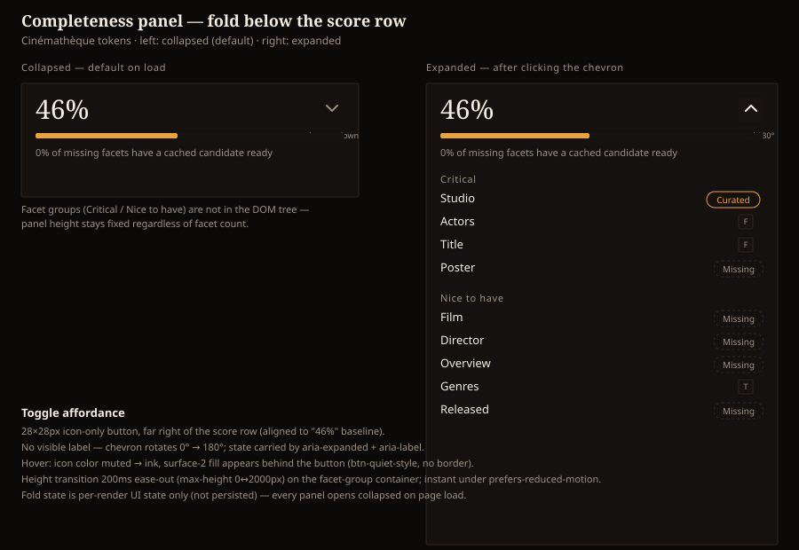

# Design handoff: Completeness panel — collapsible facet fold

**Status:** Implemented (pending review)
**Phase:** Ad hoc UX request (no HOLODEX epic — adds a collapse affordance to existing F55.13-15
UI, no new data or behavior)
**Owner:** Project owner
**Date:** 2026-08-31
**Spec:** none — UI-only addition to an already-specced component (extends
[entity-completeness-handoff.md](entity-completeness-handoff.md) §2 DD4-DD8)
**ADR:** none — no architectural change
**Branch/PR:** `claude/completeness-fold-design-580cf0` (not yet pushed)

## Overview

`CompletenessPanel.svelte` (video/person/studio detail pages) always renders its full facet
breakdown — score, bar, actionability line, then every Critical and Nice-to-have facet row. On
entities with long facet lists this makes the panel one of the tallest sections on the page, even
when the visitor just wants the headline score. This adds a fold: the score/bar/actionability
summary stays visible; the facet groups collapse behind a chevron toggle, collapsed by default.

Three rounds of mockup iteration (rendered via the visualization tool) resolved what to fold, where
the trigger sits, and its default state — see "Resolved decisions" below.



## Resolved decisions

| Question | Decision |
|---|---|
| What does the fold hide? | Only the Critical/Nice-to-have facet groups. Score, bar, and the actionability line ("N% of missing facets have a cached candidate ready" / "Fully complete") are never hidden — they're the glanceable summary, not "detail." |
| Where does the trigger live? | Icon-only chevron button, far right of the score row, vertically aligned with the "46%" text — not a separate labeled row below the bar. |
| Trigger label? | None visible — a bare chevron. State is carried by `aria-expanded` + `aria-label`/`title` (dropped after the first mockup round, which had a "Show details"/"Hide details" text label next to the chevron on its own row; the owner asked for the label removed and the chevron relocated). |
| Default state on load? | **Collapsed.** Every panel render starts closed; the owner chose density over matching current always-expanded behavior. |

## Layout

Inside the existing card (`rounded-theme border border-rule bg-surface p-4`, unchanged):

```
┌─────────────────────────────────────────┐
│  46%                              [⌄]    │  ← score + chevron, one row, justify-between
│  ▬▬▬▬▬▬▬▬▬▬▬▬▬▬▬▬▬▬░░░░░░░░░░░░░░░░░░░░  │  ← existing progress bar, unchanged
│  0% of missing facets have a cached...   │  ← existing actionability line, unchanged
│ ┄┄┄┄┄┄┄┄┄┄┄┄┄┄┄┄┄┄┄┄┄┄┄┄┄┄┄┄┄┄┄┄┄┄┄┄┄┄┄┄ │  ← collapses to zero height when closed
│  CRITICAL                                │
│  Studio                        Curated   │
│  Actors                            [F]   │
│  ...                                     │
└─────────────────────────────────────────┘
```

- The score/chevron row replaces the current bare `<span class="... text-2xl ...">{score}%</span>`
  with a `flex items-center justify-between` wrapper — the score text and its `text-2xl` sizing are
  unchanged, only its container gains a sibling.
- Chevron button: 28×28px (`h-7 w-7`), `rounded-theme`, no border at rest — `.btn-quiet` coloring
  (`text-muted`, hover `text-ink`) plus a `hover:bg-surface-2` fill so a bare icon button still
  reads as interactive on hover (this is new; `.btn-quiet` alone has no hover background today, see
  Theming below).
- The bar and actionability line keep their exact current markup/classes.
- Facet groups (the existing `{#each GROUPS ...}` block) move inside a collapsible wrapper
  (`#completeness-facets`) that animates via `overflow-hidden` + a `max-height` transition
  between `0px` and a fixed `2000px` ceiling (see Animation / motion below).

## Design tokens used

| Token | Usage |
|---|---|
| `text-muted` | Chevron at rest |
| `text-ink` | Chevron on hover |
| `bg-surface-2` | Chevron hover background (new — see Theming) |
| `rounded-theme` | Chevron button corners |

No new colors — this is a pure structure/interaction addition on top of existing tokens.

## Components

| Component | Variant | Props | Notes |
|---|---|---|---|
| `CompletenessPanel.svelte` | Modified | unchanged prop surface (`completeness`, `videoId`, `onchanged`) | Adds local `$state` for fold-open, no new props — collapse is pure UI state, not derived from `completeness` |

No new component file — the toggle button and collapsible wrapper are small enough to stay inline
in `CompletenessPanel.svelte` rather than extracting a shared disclosure primitive for one caller.

## States and interactions

| Element | State | Behavior |
|---|---|---|
| Panel | Initial render | Facet groups collapsed (`aria-expanded="false"`), chevron points down |
| Chevron button | Click / Enter / Space | Toggles `aria-expanded`; facet-group wrapper animates open/closed |
| Chevron button | Hover | Icon `text-muted` → `text-ink`, `bg-surface-2` fill appears behind the 28×28 hit area |
| Chevron button | Focus (keyboard) | Standard focus-visible ring (existing global focus style — no override) |
| Chevron icon | Open vs. closed | Rotates 180° when open; 0° at rest |
| Facet-group wrapper | Open → closed / closed → open | `max-height` transition, 200ms `ease-out` |

## Edge cases

- **`completeness.facets.length === 0`** — unchanged: the existing "No scored facets." message
  renders in place of the score/bar/facets entirely, so there's nothing to fold and no chevron
  renders. (Same branch as today — `{#if completeness.facets.length === 0}` short-circuits before
  the new fold markup.)
- **Fully complete (`actionability === undefined`)** — the "Fully complete" line still always
  shows; the fold still defaults closed even though every facet would show a non-"Missing" pill —
  there's no special-case default-open for this state, since the point of collapsing is page
  density, not hiding bad news.
- **Only one group non-empty** (e.g. every Critical facet is `not_applicable` and only "Nice to
  have" renders) — fold still wraps whatever groups the existing `{#each GROUPS}` produces; no
  layout special-casing needed.
- **`videoId` + not-applicable toggle button on `external_provider_id`** — that button already only
  renders inside a facet row, so it's simply inside the collapsed/expanded region like every other
  row; no interaction with the fold itself (toggling not-applicable while collapsed just updates
  state invisibly until the panel is expanded).
- **Rapid double-click on the chevron** — the height-transition CSS runs off `aria-expanded`
  toggling per click; a second click before the transition finishes reverses direction cleanly
  (no debounce needed — this isn't a network request, `busy` state doesn't apply here).

## Animation / motion

| Element | Trigger | Animation | Duration | Easing |
|---|---|---|---|---|
| Facet-group wrapper | Chevron click | `max-height` 0px ↔ 2000px, with `overflow: hidden` clipping the actual content edge | 200ms | ease-out |
| Chevron icon | Chevron click | `transform: rotate()` 0° ↔ 180° | 200ms | ease-out |

`max-height` transitions to a fixed ceiling rather than the measured content height — Tailwind's
`transition-[max-height]` arbitrary-property utility needs a concrete end value, and CSS can't
transition to/from `auto`. `2000px` is comfortably above any realistic facet-group height (in
practice under 700px for the full Critical + Nice-to-have set); an entity with an implausibly long
facet list would just finish its transition slightly early rather than clip. (An earlier draft
used the `grid-template-rows: 0fr → 1fr` accordion technique instead, which avoids the fixed-ceiling
tradeoff entirely — it was dropped only because it produced flaky one-directional collapse behavior
in this project's headless-browser QA tooling, not because of a functional problem with the
technique itself; `max-height` was more reliable to verify.) Respect `prefers-reduced-motion:
reduce` — skip both transitions (`transition: none`), toggle instantly.

## Accessibility notes

- Chevron button: `aria-expanded` reflects open/closed; `aria-controls` points at the facet-group
  wrapper's `id`; `aria-label` — `"Show completeness details"` / `"Hide completeness details"`
  (dynamic, since there's no visible text label to associate via `aria-labelledby`); `title`
  mirrors the label for a mouse-hover tooltip.
- Native `<button>` — full keyboard operability (Enter/Space) with no extra wiring.
- No focus trap or focus movement on toggle — expanding doesn't move focus into the facet list;
  the button keeps focus so repeated toggling doesn't require re-tabbing.
- Facet-group wrapper carries `inert={!expanded}` (not just `aria-hidden`) — the
  `external_provider_id` row's not-applicable toggle button is a real focusable descendant when
  `videoId` is set, so a `grid-template-rows: 0fr` collapse alone would leave it tabbable while
  visually clipped. `inert` removes the whole collapsed subtree from both the tab order and the
  accessibility tree in one attribute, and needs no manual `tabindex="-1"` bookkeeping on that
  button.

## Theming

Tokens-only, three-skin safe. One net-new rule needed: `.btn-quiet` today has no hover background
(only a color/underline change, appropriate for its existing inline-text call sites like "Cancel").
A bare 28px icon button with no visible label needs a hover background to read as a clickable
target at all — add `hover:bg-surface-2` as a Tailwind utility at this call site rather than
changing the shared `.btn-quiet` class (other `.btn-quiet` call sites are inline text links where a
background box would look wrong). QA collapsed and expanded states across Cinémathèque, Broadcast,
and Brutalist — confirm the chevron hover fill and the 180ms transition read correctly against all
three `--rule`/`--surface-2` pairs (Brutalist's `--radius: 0` means the button hover fill renders
as a hard-cornered square, which is correct/expected, not a bug).
