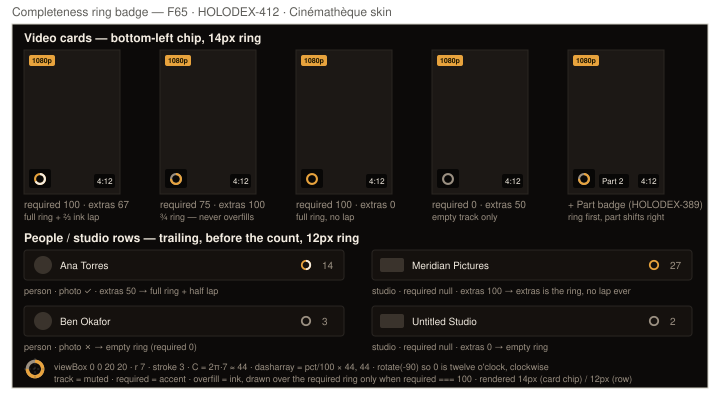

# Design handoff: completeness ring badge (F65)

**Spec**: [entity-completeness-score.md](../specs/entity-completeness-score.md) (F65.4 ring badge, F65.5 owner-only
`completeness` on list items, § Scoring model edge rules, RD5–RD7) · **ADR**:
[ADR-099](../architecture/ADR-099-completeness-score-required-band.md) D1/D5 · Jira
[HOLODEX-412](https://whoiskevinrich.atlassian.net/browse/HOLODEX-412) · **Date**: 2026-09-18



## Decision

A **ring meter** — `required` fills the ring; once `required` is 100, `extras` is drawn as a **second
lap in ink over the full accent ring** (the "overfill", brainstorm option O2). The overfill is gated on
`required === 100`, so a card missing a poster can never read as done no matter how many extras it has.
Chosen over a percent pill (a grid of digits), a gap count (digits, and only honest once the noise
facets are gone), a warn-tinted frame (spends the `warn` token on something that isn't a problem),
concentric rings (the inner ring is ~8 px at 8 columns) and ring + `+N` (digits again).

Two placements, decided 2026-09-18 after the branch caught up with main:

- **Video card — bottom-left chip, Part badge shifts right.** HOLODEX-389 had already taken the
  bottom-left corner for `Part N`; the ring chip goes first and the part badge sits beside it in one
  flex row. Parts are rare, so the pair is rare; when it happens the two read as a pair of facts along
  the bottom edge, exactly the rationale the part badge's own comment gives for pairing with duration.
  Chosen over bottom-right beside duration (two chips always crowd the right corner) and a ring prefix
  inside the duration pill (12 px ring, and the pill would change width between visitor and owner).
- **People / studio rows — trailing, before the count.** `/people` and `/studios` are row lists
  (avatar · name · count), not poster grids, so "bottom-left" has no meaning there. The ring sits in the
  metadata column with the count; names don't move between visitor and owner mode. Chosen over a
  leading dot after the avatar, which shifts every name by 18 px in owner mode. Person and studio rings
  are 0/100 by the spec's facet tables, so on a row the ring reads as a status dot — that *is* the
  at-a-glance question ("has a face", "has branding").

The badge is **owner-only by payload, not by prop**: it renders when the item carries `completeness`
and not otherwise. The API strips the field for visitors (F65.5); the card never checks `isOwner`.

## Layout

### Ring component — `CompletenessRing.svelte` (`web/src/lib/components/completeness/`)

| Prop | Type | Notes |
|---|---|---|
| `required` | `number \| null` | 0–100. `null` = the entity type has no required band (studios) — then `extras` fills the ring |
| `extras` | `number \| null` | 0–100. `null` = no extras band — never overfills |
| `size` | `'card' \| 'row'` | `card` → `h-3.5 w-3.5` (14 px); `row` → `h-3 w-3` (12 px) |

Markup:

```svelte
<span class="completeness-ring inline-flex shrink-0" role="img" aria-label={label}>
  <svg viewBox="0 0 20 20" class={size === 'card' ? 'h-3.5 w-3.5' : 'h-3 w-3'} aria-hidden="true">
    <circle cx="10" cy="10" r="7" class="fill-none stroke-muted" stroke-width="3" />
    <circle cx="10" cy="10" r="7" class="fill-none stroke-accent" stroke-width="3"
            stroke-dasharray="{arc(ring)} 44" transform="rotate(-90 10 10)" />
    {#if overfill > 0}
      <circle cx="10" cy="10" r="7" class="fill-none stroke-ink" stroke-width="3"
              stroke-dasharray="{arc(overfill)} 44" transform="rotate(-90 10 10)" />
    {/if}
  </svg>
</span>
```

where `ring = required ?? extras ?? 0`, `overfill = required === 100 ? (extras ?? 0) : 0`, and
`arc(pct) = (pct / 100) * 44` (circumference 2π·7 = 43.98; 44 is close enough that a full ring closes
with no visible gap at 14 px). Arcs start at twelve o'clock and run clockwise (`rotate(-90)`).
`stroke-linecap` stays `butt` — round caps make a 5 % arc look like 12 %.

`stroke-muted` / `stroke-accent` / `stroke-ink` are Tailwind v4 utilities over the existing
`--color-*` tokens (`@theme inline`, ADR-025) — **no new tokens, no new CSS**. The track is `muted`,
not `rule`: on the card the ring sits on a `bg-black/70` chip over a poster, where every skin's `rule`
(`#2a2622` / `#1a2240` / `#333333`) is too close to the chip to read; `muted` reads on both the chip and
the row surface.

### Video card (`VideoCard.svelte`)

| Region | Spec |
|---|---|
| Bottom-left group | Replace the part badge's own `absolute bottom-1.5 left-1.5` with a wrapper: `<span class="absolute bottom-1.5 left-1.5 z-[2] flex items-center gap-1">` containing, in order, the ring chip (if `video.completeness`) then the part badge (if `video.part`). With neither, render nothing (no empty wrapper). |
| Ring chip | `<span class="rounded-theme bg-black/70 px-1 py-[3px]">` around `<CompletenessRing size="card" …/>` → 22 × 20 px, the same height as the duration pill (`text-xs` + `py-0.5` = 20 px) so the bottom edge stays level |
| Part badge | Unchanged classes minus the positioning (`part-badge rounded-theme bg-black/70 px-1.5 py-0.5 text-xs text-ink`). For a visitor (no ring) it renders at exactly the same pixel position as today — the wrapper's inset equals its old inset |
| Other corners | Untouched: resolution bucket top-left, scene number top-right (film scenes, HOLODEX-326), duration bottom-right |
| Inside the `<a>` | Yes — like duration and part, the ring is not interactive; clicking it navigates like the rest of the card |

Card density: at the 8-column maximum (HOLODEX-331) a poster is ~130 px wide; a 22 px chip plus a
4 px gap plus a ~34 px part badge leaves ≥ 40 px before the duration pill. No wrapping rule is needed.

### People and studio rows (`routes/people/+page.svelte` `personRow` snippet, `routes/studios/+page.svelte`)

| Region | Spec |
|---|---|
| Position | Between the name (`flex-1 truncate`) and the count (`text-xs text-muted`); the row's existing `gap-3` spaces it |
| Ring | `<CompletenessRing size="row" …/>` when `p.completeness` / `s.completeness`; nothing otherwise — the count stays where it is for visitors |
| Chip | None — the ring sits directly on `bg-surface`; the `muted` track reads against it |
| Select mode (people) | The snippet is shared by the checkbox-label and the link wrappers, so the ring appears in both — no special case |

### People Poster View (`person/PersonPosterCard.svelte`)

`/people` has a second layout — the F55 Poster View (HOLODEX-255) — whose card is a 2:3 portrait
over a two-line caption (name, count). F65.4 covers every person card in a browse grid, so the ring
rides the caption's count line under the **row rule**: `<CompletenessRing size="row" …/>` trailing,
immediately before the count, in a `flex items-center gap-1.5` wrapper. The name line never moves
between visitor and owner mode; no chip (the caption sits on the page surface, where the `muted`
track reads). Added 2026-09-18 after code review found the poster grid unwired.

### Where it appears

Wherever a video / person / studio item comes from a list endpoint that emits `completeness` (ADR-099
D5): the browse grids and rows, `EntityVideos` sections on person/studio/tag/film pages, film scene
grids, and the landing shelves *if* their endpoints are list endpoints. Items that arrive embedded in
another entity's payload (a video's `people[]` on the media page → `PeopleGrid` chips, a film's cast)
carry no `completeness` and render no ring; that is by design, not a gap. The engineering rule is one
line: the card renders the ring iff the item has the field.

## States and interactions

| Element | State | Behavior |
|---|---|---|
| Ring | `required` 0 … 99 | Accent arc of that fraction over the muted track; no ink |
| Ring | `required` 100, `extras` 0 or `null` | Full accent ring, no ink |
| Ring | `required` 100, `extras` 1 … 100 | Full accent ring with an ink arc of `extras` % drawn over it, from twelve o'clock |
| Ring | `required` `null` (studio) | `extras` drives the accent arc; ink is never drawn |
| Ring | item has no `completeness` (visitor, or non-list payload) | Component not mounted; no placeholder, no reserved space |
| Ring | hover / focus / click | None — not interactive, no cursor change, no tooltip beyond the `aria-label` (the breakdown lives on the detail page) |
| Card | owner mode toggled | Ring appears/disappears with the next list fetch; no animation |

No loading state: the ring is part of the list payload, so it lands with the card.

## Motion

None. The arcs are static `stroke-dasharray` values; no transition on mount or on value change (a list
re-fetch replaces the card). `prefers-reduced-motion` has nothing to disable.

## Content

- `aria-label` (also the only text): `Completeness: required 75%, extras 100%`; with a `null` band the
  clause is dropped — `Completeness: extras 100%` for a studio, `Completeness: required 0%` when extras
  is `null`. Percent signs are spoken; the numbers are the raw integers from the payload.
- No visible text, ever. If a number is wanted, that is a different badge (rejected, RD5).

## Edge cases

- **Both `required` and `extras` are `null`** (an entity type with no scored facets at all — none today):
  render nothing. Don't mount an empty track for a type the score doesn't cover.
- **`required` 100 and `extras` 100**: the ink lap covers the whole ring — a solid ink circle. That is the
  intended "everything filled" glyph; it is distinct from the accent-only full ring at a glance on every
  skin (ink is near-white on all three).
- **Rounding**: 1 … 4 % renders as a 0.4–1.8 unit arc — visible as a tick. Don't clamp small values to
  zero; a tick means "something is there".
- **Part badge + film scene badge + ring**: all three can coexist (a multi-part video attached to a film).
  Scene is top-right, ring + part bottom-left, duration bottom-right — no two share a corner.
- **Landscape / wide `card_layout`**: same corners; the chip's absolute inset is from the frame, not the
  poster aspect.
- **Payload shape drift**: the ring reads `completeness.required` / `.extras` only; it ignores the
  detail-page `Completeness` object's `score`/`facets` (that object is the panel's, ADR-099 D5 keeps
  `score` there). Don't pass the panel object to the ring.

## Accessibility

- The chip is `role="img"` with the label above; the `<svg>` is `aria-hidden`. Inside the card's `<a>`
  the label is read as part of the link's content, one utterance per card, alongside the duration.
- Not focusable, not in the tab order — nothing to do with a keyboard here.
- Colour is not the only channel: fill *fraction* carries the value, and the overfill is a second lap of
  a different luminance, not a hue swap. On Broadcast (cyan accent) and Brutalist (lime) the accent/ink
  contrast is lower than on Cinémathèque's gold — QA 3.2 checks it still reads.
- Contrast: accent on the `bg-black/70` chip clears 4.5:1 on all three skins (gold `#e8a33d` ≈ 8:1,
  cyan `#36e0d0` ≈ 10:1, lime `#d6ff3f` ≈ 16:1 against a near-black chip); the muted track is decorative
  and exempt.

## Three-skin QA (numbered per `docs/design` convention)

**Setup** — owner session with the stress fixture (HOLODEX-342) or any library with ≥ 1 video missing a
poster, ≥ 1 with everything filled, ≥ 1 multi-part video (`part` set), a person with no photo, a studio
with no branding. Browse `/` at the 8-column density and at the default; `/people`, `/studios`. Repeat as a
visitor (log out or private window).

**Smoke**
- 1.1 `[smoke]` As owner on `/`: every card shows a ring chip bottom-left; the video missing a poster shows a ¾ accent ring with no ink; the fully-filled video shows a solid ink circle.
- 1.2 `[smoke]` As visitor on `/`: no ring anywhere; the multi-part video's `Part N` badge sits at the same pixel position it had before this change.
- 1.3 `[smoke]` As owner on `/people`: the person with no photo shows an empty muted ring before their count; a person with a photo shows a full accent ring (plus an ink arc if they have bio/birthdate).
- 1.4 `[smoke]` As owner on `/studios`: the studio with no branding shows an empty ring; one with branding shows a full accent ring and never any ink.

**Agent** (computed style via `javascript_tool`, per `reference-holodex-skin-qa-without-screenshots`)
- 2.1 `[agent]` For each skin: on a `.completeness-ring` circle, `getComputedStyle(track).stroke` equals the skin's `--muted`, the required arc's `stroke` equals `--accent`, the overfill arc's `stroke` equals `--ink`. (Resolve the vars from `getComputedStyle(document.documentElement)`.)
- 2.2 `[agent]` Ring chip `getBoundingClientRect().height` equals the duration pill's height (± 1 px) and its `left` equals the frame's `left + 6`; when a part badge is present, `part.left === chip.right + 4`.
- 2.3 `[agent]` Visitor: `document.querySelectorAll('.completeness-ring').length === 0` on `/`, `/people`, `/studios`, and the `GET /media` response items have no `completeness` key.
- 2.4 `[agent]` Overfill gating: for every card, the ink circle exists iff the item's `completeness.required === 100` and `extras > 0`.
- 2.5 `[agent]` At 8 columns, on every card `chip.right + 4 + (part?.width ?? 0) < duration.left` — no overlap along the bottom edge.

**Human**
- 3.1 `[human]` On each skin at the default density, glance at a full grid for two seconds: you can tell which cards are "done" (full ring) from which are not without reading anything. If you have to squint at the ring to tell ¾ from full, the stroke is too thin — say so rather than accept it.
- 3.2 `[human]` Broadcast and Brutalist: on a fully-filled card, the solid ink circle is clearly different from the accent-only full ring next to it (the ink one looks white/pale; the accent one looks cyan/lime).
- 3.3 `[human]` Brutalist (radius 0): the ring chip is square-cornered like the duration pill beside it; Cinémathèque: the chip's corners match the duration pill's. The ring itself is round on every skin — it is a meter, not a chip.
- 3.4 `[human]` `/people` as owner: the rings sit visually on the same baseline as the counts and don't make the rows taller; toggle select mode — the rings are still there inside the checkbox rows.
- 3.5 `[human]` `/people` as owner, Poster View: every card's count line carries the ring before the count; the person with no photo shows an empty muted ring under their placeholder portrait.
