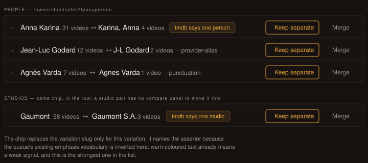

# Design handoff — shared provider external id in the Duplicates queue (F71)

**Jira**: [HOLODEX-452](https://whoiskevinrich.atlassian.net/browse/HOLODEX-452) ·
**ADR**: [ADR-107](../architecture/ADR-107-shared-external-id-duplicate-detection.md) ·
**Spec**: [F71](../specs/duplicates-shared-external-id.md) · **Date**: 2026-09-23

This is a deliberately small handoff: HOLODEX-452 is a detector, and ADR-107 decision 3 puts its
output on a surface that already exists. There is **no new screen, no new panel and no new
interaction** — a `shared-external-id` pair is an ordinary `identity_review_queue` row and
inherits F70's compare panel on person rows untouched. The only visual decision is how the row
says why it fired.

## The decision: the strongest signal names its asserter

Every queue row today prints its `variation` column verbatim in muted text —
`· punctuation`, `· provider-alias`, `· same-title`
([`DuplicatePairRow.svelte:170`](../../web/src/lib/components/duplicates/DuplicatePairRow.svelte)).
Shipping `· shared-external-id` the same way would work and cost nothing.

It was rejected because **the queue's existing emphasis vocabulary is inverted for this case.**
`matchKindLabel` styles the weak signal `text-warn` and leaves everything else muted
([`queue.ts:41`](../../web/src/lib/components/duplicates/queue.ts)) — so today colour means
*trust this less*. A `shared-external-id` row is the strongest evidence the queue will ever carry,
and rendering it in the same muted grey as the weakest rows would bury it in a list the owner has
already learned to skim. All 31 pairs in the live queue are the weakest kind; this one needs to
not look like them.

So the row renders an **accent chip naming the provider that asserted it** — `tmdb says one
person` — in place of the variation slug.

- **Naming the asserter, not the verdict.** "tmdb says one person", never "same person". F70's
  rule holds: the surface reports who asserted what and never adjudicates. The chip is a citation.
- **Accent, not warn.** `--bg-accent` fill with `--text-accent` text. `text-warn` is spoken for —
  it means weak — and reusing it here would say the opposite of what is true.
- **It replaces the slug, it does not join it.** One chip per row; the row stays one line.
- **Every other row is untouched.** No restyling of `punctuation`, `provider-alias` or
  `same-title`, and no new emphasis tier for them.

## Placement

`labelPlacement` already routes the match-kind label person → panel, every other kind → row
([`queue.ts:52`](../../web/src/lib/components/duplicates/queue.ts)), because a person row was
measured at real type sizes and could not afford a second label. **The chip does not follow that
rule**: it replaces the variation slug the row was already carrying, so it costs the row nothing
and stays in the row for every kind — including person. The mockup's second panel shows the studio
case, which has no panel to move anything into.

## What implementation touches

| Layer | Change |
|---|---|
| `web/src/lib/types.ts` | `variation` gains `'shared-external-id'` |
| `web/src/lib/components/duplicates/queue.ts` | a chip lookup keyed on `variation` (sibling of `MATCH_KIND_LABEL`, not an entry in it — that map is keyed on `match_kind`) |
| `DuplicatePairRow.svelte:170` | the variation span renders the chip when one is defined for the variation, the slug otherwise |

## Not doing

| Not doing | Why |
|---|---|
| A distinct row background or left border | One chip already carries it; a second treatment on the same row is emphasis inflation |
| Its own queue section above the others | The pair sorts top-of-group already (ADR-107 consequences); a separate section fragments a surface built for one pass |
| Showing the external id itself in the row | It is a provider-internal string the owner cannot act on. It belongs in the compare panel's provider-link badges, which F70 already renders |
| A compare panel for studio and film | F70 RD10 scoped the panel to person deliberately; ADR-107 does not revisit it |

## QA — three skins

1. `[agent]` Chip contrast in Cinémathèque, Brutalist and the instance skin: read the computed
   `background-color` / `color` off the chip and confirm both resolve from tokens, never hardcoded.
2. `[agent]` Row height is unchanged at ≥ 640px for a `shared-external-id` pair with two long
   names — the chip replaced the slug, so the row must not gain a line.
3. `[human]` The chip reads as *stronger* than the muted rows around it, not as an error.
