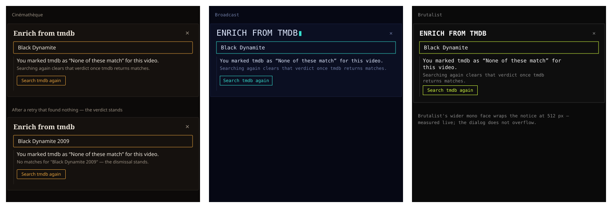

# Design Handoff: Undismiss from the Enrich picker (HOLODEX-467)

**Spec**: [enrichment-review-workflow.md](../specs/enrichment-review-workflow.md) P0-4 (RD4) —
amended by this bug · **Prior handoff**: [enrichment-review-workflow-handoff.md](enrichment-review-workflow-handoff.md)
(the queue row's "Try again") ·
**Theming contract**: [ADR-021](../architecture/archive/ADR-021-frontend-theming-and-skins.md) +
[theming.md](theming.md) — tokens only, QA all three skins.
**Surfaces**: `EnrichPicker.svelte` (one new state), its four detail-page mounts (pass `retry`
through), `api.ts` (the four `enrich*Resolve` methods), the four `/resolve` handlers. No new component.
**Mockup**: 
**Jira**: [HOLODEX-467](https://whoiskevinrich.atlassian.net/browse/HOLODEX-467) (bug)

---

## Problem

"None of these match" records a durable dismissal for `(entity, provider)` (RD4). `/resolve` then
answers `409 provider dismissed for this entity — undismiss to try again`. The Enrichment review
queue has a "Try again" that clears it, but a detail page's picker had nothing: it opened, its
seeded search 409'd, it printed the raw error, and every search the owner typed 409'd too.

## Decision (option A, approved 2026-09-27)

Option B — an inline "Undo and search" link inside the status line — was rejected: a 12 px quiet
link inside an `aria-live` region is easy to miss and is announced as text, not as a control.

### States

| State | Status line (`aria-live`) | Below it |
|---|---|---|
| Dismissed | **text-sm ink**: You marked {provider} as "None of these match" for this {entityType}. | text-xs muted: Searching again clears that verdict once {provider} returns matches. · `.btn-accent .btn-row` **Search {provider} again** |
| Retrying | unchanged | button reads **Searching {provider}…**, disabled |
| Retry found nothing | unchanged | text-xs muted: No matches for "{query}" — the dismissal stands. · button |
| Retry found candidates | normal picker (list, "None of these match") | — |

The notice block carries `border-l border-rule pl-2` — the picker's existing `detail`-list
idiom. **Not** `--warn`: a dismissal is a verdict the owner recorded, not an error. Quotation
marks, not italics — the UI has no italic idiom.

### Behaviour

1. **Detection** — a `409` `ApiError` from `resolve()` is the dismissal (the only 409 `/resolve`
   writes). It is a state, not an error: `error` stays empty.
2. **Typing doesn't search** while dismissed — every plain search would 409 again. The box stays
   editable so the owner can adjust the query first; editing clears the "found nothing" line.
3. **Enter in the box = the button.** Focus stays in the search box on open, as in every picker.
4. **Retry never auto-applies** (RD1 off) — this provider's last offer was rejected.
5. **Clear on match only.** The retry sends `retry: true`; the server searches past the
   dismissal and deletes it only when the response has at least one candidate. A zero-result
   retry keeps it, because "None of these match" is only offered over a non-empty list — a
   verdict cleared by an empty search could not be put back.
6. A non-409 failure on the retry shows as the normal error line; the next typed search 409s back
   into the dismissed state.

### Out of scope

- The provider chip on the detail page still doesn't say "not matched" before it's clicked
  (`EnrichProviderChips` has no dismissal state). Separate issue if wanted.
- The queue (`/owner/enrichment`) is unchanged: its "Try again" undismisses before opening a
  picker, so its picker never reaches this state and its `resolve` drops `retry`.

## QA (done 2026-09-27, backend-films + tmdb sidecar)

1. `[agent]` Media page, dismissed video: notice renders, focus in box; typing sent no `/resolve`.
2. `[agent]` Enter → `retry` resolve → 200 with a strong match, listed not applied; a plain
   `/resolve` afterwards → 200 (dismissal cleared).
3. `[agent]` Person page, dismissed person, nonsense query + Enter → "the dismissal stands"; plain
   `/resolve` afterwards → 409.
4. `[agent]` Three skins by computed style: button border/color = `--accent`, notice = `--ink` 14 px,
   rule = `--rule`, dialog 512 px with no horizontal overflow; Brutalist wraps the notice to two lines.
