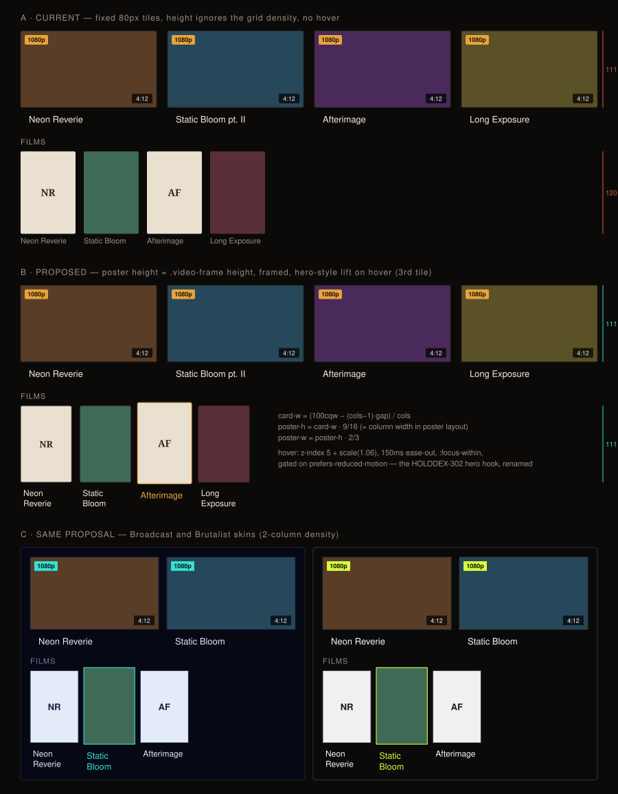

# Design handoff: Entity Films row — card-height match + hover lift

**Jira:** [HOLODEX-384](https://whoiskevinrich.atlassian.net/browse/HOLODEX-384)
**Surface:** `web/src/lib/components/entity/FilmsRow.svelte` (rendered by person, studio, and tag
detail pages through `EntityVideos`' `footer` snippet), `web/src/app.css`
**Related:** [films-entity-handoff.md §5](films-entity-handoff.md) (F56 — the row this revises),
[HOLODEX-302](https://whoiskevinrich.atlassian.net/browse/HOLODEX-302) (the person-hero hover
lift this reuses), [HOLODEX-296](https://whoiskevinrich.atlassian.net/browse/HOLODEX-296)
(shared poster-tile for the *media-detail* Films + People chips — adjacent, not this surface),
[media-detail-films-people-handoff.md §4a](media-detail-films-people-handoff.md) (the fixed-width
tile-sizing decision that this row deliberately does **not** follow — see §3a)



## 1. Overview

The Films row is a horizontal shelf of poster tiles below the video grid on a person, studio, or
tag page — "here are the full films you're not seeing above" (F56 §5). Three asks:

| # | Ask | Status |
|---|---|---|
| 1 | Extracted and reusable | **Already true.** `FilmsRow.svelte` is one component consumed by all three pages. No extraction work in this ticket. |
| 2 | Same height as the media cards | **Not true today.** Tiles are a fixed `w-20` (80px) with a `2:3` poster → 120px tall at every density. The video cards above are `repeat(cols, minmax(0,1fr))` columns with a `16:9` `.video-frame`, so *their* height changes with the density slider; the shelf's doesn't. At 4 columns on a 900px page the posters are ~9px taller than the frames; at 8 columns they're roughly double. |
| 3 | Pop-out hover like the hero images | **Nothing today** beyond `hover:text-accent` on the caption. The hero already has the exact mechanism — `.person-hero-media` in `app.css` — under a hero-specific name. |

### 1a. The rule

> **A film tile is a video card's sibling, not a chip.** It takes the card's frame height, the
> card's frame chrome (1px `--rule` border, `--radius`), and the card's caption block — only its
> aspect ratio differs. Hover is the hero lift, shared by name, not copied.

## 2. Design tokens

All from `app.css`; nothing new. Values shown for the default skin.

| Token / utility | Cinémathèque | Usage |
|---|---|---|
| `--rule` | `#2a2622` | tile frame border (matches `.video-frame`) |
| `--accent` | `#e8a33d` | frame border + caption on hover/focus (matches `VideoCard`'s `group-hover:border-accent`) |
| `--radius` | `2px` | tile frame corners (matches `.video-frame`) |
| `--logo-plate` / `--logo-plate-ink` | `#e9e0d0` / `#2a2018` | monogram empty-state plate (unchanged) |
| `--ink` | `#f3ece1` | caption at rest (was `--muted`; now matches `VideoCard`'s title) |
| `--muted` | `#9b9082` | `FILMS` section label (unchanged) |
| `text-sm` / `font-medium` / `line-clamp-2` / `p-3` | — | caption block, copied from `VideoCard`'s title block |
| `gap-3` | 12px | between tiles (unchanged) |

## 3. Layout

### 3a. Sizing formula

The video grid's column count is a runtime value (`effectiveDensity()` → `VideoGrid.svelte`
`gridStyle`), so the shelf cannot use a Tailwind width utility. It derives its size from the same
inputs with a container query:

```
section          container-type: inline-size
--cols           the same `cols` VideoGrid renders with (`effectiveDensity()`, set inline on the section)
--card-w         calc((100cqw − (var(--cols) − 1) · 1rem) / var(--cols))     ← 1rem = VideoGrid's gap-4
poster height    calc(var(--card-w) · 9 / 16)                                 (wide layout)
                 var(--card-w)                                                (poster layout: 2:3 frames)
poster width     poster height · 2 / 3   → aspect-[2/3] does this for free once height is set
```

In `card_layout: poster` mode the video frames are already `2:3`, so the film tile is simply the
column width — the same formula, no branch: the frame's height is `card-w · 3/2` and the poster's
is the same.

**Why not the fixed-width rule from media-detail §4a?** That decision aligns *two chip rows with
each other* on a page with no video grid in play. Here the only thing to align with is the grid
directly above, and the grid is density-driven. A fixed width would be right at exactly one
density.

**Stage-aligned grids** (HOLODEX-331 §9.6, `stageAligned`) do not arise here: `EntityVideos`
never sets that mode (it is the film page's Scenes list only), so the entity grid is always
`repeat(cols, minmax(0,1fr))` under `gap-4` and the formula above is exact. `FilmsRow` therefore
reads `effectiveDensity()` and `activity.cardLayout` itself — nothing is threaded through
`EntityVideos`. *(Implementation note, 2026-09-16: the first draft of this section planned to
hand a measured `--card-w` down from `EntityVideos`; reading the source showed there is no
measured width on this surface to hand down.)*

### 3b. Caption block

`VideoCard` puts its title in `p-3` / `text-sm font-medium line-clamp-2 text-ink`. The film
tile takes the same block so the two rows' *bottoms* align as well as their frames. Because the
tile is ~3/8 the width of a card, two-line wraps are the common case, not the edge case —
`line-clamp-2` stays; a third line is cut.

### 3c. Overflow

The shelf stays `overflow-x: auto` (a person with 30 films must scroll, not wrap into a second
grid). A scaled child is clipped by a scroll container on the axis it isn't scrolling, so:

- `<ul>` gets padding of `--lift-slack` = 6% of the tile width on every edge (a fixed 8px only
  covered tiles under ~270px; a density-2 poster-layout tile is ~900px tall and overshoots by
  ~28px per side), with the side and bottom slack handed back as negative margins so the tiles
  stay on the grid's left edge and the row's footprint doesn't grow. The top padding doubles as
  the heading gap (a negative *top* margin would collapse against the heading's margin and pull
  the tiles into it).
- Horizontal clipping on the first/last tile is accepted: the lift is 2–3px per side at these
  sizes and the tile's inner edge is what the eye reads.

## 4. Components

| Component | Change |
|---|---|
| `FilmsRow.svelte` | `<li>`: `w-20` → sized per §3a; add the lift hook class. Poster frame: add `border border-rule` (keep `rounded-theme bg-logo-plate`). Caption: `text-xs text-muted` → `VideoCard`'s title block. Keep `title={f.name}`, `loading="lazy"`, the monogram empty state, and the "render nothing when empty" rule. |
| `app.css` | Rename `.person-hero-media` → `.media-lift` (and `--static` → `.media-lift--static`); no value changes. |
| `PersonBanner.svelte`, `people/[id]/+page.svelte` | Class rename only (4 sites). |
| `EntityVideos.svelte` | Unchanged — see §3a: the grid here is never stage-aligned, so `FilmsRow` reads the density and layout itself. |

No new component. No new prop on `FilmsRow`'s public surface beyond what sizing needs.

## 5. States and interactions

| Element | State | Behaviour |
|---|---|---|
| Tile | Rest | `--rule` frame, `--ink` caption, `z-index: 0` |
| Tile | Hover / `:focus-within` | `z-index: 5`; `transform: scale(1.06)`; frame border → `--accent`; caption → `--accent` |
| Tile | Reduced motion | `z-index` raise and colour change only; no transform, no transition |
| Tile | Poster missing | monogram on `--logo-plate` (unchanged, HOLODEX-383) |
| Tile | Poster fails to load | `alt=""` image collapses to the plate colour; no shimmer, no retry (out of scope — matches today) |
| Row | 0 films | renders nothing (unchanged — F56 §5) |
| Row | overflow | horizontal scroll; no fade-edge, no arrows (unchanged) |

Nothing else appears on hover. A film tile is a plain link to `/films/{id}`; the accent frame and
caption say "clickable" the same way `VideoCard`'s `group-hover:border-accent` does. The play
glyph is a *watch* affordance and belongs to videos only.

## 6. Animation

| Element | Trigger | Animation | Duration | Easing |
|---|---|---|---|---|
| Tile | hover / focus-within | `transform: scale(1.06)`, origin centre | 150ms | `ease-out` |
| Tile | hover-out | same, reversed | 150ms | `ease-out` |
| Tile frame / caption | hover | border + colour change | none (instant, matches `VideoCard`) | — |

Gated on `@media (prefers-reduced-motion: no-preference)` exactly as the hero hook is today —
the `z-index` raise lives outside the gate so keyboard users still get a stacking-order signal.

## 7. Edge cases

- **One film**: a single tile at the row's left edge. Fine — it's the same size as it would be
  with ten.
- **Very long title** (`Afterimage: The Collected Cuts, Vol. II`): two lines, clamped;
  `title=` attribute carries the full name.
- **8-column density, wide layout**: card-w ≈ 100px → poster 56px tall × 37px wide. Legible for
  art, tight for a monogram — but `monogram()` yields at most two glyphs and `text-sm` fits two
  in 37px. Accept; this is the same density at which the video cards' own titles get cramped.
- **Poster layout at 8 columns**: tile = column = ~100px wide, 150px tall. Same as the cards.
- **Narrow viewport (400px)**: `effectiveDensity()` already caps columns for narrow widths; the
  shelf follows whatever it lands on. The `<ul>`'s `overflow-x: auto` is the page's only
  horizontal scroller here (HOLODEX-356 guards).
- **Density slider dragged live**: `cqw` recomputes on the next frame; the shelf resizes with
  the grid, no JS.

## 8. Accessibility

- Focus order unchanged: each tile is one `<a>`; the row is a `<ul>` of `<li>`.
- `:focus-within` on the `<li>` lifts the tile when its link is focused, same as the hero's
  Edit button does — keyboard users see the same affordance as mouse users.
- `alt=""` on poster images stays: the link text (caption) is the accessible name, and the
  monogram is `aria-hidden`.
- No new ARIA. The section heading `Films` (`<h2>`) is already the landmark.

## 9. QA

Numbered `section.item`; tagged by verifier. Three skins each.

### Setup
- 9.1 `[smoke]` `backend-films` testbed, a person with ≥ 4 films (≥ 1 with a poster, ≥ 1
  without), `films_enabled: true`, `card_layout: wide`.

### Agent
- 9.2 `[agent]` At density 4 and density 8: `getBoundingClientRect().height` of the first
  `.video-frame` equals the first film poster frame's height within 1px.
- 9.3 `[agent]` Same two densities with `card_layout: poster`: film tile *width* equals the
  first video card's width within 1px.
- 9.4 `[agent]` Bottom edge of the first film tile's caption block equals the bottom edge of the
  first video card's caption block within 2px (line-count permitting — compare a one-line title
  to a one-line film name).
- 9.5 `[agent]` Hover a tile: computed `transform` is `matrix(1.06, 0, 0, 1.06, …)`,
  `z-index` is `5`, frame `border-color` is the skin's `--accent`. With
  `prefers-reduced-motion: reduce` emulated: `transform` is `none`, `z-index` still `5`.
- 9.6 `[agent]` The hero's banner still does **not** lift (`.media-lift--static` survived the
  rename); poster and headshot still do.
- 9.7 `[agent]` `document.documentElement.scrollWidth <= clientWidth` at 400px viewport with
  8 films (HOLODEX-356 rung).

### Human
- 9.8 `[human]` Open a person page with films. Below the video grid, the film posters should
  look like they belong to the same set as the cards above: same height, same thin border, same
  title styling. If the posters look like stickers on a different page, it's wrong.
- 9.9 `[human]` Hover a poster. It should come forward and grow a touch — the same feel as
  hovering the person's headshot at the top of the page — with the border and title turning the
  skin's accent colour. Nothing else should appear (no play button).
- 9.10 `[human]` Drag the density slider. The posters should shrink and grow in step with the
  cards, never lagging or jumping.

## 10. Resolved decisions

Both were put to the owner on 2026-09-15 with side-by-side renderings (density 4 and 6 for
sizing; media-detail chips next to the person-page row for the component question).

| # | Decision | Chosen | Rejected because |
|---|---|---|---|
| D1 | Shelf sizing | **Derived from the grid** (§3a) | A fixed 80px tile is level with the frames at exactly one density and taller at every density the app ships — it fails the "same height" ask everywhere but there. |
| D2 | One poster-tile component or two | **Separate; link HOLODEX-296** | Folding into 296 now turns a three-file change into a three-surface one (media-detail Films+People chips, film-page Cast via the shared `PeopleGrid`), and would land the hover lift on surfaces that didn't ask for it. |

## 11. Scope

**In:** §3–§6 on `FilmsRow`, the `app.css` rename, the four rename sites.

**Out:**
- Anything on the media-detail page's Films + People chips — that's HOLODEX-296 / HOLODEX-328.
- A shared "poster tile" component. This row's tile is sized against a video grid; the
  media-detail chips are sized against each other. Different inputs → not the same component
  yet. If 296 lands a `PosterTile`, this row can adopt it *if* it takes a height.
- Fade-edge / scroll arrows on the shelf; hover previews; scene counts on the tile.
