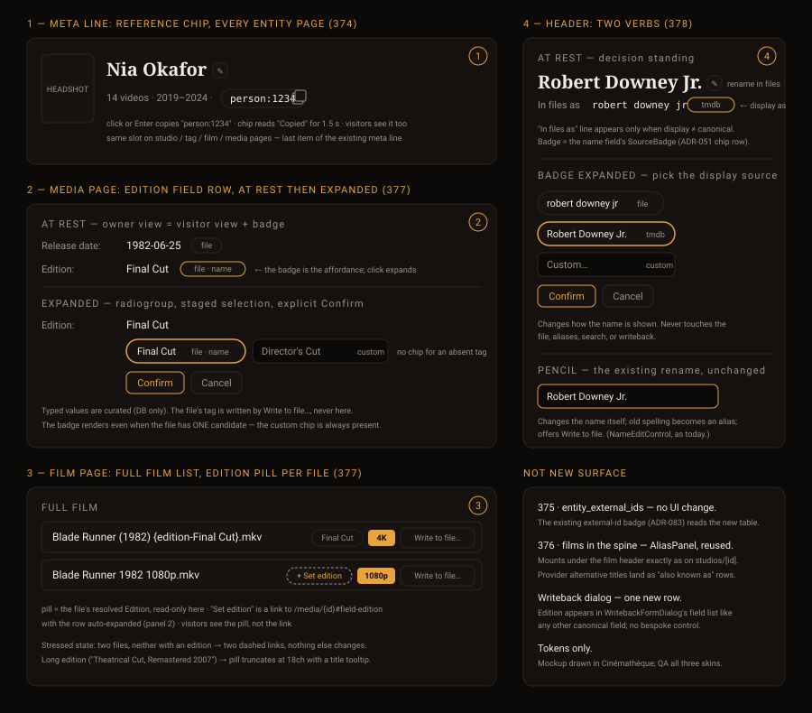

# Design handoff — Entity identity card (F60)

**Status:** Proposed — awaiting owner ratification of OQ1–OQ2 below
**Epic:** [HOLODEX-373](https://whoiskevinrich.atlassian.net/browse/HOLODEX-373) · stories with UI:
[374](https://whoiskevinrich.atlassian.net/browse/HOLODEX-374) reference chip ·
[377](https://whoiskevinrich.atlassian.net/browse/HOLODEX-377) edition ·
[378](https://whoiskevinrich.atlassian.net/browse/HOLODEX-378) Display as
**Owner:** Kevin Rich
**Date:** 2026-09-12
**Spec:** pending (`/write-spec`, `needs-spec` on the epic)
**ADR:** pending (`/architecture`, `needs-adr`) — the design below assumes the epic's five locked
decisions; if the ADR changes one, this doc is superseded, not patched.
**Builds on:** [entity-identity-handoff.md](entity-identity-handoff.md) (F43 — AliasPanel,
EntityPicker) · [field-source-of-truth-handoff.md](field-source-of-truth-handoff.md) (ADR-051
chip row) · [film-enrichment-handoff.md](film-enrichment-handoff.md) (F59 film header)
**Theming contract:** [ADR-021](../architecture/ADR-021-frontend-theming-and-skins.md) +
[theming.md](theming.md) — tokens only, QA all three skins.



## Overview

Every entity gets a uniform, *surfaced* identity so that a person, an agent, and a provider all
mean the same row. Three of the epic's five stories touch the UI; this document specifies those.
The other two ([375](https://whoiskevinrich.atlassian.net/browse/HOLODEX-375) external-id
unification, [376](https://whoiskevinrich.atlassian.net/browse/HOLODEX-376) films into the spine)
add **no new surface** — §5 records what they reuse so the decision is visible.

Two things changed between the brainstorm mockups and this grounded handoff, both because the
codebase already had the pattern:

1. **Edition edits ride `SourceBadge`, not a pencil.** HOLODEX-268's Tier-2 model is implemented
   as a badge-click (`curation/SourceBadge.svelte:227-241`), not a docked pencil. The pencil is
   `NameEditControl`'s rename affordance. Reusing the badge means the edition row is *literally* a
   canonical field row with zero new components — and it means the film page must not duplicate
   the curation mount (OQ1).
2. **"Display as" is the name field's `SourceBadge`, not a second button.** The brainstorm drew
   two buttons. Grounded: person pages already synthesise a `name` field with file + provider
   sources (`person_decisions.go:117` is where the decision is *rejected*). Lifting the rejection
   turns the name into an ordinary Tier-2 field whose badge opens the ADR-051 chip row — file
   spelling, each provider's spelling, custom. The two verbs then map onto two *existing*
   affordances: **pencil = rename in files**, **badge = display as**. This is a tighter split than
   two buttons and it also gives the owner the provider's spelling without typing it.

## 1. Reference chip — every entity page (HOLODEX-374)

### 1a. Placement

The chip is the **last item of the existing meta line** under the name. There is no shared header
component (each page is bespoke), so it mounts once per page:

| Page | Mount point | Line today |
|---|---|---|
| people | end of `EntityVideoMeta` row | `people/[id]/+page.svelte:544-548` |
| studios | hero meta line, after the video count | `studios/[id]/+page.svelte:302-329` (hero snippet) |
| tags | hero meta line | `tags/[id]/+page.svelte:379-407` |
| films | after the "Release date says …" line | `films/[id]/+page.svelte:437-439` |
| media | end of the `WxH · duration · year` meta line, after the resolution pill | `media/[id]/+page.svelte:1254-1262` |

Not in the `NameEditControl` `trailing` snippet — people already use that slot for
`NationalityFlags`, and a mono chip inline with a display-serif h1 fights it.

### 1b. Component: `RefChip.svelte` (new, `web/src/lib/components/entity/`)

| Prop | Type | Notes |
|---|---|---|
| `ref` | `string` | `"person:1234"` — comes from the API payload's `ref` field, never assembled client-side |

Markup: `<button type="button" class="btn-pill font-ui text-xs text-ink">` containing the ref in a
mono span (`font-mono` is not a token today — use `font-ui` and accept proportional digits, **or**
add `--font-mono` to `app.css` `@theme inline` as part of this story; recommended: add it, one
line, three skins inherit the system mono stack) plus a copy glyph (inline SVG, 12px,
`text-muted`).

Behaviour: click / Enter / Space → `navigator.clipboard.writeText(ref)`; label swaps to
**Copied** for 1500 ms then restores; `aria-live="polite"` region announces "Copied person:1234".
If the clipboard API rejects (insecure context, permissions), fall back to selecting the text
inside the chip and leaving it selected — the chip must never silently do nothing.

Visible to **visitors** — a ref is not a mutation and a visitor pasting `film:42` into a bug
report is the point.

### 1c. States

| State | Appearance |
|---|---|
| Rest | `btn-pill` outline, `border-rule`, text `text-ink`, glyph `text-muted` |
| Hover / focus-visible | `ring-1 ring-accent` (same ring `SourceBadge` uses) |
| Copied | label "Copied", glyph swaps to a check, 1500 ms |
| Clipboard denied | text selected in place; no toast, no error copy |

### 1d. API / MCP contract (frontend-relevant part)

Every entity payload carries `ref`. Routes accept `film:42` wherever they accept `42`; a
mismatched kind (`/people/film:42`) is **400**, not 404. The chip never parses or builds refs.

## 2. Edition field row — media page (HOLODEX-377)

### 2a. It is a canonical field, nothing more

`metadata-mappings.yaml` gains:

```yaml
- canonical: edition
  sources:
    - Edition                 # container tag — baseline, wins
    - filename:edition        # parsed {edition-X} (Plex grammar, strict in v1)
```

List order is precedence (`release_date` at `metadata-mappings.yaml.example:89-96` is the
precedent). No provider source in v1 — TMDB has no edition concept. Field kind: `replace`, single
value, manual allowed.

The media page then renders it through the generic field row
(`media/[id]/+page.svelte:1865-1890`): `<dt>Edition:</dt>` + `SourceBadge` for the owner,
`ProvenanceBadge` for visitors. Deep link `#field-edition` already works (`id="field-{canonical}"`).

### 2b. The one `SourceBadge` change

`SourceBadge` renders the clickable badge only when `isMultiSource`
(`SourceBadge.svelte:227`). An edition parsed from the filename alone is single-source, so the
owner would have **no affordance** to type a custom value. Change: the badge renders when the
field is *curatable* (manual allowed), regardless of candidate count; the chip row then shows the
one file candidate plus the custom input. This is a one-condition change in `SourceBadge`, and it
applies to every other single-source curatable field too — record it in `curation/CLAUDE.md`.

### 2c. Chip row contents

| Chip | Label | Present when |
|---|---|---|
| tag candidate | value · `file · tag` | tag present in file |
| filename candidate | value · `file · name` | `{edition-X}` parsed |
| custom | text input, placeholder `Director's Cut` | always (2b) |

Empty candidates are **not** shown as "— · file · tag" chips (the brainstorm mockup drew one; the
existing chip row never renders empty sources and neither should this). Confirm / Cancel exactly
as `SourceBadge` today; `use:dismissable` on outside click / Esc.

Helper line under the row (`text-xs text-muted`): *Typed values are curated. Use Write to file… to
store it in the file's tag.*

### 2d. Writeback

`WritebackFormDialog` (`writeback/WritebackFormDialog.svelte`) lists Edition like any other
field — no bespoke control. Writing it sets the container tag; on the next re-extract the tag
becomes the `file · tag` candidate and out-ranks the filename. The tag key per container is a spec
detail (MKV free-form `EDITION`; MP4/MOV need a QuickTime key — coordinate with HOLODEX-217).

## 3. Full-film list — film page (HOLODEX-377)

### 3a. Pill

Each row in `films/[id]/+page.svelte:641-670` gains a pill **between the title and the resolution
pill**: `rounded-full border border-rule bg-surface px-1.5 py-0.5 text-[10px] text-muted`, text =
the video's resolved `edition`. The video summary payload the film page already receives carries
`edition` (resolved value only — the film page never needs the candidates).

Truncate at 18 characters with the full value in `title`. Visitors and owners see the same pill.

### 3b. Set edition — the missing-value affordance

When `edition` is empty **and** the viewer is the owner, the pill slot shows a dashed link:
`rounded-full border border-dashed border-muted px-1.5 py-0.5 text-[10px] text-accent`, text
**+ Set edition**, `href="/media/{id}#field-edition?expand=1"`. Landing there opens the row with
the badge already expanded (`expandedField` store, `SourceBadge.svelte:34`), so the owner is one
Confirm from done. Visitors see an empty slot, not the link.

**OQ1 — deep link vs inline.** The brainstorm mockup opened the chip row *inline* on the film
page. Grounded recommendation: **deep link**. Inline would mean mounting `SourceBadge` (and its
single-slot `expandedField` store, `dismissable`, the curation `decide` plumbing) on a second page
for one field, and the film page would need each video's full `ResolvedField`, not just the value.
The cost is one navigation; the benefit is one curation mount. Owner to ratify.

### 3c. Stressed states

| Case | Rendering |
|---|---|
| Two full-film files, neither with an edition | Two dashed links. Nothing else changes — no banner, no "which is which?" prompt. The list is already the prompt. |
| One file, no edition | One dashed link. Not an error; most films have one file. |
| Edition set on some, not others | Mixed pills and links, same row shape. |
| Very long edition | 18-char truncation + `title`. |
| Edition present but identical on two files | Two identical pills — genuinely the owner's problem to fix via Set edition; do not dedupe or warn. |

## 4. Display as — entity headers (HOLODEX-378)

### 4a. Model

`name` becomes an ordinary resolved field on person / studio / tag / film: sources are the file
spelling (baseline), each provider's spelling, and custom. The **rendered** name is the resolved
value; the **canonical** `name` column is untouched by any decision and stays the file / writeback
/ identity / alias-routing truth.

### 4b. Header, at rest

The h1 (or `NameEditControl` heading) renders the resolved name. **Only when resolved ≠
canonical**, a line appears beneath it:

`In files as <canonical, mono> <SourceBadge>`

The badge is the name field's `SourceBadge` (its `ProvenanceBadge` shows `tmdb` / `custom`). When
resolved = canonical there is no line and no badge — the header looks exactly as it does today.
This keeps the visitor view and the at-rest owner view identical, per HOLODEX-268.

### 4c. Two verbs, two existing affordances

| Verb | Affordance | What it changes | Copy under it |
|---|---|---|---|
| **Display as** | the badge on the "In files as" line (or, when no decision stands yet, a quiet `btn-quiet text-xs` **Display as…** link in the same slot) | a per-field decision; DB only | *Changes how the name is shown. Never touches the file, aliases, search, or writeback.* |
| **Rename in files** | `NameEditControl`'s docked pencil, unchanged | canonical `name`; old spelling → alias; offers writeback | unchanged |

Search matches canonical, resolved, and aliases. Writeback payloads carry canonical, never the
display value — a test in the story enforces this.

**OQ2 — the go/no-go.** HOLODEX-378's kill criterion is "a first-time reader picks the right
verb." The reviewable artefact is panel 4 of the mockup: pencil next to the big name = rename;
badge on the small "In files as" line = display. If that doesn't read at a glance, cut 378 — the
other four stories don't depend on it.

### 4d. Tags and films

Tags: same badge on the tag hero; the only realistic sources are file and custom. Films: the
film title has **no** `NameEditControl` today (`films/[id]/+page.svelte:391`, rename is a 376
deliverable) — 378 for films is gated on 376 landing the pencil first.

## 5. Out of scope / no new surface

- **375 external-id unification** — the ADR-083 external-id badge reads the new table; no visual
  change.
- **376 films into the spine** — `AliasPanel` (`person/AliasPanel.svelte`, entity-generic since
  F43 S2) mounts under the film header exactly as on `studios/[id]/+page.svelte:363`; provider
  alternative titles land as `source='provider'` rows. `NameEditControl` on the film title
  reuses the studio wiring with `MergeOfferCard` as the verdict.
- Slugs, a Release/Version sub-entity, file renaming, tag lowercasing (HOLODEX-379) — set aside
  by the epic.

## 6. Accessibility

- `RefChip` is a real `<button>`; label "Copy reference person:1234"; `aria-live="polite"` on the
  Copied announcement; focus ring is the shared `ring-accent`.
- Edition and name chip rows inherit `SourceBadge`'s roving-tabindex radiogroup
  (`role="radiogroup"`, `aria-label="Source of truth for Edition"`), Esc/outside-click dismiss,
  and `aria-busy` during Confirm. The custom input is in the tab order after the last chip.
- **+ Set edition** is an `<a>` with a full href — no `onclick`-only link; screen readers get
  "Set edition, link".
- "In files as" line: the mono canonical value is plain text, not a button; only the badge is
  interactive.
- Nothing here relies on colour alone: the dashed border + the "+" carry the missing-state.

## 7. Theming

Tokens only. New class usage: `btn-pill` (exists), `border-dashed` (Tailwind utility, no token
needed), `font-mono` **only if** `--font-mono` is added to `app.css` `@theme inline` (1c). Contrast
targets to verify per skin (Cinémathèque / Broadcast / Brutalist): chip text on `bg-surface` ≥ 4.5:1;
`text-accent` on the dashed link ≥ 4.5:1; pill `text-muted` on `bg-surface` ≥ 3:1 (it's a label,
not body text — but check Broadcast, whose muted is the lightest).

## 8. QA checklist (3-skin)

### §1 Setup

- **1.1** [smoke] `backend-films` testbed, owner session (`X-Admin-Token`), one film with two
  full-film files: one named `… {edition-Final Cut}.mkv`, one with no edition marker.
- **1.2** [smoke] One person with a TMDB enrichment whose `name` differs in case from the file
  spelling.

### §2 Smoke — automated

- **2.1** [smoke] `GET /people/{id}` and `GET /people/person:{id}` return byte-identical bodies;
  `GET /people/film:{id}` → 400.
- **2.2** [smoke] Resolver: file with tag `Edition=Final Cut` and filename `{edition-Theatrical}`
  resolves `edition = Final Cut` with source `file · tag`.
- **2.3** [smoke] Writeback payload for a person with a standing display decision carries the
  canonical name, not the display value.
- **2.4** [smoke] `SourceBadge` renders the badge for a single-candidate curatable field (2b).

### §3 Agent live QA

- **3.1** [agent] Ref chip present on all five page kinds; click → clipboard contains the ref;
  label reads "Copied" then restores (use `javascript_tool` to read `navigator.clipboard` after a
  user-gesture click).
- **3.2** [agent] Media page: Edition row at rest shows value + `file · name` badge; expanded row
  shows one file chip + custom input, no empty-source chip; Confirm on a typed value → badge reads
  `custom`; reload → persists.
- **3.3** [agent] Film page: file with edition shows the pill; file without shows **+ Set edition**
  (owner) / nothing (visitor); following the link lands on `#field-edition` expanded.
- **3.4** [agent] Person header: no "In files as" line when resolved = canonical; after choosing
  `tmdb` in the badge, the line appears with the mono canonical and a `tmdb` badge; the h1 shows
  the TMDB spelling; the pencil still opens rename with the **canonical** value prefilled.
- **3.5** [agent] Contrast per §7 in all three skins via computed styles; no horizontal overflow
  at 375px on the media page with a 40-character custom edition.

### §4 Human

- **4.1** [human] Open any person page. Under the name, at the end of the small grey line, there's
  a pill like `person:1234`. Click it. It should say "Copied" for a moment. Paste somewhere — you
  get exactly that text. Looks right = the pill is quiet, doesn't compete with the name.
- **4.2** [human] Open a film with two full-film files. One row has a small label like "Final
  Cut" before the resolution badge; the other has a dashed "+ Set edition". Click it — you land on
  that file's page with the Edition row already open. Type "Theatrical", Confirm. Go back to the
  film: both rows now have labels.
- **4.3** [human] **The 378 go/no-go.** Open a person whose provider spelling differs from the
  file. Without reading any help text: which control would you use to *change how the name looks
  without touching the file*, and which to *rename the person for real*? If you hesitate, tell
  the agent — that's the signal to cut 378.

## Open questions for the owner

- **OQ1** (§3b) Set edition: deep link to the media page (recommended) vs inline chip row on the
  film page.
- **OQ2** (§4c) Does the pencil-vs-badge split read at a glance? This is the story's kill criterion.
