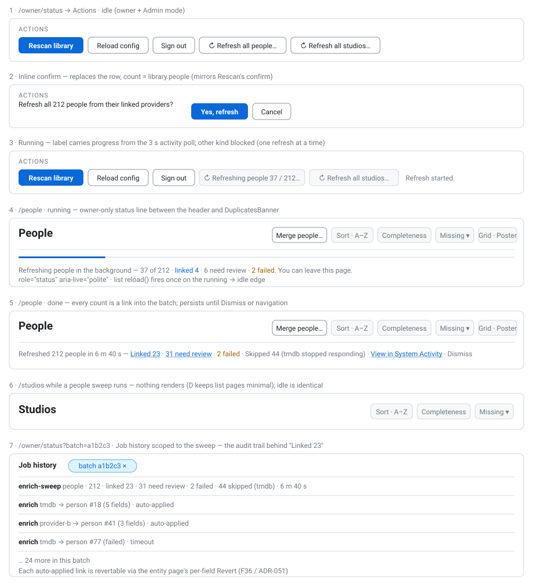

# Design Handoff: Entity refresh sweep — "Refresh all people / studios" from System Activity

**Status**: Approved placement (Option D, 2026-09-19) · **Ticket**: HOLODEX-421 · **Spec**: *pending `/write-spec`* (feature
number claimed at scaffold time via `node scripts/feature-claims.mjs`) · **ADR**: *pending `/architecture`* — provider
rate-limit contract (the initiative F47 deferred; see "Backend contract this UI needs")
**Theming contract**: [ADR-021](../architecture/ADR-021-frontend-theming-and-skins.md) + [theming.md](theming.md) —
**tokens only, QA all three skins.**
**Stack**: SvelteKit (Svelte 5 runes) + Tailwind v4 CSS-first (ADR-025).



---

## Overview

The owner can already bring **one** person or studio current with the detail page's **Refresh all**
(`EnrichProviderChips`, F47 RD8): for each provider whose `entity_types` includes the kind, a linked
provider refreshes and an unlinked one resolves and **auto-applies exactly one strong (`>= 0.85`) match**
— two-or-more strong, or none, leaves the pair for review (`enrich.SingleStrongMatch`, ADR-066 D1;
`refreshOneProvider`, `internal/api/enrich_review.go`). Dismissed pairs ("None of these match", RD4) are
skipped. Bringing the *whole* catalog current means visiting every page by hand.

This feature adds a **sweep**: one background job that runs that same per-entity step over every
person (or every studio), sequentially, and reports what it did. **No new matching rule** — the sweep
calls the code path the single click already uses.

### Placement decision (Option D)

The trigger lives on **`/owner/status` → Actions**, beside *Rescan library* and *Reload config*; the
**People** and **Studios** list pages render **only a live status line** while a sweep of their kind
runs, and a one-line summary when it finishes. Five placements were mocked in-session:

| Option | What | Verdict |
|---|---|---|
| A | Bordered `Refresh all…` first in the list header's owner group | Cheapest, but the People header is already 7 controls and wraps below ~900 px |
| B | Owner strip under the header with count + last-refresh age | Permanent chrome for an action fired roughly monthly |
| C | Owner ⋯ menu collecting Merge + Refresh all | Right answer when a third owner list action arrives; premature now |
| **D (chosen)** | **Trigger in System Activity's Actions block; list pages report only** | **Sits with the other library-wide jobs (Rescan, Extract all); list headers stay untouched; the job's audit trail is one scroll below its trigger** |
| E | Sticky bottom owner bar | New region; collides with the poster grid's scroll |

The one cost of D — trigger and feedback on different screens — is paid for by the list-page status
line: the owner who fires a sweep and navigates to People sees it progressing there, not just on the
status page.

### Design-system fit (the `/design-system` check)

**No new tokens, no new component.** Everything is assembled from idioms already on these two pages:

- **Actions buttons** — the `Reload config` treatment verbatim: `rounded-theme border border-rule px-3
  py-1.5 text-sm text-ink hover:bg-surface-2 disabled:opacity-60`. *Rescan library* stays the block's
  single solid `bg-accent` (one primary per view — theming rule, `app.css` L249–250).
- **Inline confirm** — the `confirmingRescan` shape verbatim (question `<span class="text-sm text-ink">`,
  solid-accent *Yes, …*, bordered *Cancel*). Refresh is non-destructive, but a sweep is ~`entities ×
  providers` outbound calls the owner cannot take back once queued, so it earns the same confirm Rescan has.
- **Toast** — the page's local `showToast()` (4 s auto-clear `text-sm text-muted`): `Refresh started.` /
  `A refresh is already running.` / the `toMessage(e)` error — mirroring `doRescan`.
- **Live state** — the `activity` store's existing 3 s poll of `GET /admin/activity`; the sweep is a new
  block on that read-model, so the nav `.activity-dot` lights for free (`busy` derives from it) and both
  pages read one source of truth that survives navigation and reload.
- **List-page status line** — the extraction page's `<p class="text-sm text-muted" role="status"
  aria-live="polite">` and its `text-warn role="alert"` sibling.
- **Audit landing** — `JobHistory` rows (kind, detail, batch id column, HOLODEX-207) plus one new filter
  chip: `?batch=<id>`.

Audit output: **two bordered buttons + one inline confirm on the status page, one `role="status"` line
per list page, one `sweep` block on the activity read-model, one `?batch=` filter on job history; zero new
tokens, zero new primitives.**

---

## Layout

### `/owner/status` — Actions block (owner + Admin mode only)

```
Actions
[Rescan library] [Reload config] [Sign out?]  [Refresh all people…] [Refresh all studios…]   <toast>
```

- Same `flex flex-wrap items-center gap-2` row. The two sweep buttons come **after** the existing
  buttons, in the order *people, studios* (matches the nav order).
- A button renders **only when the kind's count is `> 0`** (`a.library.people` / `a.library.studios`) — a
  sweep over nothing is not an action worth a disabled control.
- Confirm replaces the whole button row, exactly as `confirmingRescan` does:
  `Refresh all 212 people from their linked providers?  [Yes, refresh] [Cancel]`. The count is
  `a.library.<kind>` — it is the number the job will iterate.
- Running: the row is back; the running kind's button is `disabled` and reads
  `Refreshing people 37 / 212…`; the other kind's button is `disabled` with `title="One refresh at a time"`.
  Rescan/Reload are **not** disabled by a sweep (different subsystems; the scan already has its own busy).

### `/people` and `/studios` — status line (owner + Admin mode only)

Rendered **between the header row and `<DuplicatesBanner>`**, full width, only when there is something
to say about *this* kind:

```
Refreshing people in the background — 37 of 212 · linked 4 · 6 need review · 2 failed. You can leave this page.
```

```
Refreshed 212 people in 6 m 40 s — Linked 23 · 31 need review · 2 failed · Skipped 44 (tmdb stopped responding) · View in System Activity · Dismiss
```

- Nothing renders when idle. A sweep of the **other** kind renders nothing here (D keeps list pages minimal).
- The done line persists until *Dismiss* or navigation away from the route; it is derived from
  `sweep.last_run` + a page-local `dismissedBatch` so a reload does not resurrect a dismissed line.
- On the running→idle edge for this kind the page calls its existing `reload()` once, so fresh
  portraits/fields/completeness rings show without a manual refresh (same edge the status page uses
  for `loadDigest()` on scans).

---

## Design tokens used

| Token / class | Usage |
|---|---|
| `text-ink` | confirm question, button labels |
| `text-muted` | status-line body, toast, "Skipped N" segment, Dismiss |
| `text-warn` | `N failed` segment; failed-to-start line |
| `text-accent` / `hover:underline` | `Linked N`, `N need review`, *View in System Activity* links |
| `bg-accent` + `text-accent-ink` | *Yes, refresh* (confirm's affirmative — same as *Yes, rescan*) |
| `border-rule`, `bg-surface-2` (hover), `rounded-theme` | bordered buttons |
| `disabled:opacity-60` | disabled buttons — **never** on a `text-muted` element (`frontend-theming.md`) |

No new tokens. No hardcoded colors, radii, or font sizes.

---

## Components

| Component / file | Change |
|---|---|
| `web/src/routes/owner/status/+page.svelte` | Two buttons + `confirmingSweep: 'person' \| 'studio' \| null` + `doSweep(kind)`; busy/running labels from `a.sweep` |
| `web/src/routes/people/+page.svelte`, `web/src/routes/studios/+page.svelte` | `<SweepStatusLine kind="person" \| "studio" onfinished={reload} />` under the header |
| `web/src/lib/components/activity/SweepStatusLine.svelte` (**new, shared**) | Reads `activity.data?.sweep`; renders running / done / nothing; owns `dismissedBatch`; fires `onfinished` on the running→idle edge for its kind |
| `web/src/lib/components/activity/JobHistory.svelte` | Honours a `batch` prop (from `?batch=` on the status route): filter chip `batch a1b2c3 ×`, list scoped to that batch |
| `web/src/lib/api.ts` | `sweepEntities(kind)` → `POST /admin/enrich/sweep/{people\|studios}`; `activity` type gains `sweep` |
| `web/src/lib/activity.svelte.ts` | `busy` also true when `sweep.state === 'running'` |

`SweepStatusLine` is a component (not inline markup) because it is the one piece used on **two** routes
with identical behavior; the status-page buttons stay inline like their Rescan siblings.

---

## States and interactions

| Element | State | Behavior |
|---|---|---|
| `Refresh all people…` | Idle | Bordered neutral. Click → confirm row. Hidden when `library.people == 0`. |
| Confirm row | Open | `Refresh all N people from their linked providers?` · `Yes, refresh` (solid accent) · `Cancel`. Clicking either closes the row. Keyboard: Tab order question → Yes → Cancel; no auto-focus move (parity with Rescan). |
| `Yes, refresh` | Click | `busy = true`; `POST …/sweep/people`; toast `Refresh started.` on `started: true`, `A refresh is already running.` on `started: false` (202 either way — not an error); `toMessage(e)` toast on failure; `activity.refresh()` in `finally`. |
| Running kind's button | Running | `disabled`, label `Refreshing people 37 / 212…` from `sweep.done / sweep.total`. |
| Other kind's button | Running | `disabled`, `title="One refresh at a time"`. |
| Both buttons | Running → idle | Re-enable; digest reloads (existing `$effect` extended to watch `sweep.state`). |
| List status line | Running (this kind) | `role="status" aria-live="polite"`; counts update every poll tick; `You can leave this page.` |
| List status line | Done (this kind) | Summary with links; `Dismiss` clears it. `Linked N` / `N need review` → `/owner/status?batch=<id>`; `View in System Activity` → same. |
| List status line | Failed to start / job errored | `text-warn role="alert"`: `Couldn't refresh people: <error>. Try again from System Activity.` |
| List | Running → idle edge | `reload()` once. |
| JobHistory | `?batch=` present | Filter chip; rows limited to that batch; `×` clears the param. |
| Everything above | Visitor / Admin mode off | Renders nothing (`activity.effectiveOwner`). |

---

## Responsive behavior

| Breakpoint | Behavior |
|---|---|
| ≥ 768 px | Actions row single line; confirm question + two buttons fit one line. |
| < 768 px | `flex-wrap` — the confirm question wraps to its own line above the buttons (as Rescan's does today). Status line wraps naturally; the link segments stay inline (`inline` spans, no `flex`). |
| Any | No horizontal overflow: long provider names in `Skipped 44 (…)` use `wrap-anywhere` (HOLODEX-356 rule — `break-words` does not fix a flex item). |

---

## Edge cases

- **Empty catalog** — button hidden (see Layout). Studios page on a library with no studios shows no line.
- **Already running** — 202 `{started:false}`; toast, not error. Server single-flight is a `TryLock`
  (same as `extract.BatchRunner.TriggerAll`), so two tabs cannot start two sweeps.
- **Server restart mid-sweep** — the job dies with the process (server-lifetime `ctx`, same as Extract
  all); `sweep.state` comes back `idle` with `last_run` unset for the partial pass. The list line shows
  nothing; the partial per-entity runs remain in history under their batch id. No resume — documented,
  not designed around.
- **Provider goes down mid-sweep** — circuit breaker: after N consecutive failures from one provider the
  sweep stops calling it and counts the remaining pairs as `skipped`; the done line names the provider.
  Other providers continue.
- **Provider returns 429** — core honours `Retry-After` (default 30 s when absent) by pausing that
  provider's bucket; the sweep keeps going on the others. Visible only as a slower `done` counter.
- **Owner navigates away and back** — state is server truth on the 3 s poll; the line reappears in
  whatever state the sweep is in. A dismissed done line stays dismissed for the route's lifetime.
- **Sweep finishes while the list page is loading** — the running→idle edge is observed in an `$effect`
  over `activity.data`; if the page never saw `running`, no `reload()` fires (the initial load is fresh).
- **Very long done line** (many providers skipped) — one `Skipped N (a, b, c stopped responding)`
  segment; provider list truncates to 3 + `and N more`.
- **International text** — labels are English UI strings; numbers use `toLocaleString()`.

---

## Animation / motion

| Element | Trigger | Animation | Duration | Easing |
|---|---|---|---|---|
| Toast | show / clear | none (parity with Rescan) | — | — |
| Status line | appear / disappear | none — `aria-live` announces; motion would fight it | — | — |
| Running counter | poll tick | text swap only | — | — |

No spinners: the label carries progress (`37 / 212`), which says more than a spinner and costs no `animate-spin`.

---

## Accessibility notes

- Confirm row: question is plain text preceding the buttons in DOM order, so a screen reader hears
  the question before the choice. `Yes, refresh` and `Cancel` are `<button>`s.
- Disabled running button keeps its live label (`Refreshing people 37 / 212…`) — the count is readable;
  the other kind's button carries `title` **and** `aria-describedby` on a visually-hidden `One refresh at a
  time` so the reason is not tooltip-only.
- List status line: `role="status" aria-live="polite"` for running/done; `role="alert"` for the error line.
  Counter updates every 3 s — polite, not assertive, so it does not interrupt.
- Links in the done line are real `<a href>`s to `/owner/status?batch=…` (middle-click / new tab work).
- Focus order unchanged on both pages; the status line holds no focusable content while running.

---

## Backend contract this UI needs (for `/write-spec` + `/architecture`)

Design-level requirements only; the spec and ADR decide the exact shapes.

1. **`POST /api/v1/admin/enrich/sweep/{people|studios}`** → `202 {status:"accepted", started:bool}` —
   owner-gated (`requireOwner`), `TryLock` single-flight across both kinds, server-lifetime context,
   mirrors `adminExtractAll`. Iterates **sequentially over entities**; inside each entity, the existing
   per-provider fan-out (`refreshOneProvider`) — so in-flight requests are bounded by provider count,
   exactly as one detail-page click is today.
2. **`GET /api/v1/admin/activity` gains `sweep`**: `{state:"idle"|"running", kind, started_at, done,
   total, linked, needs_review, failed, skipped, batch_id, last_run:{kind, finished_at, duration_ms,
   total, linked, needs_review, failed, skipped, skipped_providers:[…], batch_id, error?}}`.
   `LibraryCounts` gains `studios`.
3. **Job runs**: one summary `JobRun` of a new kind (`enrich-sweep`) with `Detail` like
   `people · 212 · linked 23 · 31 need review · 2 failed · 44 skipped (tmdb)` and `batch_id`; every
   per-entity auto-apply the sweep performs records through the existing `RecordSearched` path **with the
   same `batch_id`**, so `?batch=` on history lists exactly which entities gained a link. Each such link is
   revertable through the existing per-field Revert on the entity page (F36/ADR-051).
4. **`GET /api/v1/admin/activity/history?batch=<id>`** — filter.
5. **Provider rate-limit contract** (the ADR; amends F47's "Queue-wide bulk resolution" non-goal /
   P2-1): per-provider token bucket in core's sidecar client for **all** outbound calls, default
   `2 req/s, burst 4`; optional `/describe.rate_limit {requests_per_second, burst}` self-declaration,
   clamped to `[0.1, 50]` like every other untrusted `/describe` field; optional `rate_limit:` operator
   override in `metadata-sources.yaml` with the established precedence **yaml → `/describe` → default**
   (as `search_pattern` does today); honour `429` + `Retry-After`; per-provider circuit breaker after N
   consecutive 5xx/timeouts. Contract doc update in `docs/specs/metadata-provider-contract.md`; sidecar
   sync is downstream as usual.
6. **Deferred → HOLODEX-422**: a `/resolve/batch` sidecar endpoint (sidecar-owned batching). Not
   needed for the default posture; a sidecar that owns its own queue declares a generous limit and answers
   `429 Retry-After` when its upstream says no.

---

## Three-skin QA checklist

Numbered, tagged `[smoke]` / `[agent]` / `[human]`, grouped by tag (project convention).

**[smoke]**
1. `/owner/status` in owner + Admin mode shows `Refresh all people…` and `Refresh all studios…` after
   `Reload config`; neither renders in visitor view or with Admin mode off.
2. Click → confirm row replaces the buttons with the correct count; Cancel restores them.
3. `Yes, refresh` → toast `Refresh started.`; buttons enter running/blocked states within one poll tick.

**[agent]**
4. Computed styles on all three skins (`javascript_tool`): buttons use `border-rule` / `text-ink`;
   `Yes, refresh` uses `bg-accent` + `text-accent-ink`; status line `text-muted`; `N failed` `text-warn` —
   no hardcoded colors (`reference-holodex-skin-qa-without-screenshots`).
5. Geometry at 375 px: confirm question wraps above the buttons; no horizontal scroll on either list page
   with the done line present (`document.documentElement.scrollWidth <= innerWidth`).
6. `?batch=<id>` on `/owner/status` scopes JobHistory and shows the chip; `×` clears it.
7. Second `POST …/sweep/people` while running → 202 `{started:false}` and toast `A refresh is already
   running.`; the studios button is disabled with `aria-describedby` text present.

**[human]**
8. Fire a sweep, navigate to People mid-run: the status line is present and counting; leave and return —
   still there. Studios page shows nothing.
9. Let it finish on People: `reload()` visibly refreshes cards; done line's `Linked N` opens System
   Activity filtered to the batch; `Dismiss` clears it and a reload does not bring it back.
10. Stop a sidecar mid-sweep: the done line names it under `Skipped`; the other provider's counts kept
    moving.
