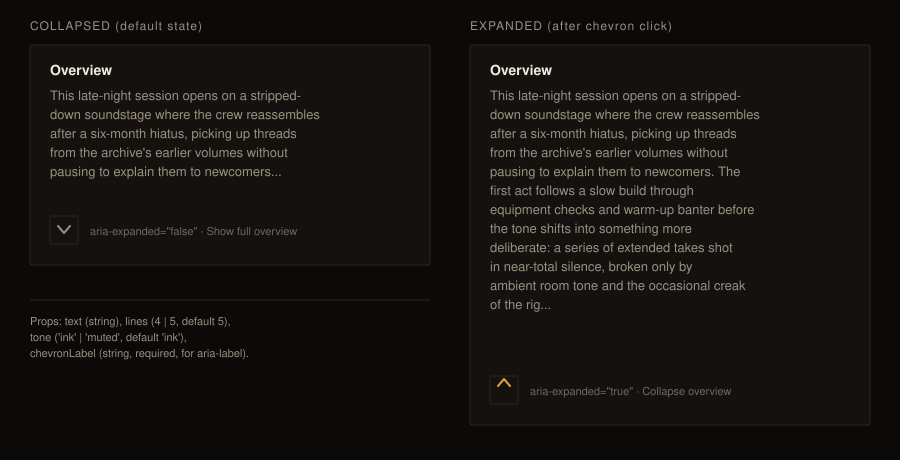

# Design handoff — `ExpandableText` shared component

Follow-up to [HOLODEX-320](media-detail-metadata-fold-handoff.md): that change moved Overview to
the media detail header, unclamped. At ~1500 characters it renders 20+ lines, pushing Studio (and
everything below it) off-screen. This handoff covers the fix and its extraction into a reusable
component, produced via `/design-critique` + interactive mockups this session before any code.

**Mockup:** [expandable-text-mockup.svg](expandable-text-mockup.svg)

## Options considered

Two layouts were mocked and compared:

- **Option A — clamp in place.** Keep Overview's existing position under the title, add a
  5-line clamp + "Show more" toggle. Smallest diff, no reorder.
- **Option B — reorder.** Move Overview below Studio so structured facts scan first, prose reads
  last. Bigger diff (reorders markup HOLODEX-320 deliberately anchored under the title).

**Decision: Option A's mechanism, in place.** The reorder in Option B doesn't ship in this
change — see "Deferred" below.

## Component

`web/src/lib/components/shared/ExpandableText.svelte` — line-clamped text with a chevron
expand/collapse toggle, mechanically identical to `CompletenessPanel`'s facet-list chevron
(`btn-quiet h-7 w-7`, `rotate-180` transition, `aria-expanded`/`aria-controls`) applied to prose
instead of a facet breakdown.

**Props:**

| Prop | Type | Default | Purpose |
|---|---|---|---|
| `text` | `string` | — | The value to render |
| `lines` | `4 \| 5` | `5` | Clamp line count. Narrowed to the two values actually used (Person's bio at 4, Media/Film's default 5) rather than an open `number` — Tailwind v4's JIT needs literal class names, so an unenumerated value would silently render unclamped |
| `chevronLabel` | `string` | `'text'` | Feeds the toggle button's `aria-label`/`title` (e.g. "Show full overview") |

**Visual treatment:** `text-muted` (not `text-ink`) and full container width (no `max-w-prose`) —
both explicit, deliberate choices for this pass: dimmed body copy reads as secondary/expandable
content rather than primary page text, and full width matches the video player's width above it
rather than a narrower reading column.

## Call sites (v1 — plain-text only)

| Page | File | Change |
|---|---|---|
| Media detail | `web/src/routes/media/[id]/+page.svelte:1070` | Visitor-view Overview branch: `
` → `<ExpandableText>` |
| Person detail | `web/src/routes/people/[id]/+page.svelte:557` | Bio: hard `sm:line-clamp-4` with no toggle → `<ExpandableText lines={4}>` |
| Film detail | `web/src/routes/films/[id]/+page.svelte:442` | Header description: unclamped `
` → `<ExpandableText>` |

All three keep their existing `id="field-<canonical>"` completeness-queue anchor wrapper unchanged.

## Deferred (explicit scope decision)

`SourceBadge.svelte` renders a field's resolved value inline (`{value}` + a
provenance chip) for owners viewing a replace field — this is the path an **owner** hits for
Media Overview (`isReplaceField && isOwner`) and Film's Details section. It is not wrapped by
`ExpandableText` in this change: a visitor sees the clamp, an owner still sees the full,
unclamped value inside `SourceBadge`. Giving `SourceBadge` its own `clampLines` option is a
separate follow-up, deliberately not folded into this diff to keep it scoped to the plain-text
call sites.

## Accessibility

- `aria-expanded` on the toggle button reflects state.
- `aria-controls` points at a `$props.id()`-generated id on the clamped `
`, so the relationship
  is explicit for assistive tech (matches `CompletenessPanel`'s `aria-controls="completeness-facets"`
  wiring).
- `title` mirrors the button's action ("Show more" / "Show less") for sighted mouse users.

## Verification

`npm run check`: 0 errors, no new warnings. Rendered via a throwaway route against the real
Tailwind build (not the static HTML mockup) to confirm: clamp renders and expands on click,
`aria-expanded`/`aria-controls` wire correctly, and the chevron rotation (Tailwind v4's `rotate`
CSS property, not `transform`) matches `CompletenessPanel`'s. Token compliance spot-checked
across all three skins via computed style (`text-muted` and `rounded-theme` both track the active
skin's `--muted`/`--radius`).
