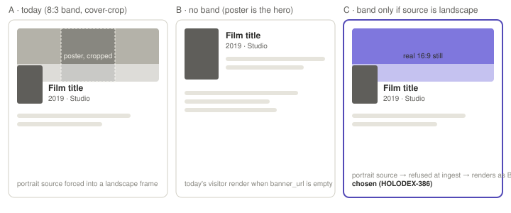

# Film banner landscape guard — design handoff

**Ticket:** HOLODEX-386 · **Status:** awaiting owner approval of option C · **Date:** 2026-09-15

## Decision under review

The film detail header's `banner` role (F59/ADR-089 D4) renders `fit="cover"` into an
`aspect-[8/3]` band. A provider sidecar emitted the film *poster* under the `banner` kind
(HOLODEX-387), so the band showed a cropped slice of portrait art. Three options were
mocked against the real header (`web/src/routes/films/[id]/+page.svelte`,
`EntityImageSlot`):

| | Option | What changes | Why not |
|---|---|---|---|
| A | Keep as-is, fix the sidecar only | Nothing in core | Core would keep trusting any third-party sidecar's `kind` |
| B | Remove the band | Supersede ADR-089 D4; films become the one entity with no hero | Reverses a three-week-old ADR on no new design evidence; whether the film page is a destination or a container is not yet known |
| **C** | **Refuse a portrait image for the landscape role at ingest** | **No new UI.** The existing `{#if film.banner_url}` gate already renders B when nothing is stored | — |

**Chosen: C.** It enforces the rule recorded in `web/src/lib/components/entity/CLAUDE.md`
("frame follows source aspect, never config or role name") and defers the destination-vs-
container question at zero cost: if the answer later turns out to be "container," B is one
ADR away and no UI built for C is thrown out.

## What the owner sees

- Landscape banner from a provider or upload → today's header, unchanged.
- Portrait image offered under `banner` → not stored; header renders exactly as it does
  today with no banner (F25.30's "no band when empty"). One activity-log line on the enrich
  run names the refusal and the dimensions, so an absent banner is explainable, never silent
  (ADR-090 posture).
- Owner upload of a portrait file to the Banner row → inline error on the row, same wording
  family as the existing upload failures; nothing stored.

## Not in scope

- Person banner (`PersonBanner.svelte`, separate component; no defect observed).
- The tinted/blurred-poster hero as a container-mode alternative — set aside until the
  film page's job is known.
- Any change to the band's 8:3 ratio, scrim, or overlap.

## QA

- 1.1 `[agent]` Enrich a film whose sidecar returns a portrait `banner`; assert no banner
  row in `ImageVersions` and one activity entry naming width×height.
- 1.2 `[agent]` Same film with a landscape `banner`; assert stored and served.
- 1.3 `[human]` Open the film page in all three skins with the portrait case: the header
  should look identical to a film that never had a banner — no plate, no gap where the
  band was.
