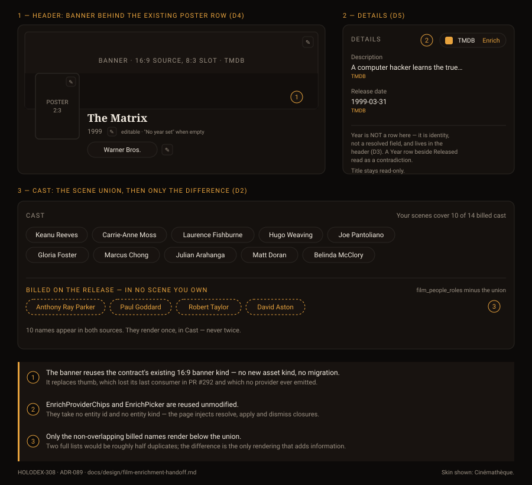

# Design handoff: Film provider enrichment (F59)

**Status:** Draft — pre-implementation gate
**Epic:** [HOLODEX-308](https://whoiskevinrich.atlassian.net/browse/HOLODEX-308)
**Owner:** Project owner
**Date:** 2026-09-04
**Spec:** [film-provider-enrichment-ux.md](../specs/film-provider-enrichment-ux.md) (F59)
**ADR:** [ADR-089](../architecture/ADR-089-film-enrichment-field-vocabulary.md) — D1 cast landing,
D2 merge rule, D3 year identity write, D4 banner-replaces-thumb, D5 SPA widening
**Supersedes:** [films-entity-handoff.md](films-entity-handoff.md) §2a (header) — the poster is no
longer the header's only image, the year is now an editable field, and the "All films" backlink is
gone (the nav's Films link already goes there; the person page dropped its equivalent in #286)
**Theming contract:** [ADR-021](../architecture/ADR-021-frontend-theming-and-skins.md) + [theming.md](theming.md) —
**tokens only, QA all three skins.**

## Overview

Three surfaces change on `/films/{id}`, and nothing else moves. The Details section gains the provider
chip every other entity page already has; the header gains a landscape banner behind the existing
poster row; and the Cast section gains a second, differently-meaning group below the scene union.

The load-bearing constraint throughout: **no component under `web/src/lib/components/enrichment/**` is
modified.** They are already entity-agnostic. A diff that touches them has gone wrong (ADR-089 D5).

## 1. Details section — provider chips

Structurally identical to `web/src/routes/studios/[id]/+page.svelte:419-436`. The film page already
has the Details `section` with the same `SourceBadge` / `baselineKey='record'` shape; this adds the
chip row to its heading line and the picker at page level.

| Element | Spec |
|---|---|
| Section shell | Unchanged — `space-y-3 rounded-theme border border-rule bg-surface p-4` |
| Heading row | Becomes `flex flex-wrap items-start justify-between gap-2`, matching studio |
| Heading | Unchanged — `text-xs uppercase tracking-wide text-muted`, "Details" |
| Owner control | `EnrichProviderChips` — one chip per film-capable provider (icon + name + Enrich), Clear/Refresh in the `⋯` overflow once linked |
| Visitor | **Sees nothing — the whole section is owner-only** (§4f). An earlier cut gave visitors a section-level `Enriched from {provider}` note; that was removed with the section, along with its now-unreachable `soleProvider` derived |
| Picker | `EnrichPicker`, page-level, `entityName={film.name}` |
| Error | `actionError` renders as `text-sm text-warn` above the field grid |

**Gate:** the whole chip row is hidden when `films_enabled` is off. The film enrich routes are not
registered in that state, so a rendered chip would 404 (F59 P0-3).

**Field rows.** `Description` and `Release date` render as they do today. **`Year` is not a Details
row** — it is the film's identity, not a resolved field, and lives as an editable control in the
header (§4). Keeping it out of here is deliberate: a `Year` row sitting beside `Released` was the
exact confusion that made the first attempt unreadable.

## 2. Header — banner behind the poster row

### 2a. Resolved: the banner sits behind an otherwise-unchanged header (spec Q1)

The alternative — promoting the banner to hero and demoting the poster to a Person-style overlapping
badge — was rejected. PR #292 deliberately made the portrait poster the film's identity image seven
days ago, and a film's poster carries more recognition weight than a person's headshot does. The
banner is atmosphere; the poster stays the subject.

So: the existing `flex flex-col gap-4 sm:flex-row` row (poster `w-40` + title column) is **unchanged**.
A banner band is inserted above it, and the row is pulled up to overlap the band's lower portion —
the same overhang relationship the Person page uses, with the poster rather than the headshot doing
the overlapping.

### 2b. Band geometry

| Property | Value | Note |
|---|---|---|
| Slot ratio | `aspect-[8/3]`, full content width | Matches Person's band; the provider asset is ~16:9 and is cropped, not letterboxed |
| Component | `EntityImageSlot` `variant="frame"` `role="banner"` | **No new component.** Second instance beside the existing poster slot |
| Overlap | Poster row pulled up so the poster overhangs the band's lower third | Name and poster read as one unit, not stranded below |
| Scrim | Bottom-anchored gradient over the band's lower ~45% | Reuses the person-bio scrim from PR #290 |
| Stacking | The overlap row and every child paint above the band | Same fix as PR #283 — the row must not sit behind |

Measured as built — title over the scrim 16.84 / 16.38 / 18.97 and the year 6.31 / 4.90 / 5.73 across
Cinémathèque, Broadcast and Brutalist. **Read that as a floor, not a guarantee:** it compares the text
against the scrim's end colour (`--bg`). Higher up the gradient the text sits over partially visible
artwork, so an unusually bright backdrop can still read worse than these numbers. If that shows up in
practice, deepen the scrim rather than darkening the text.

### 2c. Empty states (spec Q2) — as built

**No new prop was needed for the empty state.** A monogram stretched across an 8:3 band would be the
wrong empty state, so the page simply does not mount the band when there is no banner: the owner gets
`EntityImageSlot`'s compact **row** variant instead (same upload affordance, no large empty plate),
and a visitor gets nothing at all.

| Film has | Owner sees | Visitor sees |
|---|---|---|
| Banner + poster | Band + scrim, poster overlapping | Band + scrim, poster overlapping |
| Poster only | Compact "Banner" upload row above the header | **No band at all** — header renders exactly as before this feature |
| Banner only | Band + the poster slot's own upload affordance | Band + the poster role's empty state |
| Neither | Today's header, plus the compact Banner row | Today's header, unchanged |

The "poster only, visitor" row is the important one: a film with no banner renders exactly as it did
before. This mirrors F25.30's decision for Person — no placeholder band for visitors.

**The one prop the component did need was `fit`.** `EntityImageSlot` only did `object-contain`, which
pillarboxed a ~16:9 backdrop against the light plate inside the 8:3 band — visible as bright bars down
both sides. `fit="cover"` crops instead, per §2b. Same prop retires the inset (`p-*`) that produces the
"frame" look, which is wanted on a poster and wrong on a full-bleed band.

### 2d. Owner controls

Both roles keep `variant="frame"`'s corner overlay buttons (pencil = replace, `×` = remove). The
banner's sit top-right of the band; the poster's stay where PR #292 put them. Two `EntityImageSlot`
instances, two independent upload/remove paths, one `onchanged={reloadDetail}`.

## 3. Cast — the union, then the difference

The single most important rule in this handoff. See the mockup's panel 3.

### 3a. Structure

| Group | Source | Rendering |
|---|---|---|
| **Cast** | Scene union over `film_videos` — unchanged | Existing `PeopleGrid`, unchanged |
| **Billed on the release — in no scene you own** | `film_people_roles` **minus** the union | Second `PeopleGrid` instance, visually distinguished |

### 3b. What must not happen

- **Never render a name twice.** A performer in both sources appears once, in Cast. At realistic scale
  (a 10-person union against TMDB's 20-name `maxCastCredits` window) two full lists are roughly half
  duplicates.
- **Never merge the two into one list.** That destroys the distinction the second group exists to
  express — "in my footage" versus "on the release" — which is the whole value.
- **Never reorder or filter the union** to accommodate the second group. The union is primary.

### 3c. Difference styling

Dashed chip border in the accent role, accent text — reading as *provisional / not-yet-present* rather
than as an error or a warning. These are not problems; they are information about coverage. Do not use
`--text-warn` or `--text-danger`.

Difference is computed by **resolved person identity**, not display string, so an alias or a case
variant never manufactures a phantom entry (ADR-089 D2).

### 3d. Counts line (P1-1)

Right-aligned on the Cast heading row, `text-xs text-muted`: `Your scenes cover 10 of 14 billed cast`.
Hidden entirely when no provider credits exist — a film with no enrichment shows exactly today's Cast
section.

### 3e. Empty and degenerate states

| State | Rendering |
|---|---|
| No provider credits | Cast section exactly as today. No second group, no counts line |
| Credits exist, difference is empty | Counts line reads `Your scenes cover all 14 billed cast`; the second group is **omitted**, not shown empty |
| Union is empty, credits exist | Cast section shows the empty-union state; the second group renders in full — this is a film whose scenes are all unattached or uncredited |
| One difference name | Same group, singular counts copy |

## 4. Year — an editable field, not a message

The year is an **editable field in the header** using the same docked-pencil affordance the Media
page uses for Title and Studio, and a `(name, year)` clash renders as that control's inline
**verdict** — in the control the owner just used.

### 4a. At rest

| State | Rendering |
|---|---|
| Year set | `1999` in `text-sm text-muted`, directly under the title, pencil on hover/focus |
| Year unset | `No year set`, same treatment — deliberately matching the `No studio set` line one row below |
| Visitor | Identical resting text, no pencil (`NameEditControl` already handles this) |

The permanent empty state is the point, not decoration. Previously a film with no year rendered
**nothing** where the year belongs, so any message about it referred to something invisible. Giving
the year a slot is what makes it addressable at all.

### 4b. The collision verdict

Rendered by `NameEditControl`'s `verdict` snippet, inline, replacing the edit form:

- Claim, linked: `Dune (2021) already uses that name and year.`
- Why, muted: `A film is identified by its name and year together, so the two can't match.`
- Actions: `View that film` (`btn-ghost`) · `Cancel` (`btn-quiet`, restores focus to the pencil).

**Never `text-warn`.** A conflict is an answer the owner acts on, not a failure — and the API
returns `200 {conflict}` precisely so the control routes it here instead of to its red inline-error
slot. Genuine failures (a non-numeric entry, a dead server) still use that error slot, which is what
the red is for.

### 4c. Component reuse

`NameEditControl` gained three optional, defaulted props to serve this mount, leaving every existing
call site untouched — `as` (resting element; the year passes `p` because the film title already owns
the page's only `h1`), `editLabel` (an accessible name; `Rename this year` describes no real action),
and `placeholder`. See `web/src/lib/components/entity/CLAUDE.md`.

This replaces the hand-rolled `name-edit-row`/`name-edit-pencil` markup the page was already using
for its studio row **without** importing the component. Studio should follow via `StudioPicker` —
tracked on HOLODEX-285, not done here.

### 4d. Known limitation

`NameEditControl` rejects an empty commit (correct for a name), so **a year cannot be un-set from the
UI** once given. Setting a wrong year is recoverable by setting the right one; returning to "no year"
is not. Acceptable for now, and called out rather than discovered.

### 4e. Provider fills stay silent

An enrich that withholds the year no longer prints anything. It does not need to: the header simply
still reads `No year set`, and clicking the pencil gives the precise reason. The API still returns
`year_collision` on the apply response (backend-tested); the SPA no longer renders a separate line
for it.

Measured on the built control — `No year set` 6.31 / 4.90 / 5.73, verdict claim 16.00 / 15.59 /
18.50, verdict rationale 6.00 / 4.67 / 5.59 across Cinémathèque, Broadcast and Brutalist. One `h1`
on the page, confirmed in the DOM.

## 4f. Owner-only surfaces (owner request, 2026-09-04)

Three visibility rules, all matching what the Media detail page already does:

| Surface | Rule | Why |
|---|---|---|
| Studio row | `{#if isOwner || studios.length}` | Copied verbatim from `media/[id]`. A visitor never sees "No studio set" — an empty row is an owner affordance, not information. Films were the last page still showing it |
| Description under the studio row | Renders only when a value exists | Already satisfied the rule; a visitor never saw an empty one, and an owner has no add-affordance there to reveal |
| **Details section** | `{#if isOwner && …}` — owner-only outright | It is provenance and curation machinery, not reader content: source badges, provider chips, and Released all exist to serve editing decisions, and the description a visitor wants already renders in the header |

Gating Details also retired the visitor's section-level "Enriched from X" note, which could no longer
render — the `soleProvider` derived was removed rather than left as dead code.

## 5. Out of scope

- Film rename / title editing (spec Non-Goal 1) — no affordance appears anywhere in this handoff.
- Any change to how Studio is edited on a film; F57's cascade dialog is untouched.
- Multi-provider picker UI (HOLODEX-85/168) — films inherit it whenever it ships.
- Tags on a film — still a read-only union, unchanged.

## 6. Accessibility

- The banner is decorative; its `EntityImageSlot` renders `alt=""` and the film name stays the `h1`.
- The scrim is a presentational overlay, not a focusable element, and must not intercept pointer
  events on the controls beneath it.
- The difference group needs a real heading, not a styled `div` — screen-reader users must get the
  "billed but absent" framing, which is the entire meaning. Colour and dashes alone do not carry it.
- Owner overlay buttons on both image roles keep discernible names: `Replace banner`, `Remove banner`,
  and the existing poster equivalents.
- Chip contrast: the dashed accent chips must clear AA against `--surface` in all three skins — this
  is the pairing most likely to fail, since accent-on-surface is decorative elsewhere but load-bearing
  text here.

## 7. Theming

Tokens only. The band, scrim, chips and dashed borders all resolve from existing tokens — no new
token is introduced. The scrim is the one risk: it is a gradient to `--surface`, and a skin whose
surface is light inverts the legibility problem it solves. QA the banner + title contrast in all three
skins explicitly, not by inspection of one.

## 8. QA checklist (3-skin)

Numbered `section.item`, grouped by verifier ([[feedback-qa-checklist-numbering]]).

### §1 Setup
- **1.1** Preview stack running with `films_enabled: true` and a TMDB provider configured.
- **1.2** A film with at least 4 attached scenes and a known TMDB match.
- **1.3** A second film sharing the first's name but a different year (for 4.x collision tests).

### §2 Smoke — automated (green in CI)
- **2.1** `[smoke]` With `films_enabled: false`, `/films/{id}` renders no enrichment chip and issues no
  `/films/*/enrich/*` request.
- **2.2** `[smoke]` Applying provider cast to a film leaves every attached video's `video_people` and
  `field_source_decisions` unchanged (ADR-089 D1 invariant).
- **2.3** `[smoke]` A union of 10 and a billed list of 14 sharing 10 names renders 10 + 4 chips, never 24.
- **2.4** `[smoke]` A colliding-year apply returns the occupant's name and leaves both films unchanged.
- **2.5** `[smoke]` `web/src/lib/components/enrichment/**` is unchanged by the epic's diff.

### §3 Agent live QA (preview tools against the §1 stack)
- **3.1** `[agent]` Enrich a film; confirm description, release date, year, poster and banner all
  populate from one apply. **All 3 skins.**
- **3.2** `[agent]` Measure computed contrast of the film title over the banner scrim. **All 3 skins.**
- **3.3** `[agent]` Measure computed contrast of a dashed difference chip's label against `--surface`.
  **All 3 skins.**
- **3.4** `[agent]` Confirm via `getBoundingClientRect` that the poster overlaps the band and that no
  control sits beneath the scrim's hit area.
- **3.5** `[agent]` Clear the provider; confirm the difference group and counts line disappear and the
  Cast union is untouched.
- **3.6** `[agent]` A film with a poster but no banner renders a header geometrically identical to
  `main`'s.

### §4 Human
- **4.1** `[human]` Open a film you know well and click **Enrich** on the provider chip in the Details
  box. Pick the right match. Does the page now show a wide image across the top, with the poster still
  in front of it and the title readable over the image? Nothing should look washed out or hard to read.
- **4.2** `[human]` Look at the Cast area. The top group is who's in the video files you actually have.
  The dashed group below is people credited on the real film who aren't in any of your files. Is that
  distinction obvious without reading the labels twice? Is anyone listed in *both* groups? (Nobody
  should be.)
- **4.3** `[human]` Switch skins using the theme control and repeat 4.1 and 4.2 in each. The wide image
  and the title should stay readable in all three.
- **4.4** `[human]` Try enriching the film from §1.3 — the one that shares a name with another film.
  You should get a clear message naming the film it clashed with, and nothing on the page should
  change.
- **4.5** `[human]` On a film with no wide image set, does the page look the same as it did before this
  change? (It should — no empty grey band.)
- **4.6** `[human]` As a visitor (owner view off), confirm you see no Enrich button, no pencils, and no
  "Add banner" control anywhere.
