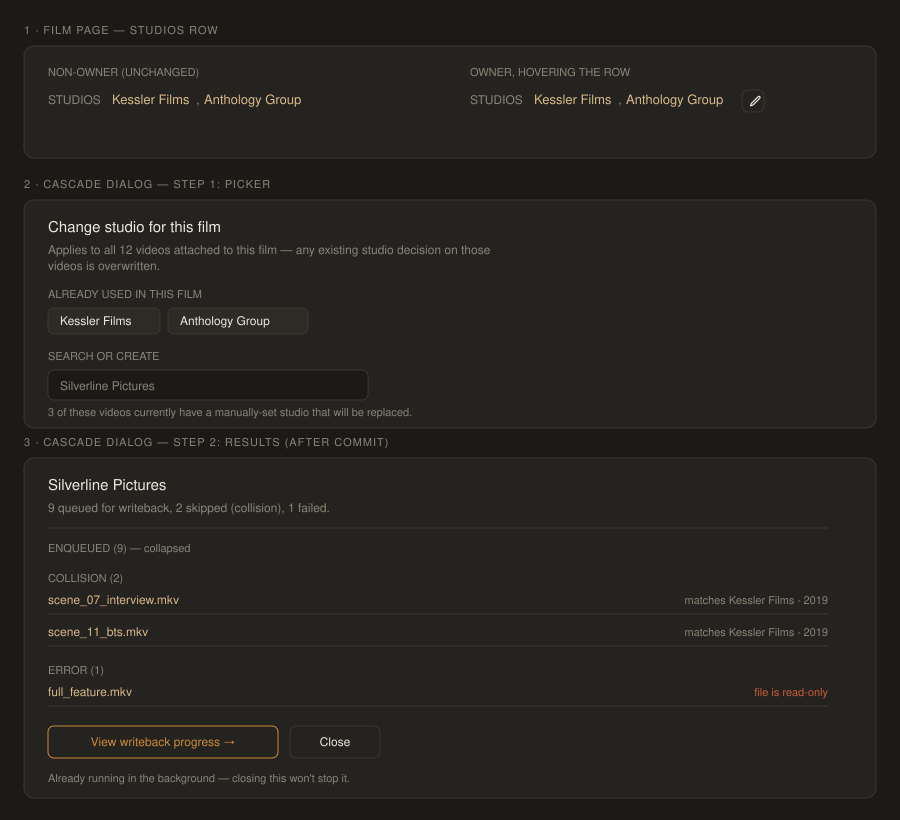

# Design handoff: Film Studio cascade edit affordance (F57)

**Status:** Draft
**Phase:** HOLODEX-285
**Owner:** Project owner
**Date:** 2026-08-25
**Spec:** [film-studio-cascade-writeback.md](../specs/film-studio-cascade-writeback.md)
**ADR:** [ADR-087](../architecture/ADR-087-film-studio-cascade-decide-and-writeback.md)
**Branch/PR:** `HOLODEX-285-film-studio-cascade-writeback`, Draft PR #254

## Overview

RD1 requires the Studio edit affordance to be gated purely on owner-view state, with the
**same visual language** wherever it appears. Media already has this
([`StudioPicker.svelte`](../../web/src/lib/components/entity/StudioPicker.svelte),
HOLODEX-271) — this handoff brings Film's read-only Studio links up to the same docked-pencil
standard, then designs the two things that don't exist yet anywhere in the codebase: a
same-action decide-across-N-videos commit, and the mixed enqueued/collision/error outcome list
that action can produce (ADR-087 D2's best-effort posture).

Nothing here touches Media's own Studio affordance, and nothing here touches Film's Cast/Tags
(spec Non-Goals 1/2).



---

## 1. Media detail page — no visual change

`StudioPicker.svelte` is unchanged and remains the reference implementation: docked pencil →
`PickerShell` popover → candidate chips (`sourceChips(field, 'file')`) → search → create
fallback → single-video `decide()` → `CollisionOfferCard` verdict on a 409. Confirmed by
reading the component in full — no code path here needs to know Film exists.

---

## 2. Film detail page — trigger affordance

Replace the current always-plain-links block
(`web/src/routes/films/[id]/+page.svelte`, ~line 142) with the same `.name-edit-row` /
`.name-edit-pencil` pattern `NameEditControl` and `StudioPicker` already use, gated on
`isOwner` exactly like every other owner control on this page — **not** a new gate, and not
conditioned on `studios.length` (an owner with zero attached studios still needs the pencil to
set one).

```svelte
<div class="name-edit-row flex flex-wrap items-center gap-1.5 pt-1">
	<span class="text-xs uppercase tracking-wide text-muted">Studios</span>
	{#if studios.length}
		{#each studios as s, i (s.id)}
			{#if i > 0}<span class="text-muted">,</span>{/if}
			<a href={`/studios/${s.id}`} class="text-ink hover:text-accent">{s.name}</a>
		{/each}
	{:else}
		<span class="text-sm text-muted">No studio set</span>
	{/if}
	{#if isOwner}
		<button
			type="button"
			aria-label="Change the studio for every video in this film"
			onclick={openCascade}
			class="name-edit-pencil rounded-theme border border-rule p-1.5 text-muted hover:border-accent hover:text-ink"
		>
			<!-- identical pencil glyph to NameEditControl -->
		</button>
	{/if}
</div>
```

Non-owner rendering is byte-for-byte what exists today (RD1) — verified by keeping the
`{#if isOwner}` block strictly additive around the existing `{#each}`.

The pencil's `aria-label` differs deliberately from Media's (`"Change this video's studio"`):
Film's must say **"every video in this film"** up front, since this is the one place in the
app where clicking an edit pencil fans out to N records instead of one — the label is the
first accessibility signal of that, before the dialog even opens.

---

## 3. New component: `FilmStudioCascadeDialog.svelte`

**New component, not a `StudioPicker` reuse.** Same reasoning the Films folder already applied
to `FilmAttachDialog` vs. `FilmBulkAttachDialog` ("deliberately separate components... result
shape and commit flow differ enough to keep this its own component" —
[`film/CLAUDE.md`](../../web/src/lib/components/film/CLAUDE.md)): `StudioPicker`'s `decide`
prop resolves one video's `{ok}` or `{conflict}`; the cascade resolves N videos' mixed
outcomes at once. Forcing that through `StudioPicker`'s existing single-conflict `verdict`
slot would corrupt a clean contract for one caller. Instead `FilmStudioCascadeDialog` **visually
mirrors** `StudioPicker` step-for-step (same chrome, same chip/search/create body, same
tokens) and only diverges where the data genuinely differs: what feeds the chips, and what
happens after commit.

Lives in `web/src/lib/components/film/` (function-based: it's a Film-specific commit flow, not
a cross-entity primitive — same classification `FilmAttachDialog`/`FilmBulkAttachDialog`
already got).

### 3a. Step 1 — Picker (open state)

Opens in a `PickerShell` popover, identical chrome to `StudioPicker`. Two framing differences
from Media, both copy-only:

| | Media (`StudioPicker`) | Film (`FilmStudioCascadeDialog`) |
|---|---|---|
| Header | "Change studio" | "Change studio for this film" |
| Subhead | *(none)* | **"Applies to all {N} videos attached to this film — any existing studio decision on those videos is overwritten."** (RD4, stated plainly, not buried) |
| Candidate chips source | `sourceChips(field, 'file')` — known values for *this field* | `FilmStudios(filmID)` — the studio names *currently shared across the film's videos* (same union query the read-only view already renders; no new endpoint) |
| Chip framing label | *(none, chips are self-evident)* | `text-xs text-muted` row above the chips: **"Already used in this film"** |
| Search / create row | unchanged | unchanged |

The subhead is load-bearing, not decorative: it's the only place in this flow that states the
unconditional-overwrite behavior (RD4) to the owner before they commit — there is no
confirm/checklist step to catch it later (Non-Goal 3).

**P1-1 (light, should-have) — pre-cascade summary line.** If the Film page already has
per-video resolved-studio-source data cheaply available client-side (it doesn't today — the
page currently only fetches the resolved union, not each video's decision source), render one
more `text-xs text-muted` line under the subhead: *"{M} of these videos currently have a
manually-set studio that will be replaced."* If that per-video source data isn't already on
hand, **skip this line entirely for v1** rather than adding a new fetch to support a P1
nice-to-have — flag this as an engineering call, not a design gap. No opt-out checklist either
way (Non-Goal 3 stands regardless of whether the count renders).

### 3b. Step 2 — Results (post-commit, same dialog, same `PickerShell`)

Committing a chip/search/create pick calls `POST /films/{id}/studio/cascade` and the dialog
**replaces its body in place** (no second modal) with the mixed-outcome list from the
synchronous `{batch_id, results: [...]}` response. This is new UI — no existing component
renders a list of N per-video outcomes from one action, and `CollisionOfferCard`'s
single-blocking-verdict shape (buttons: View existing / Save anyway / Cancel) doesn't apply
here — nothing is blocking; the cascade already ran best-effort per ADR-087 D2, so this list is
**purely a report**, not a decision point.

Structure:

- **Status line** (`aria-live="polite"`, fires once on mount — mirrors `StudioPicker`'s
  search-status pattern): *"{enqueued} queued for writeback, {collisions} skipped
  (collision), {errors} failed."* Omit a clause whose count is 0.
- **Three collapsible groups**, in this order, each a `<details>`/`<summary>` pair (native,
  no new disclosure component) so a large film's 40-video result doesn't dump 40 rows by
  default:
  1. **Enqueued ({n})** — collapsed by default, just the count; these need no owner attention.
  2. **Collision ({n})** — **expanded by default** when non-empty (these are the videos that
     need attention). Each row: video title (link to `/media/{id}`) · `text-xs text-muted`
     one-liner naming the colliding video, reusing the same fact `CollisionOfferCard` shows
     (`{people} · {year} · {studios}`) but as inert text, not buttons — there's nothing to
     action inline mid-cascade; the owner resolves it later from that video's own
     `StudioPicker` with `Override` if they want to force it.
  3. **Error ({n})** — expanded by default when non-empty. Each row: video title (link) ·
     `text-xs text-warn` error message.
- **Footer** (mirrors `StudioPicker`'s footer bar height/padding):
  - If `enqueued > 0`: `.btn-accent` **"View writeback progress →"**. Wired below (§4).
  - Always: `.btn-ghost` **"Close"**.
  - If `enqueued === 0` (every video collided or errored — `batch_id` is empty per ADR-087
    D2): no writeback button at all — never a disabled/dead primary action, per the
    project's standing rule against an affordance with nothing behind it. Close is the only
    control.

---

## 4. Writeback progress hand-off — `WritebackBatchDialog`, reused, one additive prop

The cascade endpoint already calls `writequeue.EnqueueMany` **synchronously as part of the
same POST** that produced the Results step (ADR-087 D2) — the batch is already running on the
backend by the time the owner sees "View writeback progress →". `WritebackBatchDialog`'s
existing `'confirm'` → (click Start) → `'starting'` → `trigger()` sequence assumes the click
*initiates* the batch; here it would just be re-confirming work that already started, which
misrepresents causality to the owner.

**Fix: one small additive prop**, not a redesign — `autostart?: boolean` (default `false`,
every existing caller unaffected). When `true`, the component skips `'confirm'`/`'starting'`
and calls `trigger()` immediately on mount, landing straight in `'progress'`. Everything else
— the progress bar, `waitForWritebackBatch` polling, the `'done'`/`'partial'`/`'timeout'`
terminal phases — is used exactly as built.

Wiring: clicking "View writeback progress →" **closes the `FilmStudioCascadeDialog` popover**
and mounts `WritebackBatchDialog` as its own top-level modal (it already renders its own
fixed-overlay chrome — stacking it inside `PickerShell`'s backdrop would double the dimming).
The Film page holds one new piece of state (the pending `{batch_id, enqueued}`) to pass through:

```svelte
<WritebackBatchDialog
	autostart
	scopeLabel={film.name}
	videoCountHint={pending.enqueued}
	trigger={async () => pending}
	batchStatus={api.writebackBatchStatus}
	onclose={() => (pending = null)}
	onapplied={refreshFilmStudios}
/>
```

**Dismissing either step does not stop the batch** — it's already enqueued server-side. State
this directly in the Results step's footer as a `text-xs text-muted` caption under the
buttons: *"Already running in the background — closing this won't stop it."* No new "resume
later" affordance is needed: `GET /writeback/batches/{batchID}/status` is the same
general-purpose endpoint System Activity already polls, so an abandoned batch's outcome is
still visible there through the existing mechanism.

---

## Design tokens used

All inherited — no new tokens. Reference ([theming.md](theming.md)):

| Token | Usage here |
|---|---|
| `.name-edit-row` / `.name-edit-pencil` | Film's new Studios pencil, identical hook classes to `NameEditControl`/`StudioPicker` |
| `text-ink` / `text-muted` | studio names / labels, subhead, group counts, "already running" caption |
| `text-warn` | error rows in the Results step |
| `bg-surface` / `bg-surface-2` | `PickerShell` body / chip & result rows |
| `border-rule` / `border-accent` | pencil border / hover-focus, picker row states |
| `.btn-accent` / `.btn-ghost` | "View writeback progress →" (accent, the one primary action) / "Close" (ghost) |
| `rounded-theme` | dialog/chip/row radii |

**Token guard**: `rg 'zinc-|sky-|emerald-|amber-|rounded-(lg|md|sm|xl)' web/src --glob '*.svelte'` must stay empty. **Muted-disabled guard**: `rg 'text-muted[^"]*disabled:opacity' web/src --glob '*.svelte'` must stay empty — the zero-enqueued state withdraws the writeback button entirely rather than disabling it.

---

## States and interactions

| Element | State | Behavior |
|---|---|---|
| Studios pencil | Non-owner | Not in DOM (matches `NameEditControl`) |
| Studios pencil | Owner, at rest | Low-opacity, brightens on hover/focus of `.name-edit-row` |
| Picker step | Loading candidates | Reuses `StudioPicker`'s existing chip-row skeleton, no new loading state |
| Picker step | Commit in flight | Submit control shows `busyKey`-style busy text (`StudioPicker` pattern), popover stays open |
| Results step | `enqueued > 0`, no collisions/errors | Enqueued group only, collapsed; footer shows both buttons |
| Results step | Mixed outcome | Collision/Error groups expanded by default; Enqueued collapsed |
| Results step | `enqueued === 0` | No writeback button; status line reads entirely in collision/error language |
| `WritebackBatchDialog` | `autostart` | Skips `'confirm'`/`'starting'`, opens straight into `'progress'` |

---

## Responsive behavior

Inherits `PickerShell`'s existing responsive rules unchanged (same component, same widths) —
no new breakpoint behavior. `WritebackBatchDialog` is unmodified visually, so its existing
responsive behavior carries over unchanged too.

---

## Edge cases

- **Film with zero attached videos**: the pencil still renders for an owner (RD1 doesn't
  condition on attachment count), but clicking it should be a no-op guarded client-side
  (nothing to cascade to) — show the picker with a `text-xs text-muted` note *"This film has
  no attached videos yet."* in place of the subhead, and disable commit. Avoids a round trip
  to an endpoint that would return an empty `results: []` anyway.
- **Every candidate video already has this exact studio decided**: cascade still runs
  (RD4 — unconditional) and every row lands in the Enqueued group; this is expected, not an
  error, and needs no special messaging.
- **A film with a very large scene count (40+ videos)**: the `<details>` grouping keeps the
  default view short; the Enqueued count alone (not a full list) is sufficient there since
  those rows need no owner action.
- **Owner closes the browser tab mid-`'progress'`**: no different from any other
  `WritebackBatchDialog` caller today — the batch is server-side and durable
  (`internal/writequeue`), unaffected by the dialog's lifetime.

---

## Accessibility

- Pencil: `aria-label="Change the studio for every video in this film"` (see §2) — states the
  fan-out up front, not just "Change studio."
- Results step status line: `aria-live="polite"`, fires once with the full summary sentence so
  a screen-reader user gets the outcome without having to navigate into the collapsed groups.
- `<details>`/`<summary>` groups are natively keyboard-operable (no custom disclosure JS) and
  natively announce expanded/collapsed state.
- Focus moves into the Results step's status line on mount (mirrors `NameEditControl`'s
  focus-into-verdict pattern on a conflict) rather than being left on the now-replaced commit
  button.
- `WritebackBatchDialog` is unmodified accessibility-wise; `autostart` only changes which
  phase it opens in, not its focus/keyboard contract.

---

## QA checklist (3-skin)

### §1 Setup
1.1 `[smoke]` `make web-dev`, open a film with 2+ attached videos as owner.
1.2 `[smoke]` Open the same film in a second tab without owner mode.

### §2 Smoke
2.1 `[smoke]` Non-owner tab: Studios row renders plain links, no pencil, byte-identical to current production markup.
2.2 `[smoke]` Owner tab: pencil appears on hover/focus of the Studios row, not before.
2.3 `[smoke]` Opening the pencil shows the subhead naming the exact attached-video count and the unconditional-overwrite sentence.
2.4 `[smoke]` Committing a studio transitions the same dialog into the Results step (no second modal flashes in).
2.5 `[smoke]` "View writeback progress →" opens `WritebackBatchDialog` directly in `'progress'` phase (no visible `'confirm'` step).

### §3 Agent live QA (preview tools against §1 stack)
3.1 `[agent]` Force a collision (attach two videos whose title/people/date already collide with an existing studio pairing) and confirm the Collision group renders expanded with the correct video link + reason text.
3.2 `[agent]` Confirm the Enqueued group stays collapsed by default when collisions are present.
3.3 `[agent]` Confirm the zero-enqueued case (all rows collide) renders no writeback button — only Close.
3.4 `[agent]` `rg 'zinc-|sky-|emerald-|amber-|rounded-(lg|md|sm|xl)'` and the muted-disabled guard both return empty for every new/changed file.

### §4 Human
For each of the three skins (Cinémathèque, Broadcast, Brutalist — switch via the header picker), open a film as owner and:
4.1 `[human]` Confirm the new pencil next to "Studios" looks like the pencil on a Media page's Studio field — same size, same hover brighten, same border treatment.
4.2 `[human]` Open the picker and confirm the subhead/caption text is legible (not low-contrast) against the popover background in this skin.
4.3 `[human]` Trigger a mixed-outcome result (at least one collision) and confirm the Error/Collision text uses the warn color, not muted, and reads clearly at a glance.
4.4 `[human]` Click through to "View writeback progress →" and confirm the progress bar renders correctly in this skin (this reuses existing `WritebackBatchDialog` styling — flag only if this specific change broke it).
