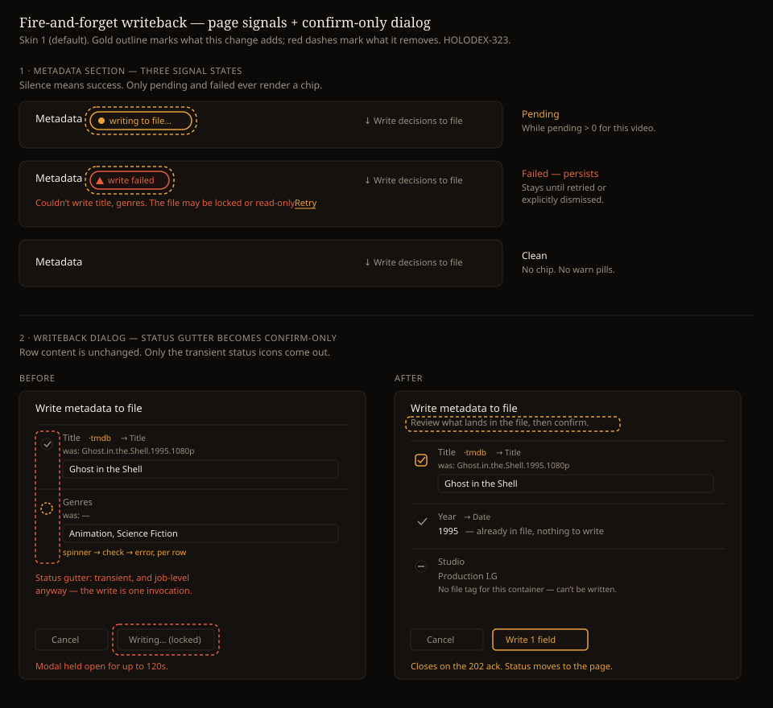

# Design handoff: Fire-and-forget writeback

**Jira:** HOLODEX-323 · **Spec:** [fire-and-forget-writeback.md](../specs/fire-and-forget-writeback.md) ·
**ADR:** [ADR-091](../architecture/ADR-091-fire-and-forget-writeback-status.md) ·
**Supersedes:** ADR-073 D4

## Overview

Writing metadata to a file is already asynchronous and durable on the server: the handler
enqueues a `writeback_queue` row and answers `202` in milliseconds, and the worker runs on
the application-lifetime context, not the request context. Nothing the browser does can
cancel an in-flight write, and the copy → write → rename model (ADR-041) means the original
file is never left half-written.

The dialog nevertheless behaves as though the write were synchronous: it gates every close
affordance on `busy` and polls for up to 120 s. This change stops that pretence. The dialog
becomes a **pre-flight confirm step** that closes as soon as the job is accepted, and the
job's outcome moves to a **page-level signal near the Metadata section**.

**The governing principle: silence means success.** The Metadata header carries a badge only
when there is something to say — the file differs, a write is running, or a write failed. No
badge means the file matches the decided values. There is no success toast, because a toast
would be a fourth thing to read in the state where nothing is wrong.

## Why the pending signal is not optional

ADR-073 introduced the dialog's wait because refetching on the `202` returns *pre-write*
state — `resolved[]` recomputes `in_sync` against the old baseline, and fields that were
just written render as "file out of sync". Closing the dialog early **without** a page-level
pending signal reproduces exactly that failure: the user submits, the dialog vanishes, the
section still reads "3 out of sync", and the reasonable response is to write again.

Fire-and-forget and the pending chip are therefore one change, not a change plus a
follow-up. Shipping the first without the second is a regression.

## Layout

All three badges live in the Metadata section header row, clustered **immediately before the
"Write decisions to file" action** rather than beside the section label. Every one of them is
about the write — the file differs from it, one is running, one failed — so they belong next
to the control that resolves them. An earlier draft anchored them to the "Metadata" label,
which put a problem statement 340px from its own remedy with dead space between.

They share one pill geometry but not one weight (see *Badge alignment and weight*). They are
section-scoped, never per-field — see *Job-level, not per-field* below.

The failed state adds a second line beneath the header row carrying the error sentence plus
Retry and Dismiss. The header row itself does not grow.

## Design tokens used

Tokens only — no hardcoded values. QA all three skins per `.claude/rules/frontend-theming.md`.

| Token | Usage |
|---|---|
| `text-accent` / `border-accent` | Pending chip text and outline |
| `text-warn` / `border-warn` | Failed chip text and outline, error sentence |
| `text-ink` | Section label, field values |
| `text-muted` | Secondary copy, `was:` line, action row |
| `bg-surface` | Chip fill |
| `rounded-full` | Chip shape, matching the existing `file out of sync` pill |
| `text-[0.65rem]` | Chip label size, matching `SourceBadge`'s pill |

The pending chip deliberately reuses the geometry of the existing `file out of sync` pill in
`SourceBadge.svelte` so the two read as one family.

## States and interactions

| Element | State | Behavior |
|---|---|---|
| Metadata header | Out of sync | **Quiet** pill — outline only, no fill, warn text. A steady state, not an event. Shown whenever the decided value differs from the stored baseline (ADR-051), including while a write is pending or after one failed. Replaces the old `· N out of sync` text. |
| Metadata header | Clean | No pill. Nothing renders. |
| Metadata header | Pending | **Filled** accent pill, "writing to file", with the spinner glyph. Rendered while `pending > 0` for this video, beside the quiet out-of-sync pill. |
| Metadata header | Failed | **Filled** warn pill, "couldn't write", beside the quiet out-of-sync pill. Persists until retried or dismissed. |
| Failed detail line | Visible | One sentence giving the cause, then Retry and Dismiss — **both underlined**, both real buttons. Job-level: it does not enumerate fields. |
| Retry | Click | Resets the failed row to `pending`, kicks the queue, swaps the chip to pending. |
| Dismiss | Click | Clears the failed row without retrying. The write is *not* reattempted. |
| Dialog | Submitting | Holds only for the `202`. Close affordances stay locked for that one round trip. |
| Dialog | Enqueued | Closes immediately. No success toast — silence is the success signal. |
| Dialog | Enqueue failed | Stays open, shows the error inline, close affordances unlock. |

### Dialog rows — what changes

Row **content is unchanged**. The existing pre-flight preview already shows everything
needed to catch a bad value before committing:

- destination tag via `→ {field.write_target}`
- current file value via the `was:` line
- the new value in an editable field
- "already matches the file, nothing to write" for no-ops
- "No file tag for this container — can't be written" for unmappable fields, shown but not
  checkable

Only the **transient status icons** leave the left gutter: the `isWriting` spinner and the
`isError` cross. `row.status` collapses accordingly.

**No two gutter glyphs may mean the same thing.** An earlier draft used a check for both "will be
written" (accent) and "already matches, won't be written" (muted) — but a check universally reads as
*included*, so using it to mark the excluded row inverted its meaning and relied on colour alone to
tell them apart. The gutter now uses three distinct glyphs:

| Glyph | Meaning | State |
|---|---|---|
| Checkbox / check | This will be written | Checked, accent |
| Equals `=` | Already matches the file, nothing to write | Muted, not checkable |
| Circle-minus | No file tag for this container, can't be written | Muted, not checkable |

**Row order** is writable fields first in registry order, then no-ops, then unwritable. The list
starts with what the owner can act on, and the two inert groups sink to the bottom. This was
previously unspecified, which would have left the implementation to guess and drift from the mockup.

## Two layers in one header row

`out of sync` and the writeback chips answer different questions and must not be conflated:

| | Question | Layer | Lifetime |
|---|---|---|---|
| `out of sync` | Does the decided value differ from the file? | ADR-051 baseline divergence | Until a write lands |
| `writing to file` | Is a write in flight? | ADR-091 job lifecycle | Until the job is terminal |
| `couldn’t write` | Did the last write fail? | ADR-091 job lifecycle | Until retried or dismissed |

They co-occur. The normal path is `out of sync` → `writing to file` + `out of sync` → nothing. The failure path is
`out of sync` → `writing to file` + `out of sync` → `couldn’t write` + `out of sync`, because a write
that didn't land leaves the file still differing. Showing both on failure is correct and load
bearing — it is what tells the owner the work is still outstanding.

### No counts — decided

The badges carry no number. The write is atomic over the fields submitted, so the job is the unit
and a per-field tally answers a question nobody acts on: you either write or you don't, and a count
of 3 versus 1 changes neither the decision nor the action.

This also dissolves the residual-count problem an earlier draft raised: with no number to compute,
there is nothing to reconcile about which fields a job does and does not carry.

**Out of sync is never hidden.** An intermediate draft had a pending write *replace* the out-of-sync
pill. That was wrong on the facts — until the job lands, the file genuinely still differs, and a
queued write can sit behind a large batch for a long time. The weight split above removes the reason
it was hidden: a quiet outline pill beside a filled event pill is not noise, so both can show in
every state where both are true. The badge tells the truth continuously and clears only when the
write actually lands.

The failed detail line is job-level for the same reason: it gives the cause ("the file may be locked
or read-only"), not a field list. Which fields were in the job is already visible in the field rows
below it.

**The dialog's CTA keeps its count** — "Write 9 fields", not "Write". That is not an inconsistency:
a pre-action count states the scope of what you are about to do and is decision-relevant (it is the
last chance to notice you left a row checked). A post-action status count only tallies something you
can no longer act on field-by-field, because the write is atomic. Scope counts, status doesn't.

This changes the existing `· {outOfSyncN} out of sync` text in the media page action row. The
per-field `file out of sync` pill on individual rows (`SourceBadge` / `SourceSelect`) is unchanged
and never carried a count — the section badge now matches its wording, which is what makes the two
read as one system.

## Badge alignment and weight

All three badges share one geometry so they read as a set — but **geometry is not weight**, and
conflating the two was a real defect in an earlier draft. When `write failed` and `out of sync`
were given identical fill, hue, shape and size and placed adjacent, they merged into a single bar
of warn colour and stopped reading as two separate facts. That is the one state where the owner
must parse two things at once, so it must be the most legible, not the least.

Shared (geometry):

- Same right-hand anchor, ending just before the write action.
- Same height and full corner radius (`rounded-full`), matching the existing per-field pill.
- Same label size (`text-[0.65rem]`) and the same horizontal padding.

Differentiated (weight):

- **Events are filled** — `writing to file` (accent) and `couldn't write` (warn) carry a fill and
  a coloured border.
- **The steady state is outline-only** — `out of sync` has no fill and a neutral border, with warn
  text. It recedes behind whichever event is live and remains legible beside it.
- A leading glyph appears **only where it carries meaning**: the spinner for motion, the warning
  triangle for alarm. Out-of-sync has none — it is a condition, not an event.

The glyph is **load-bearing, not decorative**. In skin 1, `warn` (#e2603f) and `accent` (#e8a33d)
are both warm oranges and separate poorly at 11px, so hue alone cannot distinguish pending from
failed. The glyph and the copy carry that distinction and must not be dropped for tidiness.

For the same reason the failure copy is **"couldn't write", not "write failed"**: `writing to file`
and `write failed` share a four-character prefix and scan almost identically in peripheral vision at
this size. Breaking the prefix is cheaper and more reliable than trying to widen the hue gap.

## Long values never grow the modal

Two fields can carry values long enough to make the dialog unreadable. Both clamp to a single line
and disclose on demand, so the modal's height is a function of field *count*, never value length.

| Field | Collapsed | Disclosed |
|---|---|---|
| Overview | One line, truncated with an ellipsis, plus a `more` link | Full text in a popover |
| Poster | A short label plus a `compare` link | File-vs-new image comparison, read-only |

**The triggers are links, not pills.** An earlier draft dressed the poster's trigger in the same
accent pill used by the status badges. A pill that looks like a badge but behaves like a control
teaches the wrong thing about both — badges are read, controls are pressed. Anything interactive in
these rows takes link styling.

Popovers render on a **floating surface** with a lighter border than the page, so they read as
transient overlays rather than more page furniture. Reusing the in-flow panel treatment made them
ambiguous in the mockup and would do the same in the product.

**Never hover-only.** Hover has no keyboard equivalent and does not exist on touch, so a
hover-only disclosure would make the overview unreadable and the poster uninspectable for anyone not
using a mouse. Each disclosure must open on **hover, on keyboard focus, and on tap**, and dismiss on
`Escape` and on blur. A native `title` attribute is not sufficient — it is unreliable for screen
readers and absent on touch.

The poster comparison stays read-only. Choosing a candidate is a `SourceSelect` decision (RD5) and is
never made from inside the writeback action.

## Job-level, not per-field

The write is a single `exiftool` or `mkvpropedit` invocation followed by one `os.Rename`.
It lands whole or not at all. Per-field success or failure is therefore not a real
distinction on this path, and per-field status UI would be fiction — the existing dialog
comment already concedes this for the queued path.

One job produces one chip. The error sentence names the fields the job carried, which is
the honest granularity.

## Edge cases

- **Queue depth.** Merge propagation and tag-sync enqueue one job per affected video via
  `EnqueueMany`, so a single-video write can sit behind a large batch. The pending chip must
  not imply immediacy — "writing to file…" with no ETA, not a progress bar.
- **Multiple pending jobs for one video.** Render one chip, not N. The condition is
  `pending > 0`.
- **Pending and failed at once** (a retry queued while an older failure is undismissed):
  pending wins in the header chip; the failed detail line remains until resolved.
- **Very long overview or a missing poster.** The overview clamps to one line regardless of
  length; an absent poster renders no compare affordance rather than an empty popover.
- **Visitor view.** All three badges are owner-only — a visitor has no writeback affordance. Gate
  on the same condition as the existing `canWriteback`, not on a blanket owner check around
  the section.
- **Job completes while the page is open.** The page re-resolves when pending reaches zero,
  so the warn pills clear without a manual refresh.
- **Job completes while the page is closed.** Next load reads current state from the queue —
  nothing is lost, because the signal is server-side rather than session-held.
- **Stale failed row from a previous session.** Renders normally on load. This is the point
  of sourcing from the queue rather than from a job id held in memory.

## Accessibility

- The pending chip carries `aria-live="polite"` so its appearance and disappearance are
  announced without stealing focus.
- The failed chip is **not** a live region — it persists and is reachable by reading order.
  The error sentence is associated with the section, not announced on a timer.
- Retry and Dismiss are real `<button>`s with discernible names ("Retry writing metadata",
  "Dismiss writeback error"), not icon-only affordances.
- Badge text never encodes state by colour alone: "writing to file" and "couldn’t write" are
  distinguishable without hue, and the filled-vs-outline split distinguishes event from steady
  state without relying on the warn/accent difference.
- Dialog focus trap and focus return on close are unchanged. Closing on the `202` must still
  return focus to the trigger — the existing `onMount` cleanup already does this, and must
  not regress when the close path changes.
- Escape stays blocked for the single round trip the dialog is awaiting the ack, then
  behaves normally.
- **Interactive target size.** Every control here meets the WCAG 2.2 AA 24×24 CSS px minimum,
  which the drawn sizes do not imply on their own: row checkboxes render at 14px visually and need
  padding to reach the target, and `Retry` / `Dismiss` / `more` / `compare` are inline text links
  whose hit area must be enlarged beyond their glyph bounds.
- **`Dismiss` carries the same link affordance as `Retry`.** Its lower visual weight is correct —
  it is the non-recovering action — but weight is not the same as having no affordance. Plain muted
  text beside an underlined link does not read as pressable.
- **The overview and poster disclosures open on hover, focus and tap** — never hover alone.
  Their triggers are focusable in the dialog's tab order, sit inside the existing focus trap,
  and dismiss on `Escape` without closing the dialog itself. A native `title` attribute does
  not satisfy this.
- The overview trigger announces that it is truncated and expandable (`aria-expanded` on a
  real control), so a screen-reader user knows there is more text rather than reading a
  silently clipped sentence.
- The poster popover is decorative-plus-informative: the two images need alt text naming
  which is the file's current art and which is the incoming one.

## Motion

| Element | Trigger | Animation | Duration | Easing |
|---|---|---|---|---|
| Pending chip | Appears | Fade in | 150 ms | ease-out |
| Pending chip | Job lands | Fade out, then section re-resolve | 150 ms | ease-out |
| Failed chip | Appears | Fade in | 150 ms | ease-out |
| Spinner | While pending | Existing `animate-spin` idiom | — | linear |

No layout shift on chip appearance: reserve the chip's height in the header row so the
action link does not jump.

## Open items for implementation

1. **Retry needs a new repo method.** `ClaimNextWriteback` selects `WHERE status = 'pending'`,
   and `RecoverRunningWritebacks` only resets `running`. Nothing moves `failed` back to
   `pending` today, so Retry requires a new query plus a `kick()`.
2. **Dismiss semantics.** Deleting the failed row loses the audit trail; the `job_runs` row
   persists independently, so deletion is acceptable. Confirm before implementing.
3. **Poll cadence while pending.** Reuse `pollUntilSettled` from `$lib/writebackJob.ts`
   rather than introducing a second polling idiom.
4. **Disclosure component.** The overview and poster popovers are the same pattern with
   different payloads. Check whether an existing popover/tooltip component covers it before
   writing a new one — per the component-reuse discipline, two near-identical one-offs here
   would be exactly the drift that ADR worries about.
5. **Dropping the count touches existing markup.** `outOfSyncN` currently feeds the
   `· {outOfSyncN} out of sync` span in the media page action row. If nothing else consumes
   the count once the badge stops rendering it, remove the computation rather than leaving it
   orphaned.
