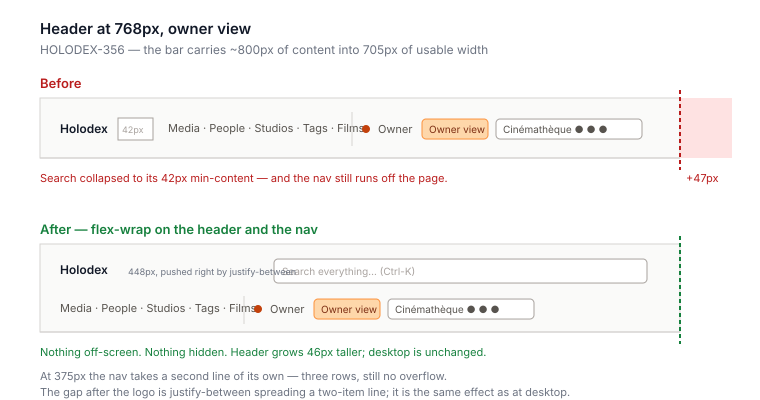

# Design handoff: the header at narrow widths

**Ticket:** [HOLODEX-356](https://whoiskevinrich.atlassian.net/browse/HOLODEX-356) ·
**Status:** decided and implemented ·
**Scope:** the global header in `web/src/routes/+layout.svelte` only. The page body below it is
[responsive-page-width-handoff.md](responsive-page-width-handoff.md)'s subject and is untouched here.

## 1. The problem

The header is one unwrappable flex row: logo · search · content nav · owner chrome. In owner view
that content measures about 800px. At a 768px viewport the row has 705px to put it in.

Flexbox resolved the shortfall the only way it could. The search `<form>` is the one item with
`flex-1` and therefore the one item that could shrink, so it shrank all the way to its 42px
min-content — a text input with no room for text — and the nav, whose `min-width: auto` floors it
at its own min-content, still ran 47px past the right edge. Every page scrolled sideways, on every
route, in all three skins. Measured on `/media/200` and `/people/20000`.

This is **not** the same defect as [HOLODEX-355](../plans/HOLODEX-355.md). There the content fit
and a missing `minmax(0, …)` stopped it from being *allowed* to fit. Here the content genuinely
does not fit, and something has to move.

## 2. The decision

**Let the header wrap.** `flex-wrap` on the header, and again on the nav.

At 768px the nav drops to a second row and the search box returns to its full `max-w-md` (448px).
At 375px the nav needs a second line of its own, so the header stands three rows. At desktop width
the row still fits and both declarations are inert — the header is pixel-identical to before.

Wrapped rows are left-aligned under the logo. `justify-between` places a lone wrapped item at the
start of its line, and matching the logo's edge reads better than a right-aligned orphan row.

### 2a. Why not collapse the nav into a menu

Considered and declined for this fix. A narrow-width menu hides affordances behind a tap and is a
design cycle of its own — this ticket is a horizontal-overflow bug, and wrapping costs two classes,
hides nothing, and leaves the desktop header exactly as designed. If the header should stay one row
at every width, that is a separate piece of work with its own handoff.

The cost is honest and worth naming: the header is 46px taller at 768px and 72px taller at 375px.

## 3. QA

### Setup

- 3.1 Seed the stress fixture and run the `backend-stress` and `web` launch profiles
  (`docs/testing-strategy.md` §12).

### Smoke

- 3.2 `[smoke]` `cd web && npm run geometry -- --only no-horizontal-page-overflow` — 180/180, no
  known-open line. This assertion is the regression guard; its `blockedBy` marker came off with
  this fix.

### Human

- 3.3 `[human]` Open any page and drag the browser window from full width down to phone width.
  The header should re-flow — first the nav dropping under the search box, then the owner controls
  dropping under the content links — and at no width should the page gain a horizontal scrollbar
  at the bottom of the window.
- 3.4 `[human]` At a tablet-ish width, check the search box is a usable input again: wide enough
  to read the placeholder ("Search everything…"), not a 40px stub.
- 3.5 `[human]` Repeat 3.3 in each of the three skins (the skin picker is the last control in the
  header). Wrapping is layout, not theming, so all three should behave identically — if one of them
  wraps at a noticeably different width, that is a font-metric difference worth reporting.
- 3.6 `[human]` At full desktop width, confirm the header looks exactly as it did before: one row,
  logo left, search in the middle, nav right.
