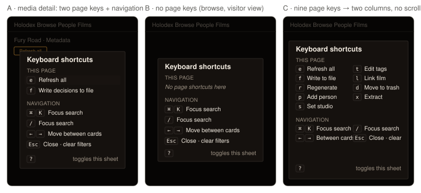

# Design handoff: `?` keyboard-shortcuts sheet + hotkey firing feedback (F62)

**Spec**: [hotkeys.md](../specs/hotkeys.md) (P0-2 firing, P0-5 sheet, P1-1 live rows) ·
Jira [HOLODEX-405](https://whoiskevinrich.atlassian.net/browse/HOLODEX-405) · **Date**: 2026-09-16

## Decision

**A · centered modal** on a dimmed backdrop, lifted from `ConfirmDialog` — same surface, focus trap,
Escape/backdrop dismissal and `confirm-rise` motion. Chosen over a bottom-right card because the
sheet is a `[role="dialog"]` either way, and under spec RD6 an open dialog silences `e`/`f`; a
non-modal card would *look* live while the keys are dead. A modal's visual promise and the guard
agree.

The sheet has two groups. **This page** is derived from the hotkey registry (whatever
`use:hotkey` buttons are mounted right now). **Navigation** is a static list of the four keys
that predate the registry (Ctrl/⌘ K, `/`, arrows, Esc) — the spec's Non-Goals keep those
listeners where they are; listing them keeps the sheet honest.

## Layout

| Region | Spec |
|---|---|
| Backdrop | `fixed inset-0 z-50 flex items-center justify-center bg-bg/60 p-4` — copy `ConfirmDialog`'s wrapper; click on the wrapper itself closes |
| Panel | `confirm-pop w-full max-w-md rounded-theme border border-rule bg-surface p-4 shadow-xl`, `role="dialog" aria-modal="true" aria-labelledby="hotkeys-title"`, `tabindex="-1"` |
| Title | `<h2 id="hotkeys-title" class="skin-title text-lg font-semibold text-ink">Keyboard shortcuts</h2>` |
| Group heading | `<h3 class="mt-3 mb-1 text-[0.65rem] uppercase tracking-wide text-muted">` — `This page`, `Navigation` |
| Row | `flex items-center gap-2.5 rounded-theme px-1.5 py-1 text-sm text-ink` ; `-mx-1.5` so the hover plate sits flush with the label column |
| Key cap | `<kbd class="inline-block min-w-[1.25rem] rounded-theme border border-rule bg-surface-2 px-1.5 py-px text-center font-mono text-xs text-ink">` ; multi-key rows (`⌘` `K`, `←` `→`) are two adjacent `<kbd>`s with `gap-1` |
| Footer | `mt-3 flex items-center gap-2.5 text-xs text-muted` — `<kbd>?</kbd>` + "toggles this sheet" right-aligned (`ml-auto`) |
| Stressed | when the Page group has **more than 6 entries**, the group's `<ul>` becomes `grid grid-cols-2 gap-x-4`; the Navigation group follows the same rule. The panel never gets `overflow-y`; at `max-w-md` two columns hold ~16 rows before the viewport matters, and a page with 16 hotkeys is a spec problem, not a layout one |
| Empty | Page group renders `
No page shortcuts here
` in place of the list; Navigation group still renders. Never hide the sheet on an empty registry — `?` must always answer |

No new tokens. `font-mono` (`--font-mono`) is already in `app.css`; `<kbd>` gets no global rule —
the classes above live on the element so the sheet is the only consumer.

## States and interactions

| Element | State | Behavior |
|---|---|---|
| Sheet | closed → open | `?` (Shift+/) outside a text field / `VIDEO` / other dialog. Panel takes focus (`dialogEl.focus()`); opener element remembered |
| Sheet | open → closed | `?` again, Escape, backdrop click. Focus returns to the remembered opener (or `body` if it was `body`) |
| Sheet | open, any registered key pressed | Nothing — RD6's dialog guard. The sheet is not a launcher by keyboard, only by click (below) |
| Page row (P1-1) | hover / focus-visible | `hover:bg-surface-2 focus-visible:bg-surface-2`; the row is a `<button type="button" class="w-full text-left …">` |
| Page row (P1-1) | click / Enter | close the sheet, then fire the entry through the same `focus()`→`click()` path the key uses — so the bound button gets the ring and scrolls into view exactly as a keypress would |
| Navigation row | any | static `<li>`; no hover plate, no cursor change |
| Bound button (P0-2) | key fired | receives `focus()` (existing `focus-visible` ring, scrolls into view) then `click()`. No extra flash, toast or outline — the page's own busy state ("Refreshing…", dialog opening) is the confirmation |
| Bound button | `disabled` | key press does nothing (`click()` on a disabled control is a native no-op); the ring still appears because `focus()` succeeds only on enabled controls — so a disabled target shows nothing at all, which is correct |
| Bound button | title | existing `title` gets ` (e)` appended by the action; `aria-keyshortcuts="e"` set. No visible `<kbd>` hint on the button itself — the sheet is the discoverability surface |

## Motion

| Element | Trigger | Animation | Duration | Easing |
|---|---|---|---|---|
| Panel | open | reuse `.confirm-pop` → `confirm-rise` (opacity 0→1, scale .98→1) | 150 ms | `cubic-bezier(0.2, 0.7, 0.2, 1)` |
| Panel | close | none (unmount) — matches `ConfirmDialog` | — | — |
| Bound button | key fired | browser-native `scrollIntoView` from `focus()`; no added transition | — | — |

`prefers-reduced-motion: reduce` already disables `confirm-rise` in `ConfirmDialog`'s stylesheet;
move that rule to `app.css` (or duplicate it) rather than importing `ConfirmDialog`'s scoped style.

## Content

- Row labels come from the bound button's trimmed `textContent` (`Refresh all`, `Write decisions
  to file`) unless the action is given `{ key, label }`. Labels longer than the column
  **truncate** (`truncate` on the label span); nothing wraps, nothing scrolls.
- Key caps show the literal `e.key` for letters; the Navigation list uses the glyphs `⌘`/`Ctrl`
  (pick by `navigator.platform` includes `Mac`), `/`, `←`, `→`, `Esc`.
- Copy: `Keyboard shortcuts` · `This page` · `Navigation` · `No page shortcuts here` ·
  `toggles this sheet`. Sentence case, no terminal punctuation.

## Edge cases

- **Two rows same key** (a page mounting two Refresh-all rows) — registry keeps the first, dev
  `console.warn`s; the sheet lists one row. Not a UI state to design for.
- **Registry changes while the sheet is open** (e.g. `canWriteback` flips after decisions load) —
  the list is `$state`-derived and re-renders in place; no animation on row add/remove.
- **`?` pressed in a text field** — types `?`. In the video player — the player owns it. In another
  dialog — ignored; the sheet never stacks on a dialog.
- **Visitor view** — Page group is always empty (owner buttons aren't mounted); the sheet still opens
  with the Navigation group. This is intentional: `?` is a visitor-safe key.
- **Narrow viewport (< 480 px)** — `max-w-md` collapses to the wrapper's `p-4` gutters; the two-column
  stressed grid drops to `grid-cols-1` under `sm:` (`sm:grid-cols-2`), so rows truncate rather than
  the panel overflowing horizontally (HOLODEX-356 rule: no horizontal page scroll).

## Accessibility

- `role="dialog" aria-modal="true" aria-labelledby="hotkeys-title"`; Tab is trapped inside the panel
  (copy `ConfirmDialog.trapTab`); focus returns to the opener on close.
- Page rows are real `<button>`s (P1-1) so Tab reaches them; Navigation rows are inert `<li>`s.
- `<kbd>` is the semantic element for the caps; screen readers announce "e, Refresh all".
- Every bound button carries `aria-keyshortcuts` — the WAI-ARIA hook for assistive tech to surface
  the key without the sheet.
- Contrast: `text-ink` on `bg-surface`, `text-muted` group headings at 12 px are the same pairings
  `ConfirmDialog` and `SourceBadge` already pass with across all three skins.

## Three-skin QA (numbered per `docs/design` convention)

**Setup** — owner session, Admin mode on, a media detail page with ≥1 provider configured and
`resolved.length > 0`.

**Smoke**
- 1.1 `[smoke]` Press `?` on media detail → sheet opens with `e Refresh all` and `f Write decisions to file` under *This page*, four rows under *Navigation*.
- 1.2 `[smoke]` Press `?` on `/` (browse) → sheet opens, Page group reads *No page shortcuts here*.
- 1.3 `[smoke]` With the sheet open press `e` → nothing fires; press Esc → sheet closes, focus back on `body`.

**Agent** (computed style via `javascript_tool`, per [reference-holodex-skin-qa-without-screenshots])
- 2.1 `[agent]` For each of Cinémathèque / Broadcast / Brutalist: `<kbd>` `background-color` equals `--surface-2`, `border-color` equals `--rule`, `color` equals `--ink`; panel `background-color` equals `--surface`.
- 2.2 `[agent]` `getComputedStyle(panel).maxWidth === '28rem'` and `panel.scrollHeight === panel.clientHeight` (no scroll) in the stressed fixture (mount 9 dummy `use:hotkey` buttons).
- 2.3 `[agent]` Row label with a 60-character label has `text-overflow: ellipsis` applied and the panel's `scrollWidth === clientWidth`.

**Human**
- 3.1 `[human]` On each skin, open the sheet: key caps read as small inset chips (a shade darker than the panel, thin border), not as pills or buttons; the group headings are small, quiet, and clearly above their rows.
- 3.2 `[human]` Press `e` with the sheet closed: the Refresh all button visibly gets its focus ring and the page scrolls so you can see it, then it switches to "Refreshing…".
- 3.3 `[human]` Brutalist skin (radius 0): the key caps and panel are square-cornered; Broadcast: the accent isn't used anywhere in the sheet (it's neutral by design).
