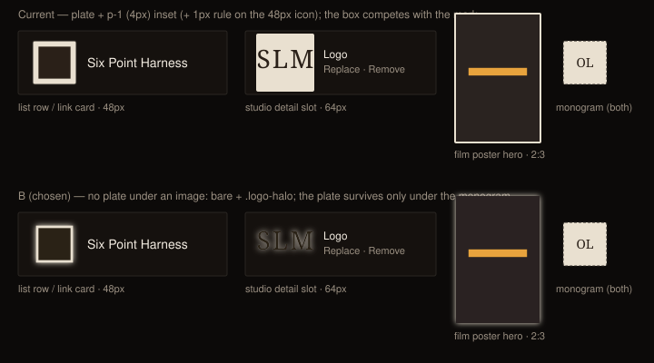

# Design handoff: no plate under an image — bare + halo, plate only under the monogram

**Status:** Approved — **option B** (owner's pick, 2026-09-20); implemented the same day
**Story:** [HOLODEX-437](https://whoiskevinrich.atlassian.net/browse/HOLODEX-437) (child of F51, HOLODEX-246), shipped in HOLODEX-432's PR #370 by owner request
**Owner:** Project owner
**Date:** 2026-09-20
**Spec:** none — presentation-only (no capability, field, or endpoint changes)
**ADR:** none
**Branch/PR:** `HOLODEX-432-studio-list-logos`, [PR #370](https://github.com/whoiskevinrich/holodex/pull/370)
**Supersedes:** the "inset IS the visible border" rule in
[studio-images-handoff.md](studio-images-handoff.md) / `EntityImageSlot`'s prior comment, and the
"icon and monogram keep the plate" half of [studio-logo-link-card-handoff.md §1](studio-logo-link-card-handoff.md)
(HOLODEX-411) — the monogram keeps it, the icon no longer does

## Overview

Owner feedback while looking at HOLODEX-432: *"I'm not wild about the thickness of the plate
(across the entire app). It's visually bulky and distracts from the icon/poster/etc."*

"The plate" is the light `bg-logo-plate` box drawn behind studio/film images, with a Tailwind
inset on the `` so `object-contain` letterboxes the image against the plate and the inset
reads as a cream frame. An inventory (2026-09-20) found the band visible in exactly four places;
everything poster / headshot / video-shaped in the app is already edge-to-edge:

| Site | Frame | Inset | Extra |
|---|---|---|---|
| `entity/StudioLogoBox.svelte`, icon branch (`/studios` rows, Film/Media `StudioLinkCard`) | 48px | `p-1` (4px) | + 1px `border-rule` → a 5px ring |
| `entity/EntityImageSlot.svelte`, row variant (studio detail: logo / icon / poster slots) | 64×64, 64×96 | `p-1` (4px) | — |
| `EntityImageSlot`, frame variant (film poster hero) | 160×240 | `p-0.5` (2px) | — |
| `completeness/CompletenessQueueRow.svelte`, studio icon | 40×26 | `p-0.5` (2px) | plus the letterbox on the mismatched axis |

Not plates in this sense (unchanged): `.portrait-frame` / `.video-frame` / `PosterTile` /
`FilmsRow` / `/films` cards / `SourceImageTiles` (`object-cover`, 1px rule, no inset);
`ProviderIcon` (16px brand icons on the plate with no inset — a halo smears at that size);
the `EnrichPicker` candidate slot (a fixed-geometry picker slot, HOLODEX-414, where the plate
is the slot background).

## 1. Decisions

Three options rendered inline at the real sizes and tokens (2026-09-20):

| Question | Decision | Why |
|---|---|---|
| Plate under an image | **B — none.** Any image (logo, icon, poster) sits bare on the surface and wears the `.logo-halo`; the plate survives only under the **monogram / empty state**, which is text and needs a ground. *Rejected A — keep the plate, drop the insets (plate would still show on a letterboxed axis). Rejected C — thinner plate (`p-0.5`, no rule): still a second shape competing with the mark.* | One rule for every studio/film image — the treatment logos already got in HOLODEX-411 and the halo in HOLODEX-432 — instead of the icon and the logo in the same row looking different. Letterboxing disappears as a category: with no plate there is nothing to letterbox against. |
| The inset | **Kept, but transparent.** `p-1` on every contained image (the hero frame goes from `p-0.5` to `p-1`; the queue row stays `p-0.5` at 26px tall). | Every plate wrapper is `overflow-hidden` (it clips `rounded-theme` and hosts the absolute overlay buttons and the uploading pulse); the inset is the room the halo renders into. With no plate behind it, it is invisible. |
| `cover` images (film banner) | Untouched: no inset, no halo. | Already edge-to-edge; a glow around a full-width photo is not wanted. |
| Halo | The existing `.logo-halo` (`app.css`, three-layer `drop-shadow` in `--logo-plate`, strength chosen in HOLODEX-432). | One hook, token-driven, re-skins and follows a custom palette. |

## 2. Component changes

| File | Change |
|---|---|
| `entity/StudioLogoBox.svelte` | Box classes: plate + dashed rule only when `!image` (was: plate + rule for icon, none for logo). The `` already carried `.logo-halo` + `p-1`. |
| `entity/EntityImageSlot.svelte` | Wrapper: `bg-logo-plate` / dashed-empty-poster classes only when `!url`. Image: `cover` → `object-cover` (unchanged); `contain` → `logo-halo object-contain p-1` for both variants (the hero frame's `p-0.5` is gone). Comment rewritten — the old one described the inset as the visible border. |
| `completeness/CompletenessQueueRow.svelte` | Icon well: `bg-logo-plate` only when `!row.icon_url`; the icon `` gains `logo-halo`, keeps `p-0.5`. |

Nothing else moves; `app.css` is unchanged (the hook already exists).

## 3. States

| State | Wrapper | Image |
|---|---|---|
| Image present, `contain` | transparent, no border | bare, `object-contain`, transparent inset, `.logo-halo` |
| Image present, `cover` (banner) | transparent | `object-cover`, edge-to-edge, no halo |
| Monogram (no image, non-poster role) | `bg-logo-plate` (+ dashed `border-rule` in `StudioLogoBox`) | — |
| Empty poster, row variant | dashed `border-rule`, no plate (unchanged) | — |
| Uploading | the `bg-surface-2/60` pulse overlays the wrapper (unchanged) | `opacity-60` (unchanged) |

## 4. Design tokens used

`bg-logo-plate`, `text-logo-plate-ink`, `border-rule` — monogram / empty only. `.logo-halo` →
`--logo-plate`. No new tokens, no literals.

## 5. Edge cases

- **Letterboxed aspect** (a wide icon in a square slot, a non-2:3 poster): the image is
  simply smaller inside a transparent box; nothing cream shows on the short axis any more.
- **A light-on-transparent mark**: still reads on the dark skins (it always did); the halo is
  plate-coloured so it neither helps nor hurts. A light skin would need a skin-switched halo
  colour — not in scope, no light skin exists.
- **Opaque-background PNGs** (a logo with a baked-in white box): the halo traces the rectangle,
  which reads as a thin light edge — the same as a poster.
- **Monogram rows next to icon rows** in one list: one has a cream box, the other does not.
  Accepted — the monogram *is* a placeholder and should look like one.

## 6. Accessibility

No change: `alt` semantics are those of HOLODEX-432 / `EntityImageSlot`; the monogram stays
`aria-hidden`; nothing conveys state by colour.

## 7. QA checklist

**Smoke**
- 7.1 `[smoke]` `cd web && npm run check` clean. ✅ 2026-09-20
- 7.2 `[smoke]` `rg 'bg-logo-plate' web/src --glob '*.svelte'` lists only monogram/empty/slot-background uses (StudioLogoBox `!image`, EntityImageSlot `!url`, CompletenessQueueRow `!icon_url`, ProviderIcon, EnrichPicker, FilmAttachDialog, SearchResultsPanel monograms).

**Agent (driven browser, computed styles)**
- 7.3 `[agent]` `/studios` icon row: wrapper `background-color` transparent, `border-width: 0px`; `` `filter` = the three-layer drop-shadow, `padding: 4px`. Monogram row: wrapper `bg-logo-plate`, dashed border. ✅
- 7.4 `[agent]` `/studios/{id}` Images section with a logo and a poster set, icon empty: logo and poster wrappers transparent, images `object-contain` + halo + `padding: 4px`; icon wrapper `bg-logo-plate` (monogram). ✅ (studio 5 on the testbed)
- 7.5 `[agent]` `/films/{id}` with a poster: hero wrapper transparent, `` `padding: 4px` (was 2px) + halo; the banner `` `object-cover`, no filter, no padding.
- 7.6 `[agent]` `/owner/completeness` with an icon-bearing studio row: well transparent, `` halo; monogram rows keep the plate. ✅ (monogram rows only on the testbed; icon path is the same class expression)
- 7.7 `[agent]` `/media/{id}` and `/films/{id}` `StudioLinkCard` with an icon-only studio: bare icon + halo, name caption present (the caption rule is unchanged — icons are not bare *logos*, `showName` stays true).
- 7.8 `[agent]` All three skins: 7.3 wrappers stay transparent; the monogram plate is that skin's `--logo-plate`.

**Human**
- 7.9 `[human]` Studios list, studio detail Images, a film page with a poster, and the completeness queue: no cream boxes behind any image anywhere — every mark sits on the row with a faint light glow; the only cream boxes left are monograms.
