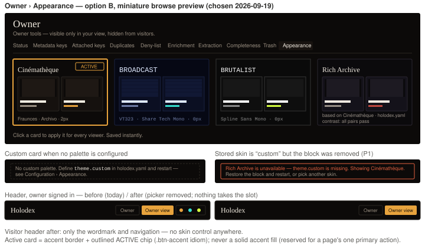

# Instance skin — Appearance tab & header picker removal — design handoff

**Ticket:** HOLODEX-427 (epic HOLODEX-425, F67) · **Status:** option B approved by the owner
2026-09-19 · **Date:** 2026-09-19 · **Spec:** [instance-skin.md](../specs/instance-skin.md) R5–R8, R15–R16 ·
**ADR:** [ADR-102](../architecture/ADR-102-instance-skin-and-settings-store.md) D1/D3

## Decision

The skin becomes instance identity (ADR-102 D1): the header's three-chip picker goes, and the
one control is a tenth tab on `/owner`, **Appearance**, holding one selectable card per skin.
Two card treatments were mocked against the real owner shell
(`web/src/routes/owner/+layout.svelte`) and header (`web/src/routes/+layout.svelte`):

| | Option | What the card shows | Why not |
|---|---|---|---|
| A | Type specimen | Skin name in its display font, a font/radius subline, five swatches | Shows the type but not what a *page* feels like; the owner is choosing an instance's look, not a font |
| **B** | **Miniature browse preview** | **Name in the display font + a two-tile miniature of the browse grid drawn in the skin's own tokens, with the skin's flourishes rendering themselves** | — |

**Chosen: B.** The differentiator the owner cares about is how the archive *reads*, and the
tiles carry that — Cinémathèque's film-frame sprockets, Broadcast's scanlines, Brutalist's
hard edges — at a glance. The cost concern with B (a hand-maintained picture per skin) is
avoided by construction: the tiles are **real `.video-frame` boxes** inside a `.video-grid`,
scoped under the card's `data-theme`, so the `[data-theme]`-gated flourish CSS in `app.css`
draws them. Nothing per-skin is authored in the tab.

## Layout & placement

- `/owner/appearance`, appended as the last entry of the `tabs` array in
  `web/src/routes/owner/+layout.svelte` (label **Appearance**). Owner gate is the layout's
  existing effect; the page adds none.
- Page body: one intro line in `text-sm text-muted` — *"Click a card to apply it for every
  viewer. Saved instantly."* — then the card grid.
- Grid: `grid gap-3` with `grid-cols-2 lg:grid-cols-4` (four cards fit the `max-w-stage`
  width at ≥ `lg`; two-up below it; never one-up — at phone width the preview still needs
  two tiles side by side, which a 2-column grid at 16px gutters gives ~160px cards).
- Card order: Cinémathèque · Broadcast · Brutalist · custom (only when
  `/capabilities.theme.custom` is non-null). Fixed order; the active card does not move.

## The card — anatomy & states

Each card is a `<button type="button" role="radio" aria-checked>` inside a
`role="radiogroup" aria-label="Instance skin"` container (roving tabindex; arrow keys move,
Space/Enter select — the picker idiom already used by `EnrichPicker`). Anatomy, top to
bottom, **all drawn in the card's own tokens** via `data-theme={id}` on the button (and, for
the custom card, the five inline primaries on the same element — the exact mechanism the SPA
uses on `<html>`, ADR-102 D4):

1. Skin name — `font-display text-base text-ink` (so Broadcast's VT323 and Brutalist's mono
   show themselves).
2. Preview — `div.video-grid` containing two `div.video-frame` tiles at the instance's
   `card_layout` aspect; each tile holds a `bg-surface-2` thumbnail block, an ink title bar
   and a meta bar (one `bg-muted`, one `bg-accent`) — plain `div`s, no text, `aria-hidden`.
3. Subline — `text-xs text-muted`: display font · UI font · radius (e.g. *Fraunces · Archivo
   · 2px*). Custom card: *based on Cinémathèque · holodex.yaml* and, when R15 lands, the
   contrast readout (*contrast: all pairs pass* or the failing pair and ratio in `text-warn`).

States:

| State | Treatment |
|---|---|
| Rest | `bg-bg` (the skin's own), `border border-rule`, `rounded-theme`, `p-3` |
| Hover / focus-visible | border to `border-ink/40`; focus ring per the existing `focus-visible` idiom |
| **Active** (`aria-checked=true`) | `border-accent` + an outlined **ACTIVE** chip top-right in the `.btn-accent` idiom (`text-accent border-accent`, no fill). **Never a solid `bg-accent` fill** — reserved for a page's one primary action; the owner tab row's active idiom is the precedent |
| Pending (PUT in flight) | Optimistic: the card is already active and the page already re-skinned; no spinner. Cards are not disabled |
| Error (PUT failed) | Previous skin re-applied; the previous card regains ACTIVE; the page's existing inline error idiom appears above the grid with the server message; the failed card returns to rest |

## Custom card — three states (spec stories 7–8)

- **Configured** — the fourth card as above.
- **Not configured** — no fourth card; in its place a dashed `border-rule` hint box in
  `text-sm text-muted`: *"No custom palette. Define `theme.custom` in holodex.yaml and
  restart — see Configuration › Appearance."* (a link to the docs section). This is the only
  affordance the tab offers for *authoring* a palette, by design (ADR-102 D2 tie-break).
- **Stored `custom` but block removed** (P1, R16) — the hint box becomes a `border-warn`
  notice: *"Rich Archive is unavailable — theme.custom is missing. Showing Cinémathèque.
  Restore the block and restart, or pick another skin."* Cinémathèque's card shows ACTIVE.
  Until R16 ships, this state renders as "not configured" with Cinémathèque active (the
  server already reports it that way, spec R3).

## Header (spec R6)

The skin picker block in `web/src/routes/+layout.svelte` (the `role="group"
aria-label="Theme skin"` segmented control) is deleted, together with the `THEMES` /
`THEME_LABELS` imports it used. **Nothing takes the slot** (spec OQ1 → resolved): for a
signed-in owner the right group is *Owner* + *Owner view*; for a visitor it is empty. The
`gap` spacing of the surrounding `` already collapses. No narrow-width change is
needed — the removed control was the widest item, so every breakpoint gets looser, not
tighter.

## Design tokens used

`bg-bg` `bg-surface` `bg-surface-2` `text-ink` `text-muted` `border-rule` `border-accent`
`text-accent` `bg-accent` (preview meta bar only — a decorative sliver inside the tile,
not a control) `border-warn` `text-warn` `font-display` `rounded-theme` `max-w-stage`
`.video-grid` `.video-frame` `.btn-accent` (chip idiom). No literal colors, fonts or radii
anywhere in the tab; the per-skin rendering is entirely `data-theme` scoping plus the five
inline primaries for the custom card.

## Interaction

Click/Space/Enter on a card → `theme` store applies the skin locally (`data-theme` on
`<html>` + inline primaries set/cleared) → `PUT /admin/theme` → on 2xx the paint cache is
written; on error the store re-applies the previous `theme` object. Selection *is* the save;
there is no Save button. The page re-skins under the owner as they click — that is the
feedback.

## Accessibility

- Radiogroup semantics; the active card announces as checked; each card's accessible name
  is the skin name (the preview is `aria-hidden`).
- Meaning is never color-only: ACTIVE is a text chip plus the border, not the border alone.
- The custom card's contrast readout is text, not an icon alone.
- Focus is not trapped; Tab leaves the group after the focused card.

## Not in scope

- Any control for *authoring* the palette (color pickers, live preview of edits) — L2,
  deferred until an operator asks.
- A viewer-facing control anywhere (removed, not deferred — ADR-102 D1).
- Reordering or grouping the ten owner tabs.
- Changing `card_layout` from this tab (a candidate for `settings` under ADR-102 D2, its own
  ticket if ever).

## QA

**Setup**
- 0.1 `[smoke]` `holodex.yaml` with and without a valid `theme.custom` block; an owner
  session and a visitor session.

**Smoke**
- 1.1 `[smoke]` `rg 'aria-label="Theme skin"' web/src` → no matches; `rg 'THEME_LABELS'
  web/src` → only `routes/owner/appearance`.
- 1.2 `[smoke]` `rg 'zinc-|sky-|emerald-|amber-|rounded-(lg|md|sm|xl)|#[0-9a-f]{3,6}'
  web/src/routes/owner/appearance` → empty (tokens only).

**Agent**
- 2.1 `[agent]` Visit `/owner/appearance` as owner: four cards when a palette is configured,
  three plus the dashed hint when not; the card matching `/capabilities.theme.active` has
  `aria-checked="true"`.
- 2.2 `[agent]` For each card, `getComputedStyle` of its name element: `font-family`
  resolves to that skin's display font, and the card's own `--accent` (via the meta bar)
  equals the skin's token — i.e. cards render in *their* tokens, not the page's.
- 2.3 `[agent]` Click Broadcast: `<html>` `data-theme` flips to `broadcast` before the PUT
  resolves; PUT body is `{"theme":"broadcast"}`; after 2xx `/capabilities.theme.active` is
  `broadcast` in a fresh visitor session.
- 2.4 `[agent]` Force the PUT to fail (e.g. revoke the owner cookie mid-flight): `<html>`
  returns to the previous skin, the previous card is checked again, an error line appears
  above the grid.
- 2.5 `[agent]` Click the custom card: `<html>` has `data-theme="cinematheque"` **and** the
  five inline `--bg --ink --accent --muted --warn` properties; click Cinémathèque: the five
  inline properties are gone (no residue).
- 2.6 `[agent]` Keyboard: Tab reaches the group, arrow keys move between cards, Space
  selects, Tab leaves the group.
- 2.7 `[agent]` Visitor session: `/owner/appearance` redirects/denies like the other owner
  tabs; the header contains no skin control at any of the three geometry rungs.

**Human**
- 3.1 `[human]` Open `/owner/appearance` in each shipped skin (set it by clicking, since the
  header picker is gone): the four cards should each look like a tiny version of *that*
  skin — the Cinémathèque tiles show the film-frame sprocket edges, Broadcast shows
  scanlines, Brutalist is flat and square — regardless of which skin the page itself is in.
  (Reference: the tiles are `.video-frame` under `data-theme`, so flourishes should render
  themselves.)
- 3.2 `[human]` With a custom palette configured, click it: the whole page should re-tint to
  the custom accent while keeping Cinémathèque's fonts and the sprocket edges on browse
  cards. Then click Cinémathèque: everything returns exactly to stock.
- 3.3 `[human]` Phone width: two cards per row, both preview tiles still side by side inside
  each card, no horizontal scroll.
- 3.4 `[human]` Header at phone width, signed in as owner: *Owner* and *Owner view* remain,
  nothing looks like a missing element where the picker was.
