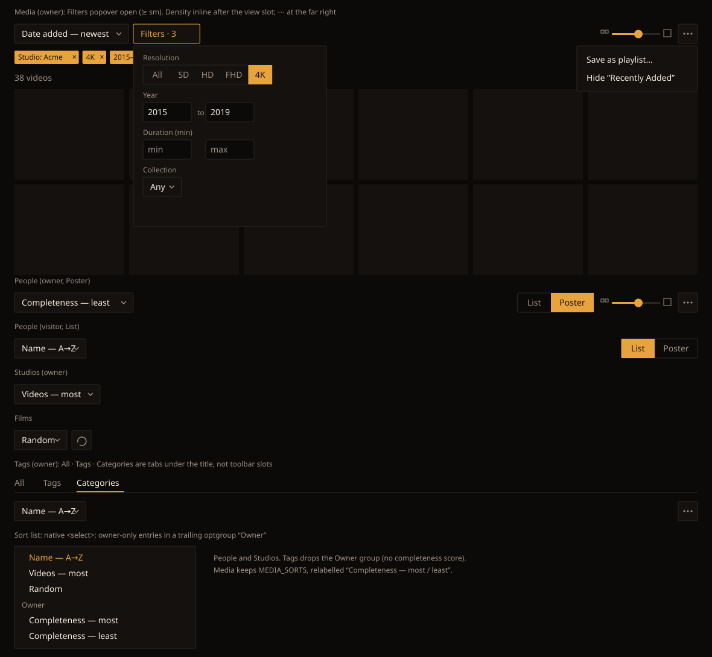
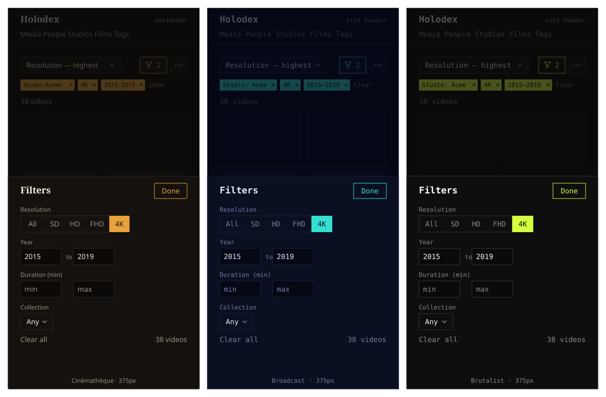
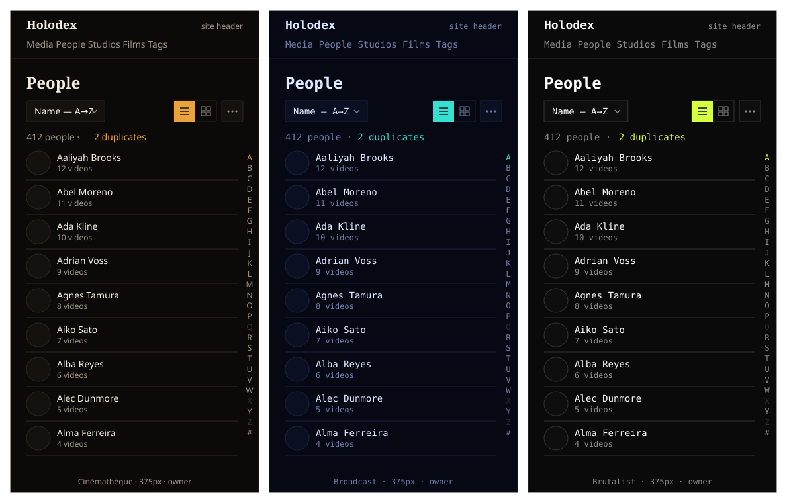

# Handoff Spec: One list toolbar (F73)

**Epic:** HOLODEX-472 (children: HOLODEX-473 multi-sort bug, HOLODEX-474 legacy-key purge)
**Spec:** [`docs/specs/list-toolbar.md`](../specs/list-toolbar.md) · **ADR:** [ADR-114](../architecture/archive/ADR-114-list-state-model.md)
**Date:** 2026-09-27 · **Status:** Draft, awaiting owner sign-off at `/implement`

Decided with the owner:
- **Filters opens a popover on desktop and a sheet on phones.** It's one panel in two
  presentations. This rules out an inline filter row, which would recreate the desktop wall.
- **Density stays an inline slider after the view slot.** It isn't moved into a View menu,
  because you need to watch the grid reflow while you drag it.

## Mockups

These are generated from the real `app.css` tokens. Text was measured in a browser with the
skins' webfonts loaded, and no label overflows its control in any skin.

**Desktop:** Media with the Filters popover and `⋯` open, plus one row per page showing its slots
(Cinémathèque):



**Mobile, Media:** the worst-case toolbar plus the open Filters sheet, three skins at 375px:



**Mobile, People (owner):** the toolbar, the merged status line, and the A–Z rail, three skins:



## Overview

Every list page (Media `/`, People, Studios, Films and Tags) renders sort, filter and view
controls through **one** component, `ListToolbar`. Pages supply content for its slots, and an
empty slot renders nothing. The goal is that a user never relearns controls between pages, and a
phone shows data after at most the title, one toolbar row and one row of chips.

## Layout

The order from top to bottom inside `<main class="px-6 py-6">`:

1. **Title row.** The existing `h1.skin-title text-2xl font-semibold`. Media has no title and
   starts at the toolbar.
2. **Tags only: tabs.** All · Tags · Categories, directly under the title.
3. **Toolbar row.** `flex items-center gap-2`. It never wraps, at any width.
   ```
   [Sort select] [Reroll?] [Filters?]  ········ml-auto········  [View?] [Density?] [⋯?]
   ```
   The right-hand group is pushed over by `ml-auto` on its first rendered item. **Don't use a
   spacer element**: in a `gap-2` row a spacer adds a third gap, which costs 8px the 375px budget
   doesn't have.
4. **Chips row.** Only when filters or scope are active: `flex flex-wrap gap-1.5` at `sm` and
   up; below `sm`, `flex-nowrap overflow-x-auto` so it stays one line.
5. **Count line.** `text-sm text-muted`: "38 videos", "412 people". Owner status is appended
   with ` · ` separators, as links: "· 3 need a refresh", "· 2 duplicates".
6. **Content.** Media's Recently Added shelf moves **below** the toolbar, so the toolbar sits in
   the same place on every page. It still shows only with no filters.

**Slots per page:**

| Page | Sort | Reroll | Filters | View | Density | `⋯` (owner) |
|---|---|---|---|---|---|---|
| Media | ✓ | when Random | ✓ Resolution, Year, Duration, mapped facets | — | ✓ | Save as playlist…, Hide/Show "Recently Added" |
| People | ✓ | when Random | — (Missing removed, R6) | List/Poster | Poster view only | Merge people… |
| Studios | ✓ | when Random | — | — | — | — (no owner page actions today) |
| Films | ✓ (Name — A→Z / Random) | when Random | — | — | — | — |
| Tags | ✓ (no Owner group) | when Random | — (type filter is the tabs) | — | — | Manage tags |

The `⋯` always sits at the **far right of the toolbar row**, not in the title row. Media has no
title row, and one location beats two.

## Design tokens used

Tokens only; no literal values in components (`.claude/rules/frontend-theming.md`).

| Token / class | Usage |
|---|---|
| `border-rule`, `bg-surface`, `text-ink`, `rounded-theme` | Sort select, Filters button, `⋯` button, popover and sheet panels |
| `border-accent`, `text-accent` | Filters button while any filter is active; the sheet's Done button (`.btn-accent`) |
| `bg-accent`, `text-accent-ink` | Chips; the active segment of the view toggle and Resolution control (`segmentedToggle.ts`) |
| `text-muted` | Captions (`text-xs`), count line, inactive tabs, rail letters, Clear |
| `bg-bg/70` | Sheet backdrop (the same as `ConfirmDialog`) |
| `bg-surface-2` | Hover on menu items and rail letters |
| `font-display` (via `.skin-title`) | Page title, sheet title "Filters" |
| Type | 14px `text-sm` controls; 12px `text-xs` captions and chips; 24px `text-2xl` titles; 18px `text-lg` sheet title |

## Components

| Component | New or reuse | Props / contract | Notes |
|---|---|---|---|
| `ListToolbar` (`lib/components/sort/`) | **new** | snippets `sort`, `filters?`, `view?`, `actions?`; `activeFilterCount` | Layout only. It owns the row, spacer and slot order, and no state. |
| Sort select | **reuse `SortDropdown`**, add a `compact` knob | `compact` drops the visible caption (keep an `sr-only` "Sort" label) and uses `py-1.5` | Native `<select>` keeps the OS picker on phones and single choice by construction (HOLODEX-473). Owner entries go in a trailing `<optgroup label="Owner">`. Add `min-w-0` as overflow insurance. |
| Sort lists | **change** | `PEOPLE_STUDIO_SORTS`: Name — A→Z · Videos — most · Random · [Owner] Completeness — most / least. Tags uses the same list without Owner. Films: Name — A→Z · Random. | Retires `SortToggle`, `CompletenessSortToggle`, Films' inline control and Tags' `typeCls` copy. |
| Media sort labels | **copy change** | "Completeness — most complete" becomes **"Completeness — most"**, and likewise "least" | A native select is as wide as its **widest option**. The old 29-character label pushed the Brutalist toolbar past 375px. At 20 characters the widest option is 208px, leaving 19px headroom. **Keep every sort label ≤ 20 characters.** |
| `SortReroll` | reuse | unchanged | From `sm` up, directly after the select. **Below `sm`, when the page renders `⋯`,** it becomes a "Shuffle again" item at the top of that menu, because the width budget has no room for it (see Responsive). Without a `⋯` (visitors), it stays inline. |
| `FiltersButton` | **new** | `count`, `expanded`, `onclick` | At `sm` and up: text "Filters" or "Filters · n". Below `sm`: a funnel glyph plus `n`, 36px wide or 52px with a count, `aria-label="Filters, n active"`. Uses accent border and text when `n > 0`. |
| `FilterPanel` | **new** | the page's filter fields as a snippet; `onclear` | One body, two presentations (see next row). Filters apply **live**, as today. There's no Apply button. |
| Popover / sheet shell | **new**, built from `dismissable` + the `ConfirmDialog` focus idiom | `open`, `onclose` | At `sm` and up: `absolute left-0 top-full mt-1 z-20 w-80 rounded-theme border border-rule bg-surface p-4 shadow-lg`, non-modal, `use:dismissable`. Below `sm`: `fixed inset-x-0 bottom-0 z-50 max-h-[80vh] overflow-y-auto border-t border-rule bg-surface p-4` over a `bg-bg/70` backdrop. Modal, focus-trapped, with the header "Filters" + Done and the footer "Clear all" plus the live count. |
| `FilterChip` | **new** (extracted from the `FacetFilter` chip) | `label`, `onremove` | `rounded-theme bg-accent px-1.5 py-0.5 text-xs text-accent-ink` plus a `×` button. Scope chips (`Studio: Acme`) come first, then filters in panel order. |
| View toggle | reuse `PersonViewToggle` | add icon-only rendering below `sm` | Below `sm`, two 32×32 icon cells (the toolbar's control height; above the 24px WCAG 2.2 target minimum) with `aria-label` "List view" / "Poster view". From `sm` up, the text labels as today. Move its classes onto `segmentedToggle.ts` (spec P1-c). |
| `DensitySlider` | reuse | unchanged, no label | It already hides itself when the screen can't fit more than one column, so it never costs width on a phone. |
| `⋯` page-actions menu | reuse the `PopoverMenu` class + the `EnrichProviderChips` `⋯` markup | items per page (table above) | Trigger 32×32 with `aria-label="Page actions"`. Menu `absolute right-0 top-full mt-1 min-w-max`. Not rendered when it would be empty (visitors, Studios, Films). |
| Tags tabs | **new**, in Tags only | `type` from the URL | `role="tablist"`, `flex gap-6 border-b border-rule text-sm`. Active: `text-ink border-b-2 border-accent -mb-px`. Inactive: `text-muted hover:text-ink`. |
| A–Z rail | **change** to People's and Studios' jump bars | — | See Responsive behaviour. |
| Count line + owner status | **change** | — | Owner status from `SweepStatusLine` and `DuplicatesBanner` renders **inline** in the count line instead of as separate blocks above the list. |

## States and interactions

| Element | State | Behaviour |
|---|---|---|
| Sort select | change | Writes the preference (ADR-114 D3), commits the URL, re-queries. Picking Random draws a fresh seed. |
| Sort select | visitor with a saved owner sort | Falls back to the page default (spec R2). The Owner optgroup isn't rendered. |
| Filters button | `n = 0` | Neutral border. Label "Filters", or the bare funnel below `sm`. |
| Filters button | `n > 0` | Accent border and text, with `n` shown. |
| Filters button | open | `aria-expanded="true"`. A second click closes it. |
| Popover (`sm` and up) | outside click / Escape | Closes and returns focus to the Filters button. Changes are already applied. |
| Sheet (below `sm`) | Done, backdrop tap, Escape | Closes and returns focus to the Filters button. |
| Filter field | change | Applies immediately: chips, count and results update. The debounce for number inputs is unchanged from today. |
| Chip `×` | click | Removes that filter or scope, commits the URL, re-queries. Focus moves to the next chip, or to the Filters button if none remain. |
| Clear (chips row, shown when 2 or more chips) / Clear all (sheet) | click | Removes all filters **and** scope chips. Sort is untouched. |
| `⋯` | open | Menu of page actions. Arrow keys move between items; Escape closes. |
| Merge people… | click | Enters select mode as today. The select-mode hint renders in the count line's place. |
| Tags tab | click | Sets `?type=` via `commit` (`replaceState`). The list filters and the sort is kept. |
| Count line status link | click | "3 need a refresh" goes to the sweep. "2 duplicates" goes to the duplicates review, the banner's current target. |

## Responsive behaviour

| Breakpoint | Changes |
|---|---|
| Below `sm` (640px) | Filters shows the funnel and count. The view toggle is icon-only. Filters opens as a bottom sheet. The chips row scrolls sideways on one line. **The A–Z rail replaces the A–Z bar.** Density hides itself. |
| `sm` and up | Filters shows its text label and opens as a popover. Chips wrap. The A–Z bar stays the sticky horizontal `nav` (`sticky top-0`). |
| All widths | The toolbar is one row and never wraps. `ml-auto` absorbs the slack. The sort select has `min-w-0` as insurance if a future label breaks the 20-character rule. |

**The measured worst case at 375px** (`main px-6`, so 327px of content). The select's width is
the widest option, measured with the skin's webfont; Brutalist's monospace is the widest.

| Row (owner, Brutalist) | Items + gaps | Total | Spare |
|---|---|---|---|
| Media | select 208 + Filters·2 52 + `⋯` 32 + 2 × 8 | 308 | 19 |
| People | select 208 + view icons 64 + `⋯` 32 + 2 × 8 | 320 | 7 |
| Media on Random | select 208 + reroll 32 + Filters·2 52 + `⋯` 32 + 3 × 8 | 348 | **−21** |

**On Random the reroll button doesn't fit.** The select's width comes from its widest *option*,
not the selected one, so picking "Random" doesn't make it narrower. So below `sm`, **the reroll
moves into the `⋯` menu as "Shuffle again"** whenever the sort is Random. From `sm` up it stays
next to the select. People on Random: 208 + 64 + 32 + 16 = 320, which fits because the reroll is
in `⋯`. Visitors on Media have no `⋯`, so the reroll takes its slot: 208 + 32 + 52 + 16 = 308.

**A–Z rail (below `sm`):**
- `fixed right-1 top-1/2 -translate-y-1/2 z-10 flex flex-col`, with each letter a
  `text-xs font-medium leading-4` button (16px pitch, 432px for 27 letters) in `text-muted`.
- Hover and focus: `text-accent`.
- Absent letters keep today's decorative `opacity-30 aria-hidden` span.
- It renders only while `sort === 'name'`, in list view, with no `q`. It no longer depends on a
  separate completeness state, because sort is one value now.
- List rows get `pr-5` below `sm` while the rail shows, so the rail never covers a tappable row.
- Tap jumps; there's no drag-scrub (P2).
- The jump targets get `scroll-mt-10` so a row doesn't land under the sticky bar at `sm` and up.
  That's a pre-existing bug, fixed in passing.

## Edge cases

- **No results:** "No videos match these filters." (or people, and so on), then a `.btn-ghost`
  "Clear filters" button. The chips stay visible above it, so it's obvious what's narrowing.
- **Filters that no longer exist** (a removed mapped facet, or an unknown param in a shared link):
  the parser drops them silently. No chip, no error (ADR-114 D6).
- **Scope for an entity that no longer exists** (for example `studio_id=999`): show the chip as
  "Studio: unknown ×" so the user can remove it. Never silently show an empty list.
- **Long chip labels** (for example a mapped-facet value): `max-w-[12rem] truncate` on the label
  span, with the full value in `title`.
- **Many chips:** they wrap from `sm` up. Below `sm` they scroll sideways in a single row, with
  no page-level horizontal overflow (see the HOLODEX-356 guards).
- **Loading:** the count line reads "Loading…" (today's copy). Controls stay interactive, and the
  last request wins.
- **Owner capabilities resolve late:** the Owner optgroup and `⋯` appear once `isOwner` resolves.
  A saved completeness sort then applies, which is the current SP1 self-heal posture.
- **Random + shared link:** the seed isn't in the URL, so the recipient gets their own shuffle.
  That's intended (ADR-114 D1).

## Animation and motion

| Element | Trigger | Animation | Duration | Easing |
|---|---|---|---|---|
| Sheet | open / close | translate-y 100% to 0 plus a backdrop fade | 150ms | ease-out |
| Popover, `⋯` menu | open | none (it appears) | — | — |
| All | `prefers-reduced-motion: reduce` | no transition | 0 | — |

## Accessibility notes

- **Focus order:** title, (Tags tabs), sort select, reroll, Filters, view toggle, density, `⋯`,
  chips from left to right, Clear, count-line links, content.
- **Sort:** a native `<select>` with an `sr-only` `<label>` "Sort". Single choice, and it's
  announced as a combobox with the current value.
- **Filters button:** `aria-expanded`, `aria-controls` pointing at the panel id, and
  `aria-label="Filters, 2 active"` in compact mode.
- **Popover:** `role="dialog" aria-label="Filters"`, non-modal. Tabbing past its last field
  closes it.
- **Sheet:** `role="dialog" aria-modal="true" aria-labelledby` the "Filters" heading. It traps
  focus using the `ConfirmDialog` `trapTab` idiom and returns focus to the trigger.
- **Chips:** each `×` is a `<button aria-label="Remove filter: Resolution 4K">`. Scope chips say
  "Remove scope: Studio Acme".
- **Count line:** `aria-live="polite"`, so a filter change announces "38 videos".
- **Tags tabs:** `role="tab"` / `aria-selected`, arrow keys move between tabs, and the list
  container has `role="tabpanel"`.
- **A–Z rail:** `nav aria-label="Jump to letter"`, as today. Each letter is a button, and absent
  letters are `aria-hidden`.
- **Contrast:** never dim a `text-muted` label with opacity to show a disabled state. Withdraw the
  affordance instead (frontend-theming rule). The rail's `opacity-30` absent letters are decorative
  and `aria-hidden`.

## Three-skin QA checklist

1. `[agent]` At 375px, in all three skins, for the owner on Media and People: the toolbar is one
   row with no horizontal page scroll. Check with `javascript_tool` geometry
   (`scrollWidth <= clientWidth`).
2. `[agent]` Brutalist: the People owner sort select with "Completeness — least" selected isn't
   visibly clipped (the 1px case above).
3. `[agent]` Chips and the active view segment read in all skins. Brutalist's `#d6ff3f` accent
   behind `#0a0a0a` ink is the one to eyeball.
4. `[agent]` Sheet: focus trap, Escape and backdrop close; focus returns to the Filters button.
5. `[human]` Skim the desktop popover and the mobile sheet in each skin (switch under Owner ›
   Appearance).
6. `[smoke]` HOLODEX-473 regression: pick Completeness on People, then Name. Only one is ever
   selected, and the A–Z index appears.

## Decisions made in this handoff (beyond the spec) — confirm at `/implement`

1. The `⋯` always sits at the far right of the toolbar row. Media's owner actions (Save as
   playlist, Hide Recently Added) move into it.
2. `SweepStatusLine` and `DuplicatesBanner` fold into the count line as inline links, instead of
   separate blocks above the list.
3. The sort control is the **native `<select>`** (reusing `SortDropdown`), not a custom menu. The
   earlier brainstorm sketch showed a button, and this looks the same when closed.
4. Sort labels follow "Field — direction" and are capped at 20 characters. People and Studios get
   "Name — A→Z" and "Videos — most".
5. Media's Recently Added shelf moves below the toolbar.
6. Below `sm`, on pages with a `⋯`, "Shuffle again" moves into the `⋯` menu, because the 375px
   width budget can't fit it inline (see Responsive).

## Amendments approved 2026-09-27

The owner chose these from visual comparisons (approved vs built vs alternatives) after the
build found gaps in this handoff, and approved them as built. The worklog's Divergences table
records how each was reached.

- **D1, which replaces decision 2 for the sweep status.** `SweepStatusLine` isn't a count, so it
  doesn't fold into the count line. It's always one line under it, shown only during or just after
  a sweep:
  - The counts truncate, with the full text in a tooltip.
  - **Details** and **Dismiss** stay pinned at the end.
  - A failure count also stays pinned, in `text-warn`, so the ellipsis never hides it.
  - `DuplicatesBanner` still folds into the count line as decision 2 says.
- **D2, People merge select mode.** Entered from `⋯` → "Merge people…". While selecting, the
  toolbar row becomes a mode bar, "N selected · Merge · Cancel", with Merge disabled below two. The
  hint takes the count line's place. This is `ListToolbar`'s `mode` snippet.
- **D3, Tags manage mode.** Entered from `⋯` → "Manage tags". It uses the same mode bar:
  "Managing · N selected · Merge… · ⋯ · Done".
  - Once two or more are picked, the bar's `⋯` holds Add to / Remove from category, Turn off /
    Turn on writeback, and Sync writeback now.
  - The writeback items are withheld while a bulk write runs.
  - Hints and warnings take the count line's place.
