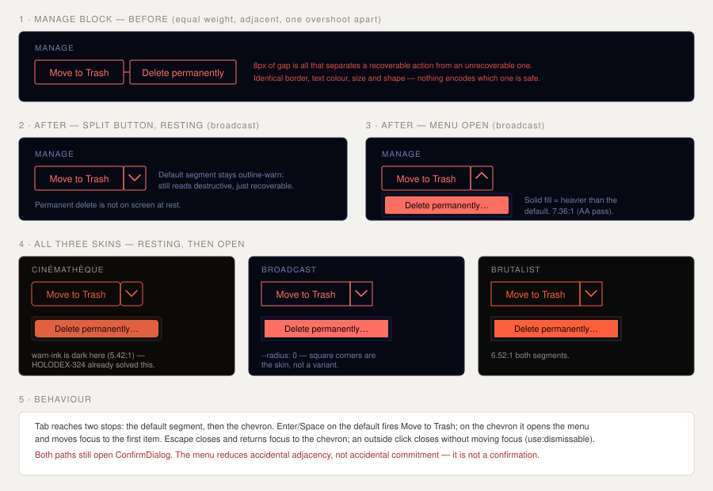

# Design handoff: Manage block — destructive split button

**Jira:** [HOLODEX-362](https://whoiskevinrich.atlassian.net/browse/HOLODEX-362)
**Surface:** `web/src/routes/media/[id]/+page.svelte` (owner-only Manage section)
**Theming contract:** [ADR-021](../architecture/ADR-021-frontend-theming-and-skins.md) + [theming.md](theming.md) — **tokens only, QA all three skins.**
**Revises:** [delete-media-handoff.md](delete-media-handoff.md) §1 (the Manage block's two-button layout)
**Related:** [ADR-037](../architecture/ADR-037-soft-delete-and-purge.md) (soft-delete vs. purge), HOLODEX-324 (the `--warn` / `--warn-ink` solid-fill pair this depends on)



## 1. What's wrong

The Manage block renders both delete paths as the same control:

```svelte
<button class="rounded-theme border border-warn px-3 py-1.5 text-sm text-warn hover:bg-warn/10">Move to Trash</button>
<button class="rounded-theme border border-warn px-3 py-1.5 text-sm text-warn hover:bg-warn/10">Delete permanently</button>
```

Identical border, text colour, padding, radius and font size, separated by `gap-2`. One is
reversible (soft-delete with a grace period, restorable from `/trash`); the other destroys the file
immediately. Nothing in the rendering distinguishes them, and they are adjacent — so overshooting
`Move to Trash` by one button-width lands on the purge.

The confirm dialog catches this today, which is why it has never caused a data loss. But a
confirmation that fires on the wrong action is a worse experience than one that never fires: the
owner reads a dialog they did not ask for and has to parse which delete they are being offered.

## 2. The rule

> **Only the reversible action is on screen at rest. The irreversible one lives behind a chevron,
> and when revealed it is visually heavier than the action it sits under — never equal, never
> lighter.**

Concretely, a split button:

| Segment | Fires | Treatment |
|---|---|---|
| Default (`Move to Trash`) | `openConfirm('soft')` | `border-warn` outline, `text-warn` — **unchanged**. It is still destructive and must still read that way. |
| Chevron | opens the menu | Same outline, joined by `border-l`, no separate border box |
| Menu item (`Delete permanently…`) | `openConfirm('purge')` | **Solid** `bg-warn` / `text-warn-ink` — the heaviest weight on the page |

The ellipsis on `Delete permanently…` follows the platform convention that the item opens a dialog
rather than acting immediately. `Move to Trash` also opens a dialog but keeps its bare label,
because it is the default segment of a split button — labelling it `Move to Trash…` would put an
ellipsis on the element users click most and dilute the signal.

### 2a. Why the default segment stays warn

An earlier option demoted `Move to Trash` to a neutral `border-rule` so that warn colour would mean
"no undo" exclusively. Rejected: moving a file to Trash is still a destructive act from the owner's
point of view — it disappears from the library and is purged on a timer. A neutral button
undersells it. The hierarchy is carried by **fill vs. outline**, not by leaving the warn family.

### 2b. Why split rather than a plain menu button

If the whole control opened a menu, the common reversible action would cost two clicks in order to
protect the rare one. The split is safe here precisely *because* the default is reversible: a
misaimed click on the body is recoverable from `/trash`. That asymmetry is the whole argument — a
split button would be the wrong pattern if both actions were irreversible.

### 2c. What this does not change

The `ConfirmDialog` on both paths is untouched. A menu is not a confirmation; it reduces accidental
*adjacency*, not accidental *commitment*.

## 3. Reuse

This is not a new primitive. `EnrichProviderChips.svelte` already implements the same shape —
`inline-flex items-stretch rounded-theme border` wrapping a primary segment and a `border-l`
overflow trigger, with an absolutely-positioned `role="menu"` beneath:

```svelte
<div class="relative inline-flex items-stretch rounded-theme border …">
  <button …>primary</button>
  <button aria-haspopup="menu" aria-expanded={open} class="border-l …">⋯</button>
  {#if open}<div role="menu" class="absolute right-0 top-full z-10 mt-1 …">…</div>{/if}
</div>
```

Two differences, both deliberate:

1. **The trigger is a chevron, not `⋯`.** `⋯` means "more actions of the same kind"; a chevron on a
   split button means "variants of the action to my left". The menu here holds one item that *is* a
   variant of delete.
2. **The wrapper is warn-bordered, not rule-bordered**, because the whole control is destructive.

Escape / click-outside / focus-return come from `use:dismissable`
(`web/src/lib/actions/dismissable.ts`) — already extracted for exactly this, and already used by
both `EnrichProviderChips` and the `/tags` per-pill menu.

`PopoverMenu` (`lib/actions/popoverMenu.svelte.ts`) is **not** reused: it is keyed by numeric row id
and carries a `value`/`busy`/`error` inline-form slot for the rename/alias flows. A single split
button with no inline form would have to invent a fake id to use it. Local `$state` plus
`use:dismissable` is the honest fit.

## 4. Keyboard and screen reader

| Key | Behaviour |
|---|---|
| `Tab` | Two stops: default segment, then chevron. The menu item is reached by opening the menu, not by tabbing past a closed one. |
| `Enter` / `Space` on default | Fires `Move to Trash` (opens its confirm dialog) |
| `Enter` / `Space` on chevron | Opens the menu and moves focus to the first item |
| `Escape` | Closes the menu, returns focus to the chevron |
| Outside click | Closes the menu, leaves focus alone (the pointer has already moved) |

The chevron carries `aria-haspopup="menu"`, `aria-expanded`, and an explicit
`aria-label="More delete options"` — it has no text of its own. The menu is `role="menu"` with
`role="menuitem"` children, matching `EnrichProviderChips`.

## 5. Contrast (measured, not assumed)

All three skins already ship a `--warn` / `--warn-ink` pair documented for a solid destructive fill;
HOLODEX-324 did that work. Computed WCAG ratios for both treatments:

| Skin | `text-warn` on `--bg` (outline segment) | `text-warn-ink` on `--warn` (filled item) |
|---|---|---|
| Cinémathèque | 5.62:1 | 5.42:1 |
| Broadcast | 7.31:1 | 7.36:1 |
| Brutalist | 6.52:1 | 6.52:1 |

All pass AA for normal text. Cinémathèque's `--warn-ink` is dark where the other two skins' are
near-black-but-cooler — that is intentional and recorded in `app.css`: a light ink on that skin's
warn only reaches 3.51:1.

## 6. Acceptance

1. At rest the Manage block shows exactly one control; `Delete permanently` is not in the DOM as a
   visible button.
2. Clicking the default segment opens the soft-delete confirm dialog, unchanged.
3. Clicking the chevron opens a menu whose single item is a solid-warn `Delete permanently…`.
4. That item opens the purge confirm dialog, unchanged.
5. Escape closes the menu and focus lands back on the chevron.
6. A click anywhere outside the control closes the menu.
7. All three skins render both states with no hardcoded colour, radius, or font.
