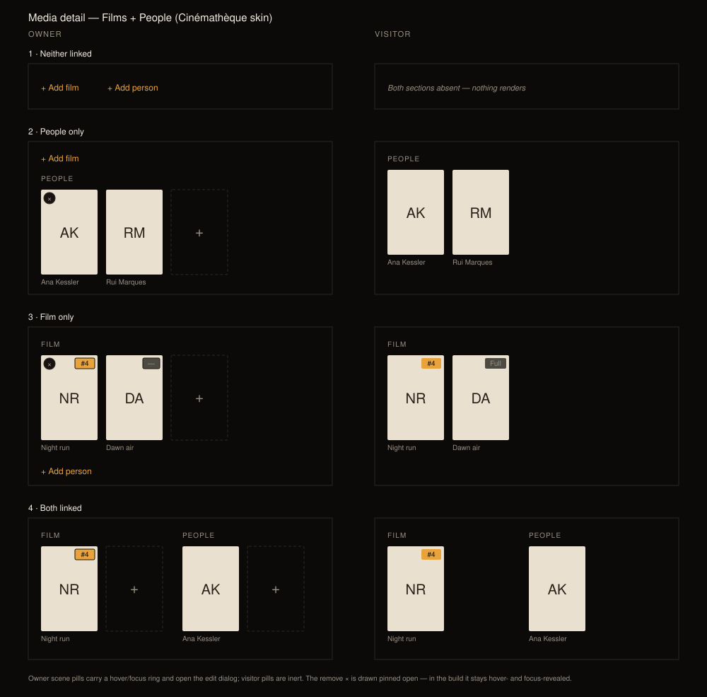

# Design handoff: Media detail — Films + People sections

**Jira:** [HOLODEX-328](https://whoiskevinrich.atlassian.net/browse/HOLODEX-328)
**Surface:** `web/src/routes/media/[id]/+page.svelte` (Films + People row), `web/src/lib/components/entity/PeopleGrid.svelte`
**Related:** [HOLODEX-296](https://whoiskevinrich.atlassian.net/browse/HOLODEX-296) (shared poster-tile component), [ADR-085](../architecture/ADR-085-films-entity.md) (films entity), [media-detail-reorder-handoff.md](media-detail-reorder-handoff.md) (the co-located row this revises)



## 1. Overview

The media detail page co-locates a **Films** section and a **People** section in one row. Both are
many-to-many owner-editable relationships (`film_videos`, `video_people`), and either can be empty
independently — four link states. Three of the four read badly today.

### 1a. What's wrong

| # | Problem | Where |
|---|---|---|
| 1 | **Two different empty affordances for the same nothing.** Empty Films renders a heading plus a dashed 2:3 poster box; empty People renders a bare text link. Side by side they look like two unrelated kinds of emptiness. | `+page.svelte` Films block vs. `PeopleGrid.svelte:113` |
| 2 | **An empty section still claims a column.** `FILMS` + a dashed box sits permanently beside a populated People grid, taking width from the content that exists. | `+page.svelte:1292` (`max-w-[50%] flex-none`) |
| 3 | **Mismatched tile sizes.** Films chips are a hardcoded `w-20`; People tiles are `grid-cols-3/4/6` inside a `flex-1` column. When both are populated the two poster rows are visibly different sizes. | `+page.svelte:1336`, `PeopleGrid.svelte:73` |
| 4 | **The scene badge is a below-poster block** reading `Unnumbered` / `Full film` / `#4`, which makes a film chip taller than a person chip and diverges from the Film detail page's Scenes grid, where the same value is a corner pill overlaid on the thumbnail. | `+page.svelte:1320-1335` vs. `VideoCard.svelte:99-122` |

Problem 1 is Films-side only: `PeopleGrid` already collapses to a text CTA when empty (and the
comment there records *why* — "a lone dashed square with nothing beside it read as less fluid than
an inline text button"). Films never got the same treatment.

### 1b. The rule

> **A section renders its heading and tiles only when it has content. An empty side degrades to a
> bare `+ Add …` text CTA with no heading and no dashed box. Sections stack vertically unless both
> are populated, in which case they sit side by side at equal tile size.**

Order is always Films, then People — in every state, in both stacked and side-by-side layouts.

The text CTA and the trailing dashed `+` tile are not competing patterns; they are the same
affordance at two densities. Text when the section is empty and has no heading to anchor it; tile
when the section is populated and the control sits in a row of tiles. A populated section keeps its
dashed `+` tile — a video with one person attached must still be able to gain a second.

## 2. State matrix

`isOwner` comes from `activity.isOwner()`. The existing visibility gates are unchanged:

```
filmsVisible  = !!activity.caps?.films_enabled && (isOwner || films.length > 0)
peopleVisible = isOwner || (video?.people?.length ?? 0) > 0
```

| # | State | Owner | Visitor |
|---|---|---|---|
| 1 | Neither linked | Two text CTAs inline on one row: `+ Add film`&nbsp;&nbsp;`+ Add person`. No headings. | Nothing renders — both gates fail, the whole row is absent. |
| 2 | People only | `+ Add film` text CTA on its own line, then the `People` heading + tile grid (with trailing `+` tile) at full width below. | `People` heading + tiles only. No `+` tile, no `×` controls, no Films trace. |
| 3 | Film only | `Film(s)` heading + tile row (with trailing `+` tile), then `+ Add person` text CTA below. | `Film(s)` heading + tiles, pills inert. |
| 4 | Both linked | Films block and People block side by side, equal tile size, each with its own trailing `+` tile. | Same two-column layout, no `+` tiles, no `×` controls. |

**State 1 for a visitor is a true blank** — not an empty state, not a placeholder. That falls out of
the existing gates and matches the project rule that a visitor sees a data point when a value
exists and never sees an owner-only control. Do not add a visitor empty state.

**When `films_enabled` is off**, `filmsVisible` is false for everyone, so state 1 collapses to just
`+ Add person` for the owner, and states 2/4 lose the Films block entirely. No new gate needed.

## 3. Design tokens

Skin tokens per [ADR-021](../architecture/ADR-021-frontend-theming-and-skins.md) / [theming.md](theming.md). **No
hardcoded colors, fonts, or radii** — all three skins must be QA'd.

| Token / utility | Cinémathèque value | Usage |
|---|---|---|
| `text-muted` | `#9b9082` | Section headings, tile captions, dim pill glyph, `×` glyph |
| `text-ink` | `#f3ece1` | Tile link text |
| `text-accent` | `#e8a33d` | `+ Add film` / `+ Add person` CTA, hover states |
| `bg-accent` / `text-accent-ink` | `#e8a33d` / `#1a1206` | Numbered scene pill |
| `bg-logo-plate` / `text-logo-plate-ink` | `#e9e0d0` / `#2a2018` | Film poster monogram fallback |
| `border-rule` | `#2a2622` | Dashed `+` tile, `×` button border |
| `bg-surface-2` | `#181310` | `×` button plate (at `/90`) |
| `rounded-theme` | `2px` (Cinémathèque), `0px` (Broadcast, Brutalist) | Every rect corner |
| `font-display` | Fraunces / VT323 / Spline Sans Mono | Monogram glyph |

**Radius warning:** `--radius` is 2px on Cinémathèque and **0px on both other skins**. The pill and
tiles are effectively square corners on two of three skins — do not introduce a literal
`rounded-md`/`rounded-full` anywhere. (The `×` button's `rounded-full` is pre-existing and stays.)

## 4. Layout

| Element | Spec |
|---|---|
| Row container | `flex items-start gap-6` only in state 4; otherwise a vertical `space-y-*` stack |
| Section heading | `text-xs uppercase tracking-wide text-muted`, `mb-1.5` — unchanged from today |
| Tile | 2:3 aspect, **shared fixed width across both sections** (today's Films `w-20` = 80px) |
| Tile row | `flex flex-wrap gap-3` in both sections |
| Caption | `line-clamp-2 text-xs text-muted`, `mt-1.5`, left-aligned under the poster |
| Empty CTA | inline text button, `text-accent`, no border, no box |
| State-1 CTA row | `flex gap-4` — both CTAs on one line |

### 4a. Tile sizing decision

Both sections use **one fixed tile width**; People's responsive `grid-cols-3 sm:grid-cols-4
md:grid-cols-6` becomes a `flex flex-wrap` row like Films'.

*Rationale:* it guarantees alignment at every viewport with no breakpoint math shared between two
components, and it is what [HOLODEX-296](https://whoiskevinrich.atlassian.net/browse/HOLODEX-296)
already proposes extracting.

> **Blast radius — read before implementing.** `PeopleGrid` is shared with the Film detail page's
> **Cast** section. Changing its grid resizes Cast tiles too. That is accepted: two surfaces showing
> people posters at two different sizes is the same inconsistency one layer up. If review disagrees,
> the escape hatch is a `tileWidth` prop rather than forking the component.

## 5. The scene pill

Ported from the Film detail page's Scenes grid (`VideoCard.svelte:99-122`) so the same value reads
the same way on both surfaces. It replaces the current below-poster badge block entirely — which is
what makes a film chip the same height as a person chip.

**Position:** `absolute right-1.5 top-1.5 z-[2]`, overlaid on the poster.
**Shape:** `rounded-theme px-1.5 py-0.5 text-[10px] font-semibold shadow-xs ring-1 ring-black/20`.

| Attachment | Content | Fill | Owner-editable |
|---|---|---|---|
| Numbered scene | `#4` | `bg-accent text-accent-ink` | yes |
| Unnumbered scene | `—` | `bg-bg text-muted` | yes |
| Full film (`is_full_film`) | `Full` | `bg-bg text-muted` | **no** |

**The dim fill is `bg-bg`, not VideoCard's `bg-black/70`.** VideoCard's badge sits over a video
thumbnail; this one sits over the light `bg-logo-plate` poster, and letting 30% of that plate
bleed through drags `text-muted` to a measured **3.14 / 2.41 / 2.85** across Cinémathèque /
Broadcast / Brutalist — an AA failure on 10px text. Opaque `bg-bg` restores it to **6.31 / 4.90 /
5.73** and costs nothing visually, since the translucency was never doing work over a poster.
(`VideoCard` itself still uses `bg-black/70`; over a bright thumbnail it has the same latent
problem, tracked separately — not changed here.)

*Full film is inert for everyone* — a full-film attachment has no scene number to edit, which is
already the rule today (`{@const editable = isOwner && !f.is_full_film}`). It keeps a pill rather
than showing a bare poster so the full-film / scene distinction the current `Full film` badge
carries isn't lost, and so an empty corner never reads as a pill that failed to render.

**Element choice** follows `VideoCard` exactly, via `svelte:element`:

- Editable → `<button type="button">` with `hover:ring-accent focus-visible:ring-accent`, opening
  `EditSceneNumberDialog`. A sibling of the `<a>`, never nested inside it.
- Not editable (visitor, or full film) → `<span class="pointer-events-none">`, so a click on the
  pill falls through to the anchor beneath and navigates to the film like the rest of the tile.

### 5a. Corner collision

The film chip's remove control currently occupies `absolute right-1.5 top-1.5` — the exact slot the
pill needs. **Remove moves to `left-1.5 top-1.5` on Films tiles only.** People tiles keep remove at
top-right.

The two Films controls only coexist visually while the owner is pointing at the tile (remove stays
inside `curation-actions`, opacity 0 until `:hover` / `:focus-within`; always visible under
`@media (hover: none)`), and the pill keeps the corner that Scenes trained the eye to check. The
cost — Films and People remove buttons on opposite corners — is accepted; matching Scenes' pill
position is the point of the change.

## 6. States and interactions

| Element | State | Behavior |
|---|---|---|
| `+ Add film` (text CTA) | default / hover | `text-accent`; opens `FilmAttachDialog` |
| `+ Add person` (text CTA) | default / hover | `text-accent`; opens `PersonPicker` popover |
| Dashed `+` tile | hover / focus | `border-accent text-accent` (unchanged) |
| Tile | hover | poster `opacity-90`, caption `text-accent` (unchanged) |
| Scene pill (owner, scene) | hover / focus-visible | `ring-accent`; click opens `EditSceneNumberDialog` |
| Scene pill (visitor, or full film) | any | inert; click passes through to the film link |
| Remove `×` | rest | `opacity-0` via `curation-actions`; visible on tile hover / focus-within |
| Remove `×` | busy | glyph → `…`, `disabled`, `cursor-default` (unchanged) |
| Section | mutation in flight | busy is keyed per row (`filmBusyKey` by `film_id`, `personBusyKey` by `personKey`) — never a section-wide spinner |

**Optimistic patching stays as-is.** Scene edits patch `films` in place
(`saveFilmSceneNumber`); detach filters it. No refetch, no layout flash.

## 7. Edge cases

- **Empty→populated transition.** Attaching the first person swaps the People branch from text CTA
  to heading + grid. `personPickerOpen` is already owned by `PeopleGrid` (not `PersonPicker`)
  precisely so the popover survives that remount — **do not move it back down**.
- **First attach changes the whole row's layout.** Going from state 2 to state 4 moves People from
  full width to a column. Accept the reflow; no animation.
- **Long film / person names.** Caption is `line-clamp-2`; the full value stays in the `title`
  attribute. A 2-line caption sets the row height for every tile in that row — that's fine and
  already true today.
- **Many attachments.** Both rows are `flex-wrap`; a video in twelve films wraps to multiple lines
  and the side-by-side columns grow independently. No cap, no "show more".
- **Scene number cleared to null.** Pill becomes the dim `—`, still editable. It does not disappear.
- **Remove error.** `filmRemoveError` / `removeError` render as `text-sm text-warn` with
  `aria-live="polite"` beneath their own section — unchanged.
- **Loading.** The row renders nothing until `video` resolves; there is no skeleton today and none
  is being added.

## 8. Accessibility

- **Focus order** within a tile: link → scene pill (if a button) → remove `×`. The pill and `×` are
  siblings of the `<a>`, never nested inside it — a nested interactive element inside an anchor is
  invalid and breaks keyboard traversal.
- **`curation-actions` is opacity-only, not `display:none`**, so the remove button stays in the tab
  order and `:focus-within` reveals it for keyboard users.
- **Labels:** pill `aria-label={`Edit scene number for ${name}`}` when interactive, none when it is
  a plain span; remove `aria-label={`Remove ${name}`}`.
- **Headings** stay `<h2>` inside `<section>`. When a section collapses to a text CTA it emits no
  heading — so the CTA must be a `<button>` with its own accessible name (`Add film`, `Add person`),
  not a bare styled `<span>`.
- **Contrast: resolved.** The `—` / `Full` pill was the risky one (muted on a translucent dark
  chip over a light plate) and it did fail — see §5. Fixed by making the chip opaque; measured at
  6.31 / 4.90 / 5.73 across the three skins. Re-measure if either token moves.

## 9. QA

Per the project's three-skin rule, every state below runs on **Cinémathèque, Broadcast, and
Brutalist**, in **both** owner and visitor sessions.

| # | Item | Verifier |
|---|---|---|
| 1.1 | Media with no film and no person, owner: two CTAs on one line, no headings | agent |
| 1.2 | Same media, visitor: the entire Films/People row is absent from the DOM | agent |
| 2.1 | Media with people only, owner: `+ Add film` above, People grid full width | agent |
| 2.2 | Same, visitor: People heading + tiles, no `+` tile, no `×` | agent |
| 3.1 | Media with a film only, owner: Film heading + tile, `+ Add person` below | agent |
| 3.2 | Numbered / unnumbered / full-film pills read `#N` / `—` / `Full` | agent |
| 3.3 | Visitor: clicking the pill navigates to the film (does not open a dialog) | human |
| 4.1 | Both populated: film and person posters are the same width, tops aligned | human |
| 4.2 | Owner: film tile's `×` is top-left, person tile's `×` is top-right, both hover-revealed | human |
| 4.3 | Owner: clicking a scene pill opens the edit dialog; saving updates the pill in place | human |
| 5.1 | Film detail page **Cast** section still looks right at the new tile size | human |
| 5.2 | Keyboard: tab through a tile reaches link, pill, then remove — all visible when focused | human |
| 5.3 | `text-muted` on the `—` pill passes AA on all three skins | agent |

## 10. Scope

**In:** the four link states, the collapse rule, shared tile size, the scene pill port, the remove-
button corner move, owner and visitor variants.

**Out:**
- **Heading pluralization.** The heading stays `Films` / `People` regardless of count — a
  count-dependent label is a third rule to maintain for no functional gain. The source sketch
  wrote `FILM` singular; the mockup has been corrected to `FILMS` so it matches what ships.
- **Extracting the shared tile component** — that is
  [HOLODEX-296](https://whoiskevinrich.atlassian.net/browse/HOLODEX-296). This handoff specifies the
  *sizing contract* that extraction should satisfy; it does not require the extraction to land first.
- **Anything in the Metadata section**, the `#field-actors` / `#field-genres` deep-link anchors
  (both preserved), and the provider-adoption / precedence layers of
  [ADR-090](../architecture/ADR-090-two-layer-entity-metadata-management.md). This is layout and
  affordance only — no field, no namespace, no decision model is touched.
