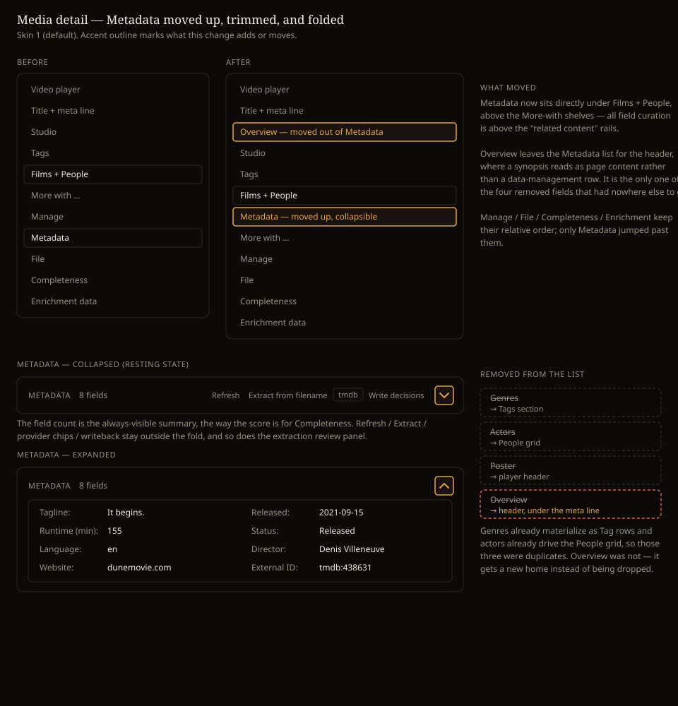

# Design handoff: Media detail Metadata — move, trim, fold

**Status:** Implemented (pending review)
**Phase:** Ad hoc UX request (no HOLODEX epic — reorder + de-duplication of existing elements)
**Jira:** HOLODEX-320
**Owner:** Project owner
**Date:** 2026-09-05
**Spec:** none — no new functionality; every affordance already existed somewhere on the page
**ADR:** none — no architectural change. Rides ADR-051 (per-field precedence) and ADR-090
(adoption vs. precedence layers) unchanged; nothing about the resolver, the shadow store, or the
decision model moves.
**Branch/PR:** `HOLODEX-320-media-detail-metadata-fold` · PR #300

## Overview

Follow-up to [`media-detail-reorder-handoff.md`](media-detail-reorder-handoff.md). That change
settled the page order; this one settles what the Metadata section is *for*. Three asks from the
owner:

1. Move the Metadata section into the gap between the Films/People row and the More-with shelves.
2. Drop the field rows that the page already surfaces somewhere better.
3. Make the section collapsible, visually identical to the Completeness panel.

## 1. Final order (top to bottom)

1. Video player
2. Title + resolution/duration/year meta line
3. **Overview** (new position — see §2)
4. Studio
5. Films + People, one row
6. Tags
7. **Metadata** (**moved up** — was below Manage)
8. More with Person / More with Tag shelves
9. Manage
10. File
11. Completeness
12. Enrichment raw-data disclosures

Only Metadata moved; Manage / File / Completeness / Enrichment keep their relative order. The
effect is that everything the owner *curates* sits above the "related content" rails, and
everything that is a rail or a destructive/diagnostic tool sits below them.

## 2. Fields removed from the Metadata list

The Metadata `<dl>` was rendering four fields the page already showed elsewhere, so the same value
appeared twice with two different affordances. Each is now rendered in exactly one place:

| Field | Canonical | Where it lives now | Was it a duplicate? |
|---|---|---|---|
| Genres | `genres` | Tags section — resolved genres already materialize into real Tag rows | yes |
| Actors | `actors` | People grid — resolved actors already derive `video_people` (ADR-072) | yes |
| Poster | `poster_url` | The player's own poster + upload / remove / regenerate controls | yes |
| Overview | `overview` | **New:** under the header meta line | **no** — see below |

Enforced by a single `METADATA_ELSEWHERE` list in `+page.svelte` rather than a condition per
render site, so "every field is shown exactly once" stays auditable in one place. `studio` and
`title` (already excluded before this change, by F52 and HOLODEX-269) joined the same list.

### Overview is the exception

Genres, Actors, and Poster were genuine duplicates — removing the row loses nothing. Overview was
not: it appeared *only* inside the owner-only Metadata section, so deleting the row would have
left a video's synopsis with no home at all, invisible and uncurable even though it still enriched
and still wrote back. It moves to the header instead, under the meta line, where a plot summary
reads as page content rather than as a data-management row.

The header render is a verbatim port of the Metadata `long_text` branch, so nothing about the
control changes:

- Owner, replace-field → `SourceBadge` (the ADR-051 precedence chip row, collapsed
  `ProvenanceBadge` at rest).
- Otherwise → read-only paragraph.

**Deliberate behavior change:** the synopsis is now visible to visitors. It previously sat inside
the owner-only section (the re-gate from the earlier reorder), so visitors saw no synopsis at all.
Accepted and confirmed by the owner — a plot summary is page content, not owner tooling.

### The gating rule this follows

Confirmed by the owner as the convention for entity data points generally, not a one-off for
Overview: **visible to visitors when a value exists; editable for the owner.** The outer gate is
`isOwner || <field has a value>` — the same shape Tags (`isOwner || video.tags?.length`) and Studio
(`isOwner || studioField?.values?.length`) already use. Resolved for Overview as:

| | Visitor | Owner |
|---|---|---|
| Has a value | read-only paragraph | `SourceBadge` (editable) |
| No value | nothing renders | `SourceBadge` showing `—`, still editable |

The owner-with-no-value cell is the one worth stating: the control still renders, so a field can be
*given* a value rather than only corrected. Apply the same rule to any field that moves out of the
Metadata list in future.

### What was checked and left alone

`poster_url` has `Display: "image_url"`, so its Metadata row rendered an `` plus a read-only
`ProvenanceBadge` — it never rendered `SourceBadge`. There is therefore **no** provider-poster
precedence chooser anywhere in the UI, before or after this change. Removing the row loses only
the duplicate preview image. Building that chooser is a separate piece of work and was explicitly
deferred rather than smuggled in here.

## 3. The fold

Mechanically identical to `CompletenessPanel`, deliberately — same chevron button, same
`rotate-180`, same `max-height` transition with `motion-reduce` opt-out, same `inert` while
collapsed, same `aria-expanded` / `aria-controls` pairing.

| Decision | Choice | Why |
|---|---|---|
| Resting state | Collapsed | Matches Completeness. The list is reference data; the actions above it are the reason to visit. |
| Always-visible summary | `{n} fields` beside the heading | Completeness keeps its score visible so the fold never hides *whether there is anything in there*. The count is the equivalent. |
| What folds | The field list only | Refresh / Extract from filename / provider chips / Write decisions stay reachable while collapsed — a fold that hides the enrichment actions would cost a click on every visit. |
| Extraction review panel | Stays outside the fold | It is transient work waiting on the owner (ADR-090 layer 1). Hiding pending review rows behind a collapsed section would strand them. |

`max-height` is `6000px` when expanded (Completeness uses `2000px`) — the metadata list is
longer and can grow with auto-registered fields.

## 4. Anchors and deep links

`CompletenessQueueRow` deep-links to `#field-<canonical>` on the detail page. Removing the Genres
and Actors rows orphaned two of those targets, so the ids moved with the content:

| Facet | Anchor | Now on |
|---|---|---|
| `genres` | `#field-genres` | the Tags `<section>` |
| `actors` | `#field-actors` | the People grid wrapper |
| `overview` | `#field-overview` | the header synopsis block |
| `poster_url` | `#field-poster_url-upload` | unchanged — `FACET_ANCHOR` already overrode this one to the header upload control |

The hidden-anchor fallback (`{#if cf.tier === 'missing' && …}`) now also skips `genres` and
`actors`, since those ids exist unconditionally and would otherwise be duplicated.

## 5. Accessibility

- The toggle is a `<button type="button">` with `aria-expanded`, `aria-controls="metadata-fields"`,
  and an `aria-label` that states the action ("Show metadata fields" / "Hide metadata fields").
- The folded region carries `inert` while collapsed, so its contents leave the tab order and the
  accessibility tree entirely — no focus trap in a zero-height container.
- Both animations honor `motion-reduce`.
- Tab order follows the new DOM order (player → title → Overview → Studio → Tags → Films → People
  → Metadata actions → fold toggle → fields → More-with → Manage → File → Completeness →
  Enrichment). No `tabindex` overrides.

## 6. Theming

No new colors, no new tokens, no hardcoded styling. Every class introduced is a verbatim reuse of
one already on this page or in `CompletenessPanel` (`btn-quiet`, `hover:bg-surface-2`,
`rounded-theme`, `text-muted`, `text-ink`, `border-rule`). Nothing skin-specific to verify.

## 7. Verification

- `npm run check` — 0 errors (14 pre-existing warnings, none in the touched file).
- `npm run test` — 189 passed.
- Live check on the `backend-films` testbed, `/media/208` (owner view):
  - Section order reads `Tags > People > Metadata > More with adventure > Manage > File >
    Completeness`.
  - Metadata field list is Tagline / Released / Runtime / Status / Language / Website /
    External ID / Director — the four removed rows are gone.
  - Genres appear in Tags (`adventure ·tmdb`, `science fiction ·tmdb`), confirming the duplication
    the removal resolves.
  - Overview renders in the header with the real synopsis, ahead of Tags in document order.
  - Fold starts collapsed (`aria-expanded="false"`, `inert`, `max-height: 0px`) and the toggle
    flips all three plus `rotate-180`.
  - `#field-genres`, `#field-actors`, `#field-overview` each resolve to exactly one element.
