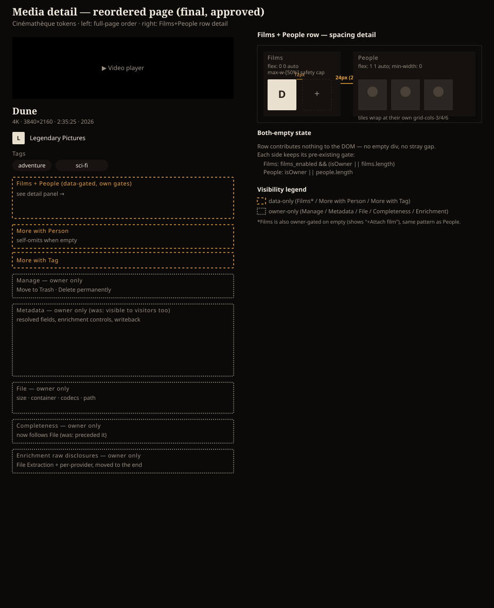

# Design handoff: Media detail page reorder

**Status:** Implemented (pending review)
**Phase:** Ad hoc UX request (no HOLODEX epic — visual reorder only, no new behavior surface)
**Owner:** Project owner
**Date:** 2026-08-30
**Spec:** none — pure reorder/re-gate of existing elements, no new functionality
**ADR:** none — no architectural change
**Branch/PR:** `claude/media-detail-reorder-c2d1ab` (not yet pushed)

## Overview

The owner supplied a drawio wireframe (`Holodex Mockup.drawio`, diagram "Media Detail") sketching
a new visual hierarchy for `web/src/routes/media/[id]/+page.svelte`. The wireframe was **for
ordering only** — no element's internal visual presentation changes. Four rounds of mockup
iteration (rendered via the visualization tool, not committed as intermediate files) resolved the
open questions the wireframe left implicit: where the player/title swap lands, whether a "Linked
Film" badge sits beside Studio (rejected — removed), and exactly how Films co-locates with People.



## Final order (top to bottom)

1. Video player
2. Title + resolution/duration/year meta line (**moved below the player** — previously above it)
3. Studio (alone — no adjacent Films badge)
4. Tags
5. **Films + People, one row** (see §1 below)
6. More with Person / More with Tag shelves
7. Manage (**moved much higher** — previously near the bottom, beside File/Completeness)
8. Metadata (**re-gated to owner-only** — see §2 below)
9. File (**moved above Completeness** — previously the reverse)
10. Completeness
11. Enrichment raw-data disclosures (**moved to the very end**)

## Visibility rules

| Element | Gate | Change |
|---|---|---|
| Films | `films_enabled && (isOwner \|\| films.length)` | unchanged (pre-existing) |
| People | `isOwner \|\| people.length` | unchanged (pre-existing) |
| More with Person / More with Tag | self-omit when the shelf has no items | unchanged |
| Manage | `isOwner` | unchanged gate, new position |
| File, Completeness, Enrichment | `isOwner` | unchanged gate, new position |
| **Metadata** | `isOwner` | **changed** — was `isOwner \|\| visibleResolved.length > 0 \|\| extraFields.length > 0` (visitors saw a filtered field subset); now strictly owner-only, matching every other data-management section on the page |

The Metadata re-gate was surfaced to and accepted by the project owner during mockup review: it
removes the one remaining visitor-visible "management" surface, making the visitor/owner split
consistent across the whole lower half of the page (visitors see Player → Title → Studio → Tags →
Films/People → More-with shelves and nothing else; owners additionally see Manage → Metadata →
File → Completeness → Enrichment).

### 1. Films + People row

Films and People render as two flex children of one row instead of two stacked full-width
sections, so Films can shrink-wrap to its content instead of claiming a full row for 1-2 tiles.
Each side keeps its own pre-existing visibility gate (table above) — the row itself is an `{#if
filmsVisible || peopleVisible}` wrapper contributing **zero DOM** when both are hidden (verified:
no stray wrapping `<div>` or gap appears for a visitor on a video with no film and no people).

```svelte
<div class="flex items-start gap-6">
	{#if filmsVisible}
		<section class="max-w-[50%] flex-none space-y-1.5">
			<!-- Films: same poster-tile chip shape as before, gap-3 (12px) between tiles -->
		</section>
	{/if}
	<div class="min-w-0 flex-1">
		<PeopleGrid ... />
	</div>
</div>
```

- **Films**: `flex: 0 0 auto` (shrink-wraps to its tiles) with a `max-w-[50%]` safety cap so a
  pathological many-films case can't push People fully out of the row — the mockup only asked for
  "don't force a fixed 50/50 split," not a specific behavior for an unbounded film count.
- **People**: `flex: 1 1 auto; min-width: 0` (fills whatever width Films doesn't use).
- **Spacing**: 12px between tiles within each side (`gap-3`, pre-existing), 24px between the two
  sides (`gap-6` on the row) — exactly 2× the tile gap, per explicit request ("twice the padding
  between people and films than what's found between people").
- Internal tile markup (poster, remove badge, "+Attach film" CTA, scene-number/full-film badge)
  is unchanged from the pre-reorder version — only the container went from CSS Grid
  (`grid grid-cols-3 sm:grid-cols-4 md:grid-cols-6`) to a flex-wrap row, adapting the shrink-wrap
  convention already used by `FilmsRow.svelte`.

### 2. Rejected during iteration

- **Linked Film badge beside Studio** — chosen in an earlier round, then explicitly reversed:
  "I changed my mind regarding FILMS: Remove the FILMS element located next to Studio." Studio
  now renders alone; Films lives only in the combined row (§1).

## Edge cases

- **Films + People both empty, visitor**: row omitted entirely (no DOM node).
- **Films + People both empty, owner**: row renders both empty-state CTAs ("+ Attach film",
  "+ Add person") since `isOwner` overrides emptiness independently on each side.
- **Many films attached**: Films caps at `max-w-[50%]` and its own tile list wraps/scrolls within
  that cap rather than displacing People.
- **Visitor on a video with no metadata-worthy fields**: previously saw an empty-looking filtered
  Metadata section; now sees no Metadata section at all (see gate table).

## Accessibility / interaction

No new interactive elements were introduced. Tab order follows the new DOM order (player → title
→ Studio → Tags → Films tiles → People tiles → More-with shelves → Manage → Metadata → File →
Completeness → Enrichment), matching the new visual order — no `tabindex` overrides needed.

## Theming

Only layout/spacing Tailwind utilities changed (`flex`, `gap-6`, `max-w-[50%]`, `flex-none`,
`min-w-0`, `flex-1`, `shrink-0`, `flex-wrap`) — no new color/token classes were added, so the
change is skin-invariant. QA'd via computed-style inspection (not screenshots, which time out on
this page after scrolling — see `docs/design/` conventions) across Cinémathèque, Broadcast, and
Brutalist: the 12px/24px spacing math holds identically in all three.
