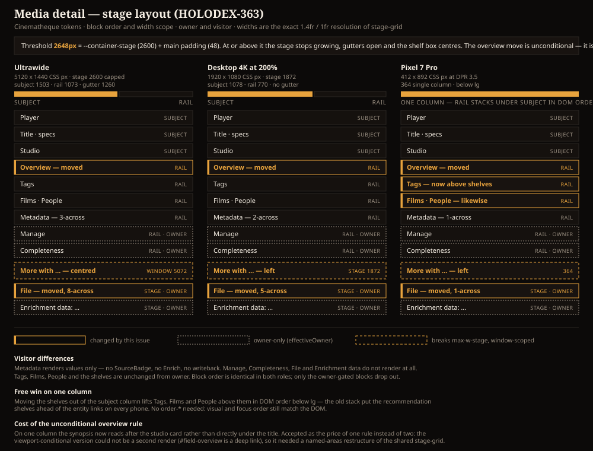

# Design handoff: Media detail stage layout

**Status:** Design approved — not yet implemented
**Phase:** HOLODEX-363 (Story) under epic HOLODEX-12 "Video detail page"
**Owner:** Project owner
**Date:** 2026-09-10
**Spec:** none — rearrangement and re-gating of existing elements; no new behavior surface
**ADR:** required (`needs-adr`) for the `stage-grid` named-areas restructure, see §5
**Branch/PR:** `HOLODEX-363-media-detail-stage-layout`

## Overview

Three layout decisions for `web/src/routes/media/[id]/+page.svelte`, arrived at from a
`/design-critique` of the page under the HOLODEX-342 stress fixture. The trigger was the
**visitor view**: the metadata rail is sized for an owner, and when the owner-only sections drop
out a visitor is left with Tags and People in a column built to hold six blocks — roughly 70%
empty, and at ultrawide that empty column is 1073px wide.

Two of the three decisions turn out to be viewport-conditional, and both key off the **same**
threshold, so it is named once rather than duplicated as two magic numbers.

## The threshold

**2648px** = `--container-stage` (2600) + `<main class="px-6">`'s 48px of padding.

- **Below it** the stage fills the window; there is no gutter. "Stage width" and "window width"
  are the same pixel, so any rule phrased as justification or breakout is a no-op.
- **At or above it** the stage stops growing, gutters open either side, the overview relocates to
  the rail, and the shelf centres.

Implement as one named thing — a custom media feature or a single `@media (width >= 2648px)`
block referenced by both rules. Do not hand-write `2648` twice.

## 1. File joins the enrichment group

`File` leaves the metadata rail and sits **directly above** the `Enrichment data:` disclosures at
the bottom of the page. It stays owner-only (`isOwner`, i.e. `activity.effectiveOwner`). The three
never separate: File, `Enrichment data: File Extraction`, then one `Enrichment data: <provider>`
block per provider — one audit group, in that order.

It sits **inside** `max-w-stage`, following the enrichment disclosures rather than going
window-scoped, so its `field-grid` resolves 8-across at 2600px. That is a much better home for the
`col-span-full truncate` `Path:` row than a 320px rail ever was.

Supersedes the "File moved above Completeness" point in
[`media-detail-reorder-handoff.md`](media-detail-reorder-handoff.md) — Completeness stays in the
rail, File does not.

## 2. More-with shelves break the width cap

Shelves span the window, not the stage. **Cards left-justified while the stage still fills the
window; the box centred once it does not.**

This is **not new CSS**. `.video-grid.stage-aligned` in `app.css` already encodes exactly this
rule (HOLODEX-331 §9.6):

| Declaration | Effect | The rule it delivers |
|---|---|---|
| `justify-content: start` | tracks pack left inside the box | left-justified under the cap |
| `min-width: min(var(--container-stage), 100%)` | box never narrower than the stage | short row still aligns to the player |
| `max-width: 100%` | box grows to the container | edge-to-edge for a long row |
| `margin-inline: auto` | box centred in its container | centred once it overhangs the stage |

Track maths live in `$lib/stageGrid` (`stageGridTracks` / `stageGridWidth`), pinned by
`stageGrid.test.ts`. One call site uses it today: the film detail page's Scenes grid, via
`VideoGrid`'s opt-in `stageAligned` prop. The behavioural rule and its traps are recorded in
[`web/src/lib/components/video/CLAUDE.md`](../../web/src/lib/components/video/CLAUDE.md) so it is
not re-decided per component.

### Two traps

1. **`RelatedShelf` is not a `VideoGrid`.** It is a `flex … overflow-x-auto` horizontal scroller
   with fixed-width cards (`w-32`/`w-52` per `data-layout`), borrowing the `.video-grid` class only
   to reset the Brutalist `reel` counter and inherit `data-layout` sizing. There is no
   `stageAligned` prop to pass — the class goes on directly, and `width: fit-content` against
   `overflow-x: auto` is **not** the same layout as against a grid. Verify live before assuming
   parity; if it does not hold, the shelf needs its own declaration rather than a shared class.
2. **Breaking the cap means leaving the article.** `max-width: 100%` resolves against the
   *container*, so a shelf inside `<article class="mx-auto max-w-stage">` caps at 2600 forever.
   The shelves must become **siblings** of that article, which also drops them out of its
   `space-y-6` rhythm — restate the vertical gap explicitly at the new call site.

### Free win: this fixes the one-column order

The shelves currently live in the subject column. Below `lg`, `stage-grid` collapses to one column
and the rail stacks under the subject in DOM order, so today a phone shows
`… studio → shelves → tags → films/people → metadata`. Moving the shelves to a sibling band
*after* the grid makes it `… studio → tags → films/people → metadata → shelves → file+enrichment`,
lifting the entity links above the recommendation shelves at no extra cost. Visual and focus order
still match the DOM — no `order-*` anywhere.

## 3. Visitor rail regains read-only field values

Reverses the owner-only re-gate of the Metadata section made in
[`media-detail-reorder-handoff.md`](media-detail-reorder-handoff.md) §2 (the comment at
`+page.svelte` reads "Owner-only (media-detail-reorder) — visitors previously saw a filtered
subset").

Visitors see the resolved field values again. They do **not** get:

- `SourceBadge` (the ADR-051 precedence chip row)
- the `Enrich` / `Refresh` / `Extract from filename` controls
- `Write decisions to file`
- `PromotedFieldEdit` or any `isReplaceField` edit affordance

They **do** get each value's `ProvenanceBadge`, consistent with the rest of the page. Follow the
idiom already used at the Tags, Studio and Overview blocks — `{#if isOwner || hasValue}` — rather
than a bare `{#if isOwner}`.

### And, above the threshold only: the overview moves into the rail

Above 2648px the overview relocates to the **top of the rail, above Tags**. Below it, the overview
stays where it is, under the header meta line in the subject column.

**Applies to owner and visitor both.** This was decided inside the visitor-rail question and could
have meant visitors only; it is drawn for both because branching the layout on viewport *and* role
gives four arrangements to QA instead of two, and the spare 1073px of rail is there either way.
Confirm before implementing — narrowing it to visitors is a small change to the placement rule,
not to the mechanism.

## 4. Measured tracks

`stage-grid` is `minmax(0, 1fr)` below `lg` (1024px) and
`minmax(0, 1.4fr) minmax(320px, 1fr)` at or above it, gap 24.

| Viewport | CSS px | Subject | Rail | Shelf | Metadata `field-grid` | File `field-grid` | Overview |
|---|---|---|---|---|---|---|---|
| Ultrawide 5120×1440 | 5120×1440 @100% | 1503 | 1073 | 5072, centred | 3-across | 8-across | **in rail** |
| Desktop 4K @200% | 1920×1080 | 1078 | 770 | 1872, left | 2-across | 5-across | in subject |
| Desktop 4K @150% | 2560×1440 | 1451 | 1037 | 2512, left | 3-across | 7-across | in subject |
| Pixel 7 Pro | 412×892 @DPR 3.5 | 364 (one col) | — | 364, left | 1-across | 1-across | in subject |

Gutter is 1260px each side at ultrawide and zero everywhere else in this table.
`field-grid` is `repeat(auto-fit, minmax(min(320px, 100%), 1fr))`; column counts above are
`floor((container − 32px of p-4) / 320)`.

## 5. Why this needs an ADR

The overview relocation **cannot be a second render**. `#field-overview` is a deep-link anchor, and
the codebase already guards this exact hazard for `#field-actors` ("rendered in exactly one branch
below, so the id is never duplicated"). Rendering the overview twice behind a media query would
duplicate the id and break the anchor.

So it has to be CSS *placement*: the two column wrapper `
`s become one flat grid with named
areas, and the overview block is placed into the rail column above the threshold. That restructures
`stage-grid`, which is **shared with the film detail page** — a cross-cutting change to a layout
primitive, which is the `/architecture` row of the change-routing table. The ADR should cover the
named-area contract, what the film page inherits, and whether the film page gets the same
overview behaviour or opts out.

## 6. States and edge cases

| Element | Case | Behavior |
|---|---|---|
| Metadata (visitor) | no resolved fields | section does not render at all — no empty heading |
| Metadata (visitor) | 1 field at ultrawide | one row, 3-across grid, two empty tracks; acceptable — do not special-case |
| Overview | absent | nothing renders in either position; Tags becomes the rail's first block |
| Overview | present, one line | no expand chevron (fixed in #319, `ExpandableText` gates on `clamps`) |
| Shelf | fewer cards than fill the stage | box pinned to stage by `min-width`, cards left-justified |
| Shelf | no items | `RelatedShelf` self-omits; the band renders nothing and contributes no gap |
| File / Enrichment | visitor | neither renders; the page ends after the shelf band |
| File | very long `file_path` | `col-span-full truncate` with `title` attribute, unchanged |

## 7. Accessibility

- **Focus order must continue to match visual order.** The one-column branch relies on DOM order,
  so the shelf band's new position is a focus-order change too — that is the intended improvement,
  not a regression.
- **The overview relocation must not change focus order relative to the visible layout.** With
  named-area placement the DOM order is fixed while the visual position moves, so above the
  threshold the overview will be reached in subject-column sequence while appearing in the rail.
  **This is the one real a11y risk in this change** — measure it, and if the divergence is material,
  prefer moving the whole rail earlier in the DOM over an `order-*` patch.
- No new interactive elements. The visitor Metadata list is non-interactive text plus
  `ProvenanceBadge`, so it adds no tab stops.

## 8. QA

Skin coverage per `.claude/rules/frontend-theming.md` — all three skins, no hardcoded styling.

### Setup

1.1 Seed the HOLODEX-342 stress fixture and open a video with 3+ resolved fields, 3 tags,
2 people, 1 studio and a sibling for the More-with shelf. `[smoke]`

### Smoke

2.1 Owner view, desktop: File no longer appears in the rail; it appears once, at the page bottom,
immediately above the first `Enrichment data:` disclosure. `[smoke]`
2.2 Visitor view, desktop: Metadata renders with values and `ProvenanceBadge`, and with no
`SourceBadge`, no `Enrich`, no `Refresh all`, no `Write decisions to file`. `[smoke]`
2.3 No horizontal page scroll at 320, 412, 768, 1024, 1920, 2560, 5120. `[smoke]`

### Agent

3.1 At 1920: shelf container width equals the stage width and its first card's left edge aligns
with the player's left edge (compare `getBoundingClientRect().left`). `[agent]`
3.2 At 5120 with few shelf cards: shelf box width equals 2600 and is centred in the window.
`[agent]`
3.3 At 5120 with many shelf cards: shelf box is wider than 2600, and its left and right overhang
past the stage edges are equal to within 1px. `[agent]`
3.4 At 5120: the overview's computed position is inside the rail column and above Tags; at 2560 it
is inside the subject column. `[agent]`
3.5 `#field-overview` appears exactly once in the DOM at every viewport. `[agent]`
3.6 Tab order from the player reaches Tags before the More-with shelves at 412px. `[agent]`
3.7 File's `field-grid` computes 8 columns at 5120 and 1 at 412. `[agent]`

### Human

4.1 Open a video page as owner on the ultrawide monitor. The synopsis should sit at the top of the
right-hand column, above the tag chips — not under the title. Nothing should look stranded in the
right column. `[human]`
4.2 On the same page, scroll to the bottom. The file details block and the collapsible
"Enrichment data" rows should read as one group, with nothing between them. `[human]`
4.3 Still on the ultrawide monitor, look at a "More with …" row that has only two or three
thumbnails. The row should start directly under the video, lined up with its left edge — not
drift to the middle of the screen. `[human]`
4.4 Find a video with many siblings so the row is long. It should now run wider than the rest of
the page, overhanging evenly on both sides. `[human]`
4.5 Sign out (or switch to visitor view) and reload. You should still see the field values —
year, runtime and so on — but no buttons for changing or fetching them. `[human]`
4.6 Repeat 4.1–4.5 in each of the three skins, then on the phone. On the phone the tags and people
should come before the "More with …" rows. `[human]`
