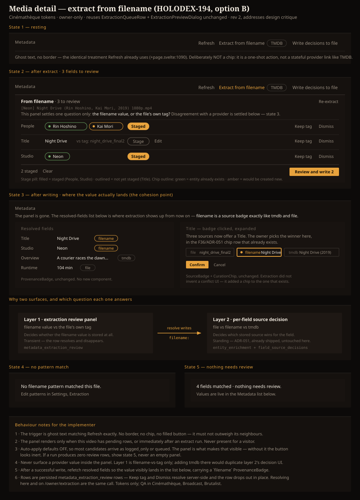

# Design Handoff: Extract from filename on the media detail page (F48.5a)

**Status**: Design decided (developer handoff)
**Date**: 2026-09-04
**Spec**: [metadata-extraction.md](../specs/metadata-extraction.md) §F48.5a / §F48.6i — §F48.6l
**ADR**: [ADR-067](../architecture/ADR-067-filename-extraction-confidence-and-rollback.md) (unchanged — no new decision)
**Jira**: [HOLODEX-194](https://whoiskevinrich.atlassian.net/browse/HOLODEX-194)
**Theming contract**: [ADR-021](../architecture/ADR-021-frontend-theming-and-skins.md) + [theming.md](theming.md) — **tokens only, QA all three skins.**
**Stack**: SvelteKit (Svelte 5 runes) + Tailwind v4 CSS-first (ADR-025).
**Extends**: [metadata-extraction-handoff.md](metadata-extraction-handoff.md), which scoped the F48 UI
to the `/owner` hub only. This handoff adds the second surface that spec §F48.5a always called for.

---

## Problem

Filename extraction is fully implemented end to end, but the owner can only *reach* it from
`/owner/extraction`. On the media detail page — where the owner is actually looking at the video
whose metadata is wrong — there is no way to run extraction and no way to see or resolve what it
found. `POST /media/{id}/extract` exists and is owner-gated
([`internal/api/extract.go:13`](../../internal/api/extract.go)); `api.extractVideo`
([`web/src/lib/api.ts:851`](../../web/src/lib/api.ts)) already wraps it and **has no callers**.
So the machinery is built and simply has no surface.

The gap is not only the missing trigger. Even with a trigger wired up, every decision would still
have to be made on a different page, because the review rows only render there.

## Goals

1. The owner can run filename extraction for one video **from that video's page**.
2. The owner can **resolve what it found without leaving the page** — same staging, same
   preview-before-write, same resolve call as the owner tab.
3. The owner tab remains the cross-library roll-up; a row resolved in either place disappears
   from both.
4. Every control is absent from the DOM for a visitor (`activity.effectiveOwner`, ADR-030).

## Non-goals

- **A dry-run preview that computes candidates without persisting.** `ExtractVideo`
  ([`internal/extract/orchestrate.go:54`](../../internal/extract/orchestrate.go)) writes the
  `filename` shadow provider and calls `Process` per field; a true dry run means splitting compute
  from commit and inventing an unpersisted candidate row shape. Deliberately deferred — the
  preview-before-*write* dialog (F48.7) already stands between staging and any file write, which is
  the protection that actually matters.
- **An always-on pending panel** that renders for any video with pending rows even when the owner
  never clicked extract. Considered and deferred; it changes what the owner tab is for, and is a
  strictly additive follow-up on top of this work.
- **Filename rewriting.** Unchanged non-goal from the F48 spec.
- **Any change to scoring, routing, thresholds, or the auto-apply flag.**

---

## The design

Four states, all inside the existing Metadata section
([`web/src/routes/media/[id]/+page.svelte:1086`](../../web/src/routes/media/[id]/+page.svelte)):

1. **Resting** — one new ghost button, "Extract from filename", in the actions row at
   `+page.svelte:1090`, between Refresh and `EnrichProviderChips`. Same treatment as its
   neighbours (`text-xs text-muted hover:text-accent focus-visible:text-accent`); it is not a
   primary action and must not read as one.
2. **After extract, rows to review** — an inline panel below the actions row, headed
   `From filename · N to review`, with the source filename in mono beneath it, one
   `ExtractionQueueRow` per pending field, and the same staged-count + "Review and write N"
   commit bar the owner tab uses.
3. **No pattern match** — a single line, plus a pointer to where patterns are edited. Not an error.
4. **Nothing needs review** — the run matched fields but produced no pending rows. Say so and
   point at the Metadata list; never render an empty panel with a zero count.

### Why the panel is not optional

Auto-apply defaults **off** ([`cmd/holodex/main.go:337`](../../cmd/holodex/main.go)), so in the
default configuration essentially every candidate resolves to `logged_only` or `queued`. A trigger
button *without* the inline panel would therefore present the owner with a control that, from where
they are standing, does nothing at all: they click, the page does not change, and the outcome is on
a page they were not looking at. State 2 is what makes the button honest. If this ships in pieces,
the button and the panel go in the same piece.

---

## Reuse map (don't build from scratch)

| Need | Reuse from | Notes |
|---|---|---|
| Per-field review row | `components/extraction/ExtractionQueueRow.svelte` | **Unchanged.** Fully prop-driven (`row`, `fieldLabel`, `isEntityField`, `staged`, `onstage`, `onunstage`, `resolveTag`, `dismiss`, `onhandled`). Typed against a persisted row, which is what we have. |
| Preview before write | `components/extraction/ExtractionPreviewDialog.svelte` | **Unchanged.** Zero owner-page coupling — no `api` import, no store access; the write call arrives as the `resolve` prop. |
| Entity chip swap | `components/entity/EntityPickerDialog.svelte` | Reached through `ExtractionQueueRow`; nothing new to wire. |
| Staging state, grouping, commit bar | `routes/owner/extraction/+page.svelte:66-89` | Lift the `staged` map + `ExtractionPreviewItem` construction into a small shared module rather than copying it; the owner tab keeps using it too. |
| Field-key → label map | `routes/owner/extraction/+page.svelte:45` | Same `people`/`actors` bridge applies here. Move it alongside the staging helper. |
| Owner gate | `activity.effectiveOwner` (`+page.svelte:156`) | Same `isOwner` already in scope on this page. |

**Net new component files: none required.** The page gains one button, one panel wrapper, and a
shared staging helper extracted from the owner tab. Introduce no new tokens.

## Backend change

One parameter, one handler:

- `GET /owner/extraction-queue` gains an optional `?video_id=` filter
  ([`internal/api/extract_review.go:27`](../../internal/api/extract_review.go)). Without it the
  media page would fetch the entire library's pending rows to display three. Owner-gated exactly as
  today; no new route, no new table, no change to resolve or dismiss.

`POST /media/{id}/extract` is used as-is.

## Interaction detail

- **Extract** disables the button and shows `Extracting…` while in flight, then refetches the
  filtered queue and renders State 2, 3, or 4 from the `ExtractionResult` (`matched`, per-field
  `outcome`) plus the returned rows.
- **Re-extract** in the panel header repeats the run. Per the partial unique index
  `ux_extraction_review_pending(video_id, field_key)`, a re-run updates pending rows in place —
  it never duplicates them, and it does resurface previously dismissed fields (F48.4d).
- **Stage / unstage** is client-only, exactly as on the owner tab. Nothing is written until
  "Review and write N".
- **Keep tag** and **Dismiss** resolve server-side immediately and the row drops out of the panel
  without a refetch, matching the F43/F47 pattern.
- After a successful write, refetch the page's resolved fields so the Metadata list below reflects
  the new values in the same interaction.

## Accessibility

- The panel is a `<section>` with an accessible name tied to its `From filename` heading.
- Row keyboard behaviour is inherited from `ExtractionQueueRow` (roving tabindex, F48.6e) — do not
  re-implement it.
- `ExtractionPreviewDialog` already traps focus and returns it on close; opening it from this page
  must return focus to the "Review and write N" button.
- The result of an extract run is announced via a polite live region, so a screen-reader user
  learns the outcome without discovering the panel by traversal.

## QA

See [media-page-extraction-qa-checklist.md](media-page-extraction-qa-checklist.md) — numbered,
tagged by verifier, all three skins.
