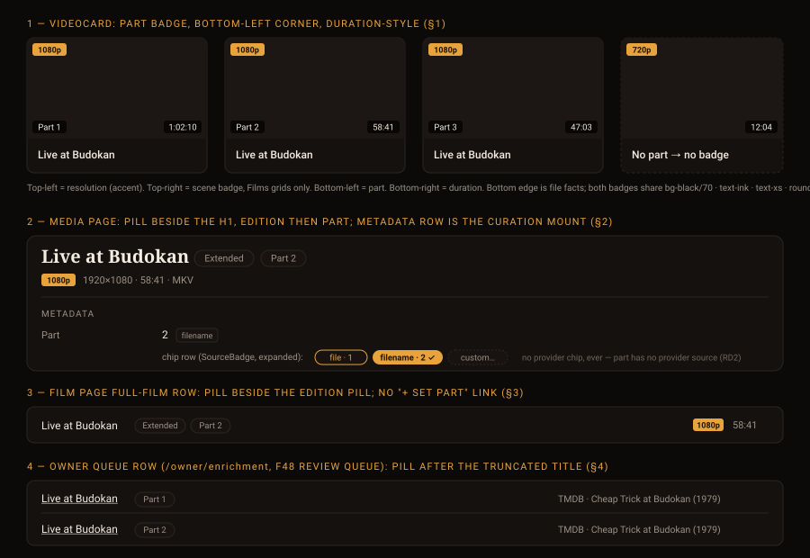

# Design handoff — Media parts (`part` badge and pill)

**Status:** Ratified 2026-09-16 — card slot = A (bottom-left, duration-style); wording = "Part N" everywhere
**Story:** [HOLODEX-389](https://whoiskevinrich.atlassian.net/browse/HOLODEX-389)
**Owner:** Kevin Rich
**Date:** 2026-09-16
**Spec:** [media-parts.md](../specs/media-parts.md) (RD1–RD10; this document resolves RD9 and OQ3)
**Builds on:** [entity-identity-card-handoff.md](entity-identity-card-handoff.md) §2–§3 (F60 —
the edition pill, the "+ Set edition" empty row, `SourceBadge` for a single-source field) ·
[film-enrichment-handoff.md](film-enrichment-handoff.md) (scene badge on `VideoCard`)
**Theming contract:** [ADR-021](../architecture/ADR-021-frontend-theming-and-skins.md) +
[theming.md](theming.md) — tokens only, QA all three skins.



## Overview

`part` is a file fact — *which slice of one media this file is* — that has to survive provider
enrichment on every surface where three files of one concert would otherwise look identical. It
is rendered as a **value, never an affordance** ([value vs. affordance](../reference/ui-vocabulary.md#content-and-chrome)):
the badge and the pill are read-only on every surface, for owner and visitor alike; the one
place the owner changes it is the media page's Metadata row through `SourceBadge`, exactly as
edition. Nothing in this handoff adds a control.

Two things the grounded component changed from the brainstorm sketch:

- **The poster has one free corner.** `VideoCard` already spends top-left on the resolution
  bucket (accent), top-right on the Films-only scene badge, bottom-right on the duration.
  The part badge takes **bottom-left**, and copies the duration badge's neutral treatment so
  the bottom edge reads as "file facts" while the top edge stays "classification". A pill
  beside the title was rejected: the h3 is `line-clamp-2`, so the pill would be clipped or
  wrap under a two-line title and grow the card. A new meta line was rejected: the card has
  none, and only cards with a part would get one.
- **One label, one helper.** "Part 2" on every surface — card, media header, film list, queue
  row — through a `partBadgeLabel(part)` helper beside `sceneBadgeLabel`, for the same reason
  that helper exists: two surfaces that show one fact must read identically. The abbreviated
  "Pt 2" was measured against the 16-column ultrawide tier and not needed.

## 1. Browse / search cards — `VideoCard.svelte`

### 1a. Placement and treatment

Inside `.video-frame`, a sibling of the duration badge:

```svelte
{#if video.part}
	<span class="absolute bottom-1.5 left-1.5 z-[2] rounded-theme bg-black/70 px-1.5 py-0.5 text-xs text-ink">
		{partBadgeLabel(video.part)}
	</span>
{/if}
```

| Property | Value | Why |
|---|---|---|
| Anchor | `absolute bottom-1.5 left-1.5 z-[2]` | the free corner; same inset and z-order as the duration badge |
| Surface / ink | `bg-black/70 text-ink` | identical to duration — neutral, not accent: accent is already the resolution bucket top-left and two accent badges on one poster would fight |
| Type | `text-xs`, no `tabular-nums` (the label is a word + one number) | matches duration's size so the two badges align on the bottom edge |
| Radius | `rounded-theme` | skin-driven, as every badge |
| Height impact | none | the badge is inside the fixed-aspect frame; `p-3` title block untouched |

The badge is inside the `<a>` like the duration badge — it is not interactive, so nesting is
fine and a click on it navigates like the rest of the card. It does **not** get the
`pointer-events-none` / `svelte:element` treatment the scene badge needs, because there is no
owner edit affordance here (RD8: the media page row is the only mount).

### 1b. Coexistence

| Case | Rendering |
|---|---|
| Part + duration (the normal case) | bottom-left "Part 2", bottom-right "58:41"; at the 16-column tier the card is ~150px wide and the two badges (~44px + ~38px + 2×6px inset) leave ≥ 50px between them — no collision |
| Part + scene badge (Films scenes grid, a scene that is also a part) | four corners in use, all four badges visible; nothing overlaps because each owns a corner |
| Part + thumbnail still generating (`thumb-shimmer`) | badge renders over the shimmer, same as duration does today |
| Part + hover play glyph | glyph is `z-[1]`, badges `z-[2]` — the badge stays readable under hover, same as duration |
| No part | nothing rendered; the corner stays empty (most files — RD7 `optional`) |

### 1c. Data

`Video` (`web/src/lib/types`) gains `part?: number | string` — the resolved value the summary
payload carries (spec §API). No resolution on the client; `VideoCard` renders what it is given.
The badge label is whatever `partBadgeLabel` returns; a hand-curated non-integer (RD8: no
validation) renders verbatim after the "Part " prefix.

## 2. Media page — header pill + Metadata row

### 2a. Header pill (`routes/media/[id]/+page.svelte`)

Same slot, same class, same read-only rule as the edition pill (F60 handoff §2, as built):

```svelte
{#if editionValue}<span class="…edition pill…">{editionValue}</span>{/if}
{#if partValue}<span class="inline-block max-w-full shrink-0 wrap-anywhere rounded-full border border-rule bg-surface px-2 py-0.5 text-xs text-muted">{partBadgeLabel(partValue)}</span>{/if}
```

- **Order: edition first, part second** — "which cut" then "which slice"; a reader parses
  `Live at Budokan · Extended · Part 2` as a narrowing. Both pills sit in the header's existing
  `flex-wrap` title row and wrap together under a long title (HOLODEX-356 guards already apply:
  `shrink-0` + `wrap-anywhere`).
- `partValue` is derived exactly as `editionValue`
  (`resolved.find(f => f.canonical === 'part')?.values[0]?.trim() ?? ''`).
- Visitor and owner render the same pill (parity); no pencil, no badge, no link.

### 2b. Metadata row — the curation mount

Nothing new to build: the generic field row renders `Part` because it is a canonical field;
`SourceBadge` renders its badge for a single-source field (F60 RD12) and offers the custom
chip. Chip row contents, in precedence order for the library:

| Chip | Present when | Label |
|---|---|---|
| `file` | container tag `PartNumber` / `DiskNumber` read | `file · 1` |
| `filename` | `{part-N}` marker adopted via F48 | `filename · 2` |
| `custom` | always (RD8) | free text, no validation |

There is **never a provider chip** — the mapping loader rejects a `<provider>:part` source (spec
RD2). If one appears in QA, that is a mapping bug, not a UI state.

**Empty + owner:** the "+ Set part" empty curatable row — the F60 found-in-build mechanism
(`curatable` plain-text replace fields, rendered from the completeness facet). Declaring `part`
as an `optional` facet is what makes the row exist; the deep link `/media/{id}#field-part`
lands with the badge auto-expanded, like `#field-edition`. **Empty + visitor:** no row (the
resolver drops empty undecided fields; the facet-driven empty row is owner-only).

## 3. Film page — full-film rows (`routes/films/[id]/+page.svelte`)

Beside the edition pill, in the same `flex-wrap` span, same `text-[10px]` pill:

```svelte
{#if fv.edition}<span class="…edition pill…">{fv.edition}</span>{:else if isOwner}<a …>+ Set edition</a>{/if}
{#if fv.part}<span class="inline-block max-w-full shrink-0 wrap-anywhere rounded-full border border-rule bg-surface px-1.5 py-0.5 text-[10px] text-muted">{partBadgeLabel(fv.part)}</span>{/if}
```

- **No "+ Set part" link on the film page.** RD11 gave edition that link because most full-film
  files *should* carry an edition once the owner curates them. Most files have no part and
  never will; a dashed link on every row would be chrome for a rare fact. Part is set from the
  media page (§2b). This is the one deliberate asymmetry with edition.
- `fv.part` rides the same payload extension as `fv.edition` (the film-videos summary).
- Order within the row: title · edition pill · part pill · resolution badge · duration —
  matching the header's edition-then-part reading.

## 4. Owner queue rows

`EnrichQueueRow.svelte` (`/owner/enrichment`) and the F48 review-queue row both name the video
with a truncating link (`<a class="truncate">{row.name}</a>`). Add the pill as a `shrink-0`
sibling immediately after the link, wrapped with it in a `flex min-w-0 items-center gap-2`
span so the title truncates and the pill never does:

```svelte
<span class="flex min-w-0 items-center gap-2">
	<a {href} class="min-w-0 truncate text-ink hover:underline" title={row.name}>{row.name}</a>
	{#if row.part}<span class="shrink-0 rounded-full border border-rule bg-surface px-1.5 py-0.5 text-[10px] text-muted">{partBadgeLabel(row.part)}</span>{/if}
</span>
```

**Backend note:** the enrichment queue rows are built from `SELECT id, title FROM videos`
(`internal/repo/enrich_queue.go:124`); the row payload needs the resolved `part` added, same
path the video summary uses. Without it the pill has nothing to render and the queue keeps
showing an identical triplet — this is the surface most likely to be forgotten (spec P0, last
bullet).

## 5. Shared helper — `partBadgeLabel`

`web/src/lib/components/video/partBadge.ts` (sibling of `film/sceneNumber.ts`; lives in
`video/` because the card is its first consumer and the fact is a video's):

```ts
// partBadgeLabel is the part badge's vocabulary, shared by VideoCard, the media header,
// the film full-film row and the owner queue rows — one fact, one reading (cf. sceneBadgeLabel).
export function partBadgeLabel(part: number | string): string {
	return `Part ${String(part).trim()}`;
}
```

No pluralisation, no "of N" (RD1), no abbreviation (OQ3 resolved: long form everywhere).

## 6. Out of scope / no new surface

- Search result cards: `VideoCard` reuse — nothing to build, listed in QA (§8) so it is
  verified rather than assumed.
- Sort tiebreak (spec P1, OQ2): no UI; if it lands, the only visible effect is order.
- Writeback dialog: `part` appears in `WritebackFormDialog`'s field list because `formatMap`
  has it — the dialog is generic.
- Film page scenes grid: the scene badge and the part badge coexist (§1b); no rule change.

## 7. Accessibility

- The badge and pills are plain text in a `<span>` — read by screen readers as "Part 2" inline
  with the title / card link text. No `aria-label`: the visible text *is* the label.
- Card badge sits inside the card's `<a>`, so it is part of the link's accessible name
  ("Live at Budokan … Part 2 … 58:41") — this is desirable: the accessible name now
  distinguishes the three cards, which it did not before.
- No new focus stops anywhere (nothing interactive was added). The Metadata row's custom chip
  keeps `SourceBadge`'s existing keyboard behaviour.
- Contrast: card badge is the duration badge's pairing (`text-ink` on `bg-black/70`), already
  QA'd across skins; pills are the edition pill's pairing (`text-muted` on `bg-surface` with
  `border-rule`), already QA'd in F60.

## 8. Theming

Tokens only — nothing in §1–§5 introduces a literal value: `bg-black/70` is the duration badge's
existing overlay (an opacity over the poster, not a palette colour), `text-ink`, `text-muted`,
`bg-surface`, `border-rule`, `rounded-theme`, `rounded-full` (intentional pill shape). Skin
flourishes on `.video-frame` (letterbox, scanlines, Brutalist index counter) sit at `z-index: 1`;
the badge is `z-[2]` like duration, so it renders above them in every skin. **Brutalist** puts a
reel counter on the frame — verify in QA that it does not occupy the bottom-left corner (it is
the one skin most likely to collide; the duration badge's history is the precedent).

## 9. QA checklist (3-skin)

### §1 Setup

- 1.1 `[smoke]` Fixture: three MKV files named `… {part-1}.mkv`, `{part-2}`, `{part-3}` plus one
  `{edition-Extended} {part-2}` and one with a container `PART_NUMBER=1` and no marker; rescan.
- 1.2 `[smoke]` One MP4 with `disk` = 2, one MP4 with `disk` = "2 of 3" (foreign), no marker.
- 1.3 `[agent]` Enrich all three parts with the same provider candidate; confirm `part` is
  unchanged on each (spec P0 triplet invariance).

### §2 Smoke — automated

- 2.1 `[smoke]` `partBadgeLabel(2) === 'Part 2'`, `partBadgeLabel(' 02 ') === 'Part 02'` (no
  normalisation in the label — that is the lifter's job).
- 2.2 `[smoke]` `VideoCard` renders the badge when `video.part` is set and nothing when unset;
  the badge is inside the `<a>`; no `button` role appears.
- 2.3 `[smoke]` Media header renders edition pill before part pill when both exist.
- 2.4 `[smoke]` Queue row renders the pill as a `shrink-0` sibling of the truncating link.

### §3 Agent live QA (computed style via `javascript_tool` — screenshots time out on this app; see [theming.md](theming.md))

- 3.1 `[agent]` For each skin (Cinémathèque, Broadcast, Brutalist): on the browse grid at the
  8-column tier, `getBoundingClientRect()` of the part badge and the duration badge on one card
  do not intersect, and the part badge's left edge ≥ the frame's left edge + 6px.
- 3.2 `[agent]` Same at the 16-column ultrawide tier (set density to max, viewport ≥ 2648px).
- 3.3 `[agent]` Brutalist: the `.video-frame` reel counter's rect does not intersect the part
  badge's rect.
- 3.4 `[agent]` Film page scenes grid with a scene that has a part: four badges, four distinct
  rects, none intersecting.
- 3.5 `[agent]` Media header at 375px viewport with the long fixture title: pills wrap below the
  title, no horizontal overflow (`document.documentElement.scrollWidth === clientWidth`).
- 3.6 `[agent]` Contrast: computed `color` / `background-color` of the card badge ≥ 4.5:1 in
  all three skins (it is the duration pairing — should match its numbers).
- 3.7 `[agent]` Visitor mode: pill present on card, header, film row, no `#field-part` link, no
  custom chip reachable.

### §4 Human

Navigate to the browse grid (home page) with the §1 fixture scanned and the skin picker in the
header.

- 4.1 `[human]` The three "Live at Budokan" cards each show "Part 1/2/3" in the poster's
  bottom-left corner, in the same small dark chip style as the running time in the
  bottom-right. It should read as a pair of facts along the bottom edge, not as a second
  coloured badge competing with the resolution chip in the top-left. Switch skins: the chip
  should stay readable on all three, and on Brutalist it must not sit on top of the reel
  counter.
- 4.2 `[human]` Open Part 2. Beside the title you see two small rounded pills, "Extended" then
  "Part 2", in that order, in the muted text colour. They are not clickable. Scroll to
  Metadata → Part: the row shows "2" with a "filename" provenance tag; clicking the row opens
  the chip row with a file chip, a filename chip, and a custom entry — and no provider chip.
- 4.3 `[human]` Open a video with no part as the owner: the Metadata section shows an empty
  "Part" row you can type into ("+ Set part" style). As a visitor the row is absent.
- 4.4 `[human]` Open the film these are attached to: each full-film row shows the title, then
  the edition pill (if any), then "Part N", then the resolution chip and running time. There is
  no "+ Set part" link on rows without a part (there *is* a "+ Set edition" — that asymmetry is
  intended).
- 4.5 `[human]` Open Owner → Enrichment: the three queue rows read "Live at Budokan · Part 1",
  "· Part 2", "· Part 3". Narrow the window: the title truncates with an ellipsis and the pill
  stays whole.
- 4.6 `[human]` Search for "Budokan": the result cards carry the same corner badge as the browse
  grid.
