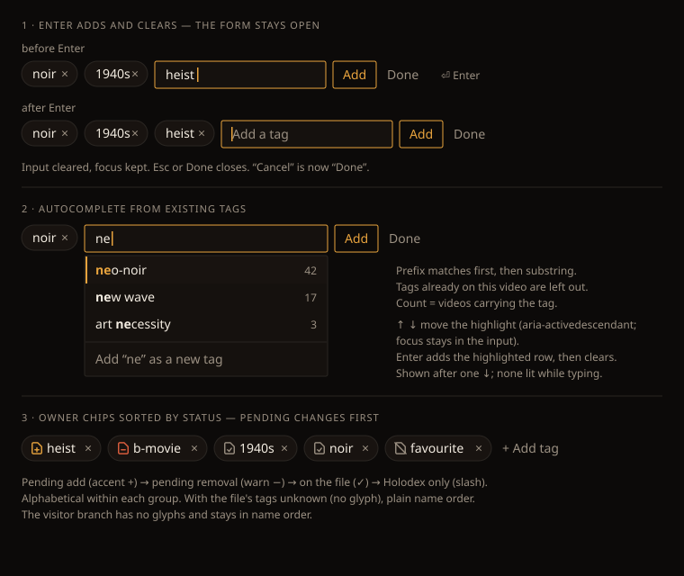

# Design handoff: Media page tag input (Enter, autocomplete, status sort)

**Status:** Approved (owner, 2026-10-03)
**Story:** [HOLODEX-519](https://whoiskevinrich.atlassian.net/browse/HOLODEX-519)
**Owner:** Project owner
**Date:** 2026-10-03
**Branch:** `HOLODEX-519-media-tag-input`
**Related:** [tag-link-chip-handoff.md](tag-link-chip-handoff.md) (the chip),
[tag-set-writeback-handoff.md](tag-set-writeback-handoff.md) (the on-file glyph this sort keys on)

## Overview

Owner mode, media detail page (`web/src/routes/media/[id]/+page.svelte`), the Tags block in the
rail. Three changes, all owner-only. The visitor branch is untouched.

1. **Enter adds and clears.** Today a successful add calls `closeTagAdd()`, so every tag costs
   another click on `+ Add tag`. Tagging a video is usually several tags in a row, so the form
   should stay open.
2. **Autocomplete for existing tags.** Typing a tag that already exists today means remembering
   its exact spelling. The near-miss nudge catches look-alikes only *after* the attach. Offering
   the existing tags while typing heads that off.
3. **Owner chips sorted by status.** The on-file glyph (HOLODEX-401) says what the next writeback
   will do to each tag. Sorting puts those pending changes first, so the owner can see them at a
   glance.

## Decisions (owner, 2026-10-03)

| # | Decision | Alternatives rejected |
|---|---|---|
| D1 | Enter adds, clears the input, keeps focus; Esc or **Done** closes | Close after every add (today) |
| D2 | The secondary button is renamed **Cancel → Done** | Keep "Cancel". After the first add there is nothing to cancel |
| D3 | Autocomplete is a combobox using **`aria-activedescendant`** | Roving tabindex, the codebase's listbox default (`EnrichPicker`, `SearchResultsPanel`). That moves DOM focus out of the input, so typing would stop working mid-list. This is an approved exception, limited to text-input comboboxes |
| D4 | Sort order **A: pending changes first**: pending add → pending removal → on the file → Holodex only | B: on-file first, reading like the file with changes trailing |
| D5 | Alias matching is **out of scope** | Matching on `aliases` with a "via *alias*" hint, a possible follow-up |

## Components

| Component | Change |
|---|---|
| `entity/TagAddInput.svelte` (**new**) | The input, the listbox, and their keyboard handling. Props: `value` (bindable), `busy`, `exclude: Set<number>` (tag ids already on the video), `onadd(name: string)`, `onclose()`. Exposes `focus()`. Fetches `api.listTags()` once on mount. It knows nothing about the video, near-miss, or errors; the page keeps those. Add it to `entity/CLAUDE.md`'s table. |
| `media/[id]/+page.svelte` | Mounts `TagAddInput` in place of the bare `<input>`. `submitTagAdd` takes a name instead of a `SubmitEvent`. On success it clears `tagAddValue` and keeps the form open (D1). Sorts the owner chip list (D4). |
| `lib/tags.ts` (or the nearest existing tag helper module) | Pure `tagStatusRank(tag)` and `sortTagsByStatus(tags)`, kept outside the page so they can be unit-tested |
| `TagLinkChip.svelte` | No change. The glyph logic stays where it is; the sort uses the same `written` × `on_file` fields |

## Layout

The form keeps today's inline row: `inline-flex items-center gap-2` inside the chips'
`flex flex-wrap items-center gap-2`. The input keeps today's classes: `rounded-theme border
border-rule bg-surface px-3 py-1.5 text-sm text-ink focus:border-accent focus:outline-none`.

The listbox is absolutely positioned under the input (`absolute left-0 top-full mt-1 z-20`).
It is the input's width, with a `min-w-[16rem]` floor so counts don't crowd short names.
It shows at most **8** rows and the list itself scrolls (`max-h-72 overflow-y-auto`). It opens
over the content below and never pushes the near-miss card or the error line.

## Design tokens used

| Token / class | Usage |
|---|---|
| `bg-surface`, `border-rule`, `rounded-theme` | Listbox container (same surface as the input) |
| `bg-surface-2` + `shadow-[inset_2px_0_0_var(--accent)]`, or a left `border-accent` bar | Highlighted row. Reuse whatever highlight `EnrichPicker` / `CategoryPicker` already render, rather than inventing one |
| `text-ink`, `text-sm` | Row name |
| `text-accent font-semibold` on the highlighted row, `font-semibold` on the others | The matched substring |
| `text-muted text-xs`, right-aligned, `tabular-nums` | Video count |
| `text-muted`, top `border-rule` | The "Add “x” as a new tag" row |
| `btn-accent` / `btn-quiet` | Add / Done buttons (unchanged classes; only the Done label changes) |

No new tokens, no hardcoded colours.

## States and interactions

### Input and form (D1, D2)

| Trigger | Behavior |
|---|---|
| `+ Add tag` | Opens the form with focus in the input (unchanged) |
| Enter, nothing highlighted, text not blank | `onadd(trimmed text)` |
| Enter, a row highlighted | `onadd(row's tag name)` (or the typed text for the "Add as new" row) |
| Enter, blank input | Nothing (unchanged) |
| Add button | Same as Enter with nothing highlighted |
| Add succeeds | `tagAddValue = ''`, listbox closes, **focus stays in the input**, form stays open |
| Add fails (422 deny-list, network, 5xx) | Text **kept** in the input so it can be corrected. `tagError` shows below the row as today |
| Busy (`tagBusy`) | Input stays editable. Enter and Add are ignored (the `runTagAction` guard). The Add button shows its disabled treatment as today |
| Esc, listbox open | Closes the listbox only; the text stays |
| Esc, listbox closed | Closes the form (`closeTagAdd`) and returns focus to `+ Add tag` |
| Done | `closeTagAdd()`, focus returns to `+ Add tag` |

**Near-miss nudge.** It still fires after an attach, but the form now stays open in every case.
A later add (or Done) replaces it: `tagNearMiss`/`tagJustAdded` reset at the start of each add,
not only in `resetTagForm`. "Use that instead" swaps the tags and clears the nudge, but **must not
clear `tagAddValue`**: the owner may already be typing the next tag. So `useTagNearMiss` stops
calling `closeTagAdd()` and resets only the nudge state.

### Autocomplete (D3)

| Aspect | Rule |
|---|---|
| Source | `api.listTags()` (name order), fetched once when `TagAddInput` mounts and held for the form's lifetime. A tag created by an add is appended locally, so it is suggestable straight away |
| When it shows | Input focused and the trimmed text is at least 1 character long |
| Matching | Case-insensitive. Prefix matches first (name order), then substring matches (name order). Tags in `exclude` (already on this video) are left out |
| Cap | First 8 matches |
| "Add “x” as a new tag" row | Last row, shown only when no existing tag's name equals the typed text exactly. With no matches it is the only row |
| Initial highlight | **None.** Typing never pre-selects a row, so Enter on a new tag adds what was typed |
| ↓ / ↑ | Move the highlight, wrapping. ↓ from none goes to the first row; ↑ from none goes to the last |
| Pointer | Hovering a row highlights it. A click adds that row; `mousedown` + `preventDefault` keeps focus in the input |
| Typing after a highlight | Clears the highlight (the list is re-filtered) |
| Blur | Closes the listbox; the text stays |
| Fetch failure | No listbox. The input works exactly as without autocomplete. No error is shown, because autocomplete is an aid, not the control |
| Fetch in flight | No listbox and no spinner until it lands (one small request, made on open) |

### Status sort (D4)

Rank from the chip's existing fields (the same truth table as `TagLinkChip`'s glyph):

| Rank | Status | `written` | `on_file` | Glyph |
|---|---|---|---|---|
| 0 | Pending add | `true` | `false` | accent + |
| 1 | Pending removal | `false` | `true` | warn − |
| 2 | On the file | `true` | `true` | muted ✓ |
| 3 | Holodex only | `false` | `false` | muted slash |
| 3 | Unknown (`on_file` or `written` undefined) | — | — | none |

Name order (`localeCompare`) within a rank, and stable. With the file's tags unknown, every chip
is rank 3, so the list is plain name order: the sort never invents an order it can't show. The
sort is applied **only in the owner branch** (`isOwner`). Visitors see no glyphs, and a status
order with no visible status would look random. A chip moves to its new group when the detail
reload lands after an add or remove. There is no animation.

## Responsive behavior

| Breakpoint | Changes |
|---|---|
| ≥ `lg` (rail beside the subject) | As drawn |
| < `lg` (rail stacked under the subject) | Same row; the form wraps under the chips as today. The listbox keeps its `min-w-[16rem]` but is clamped to `max-w-[calc(100vw-2rem)]` so it never causes horizontal scroll at 375px |

## Edge cases

- **Hundreds or thousands of tags.** Filtering is in memory and capped at 8 rows. One `listTags`
  payload per form open is fine at the library's scale. If it ever isn't, the fix is a server
  `?q=`, not a client change.
- **Every match already on the video.** Only the "Add as new" row shows. If the typed text
  exactly equals a tag already on the video, no row shows and Enter re-adds it, which is
  idempotent server-side as today.
- **Long tag names.** Rows `truncate` the name (`min-w-0 flex-1`); the count never wraps.
- **Deny-listed text.** Suggestions come from existing tags, so they are never denied. Typing a
  denied term and pressing Enter shows today's `'x' is on the deny-list.` error and keeps the text.
- **Whitespace and case.** The query is trimmed. Tags are always lowercase (house rule), so
  matching is case-insensitive and the added name is whatever the server normalizes it to.

## Accessibility

- The input takes `role="combobox"`, `aria-autocomplete="list"`, `aria-expanded`,
  `aria-controls={listId}`, and `aria-activedescendant={highlightedId}` (omitted when nothing is
  highlighted). It keeps `aria-label="Add a tag"`.
- The listbox is a `<ul role="listbox" aria-label="Existing tags">`. Rows are
  `<li role="option" id=… aria-selected>`, and are **not** focusable (no `tabindex`): that is
  D3's point.
- The count is in the option's accessible name: "neo-noir, 42 videos".
- After a successful add, a polite live region announces "Added heist". The cleared input alone
  would otherwise announce nothing.
- Focus order: chips (each link, then its ×) → input → Add → Done. The listbox is not a tab stop.
- **Recording the exception:** add a line to `web/src/lib/components/entity/CLAUDE.md` saying
  that text-input comboboxes use `aria-activedescendant` and option-list pickers use roving
  tabindex, and why. Otherwise the next session "fixes" it back.

## Animation / motion

None. The listbox appears and disappears instantly, the same as the existing pickers.

## Testing hooks (for `/testing-strategy`)

- Unit: `sortTagsByStatus`, covering all four ranks, unknown status, name order within a rank,
  and stability.
- Unit or component: the combobox filter (prefix before substring, `exclude`, cap, exact-match
  hiding "Add as new", no initial highlight).
- Component or e2e: Enter → input empty and still focused; 422 → text kept; Esc twice → form
  closed and focus on `+ Add tag`; "Use that instead" doesn't wipe typing in progress.
