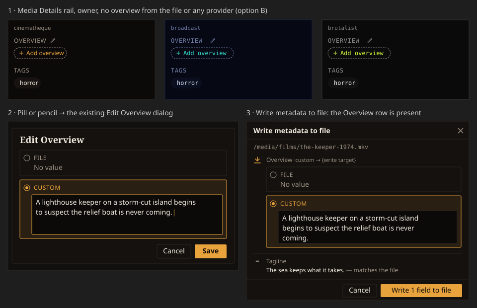
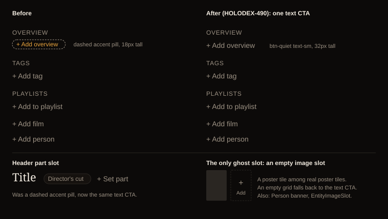

# Design Handoff: Add an Overview when no source has one (HOLODEX-471)

**Spec**: [field-source-of-truth.md](../specs/field-source-of-truth.md) P1-5 (F36) · **Architecture**: [ADR-113](../architecture/ADR-113-owner-offered-empty-fields.md)
(owner-offered empty fields; this handoff is its first adopter) ·
**Theming contract**: [ADR-021](../architecture/ADR-021-frontend-theming-and-skins.md) +
[theming.md](theming.md): tokens only, QA all three skins.
**Surfaces**: `routes/media/[id]/+page.svelte` (the Overview block in the rail), the existing
`curation/SourceEditModal.svelte` (initial selection only), and the existing
`writeback/WritebackFormDialog.svelte` (no change: it gains the row because the field now exists).
No new component. Backend (ADR-113): `resolver.Options.Offer`, a registry `OfferWhenEmpty` flag set on
`overview`, and `getMedia` passing `Offer` only for the owner, before `markWriteTargets`.
**Mockup**: 
**Jira**: [HOLODEX-471](https://whoiskevinrich.atlassian.net/browse/HOLODEX-471) (story) · related
[HOLODEX-304](https://whoiskevinrich.atlassian.net/browse/HOLODEX-304) (the general resolver change)

---

## Problem

When neither the file nor any enrichment provider supplies an `overview`, the resolver leaves the
empty, undecided field out of `resolved[]`. The page gates the Overview block on `overviewField`, so
the whole block, pencil included, disappears for the owner. The Write metadata to file dialog lists
`resolved`, so it has no Overview row either. The editor the owner needs already exists
(`SourceEditModal`'s **Custom** textarea, "Write a custom overview…") but can't be reached.

## Decision (option B, approved 2026-09-27)

Rejected options:
- **A, heading and pencil over a muted "—".** The 12 px pencil is the only control, and it's the
  same discoverability gap we have today.
- **C, an inline textarea in the rail.** It would be the only `long_text` field edited in place.
  Every other `long_text` field is edited through the dialog.

### States (owner)

| Overview state | Heading | Body |
|---|---|---|
| Has a value (any source) | unchanged: **OVERVIEW** + pencil | unchanged: `ExpandableText` |
| Empty, offered | **OVERVIEW** + pencil | dashed pill **+ Add overview** |
| After Save (custom) | unchanged | the custom text via `ExpandableText`; `ProvenanceBadge` "custom" for visitors |

Visitors: unchanged. An empty overview renders nothing, and there's no pill (see the
visitor/owner control gate in `routes/CLAUDE.md`).

### The pill

> **Superseded 2026-09-29 (HOLODEX-490).** The CTA is now the page's **text CTA**,
> `btn-quiet px-3 py-1.5 text-sm` "+ Add overview", like "+ Add tag" and "+ Add person". The dashed
> pill below was the only accent, sub-24 px add affordance in the rail, and "+ Set part" has moved
> to the text CTA too. Placement, behaviour and the pencil are unchanged. The rule (text CTA
> everywhere, dashed only for an empty image slot) is `.claude/rules/frontend-theming.md`, and the
> terms are in `docs/reference/ui-vocabulary.md`. The "12 px plus icon" below never shipped; the
> label uses a literal "+" like its siblings.
>
> 

This is the **+ Set part** idiom, reused as-is:
`rounded-full border border-dashed border-muted px-2 py-0.5 text-xs text-accent hover:border-solid`,
a 12 px plus icon, and the label **Add overview**. It's a `<button>`, and it sits where the body text
would.

### Behaviour

1. **The pill and the pencil do the same thing.** Both open the existing Edit Overview dialog
   (`SourceEditModal`).
2. **Custom starts selected.** If no source row has a value, the dialog selects **Custom** and
   focuses its textarea. When any source has a value the dialog behaves as today.
3. **Save** calls the existing `decideField('overview', 'manual', text)`, which is
   `PUT /media/{id}/fields/overview/decision`. The existing "Enter a custom value, or choose
   another source." validation still applies to empty text.
4. **Writeback dialog.** No component change. Because `resolved` now contains `overview`, the row
   renders with the stacked `SourceRadioList`: File "No value", then Custom. Before a pick, the row
   is in "Not yet decided" in the `=` tier ("— matches the file"). That's true: the file has no
   overview, so there's nothing to write yet. Picking Custom and typing confirms it: the glyph
   becomes the write arrow ("Will be written to the file → {tag}") and the footer counts it.
   Verified in QA. On submit the page saves the manual
   decision and then enqueues the write, the same path every other custom value uses.
5. **Cancel** leaves the pill in place and saves nothing.

### Out of scope

- Every other empty replace field (tagline and the rest of the Metadata list). They adopt this
  model one component at a time, per ADR-113; see HOLODEX-304.
- Person and Studio overviews/bios.
- Any change to how a populated Overview renders or is edited.

## QA

1. `[agent]` Owner, video with no overview on the file and no provider value: the OVERVIEW heading,
   pencil and **+ Add overview** pill render. Check all three skins with computed styles.
2. `[agent]` Visitor, same video: no Overview block at all.
3. `[agent]` Pill → dialog opens with Custom selected and the textarea focused; Save with text →
   the page shows the text, and the pill is gone.
4. `[agent]` Save with an empty Custom value → the existing validation line, and nothing saved.
5. `[agent]` Write metadata to file on a video with no overview → the Overview row is present in
   "Not yet decided"; typing Custom moves it to the write state and the footer count increments.
6. `[human]` Prod-skin look at the empty state in all three skins.
