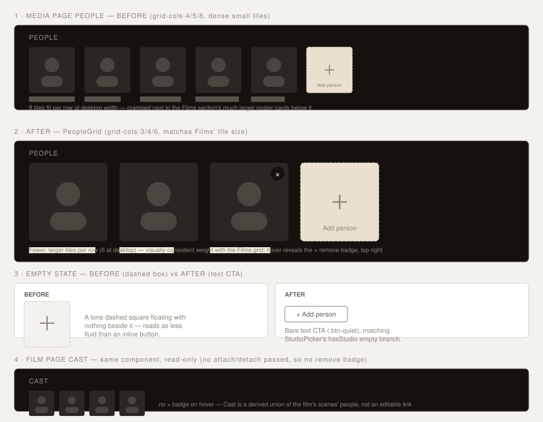

# Design handoff: PeopleGrid (reusable People/Cast display)

**Status:** As-built
**Story:** [HOLODEX-294](https://whoiskevinrich.atlassian.net/browse/HOLODEX-294)
**Owner:** Project owner
**Date:** 2026-08-29
**Spec:** none — presentational-only change, no new user capability (see "Why no spec/ADR" below)
**ADR:** none — no schema/architecture change
**Branch/PR:** `HOLODEX-294-people-grid`

## Overview

The Media detail page's "People" section was inline markup: a dense `grid-cols-4/5/8` grid of
2:3 poster tiles, each independently removable by the owner, plus a dashed "Add person"
poster-tile that opened `PersonPicker`'s popover. It visually read smaller and denser than the
Films section directly below it on the same page, and the empty state (no people attached yet)
rendered as a single dashed square floating with nothing beside it.

The Film detail page's "Cast" section (a read-only, derived union of the film's scenes' people)
had grown its own byte-near-identical copy of the same tile markup, minus the owner controls —
the same duplication pattern `StudioLinkCard` (HOLODEX-290) and `TagLinkChip` (HOLODEX-292)
fixed for Studio and Tag.

This handoff extracts both into one shared `PeopleGrid.svelte`, requested directly with three
concrete changes:

1. **Extract** the Media page's People section into a reusable component.
2. **Increase the poster tile size** to match the Films section's tile size on the same page.
3. **Empty-state fluidity**: swap the lone dashed poster-tile box for a bare "+ Add person" text
   CTA, matching the precedent `StudioPicker`'s `hasStudio` branch already set (HOLODEX-289).

The end goal (stated by the requester, realized in this same change): reuse the same component
for the Film page's Cast section, and any future entity-with-people surface.

**Why no spec/ADR:** nothing here is a new capability (people already attach to videos, already
link to `/people/{id}`, the edit affordances already exist) and nothing here is a schema or
cross-cutting architecture decision — this is a display-markup consolidation plus a visual size
change. Per the project's change-routing table this is a UX/component change → `/design-handoff`
+ `/testing-strategy` only. Mirrors the [`StudioLinkCard`](studio-link-card-handoff.md) and
[`TagLinkChip`](tag-link-chip-handoff.md) precedent exactly.



---

## 1. Resolved decisions

| Question | Decision | Why |
|---|---|---|
| Tile size target | `grid-cols-3 sm:grid-cols-4 md:grid-cols-6` (Films' own tile size) — up from `grid-cols-4 sm:grid-cols-5 md:grid-cols-8` | The request named the Films section directly; matching its breakpoints exactly (rather than picking a new intermediate size) keeps the two sections visually consistent on the same page, which was the actual complaint. |
| Where owner-editing lives | One component, gated on whether the caller supplies `attach`+`detach` — not two components (a read-only tile shape plus a separate editing wrapper) | People is a multi-item grid with **per-item** remove baked into the tile itself (the hover-reveal × badge), unlike `StudioLinkCard`, which stays a bare read-only card beside a *separately mounted* `StudioPicker`. Splitting the remove badge out of the tile would mean either duplicating the tile shape or awkwardly re-composing it — the whole section (including its own `{#if}` visibility gate) is the right unit to share. |
| Empty-state trigger shape | Bare `+ Add person` text button (`.btn-quiet`), reusing `PersonPicker`'s existing `hasStudio`-style branch mechanism, renamed `hasPeople` | Direct precedent: `StudioPicker` already solved this exact problem (HOLODEX-289) for the same reason — a lone dashed box with nothing beside it read as heavier than the content it was announcing. `PersonPicker` gets the same two-branch trigger, driven by the caller's own `people.length`. |
| Cast's remove control | None — Cast passes no `attach`/`detach`, so the component's `editable` derivation is `false` and no × badge, no `PersonPicker` add-tile render at all | Cast is a derived union of the film's scenes' people (HOLODEX-39/films-entity model) — there's no direct film-to-person link to attach or detach in the first place, so there's nothing for an edit affordance to call. |

## 2. New component: `PeopleGrid.svelte`

`web/src/lib/components/entity/PeopleGrid.svelte` — placed in `entity/` per that folder's
CLAUDE.md rule 1 (consumer-based: used by both Media/video and Film routes, and by extension any
future entity-with-people page, with no single feature folder that fits).

```ts
let {
	title,
	people,
	isOwner = false,
	attach,
	detach,
	busyKey = $bindable(null),
	onRemove,
	removeError = ''
}: {
	title: string;
	people: Person[];
	isOwner?: boolean;
	attach?: (name: string, role: 'actor' | 'director') => Promise<{ ok: true } | { conflict: VideoCollisionRef }>;
	detach?: (name: string, role: 'actor' | 'director') => Promise<{ ok: true } | { conflict: VideoCollisionRef }>;
	busyKey?: string | null;
	onRemove?: (p: Person) => void;
	removeError?: string;
} = $props();

const editable = $derived(isOwner && !!attach && !!detach);
```

The grid: 2:3 poster tiles via the existing `PersonPoster` component, keyed on the existing
`personKey()` helper (`$lib/format` — `${id}:${role}`, needed because `video_people`'s composite
primary key means a dual-role attachment is two grid entries sharing the same person id, ADR-072).
When `editable`, each tile gets a hover-reveal `×` badge (the `curation-chip`/`curation-actions`
idiom already used elsewhere) and the grid's last cell is `PersonPicker`'s docked add-tile; when
the list is empty and `editable`, `PersonPicker` renders alone with `hasPeople={false}` instead of
inside a grid `<li>`.

Notes:

- No new formatting/key helpers — reuses `personKey()` and `PersonPoster` as-is.
- `onRemove`/`removeError`/`busyKey` are pass-throughs to the caller's existing
  `attachPerson`/`detachPerson`-backed handlers (`media/[id]/+page.svelte`) — the component owns
  no mutation logic itself, matching `TagLinkChip`'s "caller owns busy/error state" precedent.
- `PersonPicker.svelte` gained one prop, `hasPeople: boolean`, and its trigger markup now
  branches the same way `StudioPicker`'s `hasStudio` already does — no other change to its
  search/attach/detach/commit logic.

## 3. Call-site changes

**`web/src/routes/media/[id]/+page.svelte`**: the ~50-line inline `{#if isOwner || video.people?.length}` section collapsed to:

```svelte
<PeopleGrid
	title="People"
	people={video.people ?? []}
	{isOwner}
	attach={attachPerson}
	detach={detachPerson}
	bind:busyKey={personBusyKey}
	onRemove={removeGridPerson}
	removeError={personRemoveError}
/>
```

`removeGridPerson`'s parameter widened from `ResolvedPerson` to `Person` (its body already
validates `role` at runtime before acting on it) so it satisfies `PeopleGrid`'s `onRemove?: (p:
Person) => void` — a plain `Person` (optional `role`) isn't assignable where a `ResolvedPerson`
(required `role`) is expected, so the callback's own parameter type has to be the wider one.

**`web/src/routes/films/[id]/+page.svelte`**: the Cast section's own inline poster grid (no
owner controls) is replaced with:

```svelte
<PeopleGrid title="Cast" people={cast} />
```

No `attach`/`detach` passed — `editable` derives to `false`, so this renders identically to the
prior read-only markup, just through the shared component.

## 4. Backend requirement

None. Both pages already receive fully-populated `Person[]` — this is a pure frontend markup
consolidation plus a Tailwind class change, no query or schema changes.

## 5. Design tokens used

| Token | Usage |
|---|---|
| `text-muted` / `text-ink` / `text-accent` | Section eyebrow label, tile name, hover state |
| `border-rule` | Remove-badge border, dashed add-tile border |
| `bg-surface-2` | Remove-badge background |
| `text-warn` | Remove-error text |
| `rounded-theme` / `rounded-full` | Tile frame corners / remove-badge shape |
| `.btn-quiet` | Empty-state "+ Add person" text CTA |

No new tokens. `rg 'zinc-|sky-|rounded-(lg|md|sm|xl)'` over the new file stays empty per the
theming rules.

## 6. States and interactions

| State | Behavior |
|---|---|
| Populated, editable (Media, owner) | `grid-cols-3/4/6` poster tiles, hover-reveal × remove badge per tile, docked `PersonPicker` add-tile as the grid's last cell |
| Populated, read-only (Media visitor; Film Cast always) | Same tile grid, no remove badge, no add-tile |
| Empty, editable | Bare `+ Add person` text CTA (`.btn-quiet`), no grid, no dashed box |
| Empty, read-only | Section doesn't render at all (`{#if editable \|\| people.length}` gate) |
| Busy (attach/detach in flight) | The acted-on tile's remove badge shows `…` and disables; matches the pre-extraction behavior exactly, unchanged |
| Dual-role person (e.g. actor + director on the same video) | Two grid entries, same `personId`, keyed by `personKey()` (`id:role`) so both render independently |

## 7. Responsive behavior

Breakpoints unchanged in kind, only in density: `grid-cols-3` (mobile) → `sm:grid-cols-4` →
`md:grid-cols-6`, identical to the Films grid it now matches. No new mobile-specific handling —
the same responsive grid mechanism the People section already had, just re-tuned.

## 8. Edge cases

- **A future caller passes only `attach` or only `detach`, not both**: `editable` requires both
  (`!!attach && !!detach`), so it silently falls back to read-only rather than erroring. Noted
  as a known footgun for a future third caller, not fixed here — both current call sites pass
  both or neither, and collapsing the two props into one `edit` object is a larger API change
  than this extraction warrants; revisit if a future caller actually needs the split.
- **Person with no poster image**: unchanged — `PersonPoster`'s own placeholder handling, not
  touched by this extraction.

## 9. Accessibility notes

- Remove badge keeps its own `aria-label={"Remove " + p.name}`, a sibling of the tile's `<a>`
  rather than nested inside it (a nested interactive control inside an anchor is invalid) —
  unchanged from the pre-extraction markup.
- Focus order per tile: the poster/name link, then (editable only) the remove badge, in DOM
  order — unchanged.
- No new focus-visible styling — reuses the existing `hover:border-accent
  focus-visible:border-accent` treatment already on the remove badge.

## 10. Verification (as-built)

Manually driven-browser QA'd this session, in-app (not screenshots-only, per the standing
`preview screenshots time out on Holodex` note — computed-style/geometry checks via
`javascript_tool` plus targeted screenshots):

- Media page (`/media/{id}`, owner): confirmed the grid renders at the new `grid-cols-3/4/6`
  size (6 columns at desktop width), the hover-reveal × badge is present with correct
  `aria-label`, and the full `PersonPicker` popover flow (search, role toggle, attach, detach)
  still works unchanged when opened from inside `PeopleGrid`.
- Media page, empty-people video: confirmed the bare `+ Add person` text CTA renders instead of
  a dashed box.
- Film page (`/films/{id}`) Cast section: confirmed it renders through the same component,
  read-only (no remove badge, no add-tile), showing the union of a real film's attached-video
  people.
- **All 3 skins** (Cinémathèque, Broadcast, Brutalist): computed-style contrast checks on the
  section heading and tile name text against each skin's body background (5.7:1 – 6.3:1, all
  well above the 4.5:1 AA threshold) and tile aspect ratio (`0.619`, consistent across all
  three) — no skin-specific regression.
- `npm run check`: 0 errors (8 pre-existing warnings in unrelated files, unchanged by this diff).

No dedicated Vitest/Playwright coverage added — consistent with the standing frontend-automation
gap `StudioLinkCard`/`TagLinkChip` both carry (see `docs/testing-strategy.md`).
