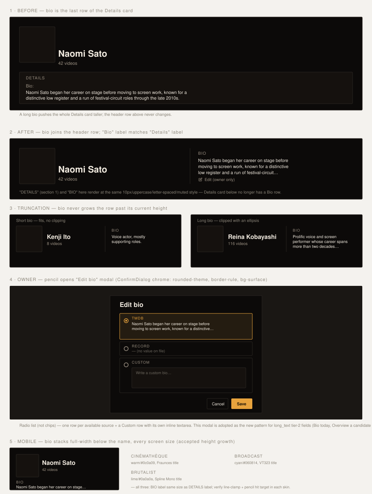

# Handoff Spec: Person detail — bio in the header row

**Spec:** — (behavior-only change, no new field semantics; no `docs/specs/` entry)
**Issue:** HOLODEX-303
**Supersedes:** none — extends [two-tier-field-editing-handoff.md](two-tier-field-editing-handoff.md)'s
`SourceBadge` pattern with a second, parallel interaction pattern for `long_text` fields
**Theming contract:** tokens-only, all three skins (`.claude/rules/frontend-theming.md`)
**Stack:** SvelteKit, Svelte 5 runes, Tailwind v4 CSS-first



## Overview

The Person detail page's hero row shows the photo, name, nationality flag, and video-count/link
meta. Bio currently renders as the last row of the "Details" card below the hero — a full-width
paragraph that can push the whole card taller with no relationship to the header above it.

This change moves Bio into the hero row itself, as a third column beside the name/meta column,
separated by a vertical rule. Bio is **removed from Details entirely** — one place to read it, not
two. Because the hero row's height is set by the photo (a fixed square), bio text is clamped so a
long bio is truncated with `…` rather than growing the row — the row's height stays exactly what
it is today regardless of bio length.

Owner editing for bio moves with it: SourceBadge's inline click-to-expand chip row (the existing
tier-2 pattern) is dropped for this field. In its place, a pencil icon appears after the truncated
bio text (owner mode only) and opens an **"Edit bio" modal**: a vertical list of radio rows — one
per available source (e.g. TMDB, Record) plus a "Custom" row with its own inline textarea — and
Cancel/Save actions, styled with `ConfirmDialog`'s modal chrome.

### Design-system fit

- Reuses `ConfirmDialog`'s modal shell (backdrop, `rounded-theme border-rule bg-surface`, focus
  trap, Escape-to-cancel, trigger-focus return, rise-in animation) rather than inventing new
  dialog chrome.
- The "Bio" eyebrow label reuses the exact class already on "Details": `text-xs uppercase
  tracking-wide text-muted`.
- Truncation uses a `line-clamp` utility, no JS measurement — consistent with how the rest of the
  app handles overflow text.

### Why this is a new pattern, not a bio-only exception

SourceBadge's inline chip-expand (see [two-tier-field-editing-handoff.md](two-tier-field-editing-handoff.md))
stays correct for compact fields (a name, a date, a short string) where the expanded chip row fits
inline without disturbing layout. It does not work for paragraph-length content: expanding a
multi-line source comparison inline either truncates the very thing the owner is trying to compare,
or blows out the layout around it. The modal removes that constraint by giving each candidate
value its own full-width block.

**This modal is adopted as the standard interaction pattern for `long_text` tier-2 fields going
forward**, not a special case scoped to Person Bio. Today there are exactly two canonical
`long_text` fields in the codebase: Person `bio` (this story) and Video `overview`. Video Overview
adoption is a natural follow-up but is **out of scope for HOLODEX-303** — flagged as an open
question below, not silently implied.

## Layout

**Desktop hero row (three columns, unchanged photo/name column):**

```
┌───────────┬─────────────────────────┬──┬───────────────────────────────┐
│           │ Naomi Sato               │  │ BIO                    ✎     │
│  photo    │ 42 videos · IMDb · site  │  │ Naomi Sato began her career   │
│           │                          │  │ on stage before moving to     │
│           │                          │  │ screen work, known for a      │
│           │                          │  │ distinctive low register…     │
└───────────┴─────────────────────────┴──┴───────────────────────────────┘
             flex-1, min-w-0            1px    flex-1, min-w-0, height = photo
                                        rule
```

- Photo column: unchanged, fixed square (sets the row's height).
- Name/meta column: unchanged (`NameEditControl` + `EntityVideoMeta`), bottom-aligned as today.
- Divider: 1px `border-rule` vertical line, full row height.
- Bio column: new. Height is pinned to the photo's height (`height: 100%` of the flex row); label
  at top, clamped text fills the remainder.

**Mobile (< the existing name-column breakpoint):** bio drops out of the row and stacks full-width
beneath the name/meta block, not clamped to the header height — see Responsive Behavior.

## The Edit-bio modal

```
┌─────────────────────────────────┐
│ Edit bio                        │
│ ┌─────────────────────────────┐ │
│ │ ○ TMDB                      │ │  ← selected: accent border/bg
│ │   Naomi Sato began her…     │ │
│ ├─────────────────────────────┤ │
│ │ ○ Record                    │ │
│ │   — (no value on file)      │ │
│ ├─────────────────────────────┤ │
│ │ ○ Custom                    │ │
│ │   ┌─────────────────────┐   │ │
│ │   │ Write a custom bio… │   │ │
│ │   └─────────────────────┘   │ │
│ └─────────────────────────────┘ │
│                [Cancel] [Save]  │
└─────────────────────────────────┘
```

| Prop | Type | Notes |
|---|---|---|
| `open` | `boolean` | controls mount/unmount, matches `ConfirmDialog` |
| `field` | `ResolvedField` | the `bio` field — supplies candidate source values |
| `decide` | `(source: string, manualValue?: string) => Promise<void>` | same signature `SourceBadge` already calls into `decideField` with |
| `onclose` | `() => void` | Cancel, Escape, backdrop click, or post-Save |

| State | Behavior |
|---|---|
| Row selected (radio) | Accent border + tinted background on the row, matching `CurationChip`'s selected treatment |
| Custom row selected | Its textarea becomes the active value; other rows' text is inert (not editable) |
| Save, non-Custom row | Calls `decide(source)` with no manual value |
| Save, Custom row | Calls `decide('manual', textareaValue)`; disabled while the textarea is empty |
| Save in flight | Save button shows busy state, both buttons disabled — mirrors `ConfirmDialog`'s `busy` prop |
| Save resolves | Modal closes, header bio re-renders from the freshly resolved field |
| Save rejects | Modal stays open, inline error text above the actions (same slot `ConfirmDialog` uses today) |

## Design Tokens Used

| Token | Usage |
|---|---|
| `text-xs uppercase tracking-wide text-muted` | "Bio" eyebrow label — identical class to "Details" |
| `border-rule` | column divider, modal border, radio-row borders |
| `bg-surface` | modal body |
| `bg-accent` / `text-accent-ink` | Save button, selected-radio-row accent |
| `text-ink` | bio body text, modal title |
| `text-muted` | unselected radio labels, "no value on file" placeholder |
| `rounded-theme` | modal, radio rows, buttons |
| `font-ui` | modal body (inherits) |

## States and Interactions

| Element | State | Behavior |
|---|---|---|
| Header bio text | Fits within clamp | Renders in full, no ellipsis |
| Header bio text | Overflows clamp | Clipped with `…` at the last full line that fits the row height |
| Header bio text | Empty (no bio on any source) | Column renders label only, no placeholder sentence, no pencil unless owner |
| Pencil icon | Visitor | Not rendered |
| Pencil icon | Owner, hover/focus | Brightens from a low-opacity rest state — same reveal language as `NameEditControl`'s docked pencil |
| Pencil icon | Click / Enter | Opens the Edit-bio modal |
| Modal | Escape / backdrop click / Cancel | Closes without calling `decide`, focus returns to the pencil |
| Modal radio rows | Keyboard | Arrow keys move selection within the radiogroup (native `role="radiogroup"` semantics), Tab reaches Cancel/Save |

## Responsive Behavior

| Breakpoint | Changes |
|---|---|
| Desktop / tablet (name/meta column already a row, ≥ existing hero breakpoint) | Three-column layout as pictured; bio clamped to the photo's height |
| Mobile (< existing hero breakpoint, where photo/name already stack or compress) | Bio drops out of the flex row and renders as its own full-width block beneath the name/meta block. **Not clamped** — the row is allowed to grow; this is an accepted, deliberate tradeoff (confirmed with the requester) rather than hiding bio on small screens |

## Edge Cases

- **No bio on any source:** column shows only the "Bio" label (owner still gets the pencil, to set one); no "No bio available" placeholder text — consistent with how other empty tier-2 fields render today.
- **Bio exactly fills the clamp:** no ellipsis is shown if the text fits exactly at the line-clamp boundary (browser default `-webkit-line-clamp` behavior — no ellipsis is inserted when there's no actual truncation).
- **Very long single word** (no natural wrap point): standard `overflow-wrap`/`word-break` already used elsewhere in the app applies; no new rule needed.
- **Modal opened with zero candidate sources beyond Custom:** the radio list shows just the Custom row (no empty "no candidates" state needed — Record is always a row, even if blank).
- **Narrow viewport + long bio, mobile:** unbounded — full text renders, page scrolls. No modal-only-on-mobile fallback; the pencil + modal pattern is identical at every width.

## Animation / Motion

| Element | Trigger | Animation | Duration | Easing |
|---|---|---|---|---|
| Edit-bio modal | Open | `confirm-rise` (existing `ConfirmDialog` keyframe: slight translate-y + opacity) | per existing `ConfirmDialog` timing | per existing `ConfirmDialog` easing |
| Pencil icon | Hover/focus | Opacity transition (existing `NameEditControl` reveal token) | existing | existing |

No new motion is introduced — both animations are reused verbatim from existing components.

## Accessibility Notes

- Modal: `role="dialog"` `aria-modal="true"`, labelled by its "Edit bio" heading (`aria-labelledby`) — same shape as `ConfirmDialog`.
- Radio list: native `role="radiogroup"` + `role="radio"` rows (or native `<input type="radio">` styled to match) so screen readers announce selection state and arrow-key navigation works for free.
- Custom row's textarea is only reachable/editable when its radio is selected; when a different row is selected, the textarea is `disabled` (not just visually inert) so Tab order doesn't stop on an inert control.
- Focus trap, Escape-to-cancel, and trigger-focus-restore all inherited from `ConfirmDialog`'s existing implementation — no new accessibility surface to build.
- Pencil icon: `aria-label="Edit bio"` (icon-only control).
- Header bio truncation: the clamped `<div>` holds the **full** untruncated string in the DOM (CSS-only clamp), so screen readers reading the header get the complete bio, not the visually truncated version.

## Resolved Decisions

- **Header owns editing; Details drops bio entirely.** No duplication between the two locations.
- **Truncation mechanism:** CSS line-clamp keyed to the row's existing height (set by the photo), not a JS-measured "would this overflow" check.
- **Owner-editing pattern:** pencil icon → modal (radio list + inline Custom textarea), not SourceBadge's inline chip-expand — chip-expand doesn't work for paragraph-length content (see "Why this is a new pattern" above).
- **Mobile:** bio stacks full-width below the name/meta block on every screen size; this is allowed to grow the header's height on mobile (accepted tradeoff, not a bug).
- **Label parity:** "Bio" renders with the exact same class as "Details" (`text-xs uppercase tracking-wide text-muted`).
- **Pattern scope:** the pencil+modal pattern is documented here as the standard for `long_text` tier-2 fields going forward, not a one-off for Bio.

## Open Questions carried to implementation

- **Video `overview` adoption.** The only other `long_text` canonical field. Migrating it to the
  same pencil+modal pattern (replacing wherever it currently uses SourceBadge, if it does) is a
  natural follow-up but is explicitly **not** part of this story — flag as a candidate HOLODEX
  issue rather than doing it inline here.
- **Exact hero breakpoint** at which bio drops from the three-column row to the stacked mobile
  layout — should match whatever breakpoint the existing name/meta column already uses to
  compress, to avoid introducing a second breakpoint value; confirm against the current
  `hero()` snippet's existing responsive classes during implementation rather than inventing a new
  one.
