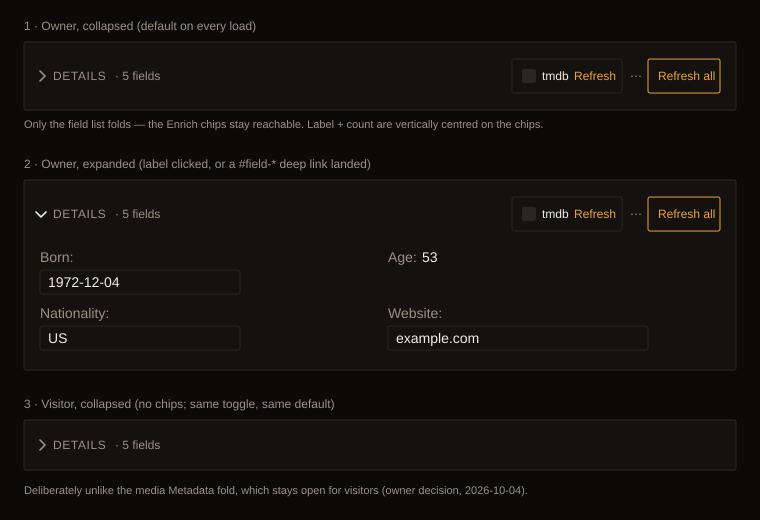

# Design handoff: Person Details fold

**Status:** Implemented (pending review)
**Jira:** HOLODEX-539
**Owner:** Project owner
**Date:** 2026-10-04
**Spec:** none. No new functionality: the field list, its rows and the Enrich chips are unchanged.
**ADR:** none. This is presentation only, with no technology fork.
**Precedent:** [`media-detail-metadata-fold-handoff.md`](media-detail-metadata-fold-handoff.md) (HOLODEX-320)
and its deep-link fix (HOLODEX-398).

## Overview

On the Person page, the **Details** card (the resolved field list) is a fold, closed on every page
load. The owner's ask: "the Details section should be collapsible and collapsed by default."

## Decisions

| # | Decision | Why |
|---|---|---|
| D1 | **The label is the toggle.** A chevron plus `DETAILS · N fields` is one `<button>` inside the `<h2>`, so the heading wraps the button (option A of two mocked). | It's a larger target than a trailing chevron. Option B put the media fold's far-right chevron after the Enrich chips, where it got lost among them. The owner chose A. |
| D2 | **Only the field list folds.** The Enrich provider chips stay in the header. | You can enrich without opening the card. The media fold does the same with Refresh/Extract. |
| D3 | **Closed for the visitor as well as the owner.** | The owner chose this explicitly on 2026-10-04, knowing it departs from the media Metadata fold, which stays open for visitors with no chevron. The values stay visible, one click away. |
| D4 | **The `· N fields` count is always shown.** N counts compact, merge, extra long-text and auto-registered rows. | The count is what keeps a closed fold honest, as the score does for Completeness. |
| D5 | **Not persisted.** It closes on every load, and also when the route component is reused for another person. | Nobody asked for persistence. A per-browser memory would be state that can't be tested here. |
| D6 | **A `#field-<canonical>` deep link opens the fold**, but only when the target row is inside it. | Same hazard as HOLODEX-398: the row exists but is clipped and `inert`. `#field-photo-upload` and `#enrich-providers` live outside the fold and are left alone. |

## Mechanics

- **Clipped, not unmounted.** The wrapper is `#person-details-fields`, `overflow-hidden` with
  `max-height` 0 or 6000px and a 200ms transition (none under reduced motion), plus `inert` while
  closed. The `#field-*` ids therefore always exist for the landing to find, and clipped rows are
  out of the tab order.
- **Spacing lives inside the fold** (`mt-3` on the `<dl>`, the empty-state line and the error line)
  rather than `space-y-3` on the card. Tailwind v4's `space-y` puts a bottom margin on the header,
  which would leave a 12px gap under a closed card.
- **Header row is `items-center`.** The 20px label sits on the midline of the 34px chip row.
- **Landing:** an `$effect` keyed on `$page.url.hash`. SvelteKit runs no `afterNavigate` for a
  same-page hash change. It opens the fold, waits a `tick`, then scrolls the row to centre.
- **No header button when there are no fields.** With `resolved` empty, the owner sees `Details`,
  the chips and "No details yet.", and there is nothing to fold.

## Accessibility

`aria-expanded` and `aria-controls="person-details-fields"` sit on the button. Its accessible name
is "Details · N fields". The chevron is `aria-hidden` and rotates 90° when open.

## QA (as run, 2026-10-04, Cinémathèque, `backend-films` + `web`)

1. `[agent]` Owner, fresh load: `aria-expanded=false`, fold height 0, `inert`, card 68px. Header
   midline delta to the chips is 0.
2. `[agent]` Click the label: fold opens. `elementFromPoint` on a row's `<dt>` hits the row.
3. `[agent]` Same-page hash change to `#field-website`: the fold opens and the row is scrolled to
   centre and hit-testable.
4. `[agent]` Visitor, fresh load with `#field-birthdate`: opens. Visitor, fresh load with no hash:
   closed, card 50px, no chips.
5. `[human]` Watch the open/close animation in a visible window. The agent pane was hidden, so the
   transition never advanced there: no animation frames.
