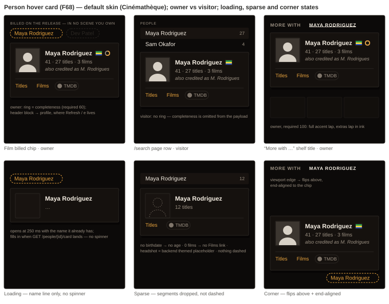

# Person hover card — floating preview with a link row on text-only person links — design handoff

**Ticket:** HOLODEX-431 (F68) · **Status:** Approved for build · **Date:** 2026-09-20 (rev 2) ·
**Spec:** [`person-hover-card.md`](../specs/person-hover-card.md) R1–R8, RD1–RD12 · **ADR:** none
unless RD10 falls (positioning needs `@floating-ui/dom`); rides ADR-099 (completeness ring) and
ADR-102 (skin = instance identity)

## Decision



One card, rendered by `PersonHoverCard.svelte`, mounted only by `PersonLinkChip.svelte`. The chip
is a **transparent wrapper**: it takes the consumer's own classes and never restyles the link. That
settles the spec's **OQ2** — the film page's dashed accent pill *encodes meaning* (dashed =
billed but in no owned scene, accent = exists in your library; `films/[id]/+page.svelte:752-783`),
so the chip must not normalize it to `TagLinkChip`'s solid pill. Three v1 consumers, three chip
looks, one card:

| Surface | Trigger look (unchanged) | Who sees it |
|---|---|---|
| Film page "Billed on the release" | `rounded-full border border-dashed border-accent px-2.5 py-0.5 text-sm text-accent hover:border-solid` | owner only (the section is owner-gated) |
| `/search` page person row | `SearchResultsPanel` row, `variant="page"` only — `hoverCards` prop, default `false`; the header dropdown never sets it | everyone |
| "More with …" shelf title | `RelatedShelf` heading link `text-ink hover:text-accent` | everyone |

**Rev 2 (2026-09-20):** the owner row (Enrich · Edit links) is gone. The owner's affordance is
the **`CompletenessRing`** from F65 beside the name — a static indicator of whether the profile
needs work — and the **header block is the profile link** for everyone, which for the owner is
also the edit path: the profile carries Refresh-all / the `e` hotkey (F62) and every field editor.
The card never fires enrichment itself; `CompletenessRing` is `role="img"` and non-interactive by
its folder contract, and a hover surface should not own a write. With the header as the profile
link, a separate "Profile" text link would be redundant, so the row is Titles · Films · badges.

**Skin:** since ADR-102 the skin is instance identity — one skin per install, chosen by the owner,
no per-browser switching. The mockup therefore renders every state in the **default skin,
Cinémathèque**; the three-skin QA rule still applies to the build (`.claude/rules/frontend-theming.md`).

Options considered in the brainstorm: **A** read-only preview (whole card = link), **B** card with
link row, **C** enriched chip with no overlay, **D** in-tile reveal. B chosen — the link row is the
point; A's simplicity is recovered by keeping the card non-modal and single-open.

## Layout & placement

- Card **`w-72`** (288 px) fixed; `max-w-[calc(100vw-2rem)]` so a narrow desktop window never
  overflows (HOLODEX-356 guard). Height is content-driven — no min-height, no reserved space.
- **Anchor:** below the trigger, start-aligned, **6 px gap** (`mt-1.5`). `position: absolute`
  inside the chip's `relative` wrapper — same recipe as every existing menu (`tags/+page.svelte:752`).
- **Flip rules** (one `getBoundingClientRect` measure on open; re-measure on `resize`/`scroll`
  while open): not enough room below → open **above** (`bottom-full mb-1.5`); right edge would
  pass the viewport → **end-aligned** (`right-0` instead of `left-0`). Both can apply at once
  (mockup, bottom-right panel). No transform-based positioning, no portal in v1 — the
  `RelatedShelf` header is the prototype site for OQ1; if its overflow clipping eats the card,
  that is the trigger for a portal + floating-ui ADR.
- `z-50` (matches the header dropdown). Only one card is open app-wide.

## The card — anatomy & states

```
┌──────────────────────────────────────────────┐  bg-surface · border border-rule · rounded-theme
│ ┌──────┐  Maya Rodriguez 🇧🇷 ◔                 │  ← header block = <a href="/people/{id}">; ring owner-only
│ │ 48px │  41 · 27 titles · 3 films             │  ← meta: text-xs text-muted, " · " separators
│ │  1:1 │  also credited as M. Rodrigues        │  ← aliases: text-xs italic text-muted (max 3)
│ └──────┘                                       │
│ ─────────────────────────────────────────────  │  ← border-t border-rule, mt-2 pt-2
│ Titles  Films  (◉ TMDB)                        │  ← links text-xs text-accent; badges = ProviderLinkBadge
└──────────────────────────────────────────────┘  shadow-lg · p-3 · gap-3 between frame and text
```

| Element | Spec | Notes |
|---|---|---|
| Header block | `<a href="/people/{id}" class="flex gap-3 group">` wrapping headshot + name/meta/alias column | The profile link for everyone; for the owner it is the edit path. `group-hover:text-accent` on the name only — the block does not get a background. |
| Headshot | `PersonImageFrame` `role="headshot"` `frameClass="portrait-frame--1x1 w-12"` | 48 px; face-biased crop and the Broadcast scanline overlay come from `.portrait-frame` for free. No client fallback needed — the backend always serves a real or themed placeholder image. |
| Name line | `display_name ?? name` · `NationalityFlags values={nationality}` (`h-4`) · `CompletenessRing size="row" required extras` **only when `card.completeness` is present** (owner, by payload) | `truncate` on the name; flags and ring `shrink-0`. Ring = 12 px, muted track, accent arc, ink overfill lap — exactly as on the people index rows (`routes/people/+page.svelte:263`). Never feed it the detail read's `score/facets` object. |
| Meta line | segments `age` · `videoCount(video_count)` · `N films`, joined with ` · `; **absent segments are dropped**, never rendered as "—" | `age_at_death` renders as `†41`. `0 films` → segment dropped. |
| Aliases | "also credited as a, b, c" — first three aliases, no "+N" in v1 (P1) | Omitted entirely when empty. |
| Link row | `flex flex-wrap gap-x-3 gap-y-1` · Titles `/people/{id}#videos` · Films `/people/{id}#films` (only when `film_count > 0`) · one `ProviderLinkBadge` per `sortExternalLinks(external_links)` | **Anchors do not exist yet** — the build adds `id="videos"` on the profile's video grid section and `id="films"` on its `FilmsRow` heading. No owner row. |

**States**

| State | What shows | Why |
|---|---|---|
| Loading (intent fired, fetch in flight) | Card opens at 250 ms with the **empty headshot frame + name line** from the chip's own props; meta/aliases/ring/link row absent | No spinner, no skeleton — the card should feel like it *was* there. Fills in place when data lands; height grows, nothing shifts horizontally. |
| Sparse | Missing facts leave no trace: no age → no age segment; no films → no segment and no Films link; no aliases → no line; no external ids → no badges | "Absent is absent" — the profile's own rule. |
| Visitor | Same card without the ring | `completeness` is omitted from the payload for visitors, as on every list read (ADR-099). |
| Error / 404 | Card closes (or never opens) silently; chip stays a plain link | Not cached, so the next hover retries. No toast — hover is not an action. |
| Corner | Flips above and/or end-aligned per the rules above | Always fully visible; never scrolls the page. |
| Touch (`pointer: coarse`) | Nothing mounts; chip is a plain link | `matchMedia('(pointer: coarse)')` checked once at mount. |

## Design tokens used

| Token / utility | Where |
|---|---|
| `bg-surface` `border-rule` `rounded-theme` `shadow-lg` | card surface — identical to the header search dropdown (`+layout.svelte:257`), the app's floating-panel convention. **No per-skin shadow hook.** |
| `text-ink` `font-display` | name |
| `text-muted` | meta, aliases, provider badge text, ring track |
| `text-accent` | in-app links (Titles / Films), ring required arc, name on header hover |
| `stroke-muted` `stroke-accent` `stroke-ink` | `CompletenessRing` (its own) |
| `hover:text-ink` `focus-visible:ring-1 focus-visible:ring-accent` | link hover/focus, matching `ProviderLinkBadge` |
| `.portrait-frame` `.portrait-frame--1x1` | headshot (app.css :454–:482, Broadcast `::after` :553) |
| `--radius` via `rounded-theme` | 2 px in the default skin (0 in Broadcast/Brutalist) — the card corners follow the skin like every panel |

Nothing hardcoded; the mockup's literal hex values are Cinémathèque's own tokens (`app.css`
:107–:123, unchanged by #365) so it renders faithfully on GitHub without the fonts.

## Interaction

| Trigger | Result | Timing |
|---|---|---|
| Pointer rests on chip | intent timer → fetch (cached?) → open | **250 ms** intent; fetch starts at intent, not on enter |
| Pointer leaves chip before intent | timer cleared, in-flight fetch aborted | — |
| Pointer leaves chip *and* card | close | **150 ms** grace; re-entering either cancels |
| Pointer moves onto the card | stays open; header block and links are hoverable | the 6 px gap is inside the grace window |
| Click on the header block | navigate to the profile (owner: this is "edit") | — |
| Chip receives focus | open **immediately** | no intent delay for keyboard |
| Tab from chip | into the card: header block → Titles → Films → badges, DOM order | card is the chip's next sibling so no focus management is needed |
| Tab past the last link / Shift+Tab from chip | close, focus continues naturally | — |
| Escape / outside click | close via `use:dismissable` (`inside` = the chip wrapper) | focus returns to the chip if it was inside the card |
| Click on the chip | **navigate** — never intercepted | the card is beside, not over, the chip so an in-flight click cannot land on it |
| Another chip opens | this one closes | single-open state (extend `PopoverMenu` or a module-level `openId`) |

**Motion:** open = opacity 0→1 + `translateY(2px→0)`, **120 ms `ease-out`**; close = none
(instant). Wrapped in `@media (prefers-reduced-motion: no-preference)` like the existing
`app.css` :524 blocks — reduced-motion users get an instant open.

## Accessibility

- Chip: the existing `<a>`; while the card is open it carries `aria-describedby={cardId}`.
- Card: `role="group"` `aria-label="{name}"` — **not** `role="dialog"`, **not** `aria-modal`; it
  is supplementary content the link already summarizes. Not `role="tooltip"` either, because it
  contains interactive children.
- Focus order = DOM order: chip → header block (profile) → Titles → Films → provider badges →
  next chip. No roving tabindex (these are links, not a list).
- The ring keeps its own `role="img"` + "Completeness: required N, extras N" label inside the
  header link; the link's accessible name is the name text (the ring's label is supplementary,
  `aria-hidden` is **not** applied so the owner hears the score).
- Screen readers hear the link text (the name) and, once open, the card as a described group.
  Loading state announces nothing extra.
- Coarse pointers get the link, which is the complete fallback — the card is never the only
  path to any destination.

## Not in scope

`PeopleGrid` / `PersonPosterCard` / people-index rows (already show the face), the header
search dropdown (popover-in-popover), curation chips (collide with `PopoverMenu`), Studio / Film
cards, age at release, touch long-press, alias "+N more", any enrichment action from the card.

## QA

Numbered per the repo's checklist convention; `[agent]` items run with `javascript_tool`
computed styles + `getBoundingClientRect`, `[human]` items are Kevin's look on the testbed.

**Setup** — a person with headshot, birthdate, ≥1 film, ≥1 alias, one external id, completeness
required < 100; a second person with none of those; a film page (owner) whose billed complement
lists the first person.

- 1.1 `[agent]` Hover the film chip: nothing before 250 ms; card open after; `bg-surface`,
  `border-rule`, `rounded-theme` computed values match the active skin — **all three skins**.
- 1.2 `[agent]` Leave chip → card closes after 150 ms; leave chip → enter card within 150 ms →
  stays open.
- 1.3 `[agent]` Tab to a `/search` person row: card opens with no delay; Tab walks header →
  Titles → Films → badge → next row; Escape closes and focus is on the row.
- 1.4 `[agent]` Second person: card shows name + "N titles" only; no Films link, no alias line,
  no badges; height smaller, width identical.
- 1.5 `[agent]` Resize to 1024 px, hover the last "More with" title chip at the right edge:
  `card.getBoundingClientRect().right ≤ innerWidth` and `document.documentElement.scrollWidth
  === clientWidth` (no horizontal overflow).
- 1.6 `[agent]` Emulate `pointer: coarse` (mobile preset): hover/click never mounts the card;
  the link navigates.
- 1.7 `[agent]` Network: exactly one `GET /people/{id}/card` per person per page session across
  repeated hovers; a 404'd person produces no card and re-requests on the next hover.
- 1.8 `[agent]` Owner session: the ring renders with the same `required`/`extras` the people
  index row shows for that person; visitor session (no cookie): the response has no
  `completeness` key and no ring renders.
- 2.1 `[human]` On the film page, does the dashed chip still read as "not in your scenes" with
  the card open beside it, or does the card make it look linked? (Expect: unchanged.)
- 2.2 `[human]` Click the header block as the owner — does landing on the profile feel like the
  natural "go fix it" move, or is a Refresh affordance missed in the card?
- 2.3 `[human]` Does the loading → filled transition feel like a card *appearing*, or like a
  flicker? If flicker, raise the intent delay to 300 ms before adding a skeleton.
