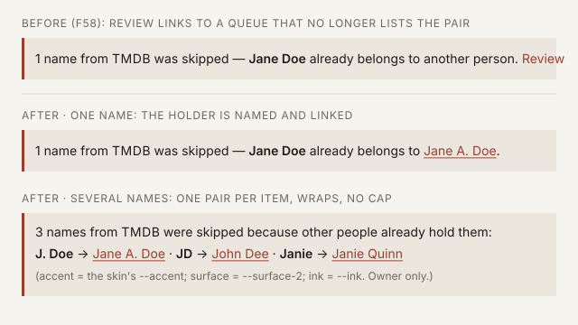

# Design handoff — Aliases panel skipped line names its holder (HOLODEX-453)

Provider-alias collisions leave the Duplicates queue
([ADR-108](../architecture/ADR-108-provider-alias-collisions-leave-the-duplicates-queue.md);
spec F58 P0-5a). The Aliases panel's owner-only skipped line
([alias-collapse-handoff](alias-collapse-handoff.md#collision-review-line)) ended in a **Review** link
to `/owner/duplicates`, which would now open a queue that no longer lists the pair. That link is
replaced by the **holder**: each skipped name is paired with the entity that already holds it,
linked to that entity's page. An owner who suspects a real duplicate opens the holder and merges
from its own panel.

Chosen by Kevin 2026-09-25, over dropping the link (you could not tell who holds the name) and
removing the line (the skip would become invisible).

## What changes

| Surface | Change |
|---|---|
| `AliasPanel.svelte` skipped line | The trailing `Review` → `/owner/duplicates` link is removed. |
| … one skipped name | `… — {alias} already belongs to {holder}.` — `{holder}` is a link. The wording "another {noun}" goes. |
| … several skipped names | Lead sentence `{n} names from {provider} were skipped because other {nounPlural} already hold them:`, then one `{alias} → {holder}` item per name, in `skipped_aliases` order (alias, case-insensitive). The separator is a non-breaking ` ·` that **ends the item before it**, plus a plain space, so a wrap never starts a line with the dot (caught in 375 px QA). |
| `SkippedAlias` (API + `types.ts`) | Gains `conflict_name` — the holder's current canonical name, joined in the same read. |
| `/owner/duplicates` | No visual change. It simply stops listing `provider-alias` rows. |

## Anatomy

- The container is unchanged: `border-l-[3px] border-accent bg-surface-2 p-3`, square corners, `aria-live="polite"`.
- `{alias}` keeps `font-semibold`. `{holder}` is an `<a>` styled `text-accent hover:underline`,
  matching the link it replaces, so no new treatment is introduced.
- Holder href: the entity's own detail route for this panel's `entityType`. Person goes to
  `/people/{id}`, studio to `/studios/{id}`. Only these two produce provider aliases.
- The arrow `→` is plain text between the alias and the holder. It carries no meaning a screen
  reader needs beyond the sentence, so it is `aria-hidden="true"`, and each item has a visually
  hidden ` held by ` in its place.

## States

| State | Rendering |
|---|---|
| No skipped names, or visitor | Nothing. Unchanged. |
| One name | Single sentence, holder linked (mockup, middle). |
| Several names | Lead sentence + wrapped item list (mockup, bottom). **No cap and no "show more"**, for the same reason the chip list has none: the panel is below the fold and a person with many AKAs genuinely has them. Items wrap at ` · ` boundaries. A long holder name wraps like prose, since the text is inline and is not a flex item. |
| Holder renamed since the skip | Shows the **current** name, because `conflict_name` is joined live. |
| Holder no longer holds the name | The line drops it. Already true: `SkippedAliasesForEntity` requires the other side to still hold it. |
| Holder merged away / deleted | The row's pair is removed by the merge, so the line drops it. Unchanged. |
| Provider attribution | Unchanged. `{provider}` appears only when this entity's chips have exactly one source. |

## Not changing

- The Duplicates queue's layout, labels and compare panel. The `alias` match-kind label stays; it
  still belongs to the fuzzy near-miss rows.
- No dismiss control on the skipped line. The skip persists until the holder drops the name, or
  until the owner merges the two, which is what makes the line self-cleaning (ADR-108
  Consequences).

## QA

Check all three skins (Cinémathèque, Broadcast, Brutalist): the accent link reads on
`--surface-2`, and a several-name line wraps without horizontal overflow at 375 px.
