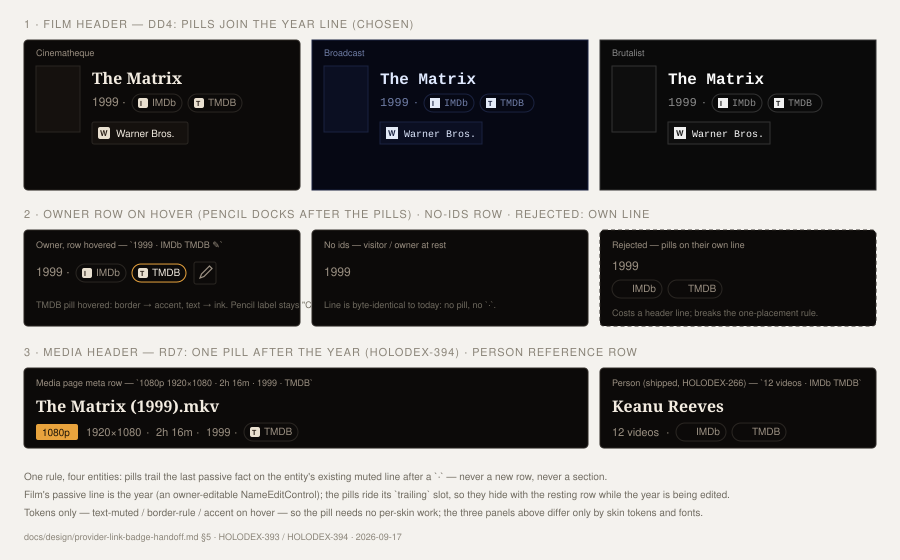

# Design Handoff: Provider Link Badge — Multi-Badge States for Person/Studio (HOLODEX-266)

**ADR**: [ADR-083](../architecture/ADR-083-provider-link-badge-person-studio.md) — read-only
projection of `person_external_ids`/`studio_external_ids`, server-built links via
`Manifest.LinkTemplates`, one badge per stored id (D3)
**Extends**: the video provider badge decided earlier this session (mockups: raw-value vs.
provider-name badge; header-inline vs. separate section; placement on the resolution/duration/year
metadata row) — not yet implemented in code (ADR-082 action item 6 is still open), so this handoff
treats that visual design as **settled** and specs the delta HOLODEX-266 actually needs: the states
that only exist once an entity can carry **zero, one, or several** ids instead of one resolved
scalar.
**Theming contract**: [ADR-021](../architecture/ADR-021-frontend-theming-and-skins.md) +
[theming.md](theming.md) — tokens only, QA all three skins.
**Prior art**: `UrlValueList.svelte` (icon + host text leading a link, ADR-059 opt-in) for the
icon+label-as-link shape; `ProvenanceBadge.svelte`/`ProviderIcon.svelte` for the icon/monogram
fallback machinery; `EnrichPicker.svelte`'s `profile_url` link (`target="_blank" rel="noopener
noreferrer"`, `aria-label="View {label} on {provider}'s site (opens in a new tab)"`) for the
external-link accessibility pattern this badge reuses verbatim, since it's the same "provider
attests a URL, we link out" shape.
**Depends on**: backend items #3–4 in the [worklog](../plans/HOLODEX-266.md) (`Manifest.LinkTemplates`
+ `external_links` projection) — not yet built. This specs the UI to build against once that lands;
frontend scaffolding (empty/degraded states) doesn't need real data to start.
**Surfaces**:
- New shared component: `web/src/lib/components/enrichment/ProviderLinkBadge.svelte` (single badge;
  video, person, and studio all render 0..N of these — video happens to always resolve 0 or 1)
- Wiring: `web/src/routes/people/[id]/+page.svelte`, `web/src/lib/components/entity/EntityVideos.svelte`
  (studio's shared header), and revisiting `web/src/routes/media/[id]/+page.svelte`'s metadata row to
  use the shared component instead of a one-off
- **Scope of this handoff**: the person/studio placement and the 0/1/N + degraded-link states. It
  does not re-decide the badge's own visual anatomy (pill shape, icon, hover/focus) — see "Badge
  anatomy (recap, unchanged)" below. **§5 (F63, HOLODEX-390) extends it** to the film and media
  headers — the two surfaces the badge never reached — under the same DD1–DD3 rules.

---

## Badge anatomy (recap, unchanged)

Settled earlier this session, restated here so this doc is self-contained:

- A small pill: `ProviderIcon` (16px, self-hosted brand icon or themed monogram) + the provider's
  short label text (e.g. "IMDb", not the id) — `rounded-full border border-rule px-2 py-0.5 text-xs
  text-muted`, matching `CurationChip`'s pill sizing.
- Lives inline in the header's passive-metadata row (the row already carrying resolution/duration/
  year for video), not in a separate card/section.
- Hover/focus-visible: border and text shift to `text-ink`/`border-accent` (mirrors
  `CurationChip`'s `.curation-actions` hover-reveal treatment, applied here to the whole pill since
  the pill *is* the affordance, not a hover-revealed control).

## 1. Placement on person and studio pages

### DD1 — Badges join the existing muted metadata line, not a new row

Person's header (`people/[id]/+page.svelte`) has `<h1>{name}</h1>` then a single
`
{videoCount} videos
` line — there is no resolution/duration/year
row to slot into, unlike video. Studio's shared header (`EntityVideos.svelte`) is the same shape.

Badges render **appended to that existing muted line**, separated by the same `·` the video row
uses between its segments: `12 videos · [IMDb] [TMDB]`. This is the direct generalization of this
session's video decision ("on the row with the resolution badges, runtime, and year") — the
principle was never "the row with those three specific facts," it was "join the entity's other
passive metadata, don't open a new section for one more fact." Person/studio's row just has fewer
peers to join.

**Chosen over**: a dedicated badge row above or below the video-count line. Rejected — for an
entity with zero ids (the common case pre-enrichment) that would either reserve empty vertical
space or require conditionally collapsing the row, both more complex than one line that already
tolerates being exactly as long as its content.

### DD2 — Wrap, don't scroll or collapse

The line becomes a `flex flex-wrap items-center gap-x-2 gap-y-1` container (same primitive as
video's metadata row). At 1–2 badges (the realistic case for a single-configured-provider
deployment) it stays one line; at 3+ it wraps onto a second line under the video-count text rather
than truncating or introducing a "+N more" overflow control.

**Chosen over**: a hard cap with a "+2 more" affordance. Rejected as premature — ADR-083's own
Consequences flag this as a revisit item only "if cross-provider convergence becomes common";
building overflow logic now for a case that doesn't exist yet in this deployment's real data would
be speculative.

### DD3 — Badge order: alphabetical by provider label

When an entity carries ids from more than one provider, badges sort alphabetically by the
provider's display label (not insertion order, not raw table row order). Deterministic and
stable across reloads regardless of what order the backend happens to return rows in.

## 2. Cardinality states (0 / 1 / N)

| Count | Rendering |
|---|---|
| 0 | Nothing appended — the video-count line renders exactly as it does today. No "not yet enriched" placeholder, no dashed pill. This is a passive metadata line, not the completeness panel — silence is correct here (the breakdown panel already owns "tell the owner what's missing"). |
| 1 | One badge appended after a `·`, same as the video row's existing single-badge case. |
| N | One badge per stored id (DD3 order), wrapping per DD2. Each badge is a fully independent link — there's no combined "2 sources" summary chip. |

## 3. Degraded state: id present, no link template

Per ADR-083 D2, a provider that advertises `id_namespaces` but no matching `link_templates` entry
for that entity kind yields no URL. The badge still renders (the point is "known to this provider,"
independent of whether a click-through exists) but as a **non-interactive** pill:

- Rendered as a plain ``, not an `<a>` — no `href`, no hover/focus-visible treatment, default
  cursor (not `cursor-pointer`).
- Same icon + label content as the linked state, so the owner still sees "this entity is known to
  TMDB" even when there's nowhere to send them.
- No visual "broken link" signal (no strikethrough, no warn color) — a missing template isn't an
  error state, it's simply a provider that hasn't declared one yet.

**Chosen over**: hiding the badge entirely when there's no link. Rejected — the badge's whole
purpose per the owner's own framing ("seeing the id is less important than knowing the entity has
been enriched") is the identity signal, not the click-through; a provider without a declared
template still carries that signal.

## 4. Interaction and accessibility

- **Linked badge**: `<a>` with `target="_blank" rel="noopener noreferrer"`,
  `aria-label="View {name} on {label}'s site (opens in a new tab)"` — reuses `EnrichPicker`'s
  existing `profile_url` link pattern exactly (same "provider-attested outbound URL" shape).
- **Degraded badge**: `` — present in the accessibility tree as
  a label, not a button/link (nothing to activate).
- **Focus order**: linked badges are natural tab stops in DOM order (left to right, matching DD3's
  visual order); degraded badges are not focusable (no `tabindex`).
- **Icon**: `alt=""` / decorative — the badge's visible text label is the accessible name, same
  convention as `ProvenanceBadge`'s icon usage elsewhere.

## Empty / loading states

The badge line has no independent loading state — it renders as part of the page's existing
detail-fetch (person/studio load once, same as `videoCount`). No skeleton; the line is simply
absent from the DOM until the page's data resolves, same as today.

## 5. Film and media headers (F63 — HOLODEX-390, spec [provider-link-badge-coverage.md](../specs/provider-link-badge-coverage.md))

**Owner rulings**: film placement ruled 2026-09-17 (mockup-backed, this section); media placement
ruled 2026-09-16 as the spec's RD7. Both are the same rule DD1 set: **pills trail the last passive
fact on the entity's existing muted line, after a `·` — never a new row.** Person's line is its
video count; film's is its year; media's is its resolution/duration/year row. The pill itself, its
0/1/N cardinality (§2), degraded state (§3), and accessibility (§4) are unchanged — this section
decides only *which line* on the two new pages.

### DD4 — Film: pills join the year line (HOLODEX-393)

The film header (`routes/films/[id]/+page.svelte`) is poster | title / **year** / studio. It has no
video-count line, and its year is not a plain `
` but a `NameEditControl` (`as="p"`,
`headingClass="text-sm text-muted"`) with the docked owner pencil. The pills render through that
control's existing **`trailing` snippet** — between the value and the pencil, exactly where the
person title already mounts its nationality flags — as `1999 · [IMDb] [TMDB]`:

- The snippet body is `{#if links.length}` → `` holding the `·` and the sorted pills. `.name-edit-row` itself does
  not wrap, so the inner flex-wrap is what lets 3+ pills fold under the year (DD2) instead of
  widening the header.
- **No ids → nothing renders, no separator** — the line is byte-identical to today (§2's 0 row).
- **Owner pencil** lands after the pills (`1999 · IMDb TMDB ✎`), hover-revealed as before; its
  accessible name stays "Change the year for this film", so nothing about the pills reads as
  editable. **While the year is being edited** the pills disappear with the rest of the resting
  row (the edit form replaces it) and return on save/cancel — no layout reserved for them.
- **Visitor** sees `1999 · IMDb TMDB` with no pencil; `No year set · IMDb` is the owner-only
  placeholder case and reads as intended (the year slot is absent, the identity signal is not).
- Sorting is DD3 (alphabetical by label), done on the page from the payload's `external_links`.

**Chosen over** a conditional line of pills under the year (mockup panel 2, dashed). Rejected:
it spends a header line whenever ids exist, detaches the pills from the passive-metadata line
every other entity uses, and gains nothing — the pencil-after-pills order it would avoid is
already the person title's shipped shape.

**Chosen over** widening `NameEditControl` with a second slot after the pencil. Rejected as a
component change for one caller with no visible benefit over `trailing`.

### DD5 — Media: one pill after the year on the meta row (HOLODEX-394, spec RD7)

The media header (`routes/media/[id]/+page.svelte`, the `flex flex-wrap items-center gap-2
text-sm text-muted` row after the title) reads `[1080p] 1920×1080 · 2h 16m · 1999`. The pill is
appended as ` · [TMDB]` after the year — `{#if links.length}·{#each …}` at the end of
that row, the same fragment `EntityVideoMeta` renders. Video always resolves 0 or 1 pill (the
resolver's winning `external_provider_id`), so the row never wraps for this; when the year is
absent the pill follows the duration instead (`2h 16m · [TMDB]`) — the separator logic is
per-segment, as it already is for the year.

- **Degraded pill renders** when the winning id's namespace has no `video` template (RD8) — the
  file-layer `imdb:` case — as §3's non-interactive "Known to IMDb".
- **No value → the row is byte-identical to today**; the Metadata grid's `External ID` chip is
  untouched (the ruling was header pill *instead of* linking that chip, not in addition).

### What this does not change

- No new component, no new token, no skin-specific work: the pill's classes are the ADR-083 set
  (`border-rule text-muted`, accent on hover/focus) and pass all three skins already; the QA for
  P0-8 is placement + wrap only.
- `EntityVideoMeta` stays person/studio's; film and media mount `ProviderLinkBadge` directly
  because neither line has a video count to lead with.

