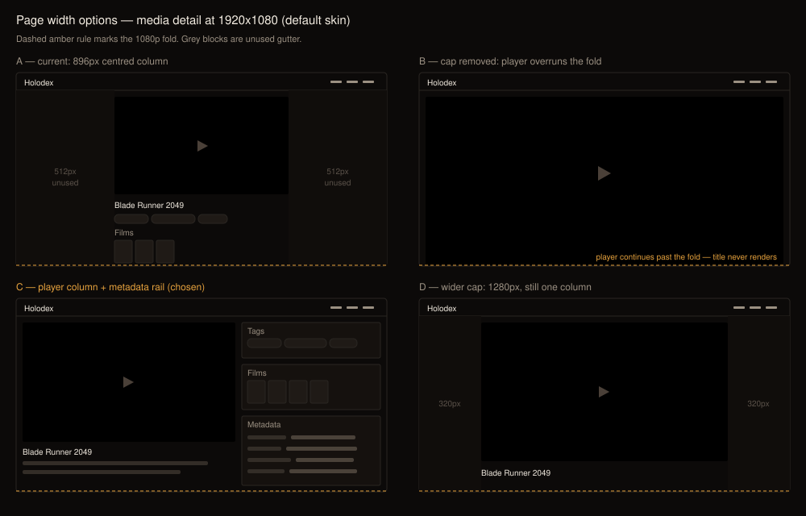
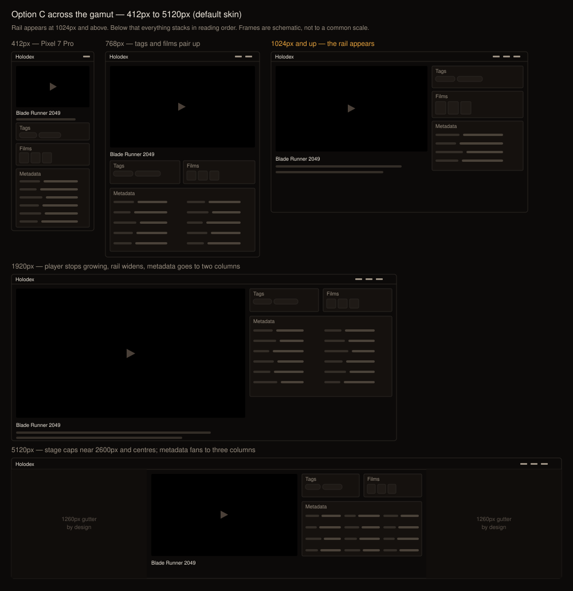

# Design handoff: Responsive page width — player column, metadata rail, intrinsic grid density

**Jira:** [HOLODEX-331](https://whoiskevinrich.atlassian.net/browse/HOLODEX-331)
**Surface:** `web/src/routes/media/[id]/+page.svelte`, `web/src/routes/films/[id]/+page.svelte`, `web/src/routes/owner/+layout.svelte` (+ its three children), `web/src/lib/density.svelte.ts`, `web/src/lib/components/video/VideoGrid.svelte`, `web/src/app.css`
**Related:** [ADR-021](../architecture/ADR-021-frontend-theming-and-skins.md) (tokens-only components), [ADR-051](../architecture/ADR-051-per-field-source-of-truth-decisions.md) (`SourceBadge` chip row in the field list), [ADR-090](../architecture/ADR-090-two-layer-entity-metadata-management.md) (the two metadata layers this layout must keep visually separate), [media-detail-metadata-fold-handoff.md](media-detail-metadata-fold-handoff.md) (the Metadata section this re-hosts), [media-detail-films-people-handoff.md](media-detail-films-people-handoff.md) (the Films + People row that moves into the rail)



## 1. Overview

The ask was "make all pages take the full width of the page instead of being constrained." The
premise needs one correction before anything else, because it changes the scope substantially.

### 1a. Most pages are already full width

`<main>` in `web/src/routes/+layout.svelte:426` is `px-6 py-6` with **no** width cap. The browse
grids (`/`, `/people`, `/studios`, `/tags`, `/films`, `/search`) and the person and studio detail
pages already run edge-to-edge. Exactly six files cap anything:

| File | Cap | Note |
|---|---|---|
| `web/src/routes/media/[id]/+page.svelte:1064` | `max-w-4xl` (896px) | the flagship case |
| `web/src/routes/films/[id]/+page.svelte:294` | `max-w-4xl` | same shape, same fix |
| `web/src/routes/owner/+layout.svelte:44` | `max-w-5xl` (1024px) | wraps all three owner pages |
| `web/src/routes/owner/status/+page.svelte:178` | `max-w-5xl` | **nested inside the layout cap** |
| `web/src/routes/owner/keys/+page.svelte:20` | `max-w-4xl` | **nested** |
| `web/src/routes/owner/trash/+page.svelte:69` | `max-w-4xl` | **nested** |

The three owner pages double-wrap: the layout caps at 1024, then each child caps again inside it.
That redundancy is a bug regardless of which direction this change takes — the inner cap can never
do anything the outer one hasn't already done.

### 1b. What's actually wrong

Removing the caps alone does **not** produce a better page, and at one end of the device range it
produces a worse one. Three distinct problems:

| # | Problem | Where |
|---|---|---|
| 1 | **The player is `aspect-video w-full`.** With no cap it grows to the full viewport: at 1920 that is a 1920x1080 player, which overruns the fold before the title renders. Width alone makes the page *less* usable. | `media/[id]/+page.svelte:1085` |
| 2 | **The field list is hardcoded `sm:grid-cols-2`.** Uncapping widens those two columns rather than adding any, so every field gains trailing dead space. Width buys nothing. | `media/[id]/+page.svelte:1713` |
| 3 | **Grid density dead-ends in both directions.** `TIERS` tops out at `{min: 1536, cap: 6}` and bottoms out at `{min: 480, cap: 2}`. Nothing happens above 1536px, and below 480px it collapses to one column. | `density.svelte.ts:57` |

Problem 3 measured on real page loads (browse grid, default density 4, poster layout):

| Viewport | Columns | Card width | Poster height (2:3) |
|---|---|---|---|
| 412 (Pixel 7 Pro) | **1** | 364px | 546px |
| 1024 | 3 | 310px | 465px |
| 1920 | 4 | 452px | 678px |
| **5120** | **4** | **1252px** | **1878px** |

At 5120 a single poster row is 1878px tall on a 1440px-tall screen — you cannot see one complete
row. At 412 one card fills 61% of the viewport. Raising `DENSITY_MAX` fixes neither end, because
the ceiling is not the binding constraint at either one.

### 1c. The rule

> **Width is spent on more information, never on bigger information.** A page uses extra width by
> adding columns — a metadata rail beside the player, more field columns, more grid cards — and
> never by scaling a fixed set of elements up. Where there is no further column to add, the content
> stops growing and centres.

This is why the 5120 frame in the ladder below is *not* edge-to-edge. It is the one deliberate
exception to the original ask, and the reasoning is in §4c.

## 2. Layout



### 2a. The stage

A new outer wrapper replaces the per-page `max-w-*` on the detail and owner pages:

```
<div class="mx-auto w-full max-w-stage">
```

`max-w-stage` comes from a new token in `app.css`'s `@theme` block, not a literal:

```css
@theme {
  --container-stage: 2600px;
}
```

Tailwind v4's `--container-*` namespace generates the `max-w-stage` utility, so this stays
tokens-only per ADR-021. **Do not** write `max-w-[2600px]`.

The three owner child pages drop their own `mx-auto max-w-*` entirely — `owner/+layout.svelte` owns
the stage for all of them.

### 2b. The two-zone split (>= 1024px)

Inside the stage, the media and film detail pages become a two-column grid:

```
grid-template-columns: minmax(0, 1.4fr) minmax(320px, 1fr);
gap: 1.5rem;   /* gap-6 */
```

`minmax(0, …)` on the player column is load-bearing: a bare `1.4fr` has `min-width: auto`, and a
long unbroken title or file path would push the column past the container and break the rail.

Left column (player zone): player, title, overview, and the "More with …" shelves.
Right column (rail): Tags, Films, People, Metadata, Manage, File — in that order.

Below 1024px the grid collapses to a single column and the rail's cards stack **in the same order**
under the player. No collapsing, no tabs — see §5b.

### 2c. Resulting geometry

Content width is viewport minus `px-6` (48px). Player and rail split at 1.4:1 with a 24px gap.

| Viewport | Content | Player col | Rail | Metadata cols in rail |
|---|---|---|---|---|
| 412 | 364 | 364 (stacked) | 364 (stacked) | 1 |
| 768 | 720 | 720 (stacked) | 720 (stacked) | 2 |
| 1024 | 976 | 555 | 397 | 1 |
| 1280 | 1232 | 705 | 503 | 1 |
| 1920 | 1872 | 1078 | 770 | 2 |
| 5120 | 2552 (capped) | 1475 | 1053 | 3 |

The player never needs its own `max-height`: at every width above 1024 the player column is
narrow enough that a 16:9 player clears the fold, and below 1024 the viewport is short enough that
a full-width player is proportionally correct. Verify this rather than assuming it if the ratio
`1.4fr` is changed.

### 2d. The field grid

`media/[id]/+page.svelte:1713` changes from:

```
class="grid grid-cols-1 gap-3 … sm:grid-cols-2"
```

to an intrinsic grid:

```
style="grid-template-columns: repeat(auto-fit, minmax(320px, 1fr))"
```

`auto-fit` (not `auto-fill`) so a single field still spans the row rather than leaving a phantom
empty track. The existing `sm:col-span-2` on long-text and image fields becomes
`grid-column: 1 / -1` so those fields span whatever the current column count is — `col-span-2` is
wrong the moment there are three columns.

Column count is now emergent, so **nothing may assume two columns**. The 320px minimum is the
floor at which a label plus its value plus its `SourceBadge` chip row still fits on one line.

### 2e. Grid density

`density.svelte.ts` stops storing a column count and stores a **target card width** instead.
`TIERS` and `capForWidth` are deleted; `VideoGrid` uses:

```
grid-template-columns: repeat(auto-fill, minmax(<target>px, 1fr))
```

`auto-fill` here, not `auto-fit`: a partially-filled last row should keep its column rhythm rather
than stretching two cards across the whole width.

The density slider keeps its five stops and its inverted direction (dragging right = bigger cards,
per the existing `invertDensity` comment), but each stop now maps to a width:

| Stop | Target width | Columns at 412 | at 768 | at 1920 | at 5120 |
|---|---|---|---|---|---|
| 1 (smallest) | 150px | 2 | 4 | 12 | 33 |
| 2 | 200px | 1 | 3 | 9 | 25 |
| 3 (default) | 260px | 1 | 2 | 7 | 19 |
| 4 | 340px | 1 | 2 | 5 | 14 |
| 5 (largest) | 440px | 0→1 | 1 | 4 | 11 |

**Migration:** existing browsers hold `holodex:media-density` values 2–6 under the old
column-count meaning. Map on read — old 6 (most columns) → stop 1, old 2 (fewest) → stop 5 — and
write back the new representation under a **new key** (`holodex:media-card-width`) so a rollback
does not read new values through old semantics. This is the piece that needs a spec note, not just
a design one.

## 3. Design tokens

No new colors. One new sizing token; everything else already exists.

| Token | Value | Usage |
|---|---|---|
| `--container-stage` | `2600px` | new — the outer stage cap, via `max-w-stage` |
| `--color-rule` | per skin | rail card borders (`border-rule`), unchanged |
| `--color-surface` | per skin | rail card fill (`bg-surface`), unchanged |
| `--color-muted` | per skin | `<dt>` field labels and section headings |
| `--color-ink` | per skin | `<dd>` field values |
| `--radius-theme` | 2px / 0px / 0px | rail cards (`rounded-theme`) |
| `gap-6` | 1.5rem | between player zone and rail |
| `gap-3` | 0.75rem | between field-grid cells |

## 4. Decisions and their reasons

### 4a. Why a rail rather than simply removing the cap

Removing the cap is the literal reading of the request and it makes the page worse: the player is
the element that grows, and it is the one element that should not. The rail converts the same
pixels into content that is currently below the fold.

### 4b. Why the field grid change is not optional

It is the difference between the width paying for itself and not. With `sm:grid-cols-2` intact, a
wider page produces two very wide columns with trailing dead space after every value — more pixels,
identical information. This change and the width change must ship together.

### 4c. Why 5120 is capped rather than edge-to-edge

This is the one place the implementation deliberately departs from the original ask. At 5120 an
uncapped rail puts a field's value roughly a screen-width from its label, and an uncapped player
column exceeds most monitors outright. The stage caps at 2600px and centres, which leaves ~1260px
of gutter each side on a 5120 display.

The gutters are the cost of legibility, and they are accepted knowingly. **Browse grids are not
subject to the stage cap** — they have a further column to add at any width, so §1c's rule keeps
them edge-to-edge all the way out.

### 4d. Why the rail stacks rather than collapses or tabs on mobile

Both alternatives hide content by default, and `#field-*` deep links (the anchors the Metadata
section relies on) would land on a collapsed or unselected panel. Stacking keeps every field
reachable and every anchor scrollable-to with no extra state to synchronise.

## 5. States and responsive behavior

### 5a. Breakpoints

| Breakpoint | Layout |
|---|---|
| < 480px | Single column. Grid: 1–2 cards depending on density stop. |
| 480–767px | Single column. Rail cards stacked full-width, field grid 1 column. |
| 768–1023px | Single column. Tags and Films cards pair side by side; field grid 2 columns. |
| 1024–2599px | Two zones: player column + rail. Field grid 1–2 columns inside the rail. |
| >= 2600px | Stage caps and centres; layout otherwise identical to 1024–2599. Field grid 3 columns. |

The 1024px rail threshold is a **container** decision, not a viewport one in spirit — if the page
ever gains a persistent sidebar, this should become a container query rather than a media query.
Media query is correct for now because `<main>` spans the viewport.

### 5b. Element states

| Element | State | Behavior |
|---|---|---|
| Rail card | default | `border-rule`, `bg-surface`, `rounded-theme`, `p-4` |
| Rail card | empty section | Collapses entirely per `media-detail-films-people-handoff.md` — no heading, text CTA only. Unchanged by this work. |
| Field row | long value | Spans all columns via `grid-column: 1 / -1` |
| Field row | deep-linked (`#field-*`) | Unchanged scroll-to and highlight; must still work when the rail is stacked |
| Player | codec failure | Existing download fallback, now constrained to the player column width |
| Grid | resize across a stop | Column count changes on the next `resize` event; no transition |

### 5c. Edge cases

- **Very long field values** (file paths, URLs) — the `minmax(0, 1.4fr)` on the player column and
  `minmax(320px, 1fr)` on the rail both clamp min-content. Verify with a 200-character path.
- **One field in the list** — `auto-fit` collapses to a single full-width row rather than leaving
  empty tracks.
- **Rail empty entirely** (no tags, no films, no people, no metadata) — the rail column renders
  nothing and the player column should not stretch to fill it; keep the grid columns fixed so the
  player stays the same size as on a populated page.
- **Ultra-narrow** (<360px, e.g. a folded device) — one card, `px-6` still applies; check nothing
  overflows horizontally.
- **Zoom to 200%** at 1920 — effective width 960, so the layout must degrade through the 1024
  breakpoint to stacked, not clip.

## 6. Motion

| Element | Trigger | Animation | Duration | Easing |
|---|---|---|---|---|
| Metadata fold | toggle | existing `transition-[max-height]` | 200ms | `ease-out` |
| Grid / rail reflow | viewport resize | **none** — no transition on `grid-template-columns` | — | — |

Do not animate the reflow. Transitioning grid track counts produces a visible stutter during window
drags and there is no user intent to acknowledge.

## 7. Accessibility

- **Focus order follows DOM order**, which is player zone then rail. Because the rail is later in
  the DOM at every breakpoint, the stacked and two-zone layouts have identical focus order — no
  `order-*` utilities anywhere in this layout, which would desynchronise visual and tab order.
- **The rail is not a landmark.** Its cards keep their existing `<section>` + `<h2>` structure; do
  not add `role="complementary"`, which would imply the metadata is tangential to the page when it
  is the page's primary content.
- **Heading hierarchy is unchanged** — the `<h2 class="text-xs uppercase tracking-wide text-muted">`
  section headings stay as they are, in the same order.
- **`prefers-reduced-motion`** — already honored by the metadata fold's
  `motion-reduce:transition-none`; the reflow has no animation to suppress.
- **Reflow (WCAG 1.4.10)** — content must not require two-dimensional scrolling at 320px width.
  The stacked layout satisfies this; verify no horizontal scrollbar appears at 320px.

## 8. QA

Three-skin QA is required (Cinémathèque, Broadcast, Brutalist) at each breakpoint, per
`.claude/rules/frontend-theming.md`. Widths to check: **412, 768, 1024, 1280, 1920, 5120**.
Reload at each width rather than resizing — the tier logic reads `window.innerWidth` at
construction and a resize is a different code path.

A full numbered checklist lives in
[responsive-page-width-qa-checklist.md](responsive-page-width-qa-checklist.md).

## 9. Open items

1. **`docs/design/theming.md` may need a note** on the new `--container-stage` token so it is not
   re-derived as a literal elsewhere.
2. **No ADR proposed.** This is a layout convention plus a component-local storage change, not a
   cross-cutting architectural decision. If the stage cap is expected to govern future pages as a
   standing rule rather than a per-page choice, that judgment should be revisited and an ADR
   written — flag it rather than assuming this call was right.
3. **The film detail page's hero** (`films/[id]/+page.svelte`) has a banner rather than a player.
   The rail applies, but the left-column geometry in §2c was derived from the video player; confirm
   the banner's aspect ratio does not want a different split.
