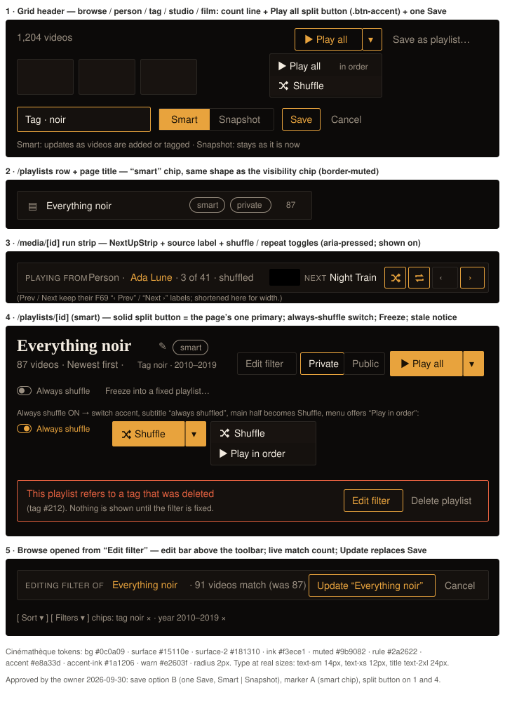

# Handoff Spec: Smart playlists, Play all and Shuffle (F75)

**Spec:** [smart-playlists.md](../specs/smart-playlists.md) · **ADR:** [ADR-121](../architecture/archive/ADR-121-smart-playlists-stored-query-and-runs.md) ·
**Extends:** [video-playlists-handoff.md](video-playlists-handoff.md) (F69) · **Jira:** HOLODEX-58, HOLODEX-500, HOLODEX-501
**Approved:** owner, 2026-09-30. Save **option B** (one *Save as playlist…* with a Smart | Snapshot
toggle), marker **option A** (`smart` chip), and Play all / Shuffle as **one split button** on grids
and playlist pages. Cinémathèque only.



## Overview

Every video grid with a `/media` query behind it (browse, person, tag, studio, film) gets a **count
line** with a **Play all split button** (Shuffle in its menu) and, for the owner, **Save as
playlist…**, whose inline form chooses **Smart** (stored query, live) or **Snapshot** (F69). Runs
play through the F69 next-up strip, which gains a source label and shuffle / repeat toggles. Smart
playlists get a chip, *Edit filter*, *Freeze*, an *Always shuffle* switch and a stale-reference notice.
Browse gains an edit mode for updating a smart playlist's filter.

Same rule as F69: **reuse existing idioms**. The only new component is the split button, composed
from `.btn-accent` / the solid primary and the existing `PageActions` menu.

## Divergences from shipped / approved F69 (approved 2026-09-30)

1. **Browse's *Save as playlist…* moves** from the ⋯ `PageActions` menu (`web/src/routes/+page.svelte:385`)
   to the count line, and its form gains the Smart | Snapshot toggle. Remove the ⋯ entry, so there's
   one save. (F69's handoff placed it in the toolbar; the shipped code put it in ⋯.)
2. **F69's solid *▶ Play all* on playlist pages becomes the solid split button** (panel 4), on
   snapshot playlists too.

## Layout

### 1 · Count line (all query-backed grids)

Sits directly above `VideoGrid`, below the toolbar / chips on browse. On entity pages it goes inside
`EntityVideos.svelte`'s `#videos` wrapper, above the grid (that page has no toolbar today).

```
<div class="flex flex-wrap items-center justify-between gap-x-4 gap-y-2">
  <p class="text-sm text-muted">{total} videos</p>
  <div class="flex flex-wrap items-center gap-2">
    <PlaySplitButton variant="accent" … />
    {#if isOwner}<button class="btn-quiet px-3 py-1.5 text-sm">Save as playlist…</button>{/if}
  </div>
</div>
```

- On browse this **replaces** the existing count `p.text-sm.text-muted` from `ListToolbar`'s count
  snippet. There must be one count, not two.
- `{total}` is the query's total (from `/media`), never the loaded page length.
- Search results, `RelatedShelf` and `RecentlyAddedShelf` get no count line actions.

### Save form (opens below the count line, replacing the F69 form position)

`flex flex-wrap items-center gap-2`, in this order:

- name `input` (existing classes, `placeholder="Playlist name"`, prefilled with the source label, e.g.
  "Tag · noir" or "Ada Lune")
- **Smart | Snapshot** segmented toggle (`segmentedToggle.ts` classes: wrapper `flex overflow-hidden
  rounded-theme border border-rule text-sm`, active `bg-accent px-3 py-1 text-accent-ink`, inactive
  `px-3 py-1 text-muted hover:text-ink`), **Smart selected by default**
- `Save` (`.btn-accent px-3 py-2 text-sm`) and `Cancel` (`.btn-quiet px-3 py-2 text-sm`)
- helper line `basis-full text-xs text-muted`: *Smart: updates as videos are added or tagged ·
  Snapshot: stays as it is now*
- errors `basis-full text-sm text-warn` (same as F69)

Smart posts `{name, query}`; Snapshot posts F69's `{name, from_query}`. The toast is F69's: "Saved
‹name›" plus a link, with "· N videos" for snapshots and "· N videos now" for smart.

### 2 · Smart chip

`PlaylistVisibilityChip`'s shape in the **muted** variant: `shrink-0 rounded-full border border-muted
px-2 py-0.5 text-xs text-muted`, text `smart`. Either extend the chip component with a `kind` prop or
add a sibling `PlaylistSmartChip`; don't copy the classes. Placement:

- `/playlists` row: after the name, **before** the visibility chip.
- `/playlists/[id]`: inline after the title's ✎, vertically centred on the title.

### 3 · Run strip (`NextUpStrip.svelte`)

Unchanged root and left / centre structure, with these changes:

- **Label**: `PLAYING FROM` + `{source kind} ·` (`text-muted`) + source name (`font-medium text-accent`,
  linking to the source page or the playlist) + `· n of N` + `· shuffled` when the mode is shuffle.
  Source kinds: `Person`, `Tag`, `Studio`, `Film`, `Browse`, and none for a playlist (its name alone,
  as F69).
- **Toggles**: two icon-only buttons at the start of the right cluster, before `‹ Prev`:
  `btn-ghost px-2 py-1.5`, `aria-pressed`. Off: the default ghost look. On: `border-accent text-accent`
  (F69's active-segment treatment). Icons are inline SVG, 14px, `stroke="currentColor"` (shapes in
  the mockup's `#shuf` / `#rep`).
  - Shuffle: `aria-label="Shuffle"`, `title="Shuffle (on|off)"`. Toggling reorders only unplayed items
    (spec RD11).
  - Repeat: `aria-label="Repeat"`. **Off by default.**
- The `aria-live` position text announces "Shuffled" or "In order" on toggle.

### 4 · Playlist page header (`routes/playlists/[id]`)

Right-hand control group, in order:

1. **Edit filter** — smart playlists only, owner only, `.btn-ghost px-3 py-2 text-sm`; navigates to
   browse in edit mode (panel 5).
2. The F69 sort dropdown. `Manual order` is **hidden** for smart playlists, since the API refuses it.
3. The F69 Private | Public segment.
4. **PlaySplitButton**, `variant="primary"` (solid). Its main half is *▶ Play all*, or *Shuffle* when
   *Always shuffle* is on.

Sub-title line: `{count} videos · {sort label}`. For smart playlists add ` · ` +
`<span class="text-xs">` with the query described in words (spec P1-3; omit until P1-3 lands). When
*Always shuffle* is on, add ` · always shuffled` (`text-accent text-xs`).

Below the header (owner only), `flex items-center gap-4 text-xs`:

- **Always shuffle** switch: the `EntityImageSlot.svelte:272-290` switch markup (`role="switch"`,
  `aria-checked`). Extract it into a shared `Switch.svelte` at its second use rather than copying it.
- **Freeze into a fixed playlist…** — smart playlists only, `.btn-quiet text-xs`. Opens `ConfirmDialog`:
  "Freeze ‹name›? It will keep its current N videos and stop updating." Confirm label: `Freeze`.

**Stale-reference notice** (smart playlists whose read returns `stale_refs`). It sits between the
header and the grid, replacing the grid:

- container `flex flex-wrap items-center justify-between gap-3 rounded-theme border border-warn
  bg-surface px-3 py-2`
- text: `text-warn` sentence + `text-xs text-muted` detail
- actions: `Edit filter` (`.btn-accent px-3 py-1.5 text-sm`) and `Delete playlist` (`.btn-quiet`, the
  existing ConfirmDialog flow)

Visitors see the notice without actions and with the copy "This playlist can't be shown right now."
Warn styling is justified because the playlist is broken; it's not decoration.

Copy by `stale_refs[].kind`:

| kind | sentence | detail |
|---|---|---|
| deleted entity | This playlist refers to a {person / tag / studio / category} that was deleted | ({kind} #{id}). Nothing is shown until the filter is fixed. |
| vanished mapped key | This playlist filters on a field that no longer exists | ({key}). Nothing is shown until the filter is fixed. |
| owner_only on public | This public playlist uses an owner-only filter | ({key}). Make it private or edit the filter. |

### 5 · Browse edit mode

Entered via `/?<stored query>&edit_playlist=<id>`; the flag is UI state and is never saved. A bar
above `ListToolbar`:

- container `flex flex-wrap items-center justify-between gap-3 rounded-theme border border-rule
  bg-surface px-3 py-2 text-sm`
- left: `EDITING FILTER OF` (`text-xs uppercase tracking-wide text-muted`), then the name
  (`text-accent`), then `· {total} videos match (was {n})` (`text-muted`). `(was n)` is the count when
  edit mode opened.
- right: **Update "‹name›"** (`.btn-accent px-3 py-1.5 text-sm`) and **Cancel** (`.btn-quiet`)

While in edit mode the count line's *Save as playlist…* is hidden; Play all stays. Update PATCHes
`{query}`, then navigates to the playlist. Cancel returns to it (`history.back()` when in-app, per
ADR-114 D4). Clearing all filters is allowed: "everything" is a valid query.

## The split button (`PlaySplitButton.svelte`, `web/src/lib/components/video/`)

| Prop | Type | Notes |
|---|---|---|
| `variant` | `'accent' \| 'primary'` | `accent` = `.btn-accent` halves (grids); `primary` = `bg-accent text-accent-ink font-medium`, `px-4 py-2` main half (playlist page) |
| `shuffleFirst` | `boolean` | true when Always shuffle is on: the main half is Shuffle and the menu's second item is *▶ Play in order* |
| `disabled` | `boolean` | empty set: both halves get the ghost look with `aria-disabled="true"` (F69's withdrawn treatment, never `opacity`) |
| `onplay` | `(mode: 'in-order' \| 'shuffled') => void` | starts the run (ADR-121 D7) |

- **Halves**: main `rounded-r-none`, caret `rounded-l-none px-2` with a 1px divider. `border-l` in
  accent for `accent`, in `accent-ink` for `primary`. Caret `aria-label="More play options"`,
  `aria-haspopup="menu"`, `aria-expanded`.
- **Menu**: reuse `PageActions`' popover and menu behaviour (positioning, focus, Esc, outside
  click). If it can't take a custom trigger, extract its menu part and use it in both places; don't
  write a second menu. Items: `▶ Play all` with a `text-xs text-muted` "in order" suffix, then
  `Shuffle` with the icon. With `shuffleFirst` the items are `Shuffle`, `▶ Play in order`.
- **The main half is fixed.** It never changes to the last-used option (owner decision).

## States and Interactions

| Element | State | Behavior |
|---|---|---|
| Split main | hover | `.btn-accent`: 10% accent fill / primary: existing hover |
| Split main | click | fetch ids (`GET /media/ids` or playlist ids), go to item 1 with `?run=`, in-app play intent ⇒ autoplay |
| Split main | loading | `aria-busy="true"`, label unchanged, no spinner; repeat clicks ignored until navigation |
| Split main | fetch error | toast in the existing error style: "Couldn't start playback"; stays on the page |
| Caret | click / Enter / Space / ↓ | opens the menu, focus on the first item |
| Menu | ↑ ↓ / Enter / Esc | move / choose / close and return focus to the caret |
| Split | disabled | ghost look, `aria-disabled`, not focusable as an action |
| Save as playlist… | click | opens the form, focus on the name input |
| Smart / Snapshot | change | helper line stays; the name is kept |
| Run toggles | click | flip `aria-pressed`; the current item never changes |
| Always shuffle | toggle | PATCH `{play_shuffled}`; optimistic, revert + `text-warn` line on failure |
| Freeze… | confirm | POST freeze; on success the chip and Edit filter disappear and Manual order appears |
| Edit filter | click | browse in edit mode with the stored query |

## Responsive Behavior

| Breakpoint | Changes |
|---|---|
| ≥ 768px | as drawn |
| < 768px | the count line wraps: count on its own row, actions below (`flex-wrap`). Split button and Save keep their size. The run strip already wraps (F69); the toggles stay with Prev / Next in the right cluster. Edit-mode bar wraps: Update / Cancel go below the label. The playlist header follows F69's wrap. |

## Edge Cases

- **Empty set**: count line reads `0 videos`, split button disabled, Save still allowed (a smart query
  can be empty today and fill later).
- **One item**: Play all plays it; repeat replays it. Shuffle has nothing to reorder but is allowed.
- **Very large sets** (thousands): only ids are fetched, so no tile payload. The count uses
  `toLocaleString()`.
- **Long names**: the source name in the run strip and edit bar is `truncate` with a `max-w-[24ch]`
  cap and the full name in `title`. Playlist titles wrap as in F69.
- **Visitor**: no Save, no Edit filter, no Freeze, no switch. A visitor on a public always-shuffle
  playlist gets *Shuffle* as the main half.
- **Run reload** (spec behaviour detail): the strip renders from the restored run; no autoplay.
- **Stale + public**: visitors get the actionless notice and no items (ADR-121 D5).

## Animation / Motion

None beyond existing hover transitions. The menu opens without animation, as `PageActions` does.

## Accessibility Notes

- **Focus order on the count line**: split main → caret → Save as playlist…
- **On the playlist page**: Edit filter → sort → visibility → split main → caret → (row below) Always
  shuffle → Freeze…
- The split button is two real buttons, not one widget pretending to be both. The menu uses
  `role="menu"` / `menuitem`, as `PageActions` does.
- Toggles are `aria-pressed` buttons with text labels in `aria-label`. The switch is `role="switch"`.
- The stale notice is `role="status"` (not `alert`; it is present on load, not a new event).
- Hotkeys: F69's `n` / `p` are unchanged. A Play-all hotkey is spec P1-2, not in this handoff.

## QA (Cinémathèque only)

1. `[agent]` Count line + split button on browse, person, tag, studio and film. None on search or the shelves.
2. `[agent]` Browse ⋯ no longer lists "Save as playlist…"; the count line does.
3. `[agent]` Save form defaults to Smart; Snapshot creates an F69 playlist (no chip).
4. `[agent]` Run strip toggles: `aria-pressed` flips, the current item doesn't change, "· shuffled" appears.
5. `[agent]` Smart page: chip, Edit filter, no Manual order, Freeze removes the chip.
6. `[agent]` Always shuffle on: main half reads Shuffle; the menu offers "Play in order".
7. `[agent]` Stale notice for a deleted tag; visitor variant has no actions.
8. `[human]` The split button reads as one control on both variants; the caret divider is visible on the solid variant.
