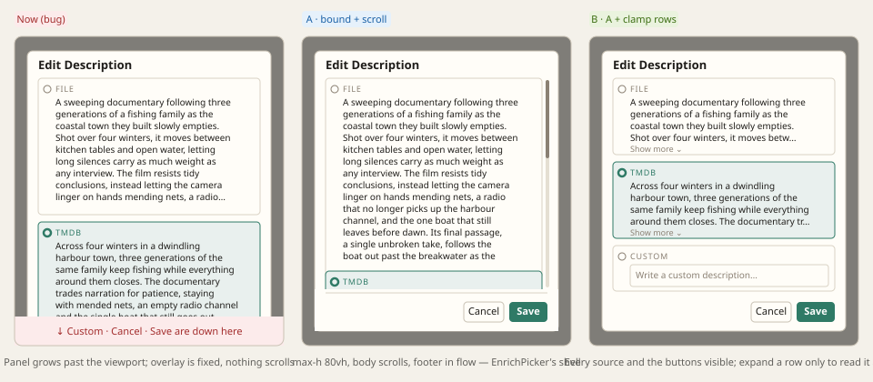

# Design handoff — `SourceEditModal` at paragraph length (HOLODEX-417)

Bug: the Edit Description modal (Media overview; the same `SourceEditModal` serves Film
overview and Person bio) pushes Save and Cancel below the viewport once a source value is long
(~2000 characters), and nothing scrolls. Produced via `/design-critique` + a side-by-side mockup
this session before any code.

**Mockup:** [source-edit-modal-overflow-mockup.svg](source-edit-modal-overflow-mockup.svg)

## Root cause

- `ConfirmDialog`'s overlay is `fixed inset-0 … items-start py-[12vh]` and its panel has no
  `max-h` and no `overflow`. A fixed overlay never scrolls the document, so anything past the
  bottom edge is unreachable by mouse (Tab still reaches Save — the only reason the modal
  worked at all).
- `SourceEditModal` renders every `chip.value` in full. 2000 chars × 2–3 namespaces is four to
  five viewport heights before the Custom textarea and the footer.
- Every sibling modal already bounds itself: `EnrichPicker` is `flex max-h-[80vh] flex-col` with a
  `flex-1 overflow-y-auto` list; `WritebackFormDialog` wraps its body in `max-h-[60vh]
  overflow-y-auto`. `ConfirmDialog` was the odd one out.

## Options considered

- **A — bound + scroll.** Give `ConfirmDialog` the `EnrichPicker` shell: `max-h-[80vh]` flex
  column, body is the scroll region, footer stays in flow. One file, fixes all eleven callers
  (`MergeCanonicalDialog` was exposed the same way with many aliases).
- **B — A + clamp rows.** Also clamp each source row to four lines with a Show more / Show less
  toggle. Restores the comparison the modal exists for: with A alone a 2000-character row is
  still a screen and a half, so the sources being compared are never on screen together.

**Decision: ship both, plus the Custom textarea at `rows="5"`** (it was `3`; with B's savings the
field you actually type into can afford the room).

## Components

### `ConfirmDialog` (shared)

Panel: `flex max-h-[80vh] w-full max-w-md flex-col …`. Body (`#confirm-body`): `min-h-0 flex-1
overflow-y-auto`. Error line and footer: `shrink-0`. Nothing else changes — focus trap, initial
focus, Esc/backdrop, motion are untouched. `focus()` on a checked radio scrolls it into view,
so initial focus still lands on the current selection even when it sits below the fold.

### `SourceValueClamp` (curation, new)

`web/src/lib/components/curation/SourceValueClamp.svelte` — a source's value clamped to four
lines with a text toggle.

| Prop | Type | Purpose |
|---|---|---|
| `text` | `string` | The (already trimmed, non-empty) value |
| `label` | `string` | The source label, for the toggle's `aria-label` ("Show the full TMDB value") |

- `line-clamp-4` + `wrap-anywhere` (HOLODEX-363's rule — an unbreakable token inside
  `overflow:hidden` is otherwise clipped silently), `leading-relaxed` so the clamp budget
  resolves in px.
- Toggle is `btn-quiet text-xs` with the `ExpandableText` chevron at `h-3 w-3`; `aria-expanded`
  / `aria-controls` on the value span. **Not rendered when the text fits** (HOLODEX-361 —
  a control that cannot change what you see is one the reader learns to distrust).
- Measured against the clamp *budget* (`scrollHeight > lineHeight × 4`), not `clientHeight`,
  so the toggle survives its own expansion; re-measured on width change and `document.fonts.ready`.
- Not `ExpandableText`. That component is deliberately the one look for *displayed* prose —
  muted, no styling props (HOLODEX-365). This is evidence under a radio and keeps the row's
  ink tone; adding a `tone` knob back to `ExpandableText` would re-open what 365 closed.
- Lives inside the row's `<label>`; a `<button>` is interactive content, so clicking it does not
  activate the radio.

### `SourceEditModal`

Non-empty values render through `SourceValueClamp`; "No value" stays a muted string. Custom
textarea `rows="5"`.

## States

| State | Behaviour |
|---|---|
| All sources short | Identical to before — no toggles, no scrollbar |
| One source long | That row clamps with Show more; the panel is shorter than 80vh, no scrollbar |
| Long + expanded | Body scrolls inside the panel; Save/Cancel pinned below the scroll region |
| Custom selected, long typed value | Textarea grows to 5 rows and stays inside the scroll region; no clamp on the textarea |

## Three skins

Tokens only (`border-rule`, `bg-surface`, `text-muted`, `text-accent`, `btn-quiet`). The
scrollbar is the platform's; the footer has no added border — the panel's own padding
separates it, as in `EnrichPicker`.

## Deferred

- A sticky hairline over the footer while the body is scrolled (`WritebackFormDialog` has
  neither, `EnrichPicker` has neither). Revisit if a long-body `ConfirmDialog` reads as if the
  footer is a row.
