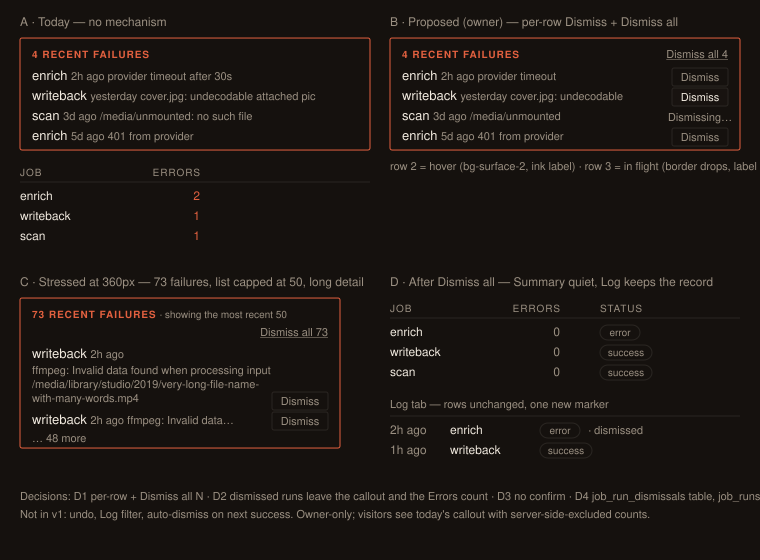

# Design handoff: dismiss addressed failures on the status page (HOLODEX-416)

**Surface:** `/owner/status` → *Recent jobs* → **Summary** tab → the `N recent failures`
callout in `web/src/lib/components/activity/JobDigest.svelte`, plus a one-marker change to the
**Log** tab (`JobHistory.svelte`).
**Related:** spec `docs/specs/job-history-digest-and-search.md` (Q4 — this resolves it),
`docs/design/system-activity-handoff.md`, ADR-071 (digest), ADR-091 (writeback dismiss leaves
`job_runs` as the audit record).
**Status:** approved 2026-09-18 — all four decisions below were taken from the inline mockup.



## Overview

The callout lists every `status = error` run in the 30-day window. Once the owner has
addressed a failure — fixed the file, rotated the key, retried the write — nothing clears
it, so the callout and the per-kind **Errors** column stay warn-coloured for up to 30 days
and a genuinely new failure is lost in the noise. This adds a way to say "seen, handled" per
failure or for the whole window, without touching the audit record.

## Decisions (locked)

| # | Decision | Chosen | Why |
|---|---|---|---|
| D1 | Controls | Per-row **Dismiss** + header **Dismiss all N** | One-offs need a row control; a bad batch (50+ rows, list capped at 50) needs a bulk one. `N` is the true total (`sum(kinds[].errors)`), never the capped list length. |
| D2 | Scope | Dismissed runs leave the callout **and** the per-kind `errors` count | Otherwise the Errors column stays `text-warn` after everything is handled and the page never quiets. The Log tab keeps every run. |
| D3 | Confirm | None, for both controls | Matches the queue-row Dismiss idiom (`ExtractionQueueRow`): immediate, row-clearing. Nothing is deleted — the Log is the record — so a slip costs nothing. |
| D4 | Persistence | New `job_run_dismissals (job_run_id PK, dismissed_at)` | Sibling of `enrichment_dismissals`; `job_runs` stays immutable as 0028 / ADR-091 assume. Recorded in the ADR (gate). |
| D5 | Status badge when a kind's **newest** run is a dismissed error | **Muted** `error` badge + `· dismissed` marker (added at spec time, 2026-09-18) | `last_status` is the newest run's fact and must not lie — an older `ok` standing in for a failed run was rejected — but a warn badge that outlives its dismissal keeps the page from quieting. Muting it and reusing the Log's marker says both things: it failed, and it is handled. A later failure of the kind is a new undismissed run, so the badge returns to `--warn` on its own. |

Deliberately **not** in v1: undo / undismiss (the Log row is the recovery path — "it's in the
Log" is the answer, not a toast), a "dismissed" filter on the Log, auto-dismiss on a later
successful run of the same kind, visitor visibility of dismissal state.

## Layout

The callout keeps its exact frame: `rounded-theme border border-warn bg-surface px-3 py-2`,
`role="alert"`. Two additions.

**Header** — the `<h3>` becomes a flex row so the bulk control sits at the trailing edge:

```
[ 73 RECENT FAILURES · showing the most recent 50 ............. Dismiss all 73 ]
```

- `h3`: add `flex flex-wrap items-baseline gap-x-2`. Existing text and the `· showing…` note
  are unchanged.
- Bulk button: `btn-quiet ml-auto text-xs normal-case tracking-normal font-normal` — the
  `h3` is `uppercase tracking-wide font-semibold`, so the button must reset all three or it
  shouts. Label `Dismiss all {totalFailures}`; while in flight `Dismissing…`.
- Owner-only (`isOwner` from the page — `activity.effectiveOwner`, same gate as the Actions
  card). Visitors see the callout exactly as today.

**Row** — each `<li>` gains a trailing row action:

```
enrich   2h ago   provider timeout after 30s ......................... [ Dismiss ]
```

- `li` stays `flex flex-wrap items-baseline gap-x-2 text-sm`; the detail span becomes
  `flex-1 min-w-0 wrap-anywhere` (it is the only cell allowed to wrap — see HOLODEX-356 rule:
  `wrap-anywhere` on the flex item, not `break-words`).
- Button: `btn-row btn-ghost px-2 ml-auto shrink-0` — same composer as `ExtractionQueueRow`'s
  `GHOST`. Label `Dismiss`; in flight `Dismissing…` with `disabled` + `aria-busy`.
- On success the row leaves the list and `totalFailures` decrements. When it reaches 0 the
  whole callout unmounts (the existing `{#if totalFailures > 0}`), and the per-kind table's
  Errors cell for that kind drops to `0` in `text-muted`.

**Log tab** — `JobHistory.svelte`: a dismissed run's status cell reads
`<JobStatusBadge status="error" /> <span class="text-xs text-muted">· dismissed</span>`. No
button, no row change. Requires `dismissed_at?: string` on `JobRun` in `types.ts`.

**Digest Status cell (D5)** — when `k.last_dismissed` is true the badge renders muted:
`rounded-theme border border-rule px-1.5 py-0.5 text-[10px] font-semibold text-muted` (the
`error` badge's shape with `--rule`/`--muted` in place of `--warn`), followed by the same
`<span class="text-xs text-muted">· dismissed</span>` as the Log. Add a `muted` prop to
`JobStatusBadge` rather than a second component so the two tabs cannot drift. Requires
`last_dismissed: boolean` on `JobKindDigest` in `types.ts`.

## Design tokens used

| Token / class | Usage |
|---|---|
| `border-warn`, `text-warn` | Callout frame + heading — unchanged; the warn colour must disappear from the page once everything is dismissed |
| `btn-ghost` + `btn-row` | Per-row Dismiss (bordered neutral: "resolves the row now") |
| `btn-quiet` | Header Dismiss all (borderless; hover underline) |
| `text-muted`, `text-ink` | Row cells, `· dismissed` marker |
| `rounded-theme`, `bg-surface` | Callout frame — unchanged |

No new tokens. No hardcoded colours, sizes, or radii. QA all three skins (Cinémathèque, and
the two others in `app.css` `[data-skin]` blocks) — the warn hue differs per skin and the
`btn-quiet` hover underline must be visible against `bg-surface` in each.

## States and interactions

| Element | State | Behaviour |
|---|---|---|
| Row Dismiss | Rest | `btn-ghost`: `--rule` border, `--muted` label |
| Row Dismiss | Hover | `bg-surface-2`, `--ink` label (class default) |
| Row Dismiss | In flight | `disabled` + `aria-busy="true"`, label `Dismissing…`, border drops (class default) |
| Row Dismiss | Success | `POST /admin/activity/runs/{id}/dismiss` → 200 → remove row locally, `totalFailures -= 1`, decrement `kinds[k].errors` for that kind. No refetch needed; the next `loadDigest()` (scan idle, tab switch) agrees with the server |
| Row Dismiss | Error | Button returns to rest; page-level toast via the existing `showToast()` (`Couldn't dismiss — try again`). Row stays |
| Dismiss all | Rest | `btn-quiet`, label `Dismiss all {N}` |
| Dismiss all | In flight | `disabled`, label `Dismissing…`; row buttons also `disabled` to prevent a double-submit race |
| Dismiss all | Success | `POST /admin/activity/failures/dismiss` (dismisses every undismissed error run in the digest window, including the ones beyond the 50-row cap) → callout unmounts, every `kinds[].errors` → 0 |
| Dismiss all | Error | Toast as above; nothing changes |
| Callout | 0 failures | Absent (existing behaviour) |
| Per-kind Errors cell | 0 after dismissal | `text-muted` (existing conditional class) |
| Per-kind Status cell | Newest run is a dismissed error | Muted `error` badge + `· dismissed` (D5); set `last_dismissed` locally when the dismissed row's `started_at` equals the kind's `last_run`, so no refetch is needed |
| Per-kind Status cell | A newer failure arrives | Warn `error` badge again — the newest run is undismissed |
| Log row | Dismissed | `· dismissed` marker after the status badge; Revert (if any) unaffected |
| Visitor | Any | No buttons rendered; counts already exclude dismissed runs server-side |

Keyboard: both buttons are native `<button>`s in DOM order — Tab reaches every row's Dismiss
in list order, then the table. No roving tabindex needed (this is not a popup list). Enter /
Space activate. Focus after a row leaves: move focus to the next row's Dismiss, or to the
section heading `h2` ("Recent jobs") when the callout unmounts, so focus never lands on
`body`.

## Content

- Header: `{N} recent failure(s)` unchanged; `· showing the most recent 50` unchanged.
- Bulk label always carries the number: `Dismiss all 73`. When `N === failures.length` the
  number is still shown (`Dismiss all 4`) — it doubles as the "how many am I clearing" cue
  that replaces a confirm dialog (D3).
- Row label: `Dismiss`. Never `✕` — the row already has three unlabeled text spans; a glyph
  adds a fourth thing to decode, and the ghost button's border is the affordance.
- Toast on failure: `Couldn't dismiss — try again`. Sentence case, no `!`, no "error:".

## Edge cases

- **Long detail** (`error_message` can be a full ffmpeg line): detail wraps under
  `wrap-anywhere`; the button never wraps or shrinks (`shrink-0`). At 360px a row is:
  kind + ago on line 1, detail on lines 2–n, Dismiss at the end of the last line (flex-wrap
  puts it after the detail; `ml-auto` pushes it right).
- **More failures than shown** (N > 50): per-row buttons cover only the visible 50;
  `Dismiss all N` covers the window. After dismissing the visible 50 the next `loadDigest()`
  surfaces the next slice — the header count already told the owner they exist.
- **Failure arrives mid-flight**: `Dismiss all` is window-scoped server-side at request time;
  a run that starts after the call is not dismissed and appears on the next refresh. Correct
  by construction — no client-side id list is sent.
- **Retention sweep** (30 days, `jobRunRetentionDays`): a dismissal row must not outlive its
  run — delete `job_run_dismissals` alongside, or FK `ON DELETE CASCADE` (ADR to choose).
- **Same run dismissed twice** (two tabs): second call is a no-op 200 (`dismissed: false`),
  mirroring `dismissWriteback`'s "absent row" posture. Client removes the row either way.
- **Empty digest** (`kinds.length === 0`): unchanged `No jobs recorded yet.`

## Motion

None. Rows leave the list without transition (matches every other queue row on the owner
pages). `prefers-reduced-motion` therefore has nothing to gate.

## Accessibility

- The callout is `role="alert"`; adding buttons inside it is fine, but do **not** re-announce
  on every row removal — the count in the `h3` changes and that is enough. Do not add
  `aria-live` to the list.
- Row button `aria-label="Dismiss {kind} failure from {formatAgo(started_at)}"` so a screen
  reader distinguishes ten identical `Dismiss` buttons.
- Bulk button: visible label is sufficient (`Dismiss all 73`).
- In-flight: `aria-busy="true"` on the button, `disabled` on the control.
- Colour is never the only signal: the `· dismissed` marker is text; the quiet page state is
  the *absence* of the callout, not a colour change alone.
- Target size: `btn-row` is `min-height: 1.5rem` (24px) — meets the 24×24 floor that
  HOLODEX-357 is still deciding for chips; row buttons are already at it.

## API contract (for the spec / ADR)

| Method | Path | Body | 200 |
|---|---|---|---|
| `POST` | `/admin/activity/runs/{id}/dismiss` | — | `{ "dismissed": bool }` |
| `POST` | `/admin/activity/failures/dismiss` | `{ "days": 30 }` (same window param as the digest) | `{ "dismissed": n }` |

Both under `requireOwner`. `GET /admin/activity/digest` excludes dismissed runs from both
`kinds[].errors` and `failures`, and adds `last_dismissed: bool` to each `kinds[]` entry (true
when the newest run is a dismissed error — D5). `GET /admin/activity/history` returns every
run and adds `dismissed_at` when set.

## Implementation notes

- `JobDigest.svelte` currently takes `{ digest }` only; it needs `isOwner` and an
  `ondismissed` / local mutation path. Prefer mutating a local `$state` copy of the digest
  (rows leave instantly) over refetching — refetch on the next existing `loadDigest()` trigger.
- Reuse the `GHOST` constant idiom from `ExtractionQueueRow.svelte:126` rather than
  re-typing the class string.
- The per-kind `errors` decrement on the client must key on `f.kind` — the kinds table is
  keyed by `k.kind`, not by run id.
- Migration: append-only, numbered, with a manual down (`.claude/rules/migrations.md`).
