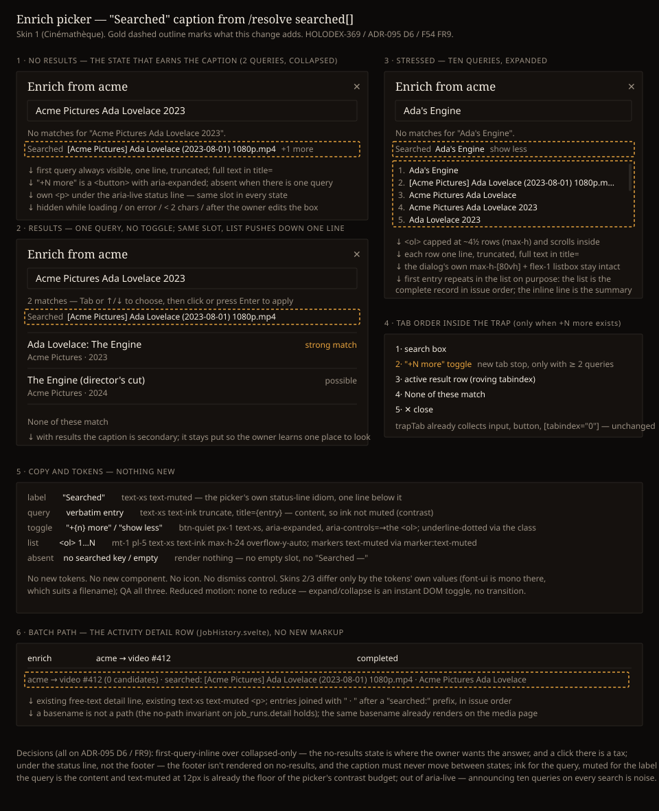

# Design Handoff: Enrich picker "Searched" caption from `/resolve` `searched[]` (HOLODEX-369)

**Spec**: [configurable-provider-search-patterns.md](../specs/configurable-provider-search-patterns.md) FR9 (replaces P1-a) ·
**ADR**: [ADR-095](../architecture/ADR-095-structured-resolve-hints.md) D6 ·
**Contract**: [metadata-provider-contract.md](../specs/metadata-provider-contract.md) §2.3 `searched[]`, §5 caps
**Theming contract**: [ADR-021](../architecture/ADR-021-frontend-theming-and-skins.md) +
[theming.md](theming.md) — **tokens only, QA all three skins**.
**Prior art**: [`EnrichPicker.svelte`](../../web/src/lib/components/enrichment/EnrichPicker.svelte)
(F22.5b) — the status line at `:241` is the idiom this reuses; the optional P1 caption in
[configurable-provider-search-patterns-handoff.md](configurable-provider-search-patterns-handoff.md)
is the slot this replaces (never built).
**Surfaces**: `EnrichPicker.svelte` (one new block under the status line); `JobHistory.svelte`
(**no markup change** — the batch path rides the existing detail line).
**Mockup**: 
**QA**: [structured-resolve-hints-searched-caption-qa-checklist.md](structured-resolve-hints-searched-caption-qa-checklist.md)
**Jira**: [HOLODEX-369](https://whoiskevinrich.atlassian.net/browse/HOLODEX-369) (story) ·
[HOLODEX-367](https://whoiskevinrich.atlassian.net/browse/HOLODEX-367) (epic)

---

## Overview

Once a provider may issue **several** upstream queries per resolve — a filename lookup, then a
performers + studio fallback after a miss (contract §4.10) — "No matches for *X*" stops being the
whole story: *X* is what the owner typed, not what the provider searched. `searched[]` on the
`/resolve` response is the provider's own record of what it asked. This handoff puts that record
under the picker's search box as one muted line, with the first query always visible and the rest
one click away, in the same slot in every state.

**Decision (chosen from two mocked options, 2026-09-11):** *first query inline + "+N more"* over a
*collapsed-only toggle*. The no-results state is where the owner wants the answer, and a click there
is a tax; one query — the common case — renders with no control at all.

### Design-system fit

**Zero new tokens. Zero new components. No icon, no dismiss control.** Everything is the picker's own
`text-xs text-muted` status idiom plus `.btn-quiet` for the toggle and a plain `<ol>`. Two Tailwind
size utilities that are not theming values (`max-h-24`, `truncate`) — allowed; sizes aren't skin
tokens. Skins 2/3 differ only by their token values (`font-ui` is monospace there, which suits a
filename).

---

## Placement

Directly **below the aria-live status line** (`EnrichPicker.svelte:241`) and **above the listbox**,
as its own `<p>` — never inside the `aria-live` region (announcing ten queries on every search is
noise; the status line already announces the outcome). Same slot on the results state, the
no-results state, and the stressed state — the caption never moves, so the owner learns one place
to look. The footer row is not a candidate: it is not rendered on no-results, which is the state
that needs the caption most.

```
┌ Enrich from acme ──────────────────────────────────────┐
│ [ Acme Pictures Ada Lovelace 2023                    ] │
│ No matches for "Acme Pictures Ada Lovelace 2023".      │  ← existing status line (aria-live)
│ Searched [Acme Pictures] Ada Lovelace (2023-…mp4 +1 more│  ← NEW
└──────────────────────────────────────────────────────────┘
```

## Content spec

| Element | Copy | Tokens / classes | Notes |
|---|---|---|---|
| Label | `Searched` | `text-xs text-muted` | No colon — the query follows after a gap; sentence case; no terminal punctuation |
| First query | `searched[0]` verbatim | `text-xs text-ink truncate`, `title={searched[0]}` | **Ink, not muted** — the query is the content, and `text-muted` at 12 px is already the floor of the picker's contrast budget. One line; the full string on hover/focus via `title` |
| Toggle | `+{n} more` collapsed · `show less` expanded, where `n = searched.length − 1` | `btn-quiet px-1 text-xs`, `aria-expanded`, `aria-controls` → the `<ol>` id | Rendered **only when `searched.length ≥ 2`**. `.btn-quiet` already gives the neutral, borderless treatment; add `underline decoration-dotted` so it reads as a disclosure, not a filter |
| Expanded list | `<ol>` of every entry, `1…N`, verbatim, in issue order | `mt-1 pl-5 text-xs text-ink max-h-24 overflow-y-auto marker:text-muted`; each `<li>` `truncate` + `title` | **Includes `searched[0]` again** on purpose: the list is the complete record; the inline line is the summary. Capped at ~4½ rows and scrolls inside so the dialog's `max-h-[80vh]` / `flex-1` listbox are unaffected |
| Absent | — | — | No `searched` key, or an empty array → render **nothing**. No empty slot, no `Searched —` |

Copy is a label plus data, so the [UI vocabulary](../reference/ui-vocabulary.md) has nothing to
translate here; "Searched" is past tense on purpose — it reports what happened, not what the owner
should do.

## States and interactions

| State | Caption |
|---|---|
| Loading (`loading`) | Hidden — the previous response's queries are stale the moment a new search starts. Clear `searched` where `candidates = []` is already cleared on input |
| Error (`error`) | Hidden |
| `< 2` characters | Hidden |
| Results, `searched.length === 1` | Label + query, no toggle |
| Results / no results, `searched.length ≥ 2` | Label + first query + `+N more` collapsed |
| Expanded | `show less` + the `<ol>`; collapses again on the next search (state resets with the response) |
| Owner edits the box | Hidden at once — same rule as the old P1 caption: it describes the last response, not the current text. Re-appears with the next response |
| Auto-apply (RD1, lone strong match on the seeded search) | Never seen — the picker closes. Acceptable; the batch path covers the unattended case and the interactive case had a confident hit |
| Toggle activation | Instant DOM toggle. **No transition** — nothing for `prefers-reduced-motion` to reduce; the picker's `enrich-rise` entrance is untouched |

## Keyboard and accessibility

- The toggle is a `<button>`, so `trapTab` (which collects `input, button, [tabindex="0"]`) picks it
  up with **no change**. Tab order becomes: search box → `+N more` (only when present) → active
  result row (roving `tabindex`) → None of these match → ✕. Enter/Space toggle it natively.
- `aria-expanded` mirrors the open state; `aria-controls` names the `<ol>`. The `<ol>` is ordinary
  content — a screen reader reads it on demand; nothing is live-announced.
- Focus stays on the toggle after activation (do not move focus into the list — it is not a widget).
- `title` on truncated text is the hover affordance; keyboard users read the full string in the
  expanded list, which is why the first entry repeats there.
- Contrast: label and toggle at `text-muted` are the picker's existing floor (≥ 4.5:1 on `--surface`
  in all three skins per the HOLODEX-324 audit); the query at `text-ink` is well above it.

## Responsive

The dialog is `max-w-lg` and the caption is one line at any width — `truncate` handles the rest.
No breakpoint behavior. The expanded `<ol>` is the only element with height; `max-h-24` keeps it
bounded on a short viewport where `max-h-[80vh]` is already tight.

## Edge cases

- **Very long entry (up to 4096 chars).** Truncated to the line; full text in `title` and in the
  expanded row (also truncated — `title` again). Never wrap: a wrapped 4 KB string would eat the dialog.
- **Exactly 10 entries.** The cap; expanded list scrolls after ~4½ rows.
- **> 10 entries from a non-conformant provider.** Holodex keeps the first 10 on ingest (§5) — the
  UI never sees more.
- **Entry equals the box text.** Show it anyway — the point is to show what the provider *did*, and
  "it searched exactly what you typed" is information (contract §4.10: a `"user"` query goes first).
- **Control characters / newlines.** Stripped on ingest, like `candidates[].label`; the UI can trust
  single-line strings.
- **Empty string entry.** Dropped on ingest; the UI never renders a blank row.

## Batch path — Activity detail row (no new markup)

`JobHistory.svelte` already renders `job_runs.detail` as one `text-xs text-muted` paragraph under
the run row (`:88–95`). The backend (HOLODEX-368) appends to the existing detail string:

```
acme → video #412 (0 candidates) · searched: [Acme Pictures] Ada Lovelace (2023-08-01) 1080p.mp4 · Acme Pictures Ada Lovelace
```

- Prefix `searched:` once, entries joined with ` · `, issue order, first 10, each already capped.
- No UI change. The paragraph wraps naturally (it is not `truncate`d today); a long run of ten
  4 KB entries would be tall but not broken — acceptable for an owner-only audit row, and the
  provider contract asks for realistically short queries.
- A basename is not a filesystem path; the `job_runs.detail` no-path invariant (F22.6b) holds. The
  security review confirms nothing beyond the basename can ride along.

## Non-goals

- No caption on Person / Studio / Film pickers — `searched[]` is video-only (contract §2.3).
- No "why" per entry (which was the filename lookup, which the fallback) — the provider does not
  label its entries and the contract does not ask it to. If that is ever wanted it is a contract
  change, not a UI one.
- No copy-to-clipboard, no re-run-this-query affordance. Clicking a query to put it in the box was
  considered and dropped: it would make ten `<li>`s interactive inside a roving-tabindex dialog for
  a case the owner can serve by typing.

## Implementation notes

- `api.ts`: the four `enrichResolve` signatures return `{ candidates }`; the **video** one gains
  `searched?: string[]`. `EnrichPicker` receives it through its existing `resolve` prop — keep the
  prop shape `{ candidates, searched? }` so the person/studio/film callers need no change.
- `EnrichPicker.svelte`: one `let searched = $state<string[]>([])` + one `let showAll = $state(false)`;
  set from the response in `search()` (respecting the stale-response guard already there), cleared
  in `onInput`. The block is ~15 lines of markup between the status `<p>` and the `<ul>`.
- Tests: there is no `EnrichPicker` test file (this repo has no component-test harness — the
  handoff assumed one), so the state table lives in a pure helper, `web/src/lib/searchedCaption.ts`
  (`searchedCaption`, `moreLabel`), with the §2 smoke cases in `searchedCaption.test.ts`; the DOM /
  a11y / geometry items were verified live (§3, HOLODEX-369 worklog entry) and the stressed-state
  geometry assertion is [HOLODEX-372](https://whoiskevinrich.atlassian.net/browse/HOLODEX-372).
- `<ol>` carries `shrink-0`: under `max-h-[80vh]` flex pressure the list would otherwise be the
  first thing squeezed (measured 49px of its 96px cap with 25 candidates at 800px tall) — the cap
  is the design; the candidates `<ul>` is `flex-1` and scrolls anyway.
- The enrich stub (`testdata/enrich-stub`) emits `searched[]` on every video resolve (`searchedFor`:
  basename → query → fields fallback; a query containing `stress` returns the ten-entry cascade with
  a 600-char second entry), and `flood` / `twins` opt into `resolve_hints`, so all three wire shapes
  are reachable from `metadata-sources.yaml` alone.
