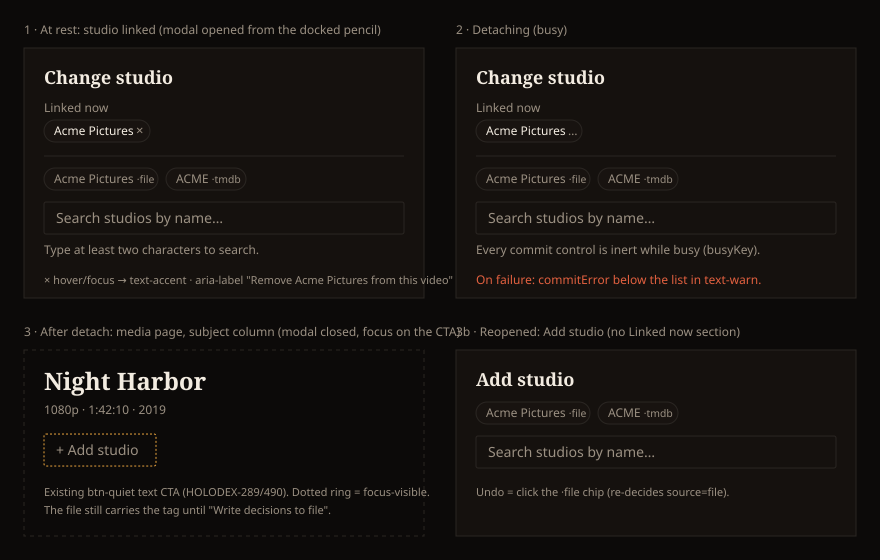

# Design Handoff: Detach a video's studio (HOLODEX-493)

**Surfaces**: `entity/StudioPicker.svelte` (one new section), `media/[id]/+page.svelte` (passes the
linked studio and a `detach` callback), and `film/FilmStudioCascadeDialog.svelte` (the same section,
committing a cascade clear; see [The film page](#the-film-page-same-chip-cascade-commit)). No new
component.
**Sibling it must match**: `entity/PersonPicker.svelte`'s attached-people list (HOLODEX-272).
**Theming contract**: [ADR-021](../architecture/ADR-021-frontend-theming-and-skins.md) as amended by
[ADR-115](../architecture/ADR-115-cinematheque-only-skin.md), so this is tokens only and QA'd in Cinémathèque.
**Backend dependency**: a "resolve to no studio" decision, settled by
[ADR-120](../architecture/ADR-120-owner-cleared-field-decision.md) (a manual decision with no value,
recorded by an explicit `clear`; writeback removes the tag).
**Mockup**: 
**Jira**: [HOLODEX-493](https://whoiskevinrich.atlassian.net/browse/HOLODEX-493) (story)

---

## Problem

The Change studio modal (pencil beside the studio card on the media page) can only *replace* a
studio. Its known-candidate chips, library search and create row all commit a studio. The owner
has no way to say "this video has no studio".

## Decision (A1, approved 2026-09-29)

The modal gets a **Linked now** section above the source chips. It holds the linked studio as an
**attached chip** with a `×` that detaches it. The chip is the *same markup* as `PersonPicker`'s
attached-people chips, not a lookalike.

Rejected during critique:

- **A (as first drawn)**: a full row with the logo box and a `--warn` "Remove" button. It's more
  visible, but it would be a second remove idiom next to `PersonPicker`'s on the same page, which is
  drift on day one. The owner picked A1 over it.
- **B**: "No studio" as an extra candidate chip. The chip row lists *sources* (`·file`, `·tmdb`), and
  "none" isn't a source, so it would read as one more provider.
- **C**: a footer "Remove studio" action with an inline confirm. It hides a removal below the
  search results and adds a confirm step for something that's easy to undo.

## Layout

In `PickerShell`'s body, in this order, only when `hasStudio`:

1. `
Linked now
`
2. `<ul class="mb-3 flex flex-wrap gap-1.5">`, one `<li>` per linked studio (normally one; see
   edge cases). Markup is copied from `PersonPicker.svelte:266-284`:
   - `li`: `inline-flex items-center gap-1.5 rounded-full border border-rule bg-surface-2 px-2 py-0.5 text-xs text-ink`
   - name: `{studio.name}`
   - button: `text-muted hover:text-accent disabled:cursor-default`, content `×`, or `…` while
     this chip's commit is in flight
3. `
` separates *what is linked* from *what you could pick*. `PersonPicker`
   has no rule, because its chips sit directly above the search. Here the source chips come next and
   look the same, so the rule is what keeps "Linked now" from reading as one more source. **This is
   the one allowed difference from PersonPicker**; it's recorded in the rule below.
4. The existing candidate chips, search input, status line and listbox, unchanged.

With no studio linked (`hasStudio=false`), the title stays **Add studio** and none of 1–3 renders
(mockup frame 3b).

No logo box in the chip. The studio card on the page already shows the logo, and the chip is an
attachment handle, not a display.

## States and interactions

| Element | State | Behaviour |
|---|---|---|
| `×` | rest | `text-muted` |
| `×` | hover / focus-visible | `text-accent`, with the global focus ring |
| `×` | click / Enter / Space | `commit('detach', …)` through the existing `busyKey` machinery; the whole modal goes inert (chips, options, `×`) while it runs |
| `×` | busy | renders `…`, `disabled` (no opacity dimming; see theming rules) |
| Detach | success | `closePicker()`, page reloads detail, `studios` is empty, so the trigger becomes `+ Add studio` and **focus moves to it** (`focusPencil()` already targets `bind:this={pencil}`, which is now the CTA) |
| Detach | composite-key collision | same as any studio pick: `{ conflict }` closes the picker and renders `verdict` (`CollisionOfferCard`). Removing the studio changes the composite key exactly as a new one does, so the check is not skipped |
| Detach | error | `commitError` in `text-warn` under the list; the picker stays open and the chip keeps `×` |

**No confirm step.** Detach is a DB decision (RD5) and undo is one click: reopen and pick the
`·file` chip, which re-decides `source=file`. That matches `PersonPicker`, which also detaches
without confirming.

**After detach, the page adds no note.** The initial critique mockup had a muted "file still says …"
line under the CTA. It's dropped here: whether the file lags the decision is the writeback dialog's
*applied vs. on file* row ([ui-vocabulary](../reference/ui-vocabulary.md#field-model)), and a
per-field note on the page would be a second, drifting copy of that signal. Revisit only if QA shows
owners losing track.

## Accessibility

- `×` is a `<button type="button">` with `aria-label="Remove {studio.name} from this video"`.
  PersonPicker's label also names the role; a studio has none.
- "Linked now" is a visible label. The `<ul>` gets `aria-label="Linked studio"`.
- Focus order inside the modal: title → Linked now `×` → source chips → search → options.
  Initial focus stays on the search input (unchanged). The `×` is reachable by Shift+Tab.
- After a successful detach, focus goes to `+ Add studio`, never lost to `body`.
- Target size: the `×` is about 20px tall, the same as PersonPicker's. Growing it is a shared
  follow-up (it must change in both pickers at once), not part of this story.

## Edge cases

- **Long name**: `max-w-[10rem] truncate` as in PersonPicker; full name in the `aria-label` and a
  `title` attribute.
- **More than one linked studio** (legacy rows; `studios` is an array): one chip each. Studio is a
  *replace* field, so any `×` clears the field, and the ADR must say whether that clears all
  `video_studios` links or only the file-derived one. Until it does, render chips but treat `×` as
  "clear the studio field".
- **Visitor**: nothing changes. The modal is owner-only.
- **Studio resolved but not linked** (`studioField.values` present, `studios` empty): no Linked now
  section. There's nothing linked to detach, and a pick from the chips still works.

## The film page: same chip, cascade commit

The film page's studio pencil opens `film/FilmStudioCascadeDialog`, whose picker step already mirrors
`StudioPicker`. It gets the **same Linked now section** (same markup, same rule-off, per the
anti-divergence rule below). The chips are the film's studios, the union over its videos. What
differs is what a `×` commits and what happens after:

| | Media (`StudioPicker`) | Film (`FilmStudioCascadeDialog`) |
|---|---|---|
| `×` commits | a clear on one video | a cascade clear across the film's videos (ADR-120 D6) |
| After success | closes; focus to `+ Add studio` | goes to the dialog's **existing results step** (Enqueued / Collision / Error), then `WritebackBatchDialog` for write progress. It doesn't close, because the write has already started |
| Writeback | later, from the cockpit | immediate, in the cascade's batch |
| Empty state after | `+ Add studio` text CTA | today's owner-only "No studio set" line plus the pencil (unchanged here; it predates the text-CTA rule and is a known holdout) |

**Mixed-studio film (decided 2026-09-29, [F74 spec](../specs/studio-clear.md) R5):** one chip per
studio in the film's union, and a chip's `×` clears **only the videos carrying that studio**.
Videos on another studio are untouched, and the results step lists exactly the videos cleared.

## Backend contract (for the ADR)

The frontend calls a page-supplied `detach(): Promise<{ ok: true } | { conflict: VideoCollisionRef }>`,
the same shape as `decide`. [ADR-120](../architecture/ADR-120-owner-cleared-field-decision.md) settles it:
`PUT …/fields/studio/decision` with `{ "source": "manual", "clear": true }`. The gaps it closed were:

- `PUT /media/{id}/fields/studio/decision` with `source: manual, manual_value: ""` is **refused**
  (`internal/api/decisions.go:53`). It stays refused without `clear`, as a guard against an
  empty Custom submit.
- `DELETE …/decision` **reverts to the file value**, the opposite of detach when the file has a
  studio tag.
- The resolver already drops an empty manual value (`internal/resolver/resolver.go:580`), so a
  standing "cleared" decision resolves to no studio with no resolver change.

ADR-120's answers, in order: (1) the owner is the source (`manual`) and the value is empty, written
only by an explicit `clear` (D1); (2) `video_studios` unlinks at decision
time through the existing relink (D3); (3) writeback removes the tag via an explicit `clear`
(D4); (4) other replace fields opt in through an allowlist, never identity keys or images (D2).

## The rule this sets (anti-divergence)

Recorded in `web/src/lib/components/entity/CLAUDE.md` under "Relationship pickers" and as the
**attached chip** term in [ui-vocabulary.md](../reference/ui-vocabulary.md):

> A relationship picker shows what is attached **at the top**, as **attached chips** in
> `PersonPicker`'s markup, and **removing a chip is the detach**. There's no separate remove button,
> no footer action and no "none" candidate. Single-value pickers (`StudioPicker`) label the section
> "Linked now" and rule it off from the source chips; multi-value ones (`PersonPicker`) don't need
> to. A change to the chip's size, target or glyph lands in both pickers in the same change.
