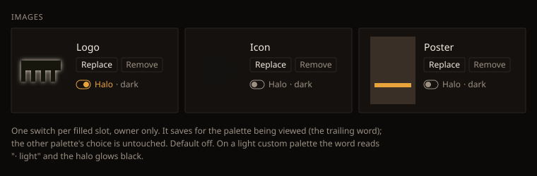

# Design handoff: studio image halo toggle (HOLODEX-463)

**Status:** approved 2026-09-26. The owner picked **option A** (one switch per slot) over option B
(Dark and Light chips).
**Refs:** [ADR-109](../architecture/archive/ADR-109-per-studio-image-halo.md), spec
[studio-images.md § Image halo](../specs/studio-images.md), prior halo work in
[studio-list-logo-handoff.md](studio-list-logo-handoff.md) (HOLODEX-432) and
[image-plate-handoff.md](image-plate-handoff.md) (HOLODEX-437).

## 1. What changes

| Surface | Before | After |
|---|---|---|
| Studio page image slots (`EntityImageSlot`, row variant) | every contained image wears `.logo-halo` | the halo shows only for the modes saved for that role. The owner gets a `Halo` switch under Replace/Remove |
| `/studios` rows and Film/Media studio link cards (`StudioLogoBox`) | logo or icon always haloed | the choice for whichever role the box shows (logo first, then icon) |
| Completeness queue studio icon | always haloed | the icon's choice |
| Film poster slot | always haloed | unchanged. The glow colour is now `--logo-halo` |

## 2. The switch

This is a **knob** in [ui-vocabulary](../reference/ui-vocabulary.md) terms: an owner-set display
choice on a value. It is not a new field.

- `<button role="switch" aria-checked>` in the slot's text column, under the Replace/Remove row.
  It only renders for the owner, only when the slot has an image and the fit is `contain`.
- Label: `Halo`. It no longer names a mode: Cinémathèque is the only look and it is dark, so the
  switch always edits the dark choice (HOLODEX-482). The `title` is "Glow behind the {role}" (e.g.
  "Glow behind the logo").
- The track is `h-3 w-5 rounded-full border` and the knob is `h-2 w-2 rounded-full`.
  - Off: `text-muted`, `border-muted`, knob `bg-muted` at the left, with `hover:text-ink`.
  - On: `text-accent`, `border-accent`, knob `bg-accent` at `left-2.5`.
- Tokens only; `rounded-full` is the intentional pill shape.
- While saving, the switch is disabled with no opacity dimming. The label stays at full contrast.
- If the save fails, the slot's existing `text-warn` error line shows the message and the switch
  stays in its old state.

## 3. Behaviour

- Clicking flips the halo for that role in the mode being viewed. The slot updates in place with
  no reload.
- The other mode is never written from here. The owner sets only what they can see (option A).
  With the single dark skin that is always the dark choice; a saved light choice is kept but
  never shows.
- Colour: `--logo-halo`, which is Cinémathèque's `--logo-plate`. The strength is unchanged
  (1/3/6px, from HOLODEX-432). The black light-palette glow is unreachable while there is no light
  look.

## 4. QA

Numbered, tagged, grouped by tag.

### [smoke]
1. `/studios/{id}` as owner with a filled logo: the `Halo` switch renders, and
   `aria-checked="false"` by default.

### [agent]
2. Default: no studio `` on the Studio page, the /studios row or the queue has a computed
   `filter` other than `none`.
3. Toggling the logo on sets `aria-checked="true"`, gives the `` the class `halo-dark`, and
   gives it a computed filter of three `drop-shadow`s in `--logo-halo` (the Cinémathèque
   `--logo-plate`, `#e9e0d0`). It also makes
   `GET /studios/{id}` return `image_halo.logo = ["dark"]`.
4. The /studios row for the same studio shows the same filter. The icon (not toggled) shows `none`.
5. An image carrying only `halo-light` (a saved light-mode choice) shows `none`: Cinémathèque is
   dark, so `.halo-light` deliberately matches nothing.
6. Visitor view (Owner view off): no switch; the saved halo still renders.
7. Re-uploading the logo keeps `image_halo.logo`.

### [human]
8. On the live library, pick a studio with a dark wordmark and one with a light mark. Turn the
   halo on for the dark one only, then check that both read well on Cinémathèque.
9. *(Retired with the custom palette, ADR-115: there is no light look to switch to.)*

**Verified 2026-09-26** (driven browser, AMV testbed, Cinémathèque): 1, 2, 3 (by computed style), 4
and 6. Item 5 was verified against the light mode since retired, so it is open as rewritten. Item 7 is asserted by the
Go test `TestStudioImageHalo_DefaultOffThenPerModeToggle`. Items 8 and 9 are open.
