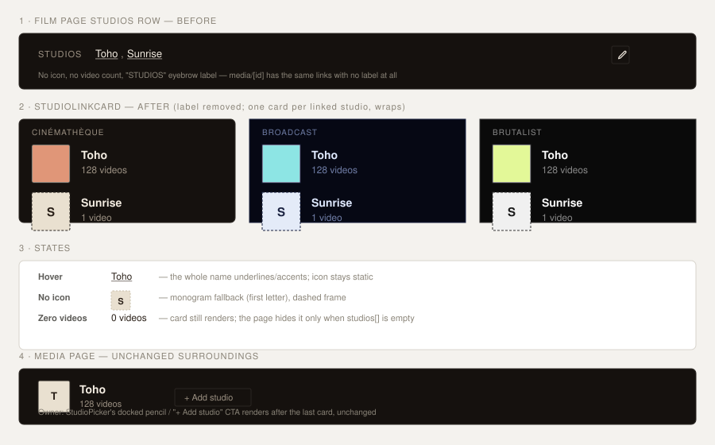

# Design handoff: StudioLinkCard (reusable Studio display)

**Status:** Draft
**Story:** [HOLODEX-290](https://whoiskevinrich.atlassian.net/browse/HOLODEX-290)
**Owner:** Project owner
**Date:** 2026-08-29
**Spec:** none — presentational-only change, no new user capability (see "Why no spec/ADR" below)
**ADR:** none — extends an existing query's `SELECT` list, no schema/architecture change
**Branch/PR:** `HOLODEX-290-studio-link-card`, Draft [PR #269](https://github.com/whoiskevinrich/holodex/pull/269)

## Overview

The Media (`media/[id]`) and Film (`films/[id]`) detail pages each grew their own ad hoc
markup for "the studio(s) linked to this record" — plain comma-joined text links, no icon, no
video count, and inconsistent labeling (Film has an uppercase "Studios" eyebrow; Media has no
label at all). This handoff replaces both with one shared `StudioLinkCard.svelte`: icon +
name (as a link) + video count, one card per linked studio. The request removes the uppercase
header entirely — the icon plus the link itself is the label.

This is scoped to **display only**. The owner-only edit affordances already living beside the
old markup — `StudioPicker`'s docked-pencil/`+ Add studio` on Media, `FilmStudioCascadeDialog`'s
pencil on Film — are unchanged and keep rendering next to the new card(s), per HOLODEX-285/271's
existing docked-pencil pattern.

**Why no spec/ADR:** nothing here is a new capability (the studio link, its `/studios/{id}`
target, and the edit affordances all already exist) and nothing here is a schema or
cross-cutting architecture decision — the backend change (§4) only widens an existing query's
column list into fields `model.Studio` already declares. Per the project's change-routing
table this is a UX/component change → `/design-handoff` + `/testing-strategy` only.



---

## 1. Resolved decisions (open questions from the rough mockup)

The attached wireframe (`Logo` box + name + `Videos: {n}`) was explicitly rough — its own
annotation flags "Logo" as mislabeled. Three things it left ambiguous, resolved here:

| Question | Decision | Why |
|---|---|---|
| Video count text | `{n} video`/`{n} videos` via the existing `videoCount()` helper (`$lib/format`) | Matches every other video-count line in the app (`EntityVideoMeta`, `StudioPicker`'s search rows, the studio near-miss line) — a literal `Videos: {n}` would be a fourth, inconsistent format. |
| Which image role | `icon_url` only, monogram fallback — **not** `logo_url` | The request's own note flags the mockup's "Logo" as mislabeled; `icon_url` is also the role Studio already uses in its own list view for the same small-square use case. `logo_url`/`poster_url` stay reserved for the studio detail page's own header. |
| Multiple linked studios | One `StudioLinkCard` per studio, in a `flex flex-wrap gap-3` row | Both pages already support N studios per video/film (F38 multi-studio). A single-studio-only component would leave the N>1 case unspecified. |

## 2. New component: `StudioLinkCard.svelte`

`web/src/lib/components/entity/StudioLinkCard.svelte` — placed in `entity/` alongside the
other Studio-specific-but-not-person/tag-generic components (`StudioPicker`), per that folder's
CLAUDE.md rule 2 (function-based grouping; `entity/` already houses single-entity-type
components, not just person/studio/tag-generic ones).

```ts
let { studio }: { studio: Studio } = $props();
```

Takes the existing `Studio` type (`$lib/types.ts`) as-is — no new prop shape, no variants.

```svelte
<a href={`/studios/${studio.id}`} class="flex items-center gap-3 hover:text-accent">
  <span
    class="flex h-12 w-12 shrink-0 items-center justify-center overflow-hidden rounded-theme border border-rule bg-logo-plate {studio.icon_url ? '' : 'border-dashed'}"
  >
    {#if studio.icon_url}
      
    {:else}
      <span class="font-display text-sm font-semibold text-logo-plate-ink" aria-hidden="true">
        {monogram(studio.name)}
      </span>
    {/if}
  </span>
  <span class="min-w-0">
    <span class="block truncate text-ink group-hover:text-accent">{studio.name}</span>
    <span class="block text-xs text-muted">{videoCount(studio.video_count ?? 0)}</span>
  </span>
</a>
```

Notes:

- The **whole card is the link** (`<a>` wraps icon + text) — larger hit target than a
  text-only link, and it means "hover" is one visual unit, not just the name.
  `hover:text-accent` on the `<a>` plus the name span inheriting current color covers this
  without a `group` class (Tailwind `group-hover` only needed if the icon itself should react
  to hover, which it deliberately does not — see Accessibility below).
- `alt=""` on the icon `img`: the adjacent name text already labels the link: an icon alt
  text would be redundant with the link's own accessible name (mirrors `EntityImageSlot`'s
  `alt` pattern, which uses a real alt string only when there's no adjacent visible label).
- Reuses `monogram()` and `videoCount()` from `$lib/format` — no new formatting helpers.
- No owner/edit affordance, no busy/error state, no snippets — this component only ever
  renders a read-only link. The caller composes it next to its own `StudioPicker`/cascade
  pencil, exactly as the current inline markup does today.

## 3. Call-site changes

**`web/src/routes/media/[id]/+page.svelte`** (replacing lines ~857–889): drop the
`<div id="field-studio">` wrapper's inline `{#each}` blocks in favor of:

```svelte
<div class="flex flex-wrap items-center gap-3" id="field-studio">
  {#each studios as s (s.id)}
    <StudioLinkCard studio={s} />
  {/each}
  {#if isOwner}
    <StudioPicker field={studioField} hasStudio={studios.length > 0} {isOwner} decide={decideStudio}>
      <!-- verdict snippet unchanged -->
    </StudioPicker>
  {/if}
</div>
```

The visitor-only `studioField.values[0]` text fallback (current line 885-887, shown when a
resolved studio value exists but has no linked entity yet) has no icon/count to show and stays
as plain text — `StudioLinkCard` requires a real `Studio` object, it doesn't degrade to a
guessed name. Keep that branch exactly as-is.

**`web/src/routes/films/[id]/+page.svelte`** (replacing lines ~165–191): drop the `"Studios"`
eyebrow `<span>` entirely; keep the empty-state text and the cascade pencil:

```svelte
<div class="name-edit-row flex flex-wrap items-center gap-3 pt-1">
  {#if studios.length}
    {#each studios as s (s.id)}
      <StudioLinkCard studio={s} />
    {/each}
  {:else}
    <span class="text-sm text-muted">No studio set</span>
  {/if}
  {#if isOwner}
    <button ... class="name-edit-pencil ...">…</button>
  {/if}
</div>
```

## 4. Backend requirement (blocking)

Neither page's Studio objects currently carry an icon or count — both queries only ever
selected `id, name`:

- [`StudiosForVideos`](../../internal/repo/studios.go) (feeds Media) — `SELECT vs.video_id, s.id, s.name`.
- [`FilmStudios`](../../internal/repo/films.go) (feeds Film) — `SELECT DISTINCT s.id, s.name`.

`model.Studio` already declares `IconURL`/`LogoURL`/`VideoCount` (used by the top-level
`/studios` list/detail reads) — this is a `SELECT`/`Scan` extension on the two queries above,
not a new field or migration.

**Implementation note (as-built):** `IconURL` is not a stored column — per F51/ADR-079 it's a
computed serving URL, populated only by calling `setStudioImageURLs()` on a `Studio` whose
`ImageVersions map[string]int64` field is set. So instead of `SELECT`ing `s.icon_url` directly,
both queries were extended to populate `VideoCount` (a correlated active-video-count subquery,
matching `GetStudio`'s existing pattern) and `ImageVersions` (via the existing
`studioImageVersions`/`attachStudioImages` batch helpers), and their two API call sites
(`internal/api/handlers.go`, `internal/api/films.go`) each call `setStudioImageURLs()` on the
result before serializing — the same convention every other Studio-serializing response already
follows. Net effect on this component is identical: `studio.icon_url` arrives populated when set.

## 5. Design tokens used

| Token | Usage |
|---|---|
| `bg-logo-plate` / `text-logo-plate-ink` | Icon frame background / monogram-fallback text color |
| `border-rule` | Icon frame border (solid when an icon is set, dashed fallback when not — matches `EntityImageSlot`'s existing icon/logo empty-state convention) |
| `text-ink` | Studio name |
| `text-muted` | Video-count line |
| `text-accent` | Hover state on the whole card |
| `font-display` | Monogram glyph |
| `rounded-theme` | Icon frame corners |

No new tokens. No hardcoded color/radius/font — `rg 'zinc-|sky-|rounded-(lg|md|sm|xl)'` over
the new file must stay empty per the theming rules.

## 6. States and interactions

| State | Behavior |
|---|---|
| Icon set | `icon_url` image, `object-contain`, solid `border-rule` frame |
| No icon | `monogram(studio.name)` (first letter(s)), dashed `border-rule` frame — same convention as `EntityImageSlot`'s non-poster empty state |
| Hover / focus | Name (and by extension the whole link) turns `text-accent`; icon does not change — the icon is decorative once the name already reads as the link (see Accessibility) |
| Zero videos | Renders `0 videos` — the card itself never hides on a zero count; the *page* decides whether to show any card at all (empty state below) |
| Multiple studios | Cards wrap in a `flex flex-wrap gap-3` row — no fixed max, no "+N more" truncation (F38 multi-studio counts are small in practice; revisit only if that stops being true) |
| Long studio name | `truncate` on the name span — an internationally long studio name ellipsizes rather than wrapping the card taller or pushing the count off two lines |
| No studio at all | Component isn't rendered — each page keeps its own empty-state text (Film: "No studio set"; Media: nothing, matching current behavior) exactly as today |

## 7. Responsive behavior

No breakpoint-specific layout — `flex flex-wrap` already reflows multiple cards to narrower
viewports without a dedicated mobile variant. Single-card case (the common one) never wraps
internally regardless of width; the 48px icon plus `truncate`d name keeps the card compact
enough to sit inline with the header content on both pages at any width they already support.

## 8. Edge cases

- **Studio with no icon and a one-character name** (e.g. an initialism with no image yet):
  monogram fallback renders the single character — no special-case needed, `monogram()`
  already handles short names.
- **Icon URL that 404s**: out of scope for this component (same as every other `` in the
  app) — no `onerror` fallback is added; broken-image handling for self-hosted studio images is
  a pre-existing concern, not introduced here.
- **Visitor with a resolved-but-unlinked studio value** (Media only, see §3): stays plain text,
  no card — documented above so it isn't mistaken for a missed case.

## 9. Accessibility notes

- The `<a>` wraps both icon and text as one link — a screen reader announces the studio name
  once (from the visible text), not twice, so the icon `img` gets `alt=""` (decorative,
  redundant with the adjacent name) rather than a repeated `alt={studio.name}`.
- Focus order: one tab stop per card (the `<a>`), in DOM order — same order the cards render
  in visually, left to right.
- Focus visibility relies on the browser's default link focus ring (no custom `:focus-visible`
  styling is introduced) — consistent with the plain `<a href="/studios/{id}">` links this
  replaces, which had no custom focus treatment either.
