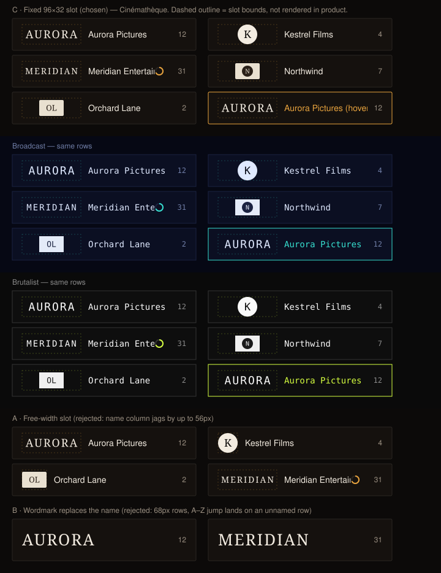

# Design handoff: `/studios` list rows draw the studio logo

**Status:** Approved — **option B** (owner's pick, 2026-09-20; C had been recommended, see §1); implemented the same day. **Revised 2026-09-20 (same day):** a light **halo** behind logos and icons, owner ask after the first look (§1 "Halo")
**Story:** [HOLODEX-432](https://whoiskevinrich.atlassian.net/browse/HOLODEX-432) (child of F51, HOLODEX-246)
**Owner:** Project owner
**Date:** 2026-09-19
**Spec:** none — presentation-only change to an existing page (see "Why no spec/ADR")
**ADR:** none — ADR-079's image roles, storage, and serving are untouched
**Branch/PR:** `HOLODEX-432-studio-list-logos`
**Supersedes:** [studio-images-handoff.md §1](studio-images-handoff.md) ("`/studios` list — logo
well data source change only": the well reads `icon_url`) and the "`/studios` list well stays
`icon_url` → monogram" bullet of
[studio-logo-link-card-handoff.md §10](studio-logo-link-card-handoff.md), and that handoff's §1
"Plate under a logo" rejection of a drop-shadow halo (the owner asked for one after seeing a dark
wordmark alone on a dark row — it now applies to the shared box, so the card gets it too)

## Overview

The Studios index (`web/src/routes/studios/+page.svelte`) renders each studio as a one-line row
— a 40×26 `bg-logo-plate` well, the name, an owner-only completeness ring, and the video count —
in a 1 / 2 / 3-column grid with an A–Z jump-nav. F51 (HOLODEX-247) pointed that well at
**`icon_url`**, reserving the `logo` role for the detail pages. Two facts make that the wrong
call today, the same two that moved `StudioLinkCard` to the logo (HOLODEX-397/411):

1. **TMDB enrichment only ever fills the `logo` role.** `icon_url` is populated only by an owner
   upload, so an enriched studio shows its monogram in the list while its logo sits in storage.
2. **`logo_url` is already on every list row.** `internal/api/studios.go` `listStudios` calls
   `setStudioImageURLs` per item; `Studio.logo_url` is on the `GET /studios` payload today. The
   page just never reads it.

This handoff changes the list well to draw the logo when there is one, with the HOLODEX-411
rules already proven on `StudioLinkCard` — **bare** (no plate), **aspect-following**, and **a
wordmark replaces the name** — applied verbatim: the card's image box is extracted into a shared
`StudioLogoBox` and the list row mounts the same box in front of its name / ring / count.

**Why no spec/ADR:** no new capability, endpoint, field, or schema — the logo is stored, served,
and on the payload. Per the change-routing table this is `/design-handoff` +
`/testing-strategy` only. Frontend-only; `internal/` is untouched.



---

## 1. Decisions

Presented as inline mockups on 2026-09-19 at the `lg` column width (300px rows) with the stressed
row — "Meridian Entertainment Group International" + a wide wordmark + the ring + a count — in
every option. **The owner chose B on 2026-09-20**, over the recommended C.

| Question | Decision | Why |
|---|---|---|
| Row image | **B — the `StudioLinkCard` rule, verbatim.** Fixed 48px-tall box, width follows the logo's own aspect clamped to `[48, 192]px`, logo bare (no plate); **a wordmark (natural w ≥ 2h) replaces the name**; a symbol mark, an icon (on the 48×48 plate) and the monogram (dashed plate) keep the name beside them. *Rejected A — free-width 32px slot, name always shown. Rejected C (recommended) — fixed 96×32 slot, logo bare + centred, name always shown.* | Owner's call: one studio image treatment across every surface — the Film/Media detail card and the index draw the identical box, so a studio looks the same wherever it appears. The list's name column no longer aligns (a 48px symbol vs a 192px wordmark) and a wordmark row carries no visible name; the owner weighed that against a second, list-only logo shape and took the single rule. Costs recorded in §8. |
| Precedence per row | `logo_url` → `icon_url` → monogram | Same order as `StudioLinkCard` (HOLODEX-397). The list stops being the one surface that ignores the role TMDB actually fills. |
| Plate | **Logo: none** — bare on `bg-surface`. **Icon / monogram: the card's 48×48 `border-rule bg-logo-plate` plate** (dashed when there is no image at all), replacing the list's old 40×26 plate. | HOLODEX-411: a transparent brand mark on a cream box read as a floating badge on the dark skins. The plate is the card's, not the old well's, so a legacy row is the card's icon state exactly. |
| Screen-reader name, once and only once | Name shown as text → `alt=""` (decorative). Name hidden (wordmark, or a bare logo still loading) → `alt={name}`, plus `title={name}` on the row link. The monogram stays `aria-hidden`. | Today's `alt="{name} icon"` next to the visible name announced the studio twice. `studioLogo.ts` `imageAlt()` owns the rule so the card and the row can't drift. |
| Halo (owner ask, 2026-09-20, after the first look) | **Yes — a `drop-shadow` halo in the plate colour on the image, both roles**: `.logo-halo` in `app.css` = `drop-shadow(0 0 1px …) drop-shadow(0 0 3px …) drop-shadow(0 0 6px var(--logo-plate))` (strength chosen from a live six-step comparison on both skins and four backgrounds — 1+3 was the weakest that fully resolved a dark wordmark, the owner took 1+3+6, heavier read as an aura), applied to `StudioLogoBox`'s single ``. Follows the mark's own silhouette (a thin light outline + soft glow); on the icon plate it is plate-on-plate and disappears, so one class serves both roles. HOLODEX-411 had rejected this as "fussier than the problem"; with the name gone from wordmark rows (B) the problem got bigger — the SLM-style dark wordmark was invisible on the row. The card inherits it through the shared box. | A halo lifts a dark-on-transparent mark off a dark surface without putting a box behind it — the plate's job, without the plate. Token-driven so it re-skins and follows a custom palette (`--logo-plate` is derived there). |
| Row height | 70px (48px box + `py-2.5` + 1px borders), was 46px | Consequence of B; `/people` rows stay 46px. Accepted. |
| Where the rule lives | `web/src/lib/components/entity/studioLogo.ts` (`isWordmark`, `showName`, `imageAlt`) + `StudioLogoBox.svelte`; both `StudioLinkCard` and the new `StudioListRow` consume them. | Two surfaces, one implementation — the aspect threshold and the alt rule cannot diverge. |

## 2. Component change

Three files in `web/src/lib/components/entity/`, one page edit:

| File | Change |
|---|---|
| `studioLogo.ts` (new) | Pure rule: `isWordmark(w, h)` = `h > 0 && w >= 2h`; `showName(bare, wordmark)` = `!bare \|\| wordmark === false`; `imageAlt(name, bare, wordmark)` = `showName ? '' : name`. `Wordmark = boolean \| null` (null = logo not loaded yet). Unit-tested (`studioLogo.test.ts`). |
| `StudioLogoBox.svelte` (new, extracted from `StudioLinkCard`) | The image box: `logo_url` → `icon_url` → monogram; `h-12 max-w-48 min-w-12`, `object-contain p-1`; plate classes only when not a logo; dashed when no image. Binds `wordmark` **out** (`bind:wordmark`), decided `onload` / for an already-`complete` cached image / `false` on error. `alt` from `imageAlt()`. `eager` prop → `loading="eager"` or `"lazy"`. |
| `StudioLinkCard.svelte` | Mounts `StudioLogoBox` with `bind:wordmark`; keeps its `showName`, `title`, name + `videoCount` caption. Behaviour unchanged. |
| `StudioListRow.svelte` (new) | The `/studios` row: a positioned wrapper with the row's border classes, a stretched `<a>` (`after:absolute after:inset-0`) holding `StudioLogoBox` + `<span class="min-w-0 flex-1 truncate">{name if showName}</span>`, then the owner ring (a `<button>` since F65.8, `z-[1]` above the stretch) and the count as siblings. `title={name}` on the `<a>` when the name is hidden. A component only because the wordmark decision is per-row state, which an `{#each}` body cannot hold. |
| `routes/studios/+page.svelte` | `{#each}` body → `<StudioListRow studio={s} eager={i < 6} />`; `monogram` / `CompletenessRing` imports dropped. |

```svelte
<!-- StudioListRow.svelte (row shape per F65.8, merged 2026-09-20: the ring is a <button>,
     so it sits beside a stretched <a> rather than inside it) -->
<div class="relative flex items-center gap-3 rounded-theme border border-rule bg-surface px-4 py-2.5 text-ink hover:border-accent has-[a:focus-visible]:border-accent">
	<a href={`/studios/${studio.id}`} class="flex min-w-0 flex-1 items-center gap-3 after:absolute after:inset-0 after:content-['']"
	   title={showName ? undefined : studio.name}>
		<StudioLogoBox {studio} {eager} bind:wordmark />
		<span class="min-w-0 flex-1 truncate">{#if showName}{studio.name}{/if}</span>
	</a>
	{#if studio.completeness}<span class="relative z-[1] inline-flex"><CompletenessRing … entity={{ kind: 'studio', id }} /></span>{/if}
	<span class="text-xs text-muted">{studio.video_count}</span>
</div>
```

Notes:

- **The empty name `<span>` stays in the DOM** when the name is hidden — it is the `flex-1`
  spacer that keeps the ring and count right-aligned.
- **`eager={i < 6}`** mirrors the People list's avatar rule: the first six rows paint without
  the lazy hop; the rest load as they scroll in. A lazy off-screen wordmark row shows nothing
  beside its box until the image loads (its name is in `alt` throughout).
- **Stale comments fixed** on `Studio.icon_url/logo_url` in `web/src/lib/types.ts` (the role
  comment said "icon (studios list well), logo (detail page header)").

## 3. Call sites — unchanged

`StudioLinkCard`'s two call sites (Film / Media detail) render byte-identically — the extraction
moved markup, not behaviour. `EntityImageSlot` (studio detail Images section), the studio picker,
and the nav-search Studios tab are untouched. `poster_url` still has no consumer.

## 4. Backend — unchanged

`GET /studios` already returns `logo_url` per row (`setStudioImageURLs`, `attachStudioImages`
batch query over `studio_images`). No new field, no new query, no migration, no `internal/` edit.

## 5. Design tokens used

| Token / utility | Usage |
|---|---|
| `bg-surface`, `border-rule`, `hover:border-accent`, `rounded-theme` | Row (unchanged) |
| `text-ink`, `text-muted` | Name, count (unchanged) |
| `border-rule`, `bg-logo-plate`, `text-logo-plate-ink` | Icon / monogram plate only — never under a logo |
| `font-display` | Monogram glyph (unchanged) |
| `.logo-halo` (app.css hook) → `--logo-plate` | The drop-shadow halo on the image, both roles |
| `h-12 max-w-48 min-w-12`, `w-12` | Box — spacing-scale utilities only; the old `h-[26px]` arbitrary value is gone |

No literal colours, radii, or fonts (`.claude/rules/frontend-theming.md`). The logo box has no
background and no border in any skin.

## 6. States

| Row | Box | Name text | `img alt` | `a title` |
|---|---|---|---|---|
| Wordmark logo (w ≥ 2h) | bare, 48px tall, width from aspect ≤ 192 | hidden | name | name |
| Symbol logo (w < 2h) | bare, 48px tall, width from aspect ≥ 48 | shown | `""` | — |
| Bare logo still loading | bare, 48 × (≥48) | hidden (no caption flash) | name | name |
| Logo fails to load | bare box, broken-image glyph | shown | `""` | — |
| `logo_url` **and** `icon_url` | logo (precedence) | per the rows above | | |
| `icon_url` only | 48×48 plate, `border-rule`, icon `object-contain p-1` | shown | `""` | — |
| Neither | 48×48 dashed plate, monogram (`aria-hidden`) | shown | — | — |
| Hover / focus | row border → `border-accent` (unchanged) | | | |
| Page loading | the existing "Loading…" line; rows appear at once (unchanged) | | | |

Every row is 70px; the box is fixed-height so an image arriving late never shifts the row.

## 7. Responsive behaviour

| Breakpoint | Row | Name column after a 48px box (symbol / icon / monogram rows) |
|---|---|---|
| `< sm` (1 col, 375px page) | ~327px wide | ~215px |
| `sm–lg` (2 cols) | ~300–360px | ~190–250px |
| `≥ lg` (3 cols) | ~300px | ~190px |

Wordmark rows have no name column: the box (≤ 192px) plus ring and count always fit a 300px
row (192 + 16·2 + 12·2 + 28 + 24 = 300). The box is `shrink-0`; the name is `flex-1 truncate`;
rows never wrap. Verified at 375px: every row 327px wide, boxes 48–192px, no row wider than
the viewport. (The owner-only sort/facet toolbar above the grid does overflow at 375px —
`FacetFilter`'s `min-w-[12rem]` — pre-existing and unrelated; filed as [HOLODEX-436](https://whoiskevinrich.atlassian.net/browse/HOLODEX-436).)

## 8. Edge cases

- **Unnamed rows (accepted cost of B):** a wordmark row shows no text. The A–Z jump-nav and
  the in-place nav-search filter both work on data, not on visible text, so they still land on
  and keep the row; the row's `title` supplies the name on hover and its `alt` to assistive
  tech. Browser find-in-page will not match a wordmark studio's name. A dark-on-transparent
  wordmark on a dark skin used to read faint **with nothing beside it** — the `.logo-halo`
  (§1) is the answer: a light silhouette glow, not a plate.
- **Name column alignment (accepted cost of B):** names start at 16 + boxWidth + 12px, so a
  symbol-mark or icon row's name sits at ~76px, a portrait logo's at ~60px and a 1.9:1 logo's
  at ~120px. Same as the card.
- **Very wide wordmark (12:1):** box 192×48, image 184×15 after inset — a bar. Verified live
  with a 1000×83 upload. Accept; the studio page shows the logo at size.
- **Portrait logo (2:3):** box `min-w-12` → 48×48, image 32×48 centred. Accept.
- **Long names:** `truncate`; ~190px at `lg` on a captioned row (was ~140px with the old well).
- **Hundreds of rows:** every row is now an `` request (before, only icon rows were).
  `eager={i < 6}` + `loading="lazy"` keeps the first paint to the first six; each image is a
  small PNG served with a `?v=` cache key by our own API.
- **Random / completeness sort, missing-facet filter:** per-row markup, order-independent.
- **A–Z anchors:** `id="sl-X"` stays on the `<li>`; `scroll-mt-16` still clears the sticky
  letter nav at 70px rows.

## 9. Accessibility

- One `<a>` per row, unchanged tab order.
- **The studio name is announced exactly once per row**, whichever shape renders: as the
  visible text node (image `alt=""`, decorative) or as the image `alt` (no text node).
  Verified in the accessibility tree: wordmark rows expose `link "Legendary"` from the alt;
  captioned rows expose the text node with no image name. The old `alt="{name} icon"` beside
  the visible name (a double announcement) is gone.
- The monogram keeps `aria-hidden="true"`.
- `title` on wordmark rows is a sighted-hover convenience, not the accessible name.
- No colour-only information: the box carries no state.

## 10. Out of scope (deliberately) and follow-ups

- **Studio page hero** still does not draw the logo —
  [HOLODEX-399](https://whoiskevinrich.atlassian.net/browse/HOLODEX-399), unchanged.
- **A logo-tile / poster-style grid for `/studios`** (like the People Poster View). The F38
  handoff deferred it "until logos are common"; logos are now common for enriched studios. File
  as its own story if wanted — it is a view mode, not a row change.
- **`poster_url`** still has no consumer.
- **Owner-only toolbar overflow at 375px** on `/studios` (`FacetFilter` `min-w-[12rem]`) —
  pre-existing, surfaced by §7's check; filed as [HOLODEX-436](https://whoiskevinrich.atlassian.net/browse/HOLODEX-436).

## 11. QA checklist

Setup: a studio with a **wide raster logo** (TMDB-enriched or upload a ~2.5:1 PNG), one with a
**12:1 logo** (upload a 1200×100 PNG), one with a **square-ish logo** (< 2:1), one with **icon
only** (upload an icon, no logo), one with **neither**. Owner logged in with Admin mode on so
the completeness ring renders. Upload via `POST /api/v1/studios/{id}/images/{role}` with a
multipart field named `image`.

**Smoke**
- 11.1 `[smoke]` `cd web && npm run check` clean; `rg 'zinc-|sky-|rounded-(lg|md|sm|xl)|#[0-9a-f]{3,6}|h-\[' web/src/lib/components/entity/StudioLogoBox.svelte web/src/lib/components/entity/StudioListRow.svelte` empty. ✅ 2026-09-20
- 11.2 `[smoke]` `cd web && npm run test` — `studioLogo.test.ts` (6 cases: the 2:1 threshold, the three `showName` states, the alt rule) plus the existing suite. ✅ 385/385, 2026-09-20

**Agent (driven browser, `getBoundingClientRect` + computed styles + the accessibility tree)**
- 11.3 `[agent]` Wordmark row (2.65:1): box 48px tall, width in `(48, 192]`, `background-color` `rgba(0, 0, 0, 0)`, `border-width: 0px`; `` ends in `/images/logo?v=`, `alt` = name, `object-fit: contain`; the name `<span>` is empty; `a[title]` = name. ✅ (114×48)
- 11.4 `[agent]` 12:1 row: box exactly 192×48, same alt/title as 11.3. ✅ (1000×83 upload)
- 11.5 `[agent]` Symbol-mark row (< 2:1): bare box ≈ 48–49px wide, name text present, `alt=""`, no `a[title]`. ✅ (1000×974)
- 11.6 `[agent]` Icon-only row: box 48×48, `background-color` = the skin's `--logo-plate`, border solid, `` ends in `/images/icon?v=`, `alt=""`, name present. ✅
- 11.7 `[agent]` Neither: box 48×48 dashed, no ``, monogram text with `aria-hidden`, name present. ✅
- 11.8 `[agent]` Accessibility tree: each row link exposes the studio name exactly once — wordmark rows as the link name (from alt), captioned rows as a text child with no image name. ✅ (`find`/`read_page`)
- 11.9 `[agent]` Every row `<a>` is 70px tall. ✅
- 11.10 `[agent]` Viewport 375px: every row narrower than the viewport, boxes 48–192px; one grid column. ✅ (rows 327px; the toolbar overflow above the grid is pre-existing — see §10)
- 11.11 `[agent]` Repeat 11.3, 11.6, 11.7 under `data-theme` = `cinematheque`, `broadcast`, `brutalist`: logo box transparent in every skin; plate `background-color` = `#e9e0d0` / `#e4ebf8` / `#f0f0f0`; plate `border-radius` 2px / 0 / 0. ✅
- 11.11b `[agent]` Halo: the `` in every logo/icon row has class `logo-halo` and computed `filter` = `drop-shadow(<plate> 0px 0px 1px) drop-shadow(<plate> 0px 0px 3px) drop-shadow(<plate> 0px 0px 6px)` where `<plate>` is that skin's `--logo-plate` (`rgb(233, 224, 208)` / `rgb(228, 235, 248)` / `rgb(240, 240, 240)`); the monogram `<span>` has no filter. ✅ 2026-09-20, all three skins
- 11.12 `[agent]` Sort by name, click the letter of a wordmark studio in the jump-nav: the row scrolls into view (its name is in `alt`/`title`, not text).
- 11.13 `[agent]` `/media/{id}` and `/films/{id}` with a logo-bearing studio: `StudioLinkCard` renders exactly as on `main` (same box width, caption rule, alt/title) — the extraction changed no behaviour.

**Human**
- 11.14 `[human]` Open `/studios` in each skin. Enriched studios show their logo sitting directly on the row, no cream box, with a thin light glow tracing the mark so a dark logo still reads on the dark row; at the same size as on a film page; wordmark studios show the logo alone with the count at the right; symbol-mark, icon and logo-less studios show image + name. Rows are visibly taller than People rows.
- 11.15 `[human]` Hover a wordmark row: the browser tooltip shows the studio name.
- 11.16 `[human]` Open a film whose studio has a logo: the studio row under the year looks exactly as it did before this change.
