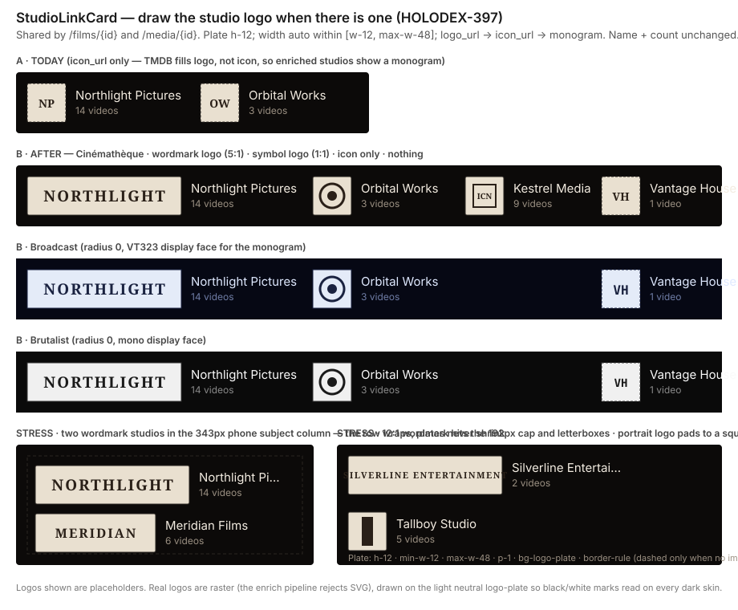

# Design handoff: StudioLinkCard draws the studio logo

**Status:** Approved (options B + logo-first, 2026-09-16)
**Story:** [HOLODEX-397](https://whoiskevinrich.atlassian.net/browse/HOLODEX-397) (child of F51, HOLODEX-246)
**Owner:** Project owner
**Date:** 2026-09-16
**Spec:** none — presentation-only change to an existing component (see "Why no spec/ADR")
**ADR:** none — ADR-079's image roles, storage, and serving are untouched
**Branch/PR:** `HOLODEX-397-studio-logo-link-card`
**Supersedes:** the "Which image role" row of
[studio-link-card-handoff.md §1](studio-link-card-handoff.md) (HOLODEX-290)

## Overview

The Film (`/films/{id}`) and Media (`/media/{id}`) detail pages both render each linked studio
through one shared `StudioLinkCard` (HOLODEX-290): a 48×48 plate + linked name + video count.
That card was specced to draw **`icon_url` only**, reserving `logo_url` for "the studio detail
page's own header". Two facts make that the wrong call today:

1. **TMDB enrichment only ever fills the `logo` role** (`internal/enrich/assets.go`: "TMDB
   emits only the logo kind for studios"). `icon_url` is populated only by an owner upload.
2. **The studio page's header does not draw the logo either** — the hero is name + display-name
   line + meta; the logo appears only in the owner-editable Images section.

So an enriched studio shows a **monogram** on every page it appears on while its logo sits in
storage. This handoff changes `StudioLinkCard` to draw the logo when there is one, with a plate
that follows the logo's source aspect instead of forcing a square.

**Why no spec/ADR:** no new capability (the logo is already stored, served at
`/api/v1/studios/{id}/images/logo`, and already on the `Studio` JSON as `logo_url` on every list
and detail read — `setStudioImageURLs` populates it at both call sites today), no schema or
cross-cutting decision. Per the change-routing table this is `/design-handoff` +
`/testing-strategy` only.



---

## 1. Resolved decisions

Presented as inline mockups and chosen 2026-09-16:

| Question | Decision | Why |
|---|---|---|
| Card shape when a logo exists | **B — logo plate + name.** The plate becomes fixed-height / auto-width; name and video count stay beside it. *Rejected C — logo replaces the name* | A symbol-only logo (no wordmark) would leave the studio unnamed on the page; keeping the name means one card shape for every studio, and the two pages keep sharing one component. |
| Precedence when both `logo_url` and `icon_url` exist | **Logo first:** `logo_url` → `icon_url` → monogram | The detail pages have the horizontal room a logo wants; `icon` remains the role for the `/studios` list well, which is sized for a square. Matches the ask. |
| Plate aspect | **Follows the source** — fixed 48px height, width from the image's own aspect, clamped to `[48px, 192px]` | `web/src/lib/components/entity/CLAUDE.md`, "Frame follows source aspect, never config or role name": a wordmark cover-cropped into a square is unreadable, and `CheckRoleAspect` guarantees nothing about the `logo` role's aspect. Mirrors `ProviderIcon`'s existing fixed-height / `max-width: 4×` treatment for provider wordmarks. |

Supersession: HOLODEX-290's row "`icon_url` only, monogram fallback — **not** `logo_url` …
`logo_url`/`poster_url` stay reserved for the studio detail page's own header" is replaced by
the precedence above. `poster_url` stays unconsumed here.

## 2. Component change: `StudioLinkCard.svelte`

`web/src/lib/components/entity/StudioLinkCard.svelte` — same file, same single prop
(`{ studio: Studio }`), same call sites. No new component, no new prop, no variant.

```svelte
<script lang="ts">
	// … existing imports …
	let { studio }: { studio: Studio } = $props();
	// Logo first — it is the role enrichment fills; icon is the list well's square.
	const image = $derived(studio.logo_url ?? studio.icon_url);
</script>

<a href={`/studios/${studio.id}`} class="flex items-center gap-3 hover:text-accent">
	<span
		class="flex h-12 min-w-12 max-w-48 shrink-0 items-center justify-center overflow-hidden rounded-theme border border-rule bg-logo-plate {image
			? ''
			: 'w-12 border-dashed'}"
	>
		{#if image}
			
		{:else}
			<span class="font-display text-sm font-semibold text-logo-plate-ink" aria-hidden="true">
				{monogram(studio.name)}
			</span>
		{/if}
	</span>
	<span class="min-w-0">
		<span class="block truncate text-ink">{studio.name}</span>
		<span class="block text-xs text-muted">{videoCount(studio.video_count ?? 0)}</span>
	</span>
</a>
```

What changed versus HOLODEX-290's markup, and nothing else:

| Before | After | Why |
|---|---|---|
| `studio.icon_url` everywhere | `image = logo_url ?? icon_url` | §1 precedence |
| plate `h-12 w-12` | plate `h-12 min-w-12 max-w-48`, `w-12` only on the monogram branch | Width follows the image; the monogram keeps its square |
| img `h-full w-full object-contain p-1` | img `h-full w-auto max-w-full object-contain p-1` | `w-auto` lets the image's aspect set the plate width; `max-w-full` + the plate's `max-w-48` cap it, and `object-contain` letterboxes anything that hits the cap |
| dashed border when `!icon_url` | dashed border when `!image` | Dashed still means "no image at all" — an icon-only studio gets a solid frame as before |

**Sizing semantics** (Tailwind v4, `@theme inline` — all existing utilities, no new tokens):

- `h-12` = 48px, the card height HOLODEX-290 set; unchanged so the row's rhythm on both pages is
  identical for every studio, logo or not.
- `min-w-12` = 48px floor: a portrait or square logo pads to a square plate, never a sliver.
- `max-w-48` = 192px cap = 4× height, the same ratio `ProviderIcon` already uses for wordmarks.
  A 12:1 mark letterboxes inside it (mockup, bottom right) rather than dominating the row.
- `p-1` inset unchanged — per `entity/CLAUDE.md` the inset *is* the visible border on the
  contain path.

## 3. Call sites — unchanged

| Page | File | Change |
|---|---|---|
| Film detail | `web/src/routes/films/[id]/+page.svelte` (studio row, `name-edit-row` under Year) | none — `<StudioLinkCard studio={s} />` per studio, cascade pencil beside it |
| Media detail | `web/src/routes/media/[id]/+page.svelte` (`#field-studio` row after the header) | none — `<StudioLinkCard studio={s} />` per studio, `StudioPicker` beside it |

Both rows are already `flex flex-wrap items-center gap-3`, so wider cards wrap instead of
squeezing (§7). The visitor "resolved-but-unlinked studio" plain-text branch on Media and the
"No studio set" empty state on Film are untouched.

## 4. Backend — unchanged

`logo_url` is already populated wherever a `Studio` is serialized: `FilmStudios` →
`setStudioImageURLs` in `internal/api/films.go`, `StudiosForVideos` → `setStudioImageURLs` in
`internal/api/handlers.go`. The served bytes come from the existing immutable-cached
`GET /api/v1/studios/{id}/images/logo?v={id}` route. No query, model, migration, or sidecar change.

## 5. Design tokens used

| Token | Usage |
|---|---|
| `bg-logo-plate` / `text-logo-plate-ink` | Plate background (the light neutral plate exists precisely so arbitrary brand marks read on dark skins) / monogram text |
| `border-rule` | Plate border — solid when any image is drawn, dashed when none |
| `text-ink`, `text-muted`, `text-accent` | Name / count / hover, unchanged |
| `font-display` | Monogram, unchanged |
| `rounded-theme` | Plate corners (2px Cinémathèque, 0 Broadcast/Brutalist) |

No new tokens. `rg 'zinc-|sky-|rounded-(lg|md|sm|xl)|#[0-9a-f]{3,6}' StudioLinkCard.svelte`
stays empty.

## 6. States

| State | Behavior |
|---|---|
| Logo set (any aspect) | Plate width = aspect × 48px, clamped `[48, 192]`; `object-contain p-1`; solid `border-rule` |
| No logo, icon set | Identical to today: 48×48 plate, icon `object-contain p-1`, solid border |
| Neither | Identical to today: 48×48 dashed plate, `monogram(studio.name)` |
| Hover / focus | Unchanged — whole link turns `text-accent`; the plate does not change |
| Zero videos, multiple studios, long name, no studio at all | Unchanged from HOLODEX-290 §6 |

## 7. Responsive behavior

No breakpoints. The card is at most 192 + 12 + name wide; on the 343px phone subject column a
wordmark card leaves ~130px for the `truncate`d name (mockup, bottom left). Two wordmark studios
wrap to two rows via the pages' existing `flex-wrap` — plates never shrink below their aspect,
names ellipsize. Nothing in this change affects the HOLODEX-356 horizontal-overflow guard: the
plate is `shrink-0` with a hard `max-w-48`, and the name span keeps `min-w-0 truncate`.

## 8. Edge cases

- **Extreme wordmark (≥ 4:1)**: hits the 192px cap; `object-contain` letterboxes it vertically
  inside the plate. Readability degrades gracefully — the name beside it is the fallback label.
- **Portrait logo**: `min-w-12` keeps the plate square; the mark sits centered with side
  padding (mockup, "Tallboy Studio"). The logo role has no aspect gate (`CheckRoleAspect` only
  constrains the film banner), so this must render acceptably rather than be refused.
- **Tiny raster (e.g. 32×32)**: `h-full` upscales it to 40px inside the inset — soft but
  legible; acceptable for a role whose sources are provider CDN images at ≥ 100px.
- **SVG logo**: never reaches this component — the raster-only ingest already rejects TMDB's SVG
  variants (`providers/tmdb/tmdb.go`).
- **Logo URL 404**: unchanged policy — no `onerror` fallback, same as every other `` in the
  app.
- **Studio with logo on the Film page *and* on the Media page**: identical card; both pages read
  the same `Studio` shape from `setStudioImageURLs`.
- **Cache-busting**: `logo_url` already carries `?v={image id}`, and a replace produces a new
  id, so a replaced logo shows immediately without touching this component.

## 9. Accessibility

Unchanged from HOLODEX-290: one `<a>` per card (one tab stop), image `alt=""` because the visible
name is the accessible label, monogram `aria-hidden`. Because the name always stays visible
(decision §1), a symbol-only logo does not reduce the card's accessible name.

## 10. Out of scope (deliberately) and follow-ups

- **`/studios` list well** stays `icon_url` → monogram. It is a fixed 40×26 square-ish well
  sized for icons; a wordmark there needs its own layout decision.
- **Studio page hero** still does not draw the logo despite `model.go`'s comment ("logo →
  studio detail header"). Tracked as
  [HOLODEX-399](https://whoiskevinrich.atlassian.net/browse/HOLODEX-399).
- **`poster_url`** still has no consumer.
- **Provider icons in `ProviderIcon`** already use this fixed-height/auto-width shape; no change.

## 11. QA checklist

Setup: a studio with a **wide raster logo** (enrich from TMDB or upload a ~5:1 PNG), one with a
**square logo**, one with **icon only** (upload an icon, no logo), one with **neither**, and one
with **both** logo and icon. Link at least two of them to the same video and the same film.

**Smoke**
- 11.1 `[smoke]` `cd web && npm run check` clean; `rg 'zinc-|sky-|rounded-(lg|md|sm|xl)|#[0-9a-f]{3,6}' web/src/lib/components/entity/StudioLinkCard.svelte` empty.

**Agent (driven browser, `getBoundingClientRect` + computed styles — no screenshots, per the
three-skin QA reference)**
- 11.2 `[agent]` Wide-logo card on `/media/{id}`: plate height 48, width in `(48, 192]`, `` computed `object-fit: contain`, plate `border-style: solid`.
- 11.3 `[agent]` Same studio on `/films/{id}`: plate width identical to 11.2 (same URL, same clamp).
- 11.4 `[agent]` Both-logo-and-icon studio: `` ends in `/images/logo?v=` — logo wins.
- 11.5 `[agent]` Icon-only studio: plate 48×48, `` ends in `/images/icon?v=`, border solid.
- 11.6 `[agent]` Neither: plate 48×48, no ``, `border-style: dashed`, monogram text present.
- 11.7 `[agent]` 12:1 logo (upload a 1200×100 PNG): plate width exactly 192, `` naturalWidth/naturalHeight ratio preserved (rendered width ≤ 184 after inset).
- 11.8 `[agent]` Viewport 375px, two wide-logo studios on one video: row height ≥ 2 × 48 + 12 (wrapped), `document.documentElement.scrollWidth === clientWidth` (no horizontal overflow).
- 11.9 `[agent]` One `<a>` per card; `img[alt=""]`; tab order unchanged versus a build from `main`.
- 11.10 `[agent]` Repeat 11.2 and 11.6 under `data-theme` = `cinematheque`, `broadcast`, `brutalist`: plate `background-color` equals that skin's `--logo-plate`; `border-radius` 2px / 0 / 0.

**Human**
- 11.11 `[human]` Open a film whose studio has a TMDB logo, in each of the three skins (top-right skin switcher). The studio row under the year should show the logo on a light plate at the same height as before, with the studio name and video count beside it — not a monogram, not a squashed or cropped logo. The plate should look like it belongs to the row (same height as a 48px poster thumb), not like a banner.
- 11.12 `[human]` Open the same studio's video on `/media/{id}`. The card should be pixel-identical to 11.11 (same plate width), sitting beside the studio pencil (owner) exactly where it was.
- 11.13 `[human]` Narrow the window to phone width on a video with two logo-bearing studios. The two cards should stack on separate lines with nothing cut off and no sideways scroll.
