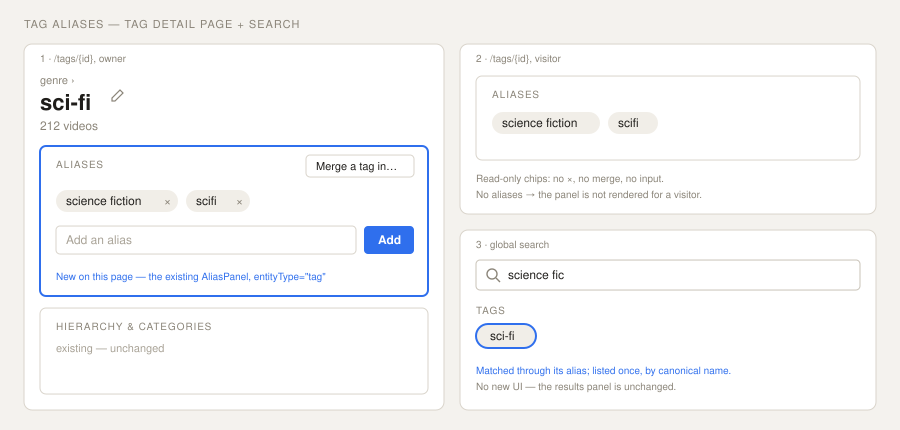

# Design Handoff: Tag aliases on the tag detail page (HOLODEX-507)

**Spec**: [entity-identity.md](../specs/entity-identity.md) — F43, revised RD7 + RD12 + P0-9/P0-10 (HOLODEX-507 amendment)
**Architecture**: [ADR-061](../architecture/archive/ADR-061-unified-entity-name-identity.md) D7 — tags are identity-only
**Theming contract**: [ADR-115](../architecture/archive/ADR-115-cinematheque-only-skin.md) + [theming.md](theming.md) — tokens only, QA Cinémathèque.
**Prior art**: [entity-identity-handoff.md](entity-identity-handoff.md) §1 (the alias panel on person/studio);
the film page's use of the same panel (HOLODEX-376).
**Surface**: `web/src/routes/tags/[id]/+page.svelte` only. No new component, no new route, no search UI change.



---

## Problem

A tag's aliases can be added (from the `/tags` row action) but never seen or removed: no page lists them.
A mistaken alias, or one left by a merge, keeps routing file values into the tag with no way to undo it from
the UI. The `DELETE /tags/{id}/aliases/{aliasId}` endpoint and `Tag.aliases` payload already exist.

## Design

Mount the existing **`AliasPanel`** (`$lib/components/person/AliasPanel.svelte`, already entity-generic and
`EntityKind`-typed) in the tag page's `detail` snippet, **above "Hierarchy & categories"**. Identity reads
before taxonomy and Details, as on the film and studio pages (aliases above the Details panel).

```svelte
<AliasPanel
	entityType="tag"
	entityId={id}
	entityName={tag.name}
	bind:aliases={tagAliases}
	{isOwner}
	onmerged={() => reloadTag()}
/>
```

What the panel already does for `entityType="tag"`, with no change to the component:

| Element | Owner | Visitor |
|---|---|---|
| Panel | always rendered | rendered only when the tag has aliases |
| Alias chips | with a remove `×` | read-only |
| "Merge a tag in…" | `EntityPicker` → informed merge confirm (RD8) | hidden |
| "Add an alias" input | add; 409 → `MergeOfferCard`; near-miss advisory | hidden |

- **Rename stays on the hero's `NameEditControl`**: the panel is add/remove/merge only, as on film/studio/person.
- **No provenance badge on tag aliases.** The chip badge shows `alias.source`, which only providers set, and
  tags have no provider aliases (provider-alias-collapse P2-1). A merged-away name is a plain chip.
- **Lowercase (RD12).** Alias chips read lowercase because the server stores tag alias text lowercase. The
  panel does not lowercase anything itself, so it never disagrees with the stored value.
- **The component's header comment** ("not tag — RD7") is updated to name tag among its hosts.

## Search (no UI change)

A tag matched through an alias appears **once, under its canonical name**, in the existing Tags group of
`SearchResultsPanel`. There's no "matched *alias*" hint: people and studios don't show one either, and a
hint would need a new response field. `EntityPickerDialog` uses the same `api.search`, so the "Merge a tag
in…" picker finds a tag by its alias too. That's correct, because the alias names the same tag.

## States to QA (Cinémathèque)

1. Owner, tag with no aliases → panel shows "No aliases yet." and the add input.
2. Owner adds `Science Fiction` → chip reads `science fiction`.
3. Owner adds an alias equal to another tag's name → `MergeOfferCard` (merge / keep separate).
4. Owner removes an alias → chip disappears; a rescan no longer routes that value into this tag.
5. Owner "Merge a tag in…" → after confirm, the page reloads with the loser's name as an alias chip.
6. Visitor, tag with aliases → read-only chips; tag without aliases → no panel.
7. Narrow viewport (375px): chips wrap; the input and Add button wrap without horizontal overflow.

## Design-system fit

Zero new tokens, zero new components, zero new CSS: one existing component placed on one more page.
