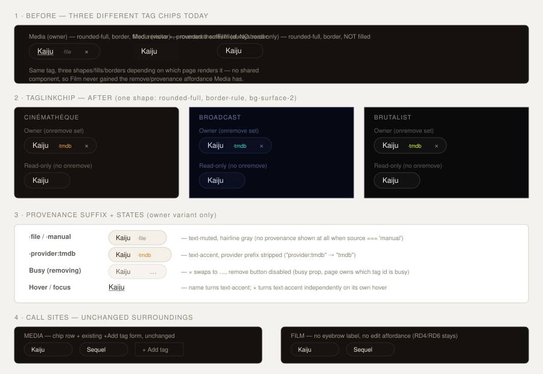

# Design handoff: TagLinkChip (reusable Tag display)

**Status:** Draft
**Story:** [HOLODEX-292](https://whoiskevinrich.atlassian.net/browse/HOLODEX-292)
**Owner:** Project owner
**Date:** 2026-08-29
**Spec:** none — presentational-only change, no new user capability (see "Why no spec/ADR" below)
**ADR:** none — no schema/architecture change
**Branch/PR:** `HOLODEX-292-tag-link-chip`, Draft PR (opened alongside this doc)

## Overview

The Media (`media/[id]`) and Film (`films/[id]`) detail pages each grew their own tag-chip
markup, and even *within* Media the owner and visitor branches disagree with each other:

| Variant | Shape | Border | Fill | Remove | Provenance |
|---|---|---|---|---|---|
| Media, owner | `rounded-full` | `border-rule` | `bg-surface-2` | × button | `·file`/`·manual`/`·provider` suffix |
| Media, visitor | `rounded-theme` | none | `bg-surface-2` | — | — |
| Film (always read-only) | `rounded-full` | `border-rule` | none | — | — |

Same tag, three different shapes depending on which page (or which auth state) renders it, and
Film never picked up the richer owner-only treatment because there was nothing to share it
from. This handoff replaces all three with one shared `TagLinkChip.svelte`.

This is scoped to **display only** — the pill itself (name, provenance suffix, remove control).
The **add-tag control** (the "+ Add tag" trigger/popover/near-miss flow) is a separate,
already-in-flight component (`TagPicker.svelte`, HOLODEX-287/ADR-088) and is untouched here;
Media keeps composing its own add-tag affordance beside the chip row exactly as it does today.

**Why no spec/ADR:** nothing here is a new capability (every tag already links to `/tags/{id}`,
provenance and remove already exist on Media) and nothing here is a schema or cross-cutting
architecture decision — this is a pure display-markup consolidation. Per the project's
change-routing table this is a UX/component change → `/design-handoff` + `/testing-strategy`
only. Mirrors [HOLODEX-290's `StudioLinkCard`](studio-link-card-handoff.md) precedent exactly.

**People details is explicitly out of scope.** `Person` has no tags relation today (no
`person_tags` table, no `Tags` field on the `Person` struct) — wiring tags onto People would be
a new backend capability requiring its own spec/ADR, not a display refactor. Tracked separately
in the backlog (HOLODEX-39) if/when that feature is built.



---

## 1. Resolved decisions

| Question | Decision | Why |
|---|---|---|
| Which shape wins? | `rounded-full border border-rule bg-surface-2` (Media-owner's shape) for **every** variant, including read-only | It's the fullest treatment already in production (border + fill), and unifying on it fixes both inconsistencies at once — Media's owner/visitor mismatch, and Film's missing fill. |
| How do owner vs. read-only differ? | Presence of an `onremove` callback prop, not a separate `isOwner` boolean | Simplest shape for the two known call sites (Media, Film) — one prop that's both the affordance switch and the action, no redundant boolean to keep in sync with it. Note this is *not* `EntityImageSlot`'s pattern (that component takes an explicit, required `isOwner: boolean` alongside always-required `upload`/`remove` props) — if a future caller needs "owner-styled but remove unavailable" distinct from the existing `busy` (transient-disable) state, revisit with an explicit `isOwner` prop then rather than pre-building it now. |
| Provenance suffix visibility | Gated on `onremove` (owner-only), same as the remove button | Matches current behavior exactly — Media's pre-existing visitor branch never showed provenance either. Gating both on the same prop avoids a visitor seeing a `·file`/`·provider` badge with no corresponding remove affordance to act on it, and keeps read-only chips (Film always, Media visitors) visually identical to what they render today. Film's tags additionally have no meaningful single `source` at all (resolver-level union query across the film's videos), so this would be moot there regardless. |
| Busy state | Caller-supplied `busy` boolean (defaults `false`) disables the remove button; the glyph stays a static `×` | Media's existing `tagBusy` is a single page-level flag shared by add/remove/near-miss (not per-tag), so every chip's remove button disables together during any tag mutation — that's unchanged from current behavior, but the glyph must stay static: swapping it to a busy indicator (e.g. `…`) would read as "this tag is being removed" on every chip at once, not just the one actually being acted on. A per-tag busy indicator would need a per-tag key the page doesn't track today. |

## 2. New component: `TagLinkChip.svelte`

`web/src/lib/components/entity/TagLinkChip.svelte` — placed in `entity/` per that folder's
CLAUDE.md rule 1 (consumer-based: used by both Media/video and Film routes, and by extension any
future entity-with-tags page, with no single feature folder that fits).

```ts
import { isProviderSource, providerOf } from '$lib/f36';

let {
	tag,
	busy = false,
	onremove
}: {
	tag: Tag;
	busy?: boolean;
	onremove?: (tagId: number) => void;
} = $props();

let sourceIsProvider = $derived(!!tag.source && isProviderSource(tag.source));
let sourceLabel = $derived(sourceIsProvider ? providerOf(tag.source!) : tag.source);
```

```svelte
{#if onremove}
	<span
		class="curation-chip group relative inline-flex items-center gap-1 rounded-full border border-rule bg-surface-2 px-2.5 py-1 text-sm text-ink"
	>
		<a href={`/tags/${tag.id}`} class="hover:text-accent focus-visible:text-accent">{tag.name}</a>
		{#if tag.source && tag.source !== 'manual'}
			<span class="{sourceIsProvider ? 'text-accent' : 'text-muted'} text-[0.65rem]">
				·{sourceLabel}
			</span>
		{/if}
		<span class="curation-actions ml-0.5 inline-flex items-center">
			<button
				type="button"
				onclick={() => onremove?.(tag.id)}
				disabled={busy}
				aria-label={`Remove tag ${tag.name}`}
				title={tag.source === 'file' ? 'Removing a file-sourced tag may reappear on the next rescan' : undefined}
				class="rounded p-0.5 -m-0.5 text-muted hover:text-accent focus-visible:text-accent"
			>
				×
			</button>
		</span>
	</span>
{:else}
	<a
		href={`/tags/${tag.id}`}
		class="rounded-full border border-rule bg-surface-2 px-2.5 py-1 text-sm text-ink hover:text-accent focus-visible:text-accent"
	>
		{tag.name}
	</a>
{/if}
```

Notes:

- Two branches, not one shape with conditional children: the read-only branch (`onremove`
  absent) makes the whole pill the `<a>` itself, matching Film's and Media-visitor's prior
  markup exactly (the pill's padding lived on the anchor there, so the full pill was the
  click/tap target). Folding both into one `<span>` wrapper with an unpadded inner `<a>` would
  shrink the read-only hit area to the text box alone — caught in this session's own review.
- Owner-branch body is a verbatim lift of Media's existing owner-chip markup (`curation-chip`/
  `curation-actions` idiom from `app.css`) — no new CSS, no new classes.
- Provider-prefix parsing (`isProviderSource`/`providerOf`) reuses `$lib/f36.ts` — the same
  helper `SourceBadge.svelte` and the Studio/Person detail pages already use for the identical
  `provider:<name>` source-key shape, rather than re-parsing the prefix inline.
- `onremove` absent → the `<span class="curation-actions">` block doesn't render at all, which is
  exactly Film's and Media-visitor's current "plain pill" look, now sharing the same border+fill
  shape as the owner variant instead of its own thinner/unfilled/unbordered styles.
- Reuses `Tag` from `$lib/types.ts` as-is — no new prop shape.
- No internal busy/error/near-miss state — that all stays owned by the page (Media already has
  `tagBusy`/`tagBusyKey`/`tagError`/`tagNearMiss` for the add-tag flow; this component only reads
  the single `busy` boolean the page passes per-chip).

## 3. Call-site changes

**`web/src/routes/media/[id]/+page.svelte`** (replacing the `{#each video.tags ...}` block,
currently lines 919–953): the owner/visitor branch collapses into one loop —

```svelte
{#each video.tags ?? [] as t (t.id)}
	<TagLinkChip tag={t} busy={tagBusy} onremove={isOwner ? removeTag : undefined} />
{/each}
```

The surrounding `+ Add tag` button/form, near-miss card, and error text (lines 955–1001) are
unchanged.

**`web/src/routes/films/[id]/+page.svelte`** (replacing lines 198–209): drop the uppercase
`"Tags"` eyebrow label — the pill row itself is now visually self-evident as tags, matching the
Studios row's precedent of dropping its own eyebrow in HOLODEX-290:

```svelte
{#if tags.length}
	<div class="flex flex-wrap items-center gap-1.5">
		{#each tags as t (t.id)}
			<TagLinkChip tag={t} />
		{/each}
	</div>
{/if}
```

No `onremove` passed — Film tags stay permanently read-only (RD4/RD6 from the films-entity brainstorm).

## 4. Backend requirement

None. Both pages already receive fully-populated `Tag` objects (`id`, `name`, and `source` where
applicable) — this is a pure frontend markup consolidation, no query changes.

## 5. Design tokens used

| Token | Usage |
|---|---|
| `border-rule` | Chip border |
| `bg-surface-2` | Chip fill |
| `text-ink` | Tag name |
| `text-muted` | File/manual provenance suffix, remove button at rest |
| `text-accent` | Provider provenance suffix, hover/focus on name and remove button |
| `rounded-full` | Chip shape |

No new tokens. `rg 'zinc-|sky-|rounded-(lg|md|sm|xl)'` over the new file must stay empty.

## 6. States and interactions

| State | Behavior |
|---|---|
| Read-only (`onremove` absent) | Name link only, no remove control, no provenance suffix — Film always, Media visitors always |
| Owner (`onremove` set) | Name link + remove `×` button, `curation-actions` hover-reveal idiom; provenance suffix shown per the rules below |
| `source === 'manual'` or unset (owner) | No provenance suffix shown |
| `source === 'file'` (owner) | `·file` suffix, `text-muted`; remove button gets a title warning it may reappear on rescan |
| `source` starts with `provider:` (owner) | `·{provider}` suffix (prefix stripped), `text-accent` |
| `busy` | Remove button disabled; glyph stays a static `×` (page-level flag, not per-tag) |
| Hover / focus | Name turns `text-accent` independently of the remove button, which has its own hover/focus treatment |

## 7. Responsive behavior

No breakpoint-specific layout — both call sites already wrap the chip row in `flex flex-wrap`;
unchanged.

## 8. Edge cases

- **Film tag with a `source` value** (shouldn't happen given the resolver's union-query origin,
  but not structurally prevented): the component would render whatever suffix `Tag.source`
  carries — no special-casing added, since this mirrors how Media already trusts whatever the
  API returns.
- **Very long tag name**: no `truncate` applied (existing Media/Film behavior also had none) —
  out of scope for this change, consistent with not touching wrapping behavior.

## 9. Accessibility notes

- Remove button keeps its own `aria-label={"Remove tag " + tag.name}` — distinct from the
  adjacent link's accessible name, so a screen reader announces "Kaiju, link" and "Remove tag
  Kaiju, button" as two distinct controls, not a duplicate.
- Focus order unchanged from current markup: name link, then (owner only) remove button, in DOM
  order per chip.
- No new focus-visible styling — reuses the existing `focus-visible:text-accent` treatment
  already on both the link and the button.
