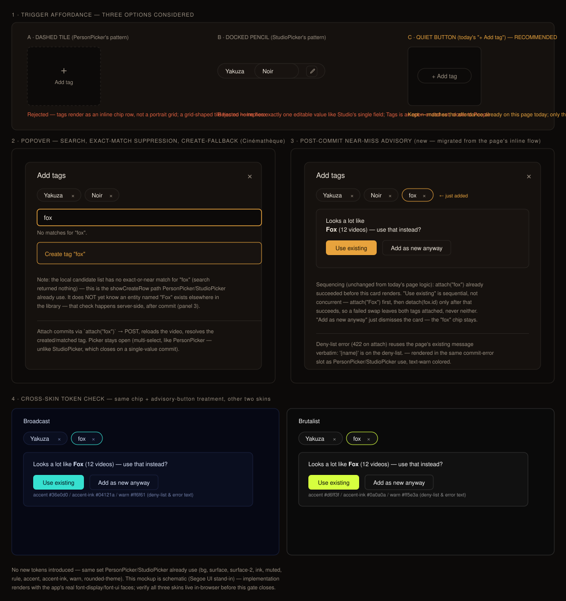

# Design Handoff: TagPicker — video tag attach/detach + near-miss (HOLODEX-287)

ADR: [ADR-088](../architecture/ADR-088-frontend-component-reuse-discipline.md) · Worklog:
[`docs/plans/HOLODEX-287.md`](../plans/HOLODEX-287.md) — no separate spec (discipline/tooling
change, not new product behavior; see ADR-088 header).

## Overview

Replaces the hand-rolled inline Tags form on the video detail page
(`web/src/routes/media/[id]/+page.svelte:924-1011`, state at `:106-116`, logic at `:599-687`)
with a proper `TagPicker.svelte` sibling of `PersonPicker`/`StudioPicker`, closing the one gap
ADR-088 identified: every other entity-linking surface on this page (People, Studio) has a
dedicated picker component; Tags never got one and still uses a bare add-form with no
search-as-you-type.

Structural precedent: **`PersonPicker.svelte`** (354 lines) is the right template, not
`StudioPicker`. Like People, Tags is a **set** relationship — many per video, no exclusive
single value — so `TagPicker` follows `PersonPicker`'s stays-open-across-commits,
chip-list-of-attached contract, not `StudioPicker`'s closes-on-commit single-value one.

Two things `PersonPicker` has that `TagPicker` must **not** copy:
- The Actor/Director role machinery (`ROLES`, `roleLabel`, `availableRoles`, `roleFor`,
  `setRole`, the `roleToggle` snippet) — tags have no role concept, so every one of these is
  deleted, not adapted.
- The dashed-tile grid trigger — that shape matches the person-portrait grid it sits in; tags
  render as an inline chip row on this page today, so the trigger should keep today's
  `+ Add tag` quiet-button shape instead (see panel 1 of the mockup — three options were
  compared, quiet-button wins).

One thing neither sibling has that `TagPicker` must add: the page's existing **post-commit
near-miss advisory** (`tagNearMiss`/`tagJustAdded`/`useTagNearMiss`, `:601-687`) migrates
into the component rather than being dropped. This is the one genuinely new interaction here
(mockup panel 3) — it does not exist in `PersonPicker` or `StudioPicker` today.

## Layout

Single popover via `PickerShell`, same footprint class as `PersonPicker`/`StudioPicker`
(`PickerShell` sizes to content, typically ~360–480px wide). Three stacked regions:

1. **Attached list** — chips, one per `video.tags` entry, each with a remove `×`. Wraps to
   multiple lines, no scroll container — same assumption `PersonPicker` makes (a video's tags
   are a handful in practice; revisit only if that assumption breaks).
2. **Search** — the same `role="combobox"` input + debounced (300ms) `<ul role="listbox">` +
   create-fallback row (`showCreateRow` pattern) as `PersonPicker`/`StudioPicker`, minus role
   pills on each result row.
3. **Near-miss advisory** — replaces the search body in place, immediately after a commit whose
   `api.nearMiss('tag', tag.id, name)` check comes back non-null. Not present in either sibling.

## Design Tokens Used

All values are Holodex's existing semantic tokens (`web/src/app.css`) — no new tokens
introduced, identical set to `PersonPicker`/`StudioPicker`. Cinémathèque (default) values
shown; Broadcast and Brutalist substitute their own skin values for the same variable names
(see mockup panel 4) — the component must reference the variables, never these literals.

| Token | Cinémathèque value | Usage |
|---|---|---|
| `--bg` (`bg-bg`) | `#0c0a09` | Popover backdrop (`bg-bg/70`) |
| `--surface` (`bg-surface`) | `#15110e` | Popover body, search input bg |
| `--surface-2` (`bg-surface-2`) | `#181310` | Attached chips, results row hover bg, near-miss advisory card bg |
| `--rule` (`border-rule`) | `#2a2622` | Popover border, chip border, quiet-button border |
| `--ink` (`text-ink`) | `#f3ece1` | Chip text, result-row text, advisory card text |
| `--muted` (`text-muted`) | `#9b9082` | Placeholder text, status line, quiet-button idle state |
| `--accent` (`bg-accent`/`text-accent`) | `#e8a33d` | Focused search input border, create-fallback row, newly-added chip highlight, "Use existing" button |
| `--accent-ink` (`text-accent-ink`) | `#1a1206` | Text on "Use existing" button |
| `--warn` (`text-warn`/`border-warn`) | `#e2603f` | Commit error (deny-list 422), same slot `PersonPicker`/`StudioPicker` use |
| `rounded-theme` | skin-dependent radius | Popover corners, input, "Add as new anyway" button |
| `rounded-full` | — | Chips, "Use existing"/"Add as new anyway" buttons |
| `font-display` | `'Fraunces Variable'` | Popover header ("Add tags") |
| `font-ui` | `'Archivo Variable'` | Everything else |

## Components

| Component | Variant | Props | Notes |
|---|---|---|---|
| New: `TagPicker.svelte` | — | `tags: EntityRef[], isOwner: boolean, attach: (name: string) => Promise<{ tag: EntityRef }>, detach: (tagId: number) => Promise<void>` | Composes `PickerShell` for chrome; internal state mirrors `PersonPicker`'s shape minus role tracking (`open`, `query`, `candidates`, `active`, `searchLoading`, `searchError`, `searchId`, `timer`, `busyKey`), plus new `nearMiss: EntityRef \| null` and `justAdded: EntityRef \| null` absorbed from the page's `tagNearMiss`/`tagJustAdded` state. **No `verdict` prop** — see Edge Cases; tag attach has no known collision path to hand off to a caller-supplied verdict snippet, unlike Person/Studio/Video Title. |
| Reused as-is: `PickerShell.svelte` | — | `titleId, onclose, dialogEl` (bindable) | No change — generic chrome already supports this; `titleId="tag-picker-title"`, `focusOptionIn` prefix `tag-search-opt` |
| Replaced: hand-rolled `+ Add tag` form | — | — | `web/src/routes/media/[id]/+page.svelte:924-1011` markup and its `:599-687` logic (`tagAddOpen`, `tagAddValue`, `tagInput`, `tagBusy`, `tagError`, `tagNearMiss`, `tagJustAdded`, `resetTagForm`, `openTagAdd`, `closeTagAdd`, `runTagAction`, `submitTagAdd`, `useTagNearMiss`) are deleted; the page keeps only thin `attach`/`detach` wrappers around `api.addVideoTag`/`api.removeVideoTag` (each doing the mutation + `reloadDetail()`, same division of labor `attachPerson`/`detachPerson` already use for `PersonPicker`) and passes `video.tags` straight through |

### Prop contract detail — where the near-miss call lives

`attach`/`detach` stay **page-owned mutations** (POST/DELETE + `reloadDetail()`), matching the
existing convention every picker uses. The near-miss check itself is a **read**
(`api.nearMiss('tag', id, name)`), so `TagPicker` calls it directly rather than routing it
through a prop — this mirrors how `AliasPanel.svelte` owns its own `flagNearMiss` read today
rather than taking it from a caller. **Verify this against `AliasPanel.svelte`'s actual call
site at implementation time** — if it turns out to take near-miss as a prop instead, follow
that precedent for consistency rather than this document.

Sequencing to preserve exactly (from the page's current `useTagNearMiss`, `:664-680`):
attach the near-miss name **first**; only after that succeeds, detach the tag the original
add created. If the swap-attach fails, the original tag is left alone — never detach before
the replacement is confirmed attached.

## States and Interactions

| Element | State | Behavior |
|---|---|---|
| Trigger (`+ Add tag`) | Rest | `btn-quiet`, unchanged from today's page — see mockup panel 1 for the three options compared |
| Trigger | Click | Opens `TagPicker` popover via `PickerShell` |
| Attached-tag chip | Rest | Name + `×`, same shape as `PersonPicker`'s chip minus the role badge |
| Attached-tag chip | Click `×` | `busyKey` locks to that tag id; `detach(tagId)` commits; on success the chip is removed |
| Search input | Typing | 300ms debounce + monotonic `searchId` guard against stale responses — identical to `PersonPicker.search()` |
| Search input | No local match, non-empty query | Create-fallback row ("Create tag \"…\""), same `showCreateRow` derivation as `PersonPicker`/`StudioPicker` — this only checks the **currently loaded candidate list**, not the whole library (see Edge Cases) |
| Result row | Rest | Name only (no role pills) |
| Result row already attached | — | Excluded from `candidates` (a tag has no per-row "role" capacity to exhaust the way `PersonPicker` tracks, so there's no "already attached as…" affordance to build — just don't offer an already-attached tag as a result) |
| Commit (attach) | Success, no near-miss | Chip list updates in place; search input clears and refocuses; picker stays open (multi-select, matches `PersonPicker`, unlike `StudioPicker` which closes) |
| Commit (attach) | Success, `api.nearMiss` returns non-null | Search body is replaced by the near-miss advisory card (mockup panel 3): "Looks a lot like **{name}** ({video count}) — use that instead?" with `.btn-accent` "Use existing" and `.btn-ghost` "Add as new anyway" |
| Near-miss advisory | Click "Use existing" | Sequential swap per the Prop contract section above; on success the advisory clears and the swapped-in chip appears; search body returns |
| Near-miss advisory | Click "Add as new anyway" | Advisory dismisses; the just-added chip stays as-is; search body returns |
| Commit (attach) | 422 deny-list | Inline `commitError` paragraph: `'{name}' is on the deny-list.` — verbatim message the page already shows, same styling slot as `PersonPicker`/`StudioPicker` |
| Commit (attach or detach) | Other network/validation error | Inline `commitError` paragraph, `toMessage(err)` — same as siblings |
| Escape / backdrop click | — | Closes the popover, unchanged `PickerShell` behavior |

## Responsive Behavior

No new breakpoint logic — `TagPicker` inherits `PickerShell`'s existing responsive chrome,
identical to `PersonPicker`/`StudioPicker` at all viewport widths. The Tags chip row on the
page reflows the same way it does today; the `+ Add tag` trigger is just one more inline
element in that flow.

| Breakpoint | Changes |
|---|---|
| Desktop (≥768px) | Popover anchored near the trigger, default `PickerShell` sizing |
| Tablet / Mobile (<768px) | Unchanged — `PickerShell`'s fixed-position centered backdrop layout already works at all widths (verify no regression, don't redesign) |

## Edge Cases

- **Search returns no candidates but the tag exists elsewhere in the library** (the "fox"/"Fox"
  scenario): this is **not** caught by `showCreateRow`'s local exact-match suppression — that
  only inspects the candidates the debounced search already returned. The near-miss advisory
  is the mechanism that catches this, and it only fires **after** a successful attach, per the
  page's current (and unchanged) server round-trip. Don't try to move this check earlier into
  the search step — the fuzzy-match algorithm is server-side only (`GET /tags/{id}/near-miss`)
  and there is nothing to run client-side before commit.
- **Does tag attach ever return a collision, like Person/Studio's 409?** No evidence found in
  the current API (`api.addVideoTag` returns `{ tag }}`, not a conflict union type) — confirm
  this against the backend contract at implementation time before deciding whether a `verdict`
  prop is needed. This spec assumes **no**, based on current code; if that's wrong, add the
  same `verdict?: Snippet<[...]>` mechanism `StudioPicker`/`PersonPicker` already use rather
  than inventing something new.
- **Near-miss advisory open when the popover is closed (Escape/backdrop)**: closing the picker
  mid-advisory is fine — the swap is purely additive to the attached list, so there's no
  half-done state to protect; reopening the picker shows the current (already-updated) chip
  list with no dangling advisory.
- **Removing a tag while a near-miss advisory for a different tag is showing**: independent
  actions — removing a chip via `×` doesn't touch `nearMiss` state.
- **Long tag name overflow** (chip or advisory card): existing `max-w-[10rem] truncate`
  handling on chips carries over unchanged from `PersonPicker`/Tags.
- **Zero tags, owner viewing**: unchanged from today's page — the Tags section always renders
  the `+ Add tag` trigger regardless of count; this spec doesn't touch that guard.

## Animation / Motion

| Element | Trigger | Animation | Duration | Easing |
|---|---|---|---|---|
| Popover | Open | `PickerShell`'s existing `merge-rise` keyframe (gated by `prefers-reduced-motion: no-preference`) | unchanged | unchanged |
| Near-miss advisory card | Appears (replaces search body) | No new animation — instant swap, same as how the page's advisory appears today (no fade was ever added there; don't add one here as an unrequested embellishment) | — | — |
| Result row commit | Busy | Row dims slightly (matches `PersonPicker`/`StudioPicker` busy treatment) | unchanged | — |

## Accessibility Notes

- Trigger: real `<button>`, `aria-haspopup="dialog"`.
- Search input: `role="combobox"`, `aria-expanded`, `aria-controls` pointing at the results
  `<ul role="listbox">` — identical wiring to `PersonPicker`/`StudioPicker`.
- Results listbox: roving tabindex via `PickerShell`'s shared `focusOptionIn` helper, prefix
  `tag-search-opt`, `role="option"` per row — same keyboard trio (`onSearchKey`/`onOptionKey`)
  as `PersonPicker`, with no role-pill sub-navigation to account for (simpler than
  `PersonPicker`'s keyboard surface, not more complex).
- Attached-tag chip `×`: `aria-label="Remove tag {name}"`.
- Near-miss advisory: the card's status text should be in an `aria-live="polite"` region (same
  as the page's current `aria-live="polite"` wrapper around this exact card) so screen-reader
  users are told about the suggestion without it stealing focus.
- Focus trap, Escape-to-close, and return-focus-to-trigger are inherited unchanged from
  `PickerShell` — no new work, just don't bypass it.
- **3-skin QA required before this gate closes** (Cinémathèque, Broadcast, Brutalist) per
  `.claude/rules/frontend-theming.md` — the near-miss advisory's `--accent`/`--accent-ink`
  button pairing and `--warn` deny-list text are the two color usages worth double-checking
  contrast on; mockup panel 4 is a schematic pre-check, not a substitute for the live 3-skin
  pass.

## Open questions for implementation (not blocking design sign-off)

1. Confirm `AliasPanel.svelte`'s actual near-miss call ownership (prop vs. direct `api` call)
   and match it, per the Prop contract note above.
2. Confirm `api.addVideoTag` genuinely never returns a conflict — if it can, add the
   `verdict` prop back in rather than silently dropping collision handling.
